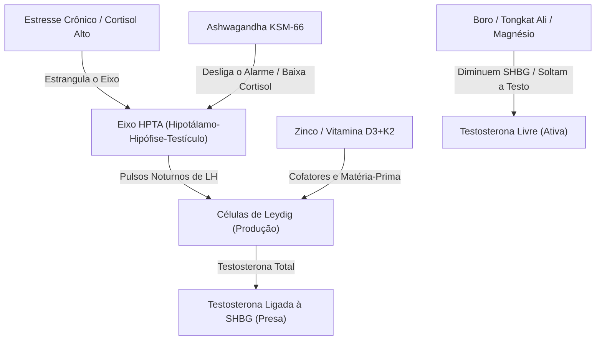
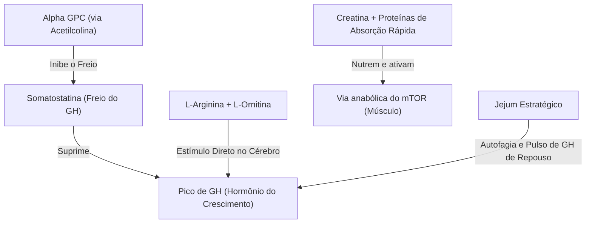
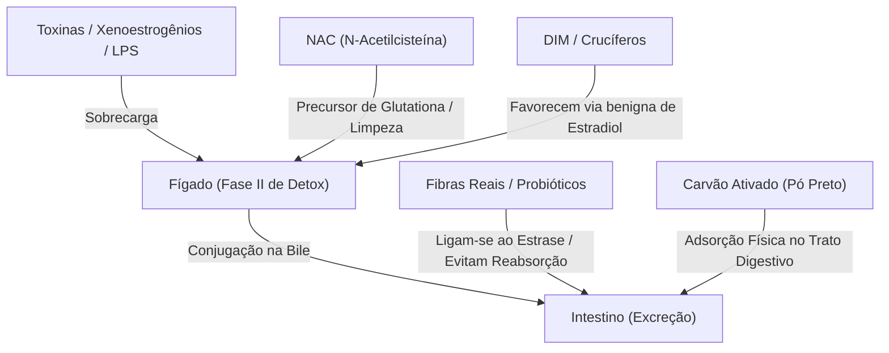

# Introdução — O homem dentro da margem

A primeira coisa que me fez levar este assunto a sério não foi uma frase de efeito. Foi um número.

Em 2017, uma revisão publicada na *Human Reproduction Update* estimou uma queda de 52,4% na concentração de espermatozoides entre homens de países ocidentais ao longo de quase quatro décadas. O trabalho reuniu dados de 185 estudos, com amostras coletadas entre 1973 e 2011. Não era uma anedota, nem um susto de internet, nem um gráfico isolado circulando fora de contexto. Era uma tentativa ampla de olhar para a saúde reprodutiva masculina ao longo do tempo e perguntar se algo havia mudado.

Algo havia mudado.

Esse número incomoda porque não se comporta como culpa individual. Um homem pode explicar o próprio cansaço como excesso de trabalho. Pode explicar a baixa libido como estresse. Pode explicar a ereção pior como ansiedade, idade, álcool, pornografia, relacionamento, sedentarismo ou falta de sono. Essas explicações podem estar certas em casos específicos. Mas uma tendência populacional atravessando décadas força uma pergunta maior, menos confortável e muito mais difícil de responder: o que mudou no ambiente em torno do corpo masculino?

Quase tudo mudou.

A comida mudou. A luz mudou. O sono mudou. O trabalho mudou. A pornografia mudou. O plástico se tornou onipresente. Herbicidas e compostos industriais se espalharam em escala. O celular foi para o bolso, o laptop foi para o colo, as telas entraram no quarto, o delivery entrou na rotina, o estresse deixou de ser evento e virou atmosfera. Ao mesmo tempo, a medicina ficou extraordinária para emergências, mas frequentemente apressada diante de queixas vagas demais para caber em um diagnóstico rápido.

Para dar rosto ao tipo de homem que este livro investiga, vou usar de vez em quando um caso composto. Chamarei esse homem de Marcos. Ele não é uma pessoa específica, nem um personagem fictício criado para dramatizar uma tese. É uma síntese de padrões recorrentes: homens entre trinta e poucos e cinquenta anos que relatam cansaço persistente, queda de libido, piora da ereção, foco instável, ansiedade, sono ruim e exames que não explicam a experiência que vivem. Marcos existe porque o problema precisa de corpo, não apenas de estatística.

Marcos fez exames. A testosterona total veio dentro da referência. A glicose não assustava. O hemograma não dizia nada dramático. O médico falou em estresse, sono e rotina. Nada disso estava errado, mas também não era suficiente. Marcos saiu do consultório com números aceitáveis e a sensação íntima de que alguma coisa continuava fora do lugar. Essa distância entre o papel e a vida é o território deste livro.

Há homens vivendo dentro da margem laboratorial e fora da própria potência.

A palavra potência, aqui, não se limita a sexo. Ela inclui energia para acordar, clareza para pensar, presença para se relacionar, força para treinar, desejo por vida real, capacidade de dormir profundamente, circulação suficiente para sustentar uma ereção e estabilidade emocional para não depender de estímulos baratos o dia inteiro. Quando essas coisas caem juntas, chamá-las de problemas separados pode ser uma forma elegante de não enxergar o sistema.

Em 2007, pesquisadores do Massachusetts Male Aging Study publicaram no *Journal of Clinical Endocrinology & Metabolism* um dado que conversa com essa suspeita. Eles observaram uma queda populacional de testosterona em homens americanos que não era explicada apenas pelo envelhecimento. Homens de mesma idade medidos em períodos mais recentes apresentavam níveis menores do que homens medidos anos antes. O estudo não resolve a causa. Mas reforça o incômodo: talvez não estejamos olhando apenas para indivíduos envelhecendo, e sim para coortes de homens vivendo em ambientes diferentes.

Essa distinção muda tudo.

Se um homem isolado perde energia, podemos começar por sua rotina. Se muitos homens, ao longo de décadas, mostram sinais de piora em marcadores reprodutivos e hormonais, precisamos olhar também para o mundo que passou a cercá-los. Não para substituir responsabilidade pessoal por paranoia ambiental, mas para colocar a responsabilidade no lugar certo. O corpo não vive no vácuo. Ele negocia com luz, comida, água, sono, moléculas, estímulos, trabalho, medo, prazer e ar.

A tese deste livro é que o homem moderno não está apenas envelhecendo ou perdendo força por acaso. Ele está sendo biologicamente pressionado por um conjunto de fatores ambientais, comportamentais, metabólicos e tecnológicos que interferem nos sistemas que sustentam energia, libido, fertilidade, foco, sono, circulação e testosterona. Pressionado é uma palavra importante. O corpo raramente desaba de uma vez. Ele compensa, adapta, reduz sensibilidade, aumenta cortisol, guarda gordura, diminui desejo e aprende a funcionar abaixo do que seria possível.

Essa adaptação é útil em uma emergência. É devastadora quando vira estilo de vida.

O mundo moderno não precisa causar uma catástrofe visível para alterar o corpo. Basta criar interferências pequenas, repetidas e convergentes: luz no horário errado, compostos químicos que imitam ou bloqueiam sinais hormonais, comida que mantém insulina alta, pornografia que recalibra o sistema de recompensa, sono superficial, deficiência mineral, inflamação intestinal, estresse crônico, exames incompletos e uma cultura que chama de normal aquilo que só se tornou comum.

Separados, esses fatores parecem pequenos demais para explicar a sensação de colapso. Juntos, começam a formar uma hipótese difícil de ignorar: talvez o corpo masculino esteja respondendo a um ambiente que mudou mais rápido do que sua biologia consegue acompanhar.

Nos roteiros que inspiraram parte deste projeto, Rick chama isso de sabotagem. A palavra é forte e às vezes exagerada, mas tem uma virtude: desloca a culpa do indivíduo isolado para a rede de forças que o atravessa. Rick não será tratado aqui como personagem, médico ou autoridade final. Ele aparece como origem provocadora de perguntas. Quando uma frase dele abrir um capítulo, ela será a faísca, não a conclusão. O trabalho do livro é fazer o que um vídeo curto não consegue fazer: investigar, contextualizar, separar evidência de hipótese e transformar provocação em compreensão prática.

Essa diferença importa. Um vídeo pode sobreviver de choque. Um livro precisa sobreviver de confiança.

Livros sobre saúde costumam cair em dois erros. O primeiro é a certeza falsa: tudo vira causa direta, protocolo infalível, inimigo absoluto, promessa rápida. O segundo é a cautela paralisante: tudo “talvez”, tudo “mais estudos são necessários”, tudo tão protegido que o leitor fecha o livro sem saber o que fazer amanhã. Este projeto tenta ficar no meio mais difícil. Quando houver evidência humana forte, isso será dito. Quando houver estudo animal, será tratado como estudo animal. Quando houver correlação, não será vendida como causalidade. Quando houver hipótese plausível, ela será apresentada como hipótese. E quando uma ação simples fizer sentido por baixo risco e coerência biológica, não fingiremos que é preciso esperar certeza perfeita para começar.

A vida prática acontece antes da certeza perfeita.

Você não precisa resolver toda a toxicologia dos plásticos para parar de aquecer comida em plástico. Não precisa entender toda a neurociência da dopamina para perceber que pornografia infinita mudou sua resposta ao sexo real. Não precisa virar endocrinologista para saber que testosterona total sozinha pode não explicar sintomas. Também não precisa rejeitar medicina, exames ou tratamento. O homem que este livro imagina não é rebelde contra a ciência. Ele é rebelde contra a passividade.

## O pacto da prudência

Este livro opera na zona cinzenta da toxicologia moderna — onde nem tudo tem ensaio clínico de trinta anos, mas onde a biologia plausível e a exposição diária são reais. Alguns dos compostos que vamos discutir estão no mercado desde os anos 1920 sem revisão vinculante. Outros foram aprovados quando ainda não existia endocrinologia moderna. Outros, ainda, são tão novos que a ciência leva décadas para alcançar a adoção em massa.

O princípio que guia estas páginas é simples: **precaução sem histeria**. Você não precisa de certeza perfeita para trocar uma garrafa plástica por vidro. Não precisa de meta-análise para respirar pelo nariz em vez da boca. Não precisa de ensaio clínico randomizado para desligar telas antes de dormir.

A partir daqui, não vou mais pedir desculpa pela ciência a cada página. Vocês já sabem as regras. Quando eu disser "aplicamos aqui o princípio da prudência", vocês sabem o que significa: biologia plausível + exposição diária + custo zero de prevenção = ação imediata.

**Se o custo de tirar é zero e o risco de deixar é real, tira.**

Essa frase será sua âncora nos capítulos iniciais. Mas atenção: à medida que avançarmos, você verá que algumas decisões exigem mais do que precaução — exigem soberania. O custo nem sempre será zero. Às vezes, será suor. Às vezes, será escolha difícil. O protocolo completo está no Capítulo 27, dividido em três sprints: Semana 1 (remoção de ruído), Mês 1 (restauração) e Mês 3 (refinamento com exames).

**Mas antes de qualquer exame, entenda isto:** medir um corpo sabotado é como tirar foto de um prédio em chamas. O número vai refletir o dano, não a base. Se você correr para o laboratório hoje, seus marcadores inflamatórios estarão altos, sua testosterona estará suprimida, seu cortisol estará elevado. Isso não é seu estado permanente — é seu estado em chamas. A ordem correta é: primeiro apague os incêndios silenciosos (semanas 1-4), depois restaure a fundação (mês 2), só então meça com precisão (mês 3). Não jogue sua cozinha no lixo hoje em um ataque de pânico noturno. Cada etapa tem seu tempo. Leia o Capítulo 27 antes de tirar sangue ou comprar suplementos.

Ao terminar este livro, você não terá uma lista mágica de suplementos. Terá um mapa. Um mapa de como fatores aparentemente desconectados — água, plástico, luz, sono, pornografia, comida, estresse, gordura abdominal, minerais, circulação, intestino, fígado, dopamina e testosterona — podem convergir sobre o mesmo corpo.

A promessa é simples: você vai entender melhor por que certos sintomas aparecem juntos e por onde faz sentido começar. Vai entender por que cansaço, baixa libido, ereção pior, ansiedade, gordura abdominal, sono ruim e perda de foco podem não ser problemas separados. Vai entender por que um exame normal pode ser apenas o começo da investigação, não seu fim. Vai entender por que a pergunta “quanto de testosterona eu tenho?” é menor do que “quanto do meu sinal hormonal está chegando onde precisa chegar?”.

A investigação começa pela água porque ela é a primeira confiança do dia. Antes de suplemento, antes de protocolo, antes de treino, existe o copo. A água parece neutra, e talvez por isso seja o ponto perfeito de partida. Quando você aprende a perguntar o que entra no corpo todos os dias sem chamar atenção, começa a enxergar o resto da casa de outro jeito.

A torneira deixa de ser paisagem. A garrafa deixa de ser neutra. O banho deixa de ser só conforto. A luz do quarto deixa de ser só iluminação. O celular no bolso deixa de ser só ferramenta. O exame deixa de ser sentença. O cansaço deixa de ser caráter.

O primeiro passo não é acreditar em tudo.

É parar de aceitar que o invisível não existe.

**O ambiente não pede permissão para mudar seu corpo. Ele só muda. A pergunta não é se você está sendo sabotado — é se você vai notar antes do colapso.**

Abra a torneira. Olhe a água. Cheire. Pergunte o que há nela. Essa curiosidade não é paranoia. É a primeira vez que você assume o volante.

O Capítulo 1 começa exatamente aí. Na água que você bebe sem pensar. No cloro que mata bactéria e talvez mate mais do que deveria. No plástico que viaja da garrafa para o sangue. No primeiro copo da manhã — o primeiro voto que seu corpo recebe sobre como vai funcionar hoje.

---

## Referências da introdução

Levine et al., “Temporal trends in sperm count: a systematic review and meta-regression analysis”, *Human Reproduction Update*, 2017.  
https://pubmed.ncbi.nlm.nih.gov/28981657/

Travison et al., “A population-level decline in serum testosterone levels in American men”, *The Journal of Clinical Endocrinology & Metabolism*, 2007.  
https://pubmed.ncbi.nlm.nih.gov/17470573/


---

# Abertura da Parte 1

## O Invisível Tornou-se Visível

Você começou esta jornada com uma pergunta simples, mas que carrega um peso enorme: por que, mesmo fazendo tudo "certo", os números não fecham?

Nas páginas anteriores, nós tiramos o problema da esfera abstrata da "genética" ou da "idade" e o trouxemos para o chão da realidade física. Você viu como a contagem de espermatozoides não é um destino imutável, mas um reflexo direto do ambiente em que esses corpos microscópicos vivem e morrem.

Nós estabelecemos o protocolo básico: entender que o esperma é frágil, que ele responde ao calor, às toxinas e ao tempo de forma previsível. Aprendemos que o homem moderno não está "quebrado"; ele está, muitas vezes, operando em um ambiente hostil sem saber disso.

Mas entender a teoria é apenas o primeiro passo. Saber que o calor mata o esperma é útil; saber exatamente onde esse calor está escondido na sua rotina é o que muda o jogo.

Agora, vamos sair do geral e ir para o específico. Vamos entrar no seu dia a dia.

Na **Parte 1**, vamos investigar os **Inimigos Silenciosos do Cotidiano**. Não estamos falando de grandes catástrofes industriais ou acidentes raros. Estamos falando das pequenas escolhas, dos objetos comuns e dos hábitos enraizados que, somados, criam um cenário de sabotagem contínua.

Você vai aprender a identificar as fontes de radiação não ionizante que cercam seu corpo, a entender a química oculta nos plásticos que você usa todos os dias e a ver o seu próprio corpo como um sistema de refrigeração que precisa ser respeitado.

O objetivo aqui não é criar paranoia. É criar consciência. Quando você sabe onde o tiro está saindo, pode se abaixar. Quando você entende a lógica da sabotagem, pode desativá-la.

Vamos começar a caça aos invisíveis.


---

# Capítulo 1 — A água que você chama de limpa

São sete da manhã e Marcos está de pé na cozinha, naquela penumbra amarelada que a lâmpada econômica derrama sobre a pia. Numa mão, um copo d'água tirado direto da torneira. Na outra, três cápsulas que custaram caro — um complexo de zinco, magnésio, algo chamado fenugreek com selênio, tudo comprado depois de duas horas de pesquisas em sites de suplementação. Ele quer testosterona. Ele quer energia. Ele quer libido de volta. Ele quer acordar amanhã sentindo que dormiu de verdade.

A água é transparente, inodora, insípida. Não levanta suspeita. Essa é exatamente a camuflagem que o sabotador precisa.

Marcos não percebeu ainda, mas ele está tentando apagar um incêndio jogando gasolina transparente.

O corpo dele já dá sinais de que algo não fecha: testosterona total no limite inferior da referência, libido que não responde como antes, ereções que falham quando a situação pede presença, cansaço que o café só mascara, sono que não restaura. E ele está fazendo o que qualquer homem faria — atacando o resultado, reforçando o que parece fraco. Toma suplementos. Só que toma com a mesma água que sai da torneira todo dia.

A água parece resolvida. E aí está o problema: *parece*.

Antes do café, do banho, do remédio, do gelo no uísque, do arroz no fogo, ela já entrou na rotina como algo anterior à dúvida. A água é a matéria da limpeza, a substância que lava, hidrata, salva. Por isso é tão difícil interrogá-la. Ninguém quer desconfiar daquilo que usa para limpar o resto.

Este capítulo vai fazer exatamente isso: interrogar a água. E vai usar um método que o leitor carregará para o resto do livro. Identificar o contaminante. Entender a via de entrada. Perguntar a dose e a frequência. Traduzir o mecanismo para o corpo. Calcular o custo de reduzir exposição contra o risco de ignorar.

A promessa não é medo. É inventário.

No final deste capítulo, você saberá mais sobre o que sai da sua torneira do que soube em toda sua vida adulta.

A sabotagem não vem de fora dos portões da cidade. Ela vem de dentro da casa. Pela torneira. Pelo chuveiro. Pelo vapor que você respira enquanto acha que está só se lavando.

A primeira ação custa zero: pare de aquecer água em plástico. A segunda: troque a garrafa do carro por vidro ou inox. A terceira: um filtro de chuveiro decente custa menos que dois meses de academia. As soluções de baixo custo estão mapeadas no **Sprint 1 do Capítulo 27** (Semana 1: remoção de ruído). Este capítulo ensina o método; o 27 entrega o plano.

Abra a torneira. A investigação começa exatamente aí.

---

## A transparência não é uma prova

A palavra "água" esconde o caminho da água.

No papel, ela é H₂O. Na vida real, é um líquido que atravessou solo, chuva, rios, reservatórios, estações de tratamento, tubulações, caixas d'água, filtros domésticos, garrafas, copos, chaleiras. Em cada etapa, alguma coisa pode ser removida, adicionada, reduzida, concentrada ou ignorada.

Algumas dessas coisas são naturais. Minerais, por exemplo. Outras são adicionadas por razões sanitárias. O cloro, em muitos sistemas, impede tragédias microbiológicas que seriam muito mais imediatas e graves do que a maior parte das preocupações discutidas aqui. O saneamento moderno salvou milhões de vidas; qualquer crítica séria à água moderna precisa começar reconhecendo isso.

Mas reconhecer o valor do tratamento não obriga ninguém a fingir que a história termina ali. Água tratada significa água tratada para *determinados* riscos, dentro de *determinados* parâmetros, com *determinadas* tecnologias, *antes* de atravessar um trajeto que talvez você desconheça. A água pode sair adequada de uma estação e envelhecer em uma caixa mal cuidada. Pode ser segura para risco infeccioso e ainda carregar substâncias que não são o alvo principal do tratamento. Pode estar dentro de limites regulatórios e participar de uma carga cumulativa que o corpo recebe de várias fontes ao mesmo tempo.

Essa distinção importa para homens como Marcos. Quando ele tentava entender por que acordava cansado, por que a libido tinha diminuído, por que o exame de testosterona total não explicava seus sintomas, a água parecia irrelevante. Ele pensava em treino, sono, estresse e talvez suplemento. Não pensava no copo que usava para engolir o suplemento. Quase ninguém pensa.

A pergunta sobre a água não começa com pânico. Começa com contexto. Segura para não causar surto infeccioso? Segura na saída da estação? Segura depois da tubulação do prédio? Segura perto de área agrícola? Segura em poço sem análise? Segura ao longo de décadas, combinada com plásticos, pesticidas, ultraprocessados, sono ruim, deficiência mineral e estresse crônico?

A palavra "segura" precisa de uma frase depois dela. Sem essa frase, ela tranquiliza mais do que explica.

---

## O herbicida que tornou a água estranha

A primeira substância que transforma essa conversa em algo desconfortável tem um nome pouco familiar: **atrazina**.

Atrazina é um herbicida, usado para controlar plantas indesejadas em lavouras, especialmente em sistemas agrícolas de grande escala. Ficou associada sobretudo ao cultivo de milho. Não é uma substância que o cidadão urbano costuma imaginar quando abre a torneira. Pertence, no imaginário comum, ao campo, ao pulverizador, ao solo, à produção agrícola.

Mas a água não respeita o imaginário urbano. Chuva cai sobre lavouras. Escoamento carrega resíduos. Substâncias podem atingir corpos d'água, lençóis freáticos ou sistemas ambientais mais amplos, dependendo de uso, solo, clima, manejo e regulação. Não é preciso transformar cada gole em ameaça para entender a lógica: aquilo que usamos em escala no ambiente pode voltar em formas que não cabem na embalagem original.

A atrazina se tornou famosa por causa de anfíbios.

No início dos anos 2000, Tyrone Hayes, biólogo da Universidade da Califórnia, Berkeley, publicou com colaboradores estudos sobre os efeitos da atrazina em rãs *Xenopus laevis*, a rã-africana-de-unhas [1]. A espécie é usada em laboratório e tem uma característica que a tornou particularmente relevante para esse tipo de investigação: anfíbios são íntimos da água. O desenvolvimento deles acontece em contato estreito com o ambiente aquático. A pele é permeável. O corpo denuncia mudanças que outros animais talvez escondam por mais tempo.

O que os estudos de Hayes relataram foi perturbador. Machos expostos à atrazina apresentaram sinais de desmasculinização e alterações gonadais. Em um estudo de 2002 publicado na *PNAS*, o resumo descreve hermafroditismo em concentrações consideradas ambientalmente relevantes e queda expressiva de testosterona em machos expostos a uma concentração mais alta [1]. A hipótese discutida era que a atrazina poderia induzir **aromatase**, uma enzima capaz de converter testosterona em estrogênio.

---

### As 3 batidas: aromatase

**Função:** Existe uma enzima no corpo cuja função é pegar testosterona e transformá-la em estrogênio. É uma conversão química — a moeda masculina sendo trocada pela feminina pela bioquímica.

**Analogia:** Imagine uma falsificadora dentro de uma fábrica. Ela não destrói o produto; ela altera a etiqueta. A testosterona entra como sinal masculino, e a aromatase recoloca a etiqueta: "isto agora é estrogênio". O corpo masculino passa a receber instruções femininas feitas com o próprio combustível masculino.

**Nome:** A enzima se chama **aromatase**.

---

A palavra aromatase voltará muitas vezes neste livro. Por enquanto, basta sentir o desconforto do mecanismo. Um corpo masculino depende de sinais androgênicos para desenvolver e manter certas características. Se uma substância altera o equilíbrio entre testosterona e estrogênio em um organismo sensível, o problema deixa de ser apenas toxicidade. Vira linguagem. A substância não precisa matar para mudar uma trajetória. Basta interferir no sinal.

É aqui que a água deixa de parecer apenas água. Ela passa a parecer veículo.

Enquanto a ciência debate a dose exata, a precaução é barata: água filtrada para beber e cozinhar, garrafa de vidro, não aquecer plástico. O Capítulo 27 mostra como fazer isso em 30 minutos na Semana 1.

---

## O erro de entender rápido demais

A objeção é imediata: *rãs não são homens*. Correta. Mas estreita.

Anfíbios são sentinelas. Respondem ao ambiente antes que nós. Quando uma substância agrícola amplamente usada desmasculiniza vertebrados que vivem imersos na água, a pergunta não é "isso prova o que acontece comigo?". A pergunta é: *que tipo de mundo químico estamos construindo e quais sistemas biológicos servem de alarme?*

Aqui, o **Pacto da Prudência** não espera certeza: **exposição diária + biologia plausível + custo zero para reduzir = ação**. Você não precisa de ensaio clínico para trocar garrafa plástica por vidro. Mas quando o custo subir — capítulos sobre gordura visceral, suplementação e hormônios — a decisão exigirá mais do que precaução.

Esse tipo de pergunta exige que um homem que queria apenas beber café pense em herbicidas, desenvolvimento sexual, enzimas, regulação, interesses econômicos, filtros e relatórios de qualidade da água. Quase ninguém quer uma manhã tão grande. Por isso a explicação mais confortável costuma vencer rápido: *sapo não é gente, assunto encerrado*.

Mas a frase, embora verdadeira, não responde ao ponto mais inquietante. Se uma substância ambiental pode entrar no sistema hormonal de um vertebrado sensível, o corpo humano deve ser tratado como completamente isolado desse problema ou apenas mais resistente, mais complexo e mais difícil de estudar?

Enquanto o atrito resolve, seu corpo negocia com a química.

A diferença entre essas duas respostas muda a forma como olhamos para a torneira.

---

## A ciência quando encosta no dinheiro

A história de Tyrone Hayes não ficou restrita a lâminas de laboratório. Se tivesse ficado, talvez fosse apenas mais uma disputa técnica. Mas a atrazina tinha fabricante, mercado, uso agrícola, valor econômico e regulação. Hayes havia trabalhado inicialmente em pesquisas relacionadas à substância e à empresa associada a ela, a Syngenta. Depois, a relação se deteriorou. Reportagens do *New York Times* e da NPR narraram a controvérsia: contestação de resultados, acusações, tensão pública, disputa sobre a interpretação dos achados [1].

Não é necessário transformar essa história em caricatura para entender sua importância. Quando uma substância é economicamente relevante, a ciência ao redor dela raramente circula em ar puro. Empresas defendem produtos. Pesquisadores defendem resultados. Reguladores pedem padrões de prova. Agricultores defendem ferramentas. Ambientalistas pressionam por precaução. A imprensa simplifica. O público recebe frases prontas.

Marcos não acompanha a NPR. Ele não lê *PNAS*. Ele só quer entender por que acorda cansado e por que a libido sumiu. Mas o labirinto de interesses ao redor da atrazina é exatamente o que torna tão lenta a resposta que ele precisa.

Enquanto cientistas e advogados debatem p-values, Marcos bebe a água. A ciência não é lenta por incompetência. É lenta por atrito. E o atrito tem custo hormonal.

No final, o cidadão comum escuta uma de duas versões: é seguro ou é perigoso. As duas podem esconder mais do que revelam.

Uma substância pode ser permitida e ainda controversa. Pode ser útil economicamente e problemática biologicamente. Pode ter estudos conflitantes por diferença de método. Pode ter efeitos claros em uma espécie e incertos em outra. Pode ser regulada dentro de limites considerados aceitáveis e, ao mesmo tempo, levantar perguntas sobre exposição cumulativa, populações vulneráveis ou efeitos em desenvolvimento.

Depois de ler sobre a controvérsia da atrazina, é tentador procurar uma conclusão que alivie. A mente quer um carimbo: culpada ou inocente. Só que a saúde ambiental raramente oferece esse tipo de conforto. Ela oferece gradientes, probabilidades, sinais, lacunas, incentivos conflitantes e decisões práticas em meio à incerteza. Foi nesse ponto que entendi por que a água era um começo tão bom para o livro. Ela obriga o leitor a abandonar a fantasia de que "aprovado" significa "absolvido para sempre".

Regulação é um processo humano. Importante, necessário, imperfeito.

---

A água que você bebe está no fim de muitos processos humanos: agricultura, indústria, saneamento, fiscalização, manutenção doméstica. Cada processo tem seus próprios incentivos. Nem todos foram desenhados para otimizar seu eixo hormonal, sua fertilidade, seu sono ou sua sensação de vitalidade. Isso não significa que todos conspiram contra você. Significa algo mais frio: quase ninguém tem como prioridade principal proteger a complexidade do seu corpo.

---

## O segundo desconforto

A atrazina vem com roupa de suspeita. É herbicida. Soa externa, industrial, agrícola, distante. O flúor é diferente. Ele chega vestido de cuidado.

Para muitas pessoas, flúor lembra infância, pasta de dente, consultório odontológico, prevenção de cáries. Em várias regiões, a fluoretação da água foi adotada como política pública de saúde bucal. A justificativa é conhecida: reduzir cáries em nível populacional. Esse benefício é defendido por instituições de saúde pública há décadas.

A passagem da atrazina para o flúor muda o tipo de desconforto. No primeiro caso, a suspeita vem de uma substância que parece não pertencer à vida doméstica. No segundo, vem de algo que fomos ensinados a associar a proteção. Essa inversão é importante porque mostra que o problema não é dividir o mundo entre "químico ruim" e "natural bom", uma caricatura que não ajuda ninguém. O problema é mais sutil: uma substância pode ter uma função útil em um contexto e ainda merecer perguntas em outro.

O corpo não é apenas dente.

A discussão que aparece nos roteiros originais não é sobre abandonar saúde bucal. É sobre exposição total e destino biológico. O nome central aqui é **Jennifer Anne Luke**, autora de uma tese de doutorado na Universidade de Surrey, em 2001, sobre o efeito do flúor na fisiologia da glândula pineal [3].

A pineal é uma pequena glândula no cérebro, associada principalmente à produção de melatonina. A melatonina ajuda o corpo a reconhecer a noite. Não é simplesmente um comprimido natural para dormir, como às vezes se imagina. É um sinal de escuridão, uma informação química que participa do **ritmo circadiano** — o ciclo interno de aproximadamente 24 horas que organiza sono, hormônios, metabolismo e reparo. E o ritmo circadiano conversa com praticamente tudo que interessa a este livro: sono profundo, cortisol, fome, reparo, testosterona, humor, imunidade, energia.

Luke investigou se o flúor se acumula na pineal e se poderia afetar sua fisiologia. O resumo da tese relata concentrações de flúor em pineais humanas idosas muito superiores às encontradas em músculo e explora efeitos em modelo animal relacionados à melatonina [3].

Aqui, novamente, a conclusão exige cuidado. Esse trabalho não prova que água fluoretada destrói o sono de adultos. Não prova que todo homem com insônia tem problema pineal por flúor. Não autoriza frases absolutas sobre consciência, castração química ou colapso hormonal. Mas levanta uma questão que não desaparece só porque é desconfortável: se uma substância de exposição diária pode se acumular em tecido relacionado ao relógio biológico, por que o consumidor comum não deveria pelo menos conhecer sua exposição e suas opções?

A pergunta é razoável. Talvez seja justamente por isso que incomode tanto.

---

### As 3 batidas: flúor, pineal, melatonina

**Função:** A pineal é o relógio mestre do corpo. Ela lê a luz ambiente, entende quando a noite chega de verdade, e dispara a melatonina — o hormônio que avisa a cada célula: "é noite, desligue o cortisol, acione o reparo, regenere, durma profundo".

**Analogia:** Imagine areia fina caindo devagar, grão a grão, nas engrenagens de um relógio suíço. Não para o relógio de uma vez. Ele continua andando, mas cada tic-tac fica mais pesado, mais lento, menos preciso. Com o tempo, o relógio marca horas erradas. O alarme não toca na hora certa. O corpo não sabe mais quando é noite.

**Nome:** **Calcificação pineal induzida por flúor** — o acúmulo progressivo de cristais de fluorapatita no tecido que deveria ser o condutor da sinfonia noturna.

---

Marcos dorme oito horas. Acorda exausto. O corpo dele não recebeu o aviso de que a noite realmente aconteceu. A pineal, carregada de areia, sussurrou em vez de gritar. O cortisol não desceu como devia. O reparo noturno não completou o ciclo. A testosterona, que deveria ter seu pico na madrugada, ficou no meio do caminho.

Não é insônia. É sequestro de ritmo.

E o mais inquietante: a exposição vem de onde ele menos espera. Da água que bebe. Da água que cozinha. Da pasta de dentes que engole sem querer duas vezes ao dia. Do chá que prepara com água fluoretada. Do vapor do banho que ele respira. É uma exposição sistêmica, silenciosa, diária, acumulativa.

A ciência ainda debate a magnitude do efeito em humanos em níveis de água potável. Mas a plausibilidade biológica — flúor ama hidroxiapatita, a pineal é rica em hidroxiapatita, a melatonina regula o eixo reprodutivo — é forte o bastante para não ser ignorada por conveniência.

O alívio imediato não exige laboratório: pasta de dente sem flúor (já existe no mercado), água filtrada para café/chá, filtro de chuveiro para o vapor. A reversão do relógio começa na rotina matinal — o Capítulo 27 detalha o passo a passo.

---

## A água que toca sem ser bebida

A discussão da água costuma parar no copo, mas o corpo encontra água também no banho.

Marcos entra no banho quente. Vapor denso. Quinze minutos. O vidro do box embaça até ficar opaco. Ele respira fundo, relaxa os ombros, deixa o calor envolver o corpo. O banho é o ritual de limpeza — o oposto de suspeita.

O que ele não vê: o cloro residual da água tratada, volátil no calor, sobe no vapor. Trihalometanos — a fuligem invisível da água tratada — flutuam no ar do box. Três batidas rápidas para este intruso: o cloro é necessário para matar bactérias na estação de tratamento, mas quando ele reage com matéria orgânica dissolvida na água, fabrica subprodutos voláteis. Imagine uma chaminé sem fumaça visível — a água sai limpa, mas o vapor do banho carrega o escapamento invisível da desinfecção. O nome desse escapamento: **trihalometanos**. A pele, o maior órgão do corpo, dilata os poros no calor. O couro cabeludo libera oleosidade que a água quente remove e o vapor reaquece. As mucosas do nariz, da boca, da faringe, dos brônquios, dos alvéolos ficam expostas a cada respiração funda.

O banho quente é uma **câmara de inalação de subprodutos do cloro**.

O pulmão não tem filtro hepático. O que entra pelos alvéolos cai direto na circulação sistêmica. Não passa pelo fígado para ser processado. É como pular a alfândega na fronteira do corpo — a molécula entra e vai direto para o sangue, sem inspeção.

Estudos mostram que a exposição dérmica e inalatória ao cloro e subprodutos voláteis durante o banho quente pode igualar ou superar a ingestão oral desses mesmos compostos, dependendo da temperatura, duração e ventilação do banheiro [4, 5]. A pele resseca. O couro cabeludo coça. Às vezes há uma tosse seca sutil, um desconforto respiratório que Marcos atribui ao ar condicionado ou à poluição da rua.

Isso não significa que tomar banho é perigoso. Significa que o ato mais banal do dia — abrir o chuveiro — é também um ponto de negociação química entre o corpo e o ambiente. Marcos bebe a água e respira a água ao mesmo tempo. Duas portas abertas para o mesmo tipo de sabotador.

---

## Filtros: a pergunta certa, o alvo certo

Em algum momento, quase todo leitor chegará à frase defensiva: "mas eu uso filtro". Eu também já usei essa frase como se ela encerrasse a conversa.

Marcos usava um filtro de jarra. Carvão ativado. Comprou porque a água tinha gosto de cloro e a jarra prometia "água mais pura". Ele trocou o refil três vezes no primeiro ano. Depois esqueceu. O filtro ficou lá, biofilme crescendo, partículas saturadas, a água passando por um leito exausto que já não retinha quase nada. Marcos bebia achando que estava protegido. Estava bebendo cloro, flúor e uma colônia de bactérias gentis crescendo no carvão velho.

Filtro não é categoria. É ferramenta. E ferramenta só pode ser julgada pelo alvo. Um martelo é excelente para prego e ridículo para cirurgia.

Todo filtro tem um alvo. Nenhum filtro resolve tudo. A maioria dos homens compra um sistema que promete sabores agradáveis e espera que ele resolva a água.

Veja o mapa rápido das tecnologias:

- **Carvão ativado** (o mais comum em filtros de jarra e torneira): reduz cloro, gosto, odor, alguns compostos orgânicos voláteis. **Não remove fluoreto, nitrato, metais pesados ou microrganismos persistentes de forma confiável** [6].

- **Osmose reversa**: remove flúor, nitratos, metais pesados como chumbo, arsênico, cromo-6, a maioria do sódio e uma fração relevante de contaminantes agrícolas [6]. A troca: 3 a 5 litros de água rejeitada para cada litro filtrado, remoção de minerais benéficos (o que pode ser remediado com cartucho de remineralização), e um custo inicial maior.

- **Alumina ativada**: remove flúor e arsênico, mas requer pH abaixo de 6,5 para eficiência e pode deixar vestígios de alumínio na água conforme o uso do leito [6].

- **Destilação**: remove praticamente tudo — flúor, bactérias, metais, nitratos — mas é lenta, consome energia, remove minerais essenciais e produz água com gosto que alguns consideram "plano".

- **Íon troca / resinas**: remove metais específicos e dureza, mas não flúor, herbicidas como atrazina ou contaminantes microbiológicos por si só.

- **Filtros de chuveiro**: geralmente carvão e KDF, reduzem cloro, sedimentos e odor, mas não purificam flúor, nitratos ou metais pesados. São úteis principalmente para pele, cabelo e vapor, não para ingestão.

---

A modernidade vende a palavra geral: "purificador". Saúde exige a pergunta específica: *reduz o quê, quanto, por quanto tempo e testado por quem?*

"Tenho filtro" não basta. "Meu filtro é certificado NSF 53 para redução de usuários, certificado NSF 58 para redução de contaminante tal, e o refil foi trocado em tal data" começa a ser uma resposta. A diferença entre as duas frases é a distância entre relaxo e controle.

E há uma regra simples demais para ser ignorada: não filtre a água para depois colocá-la em plástico aquecido. Garrafas esquecidas no carro, copos expostos ao sol, recipientes plásticos no micro-ondas, chaleiras plásticas velhas — isso pertence ao próximo capítulo, mas já começa a trabalhar aqui.

---

## O que fazer com a torneira

A reação errada depois desta investigação é medo. A reação certa é inventário.

**Semente de alívio:** você não precisa comprar filtros caros hoje. As soluções práticas de baixo custo — trocar refil, limpar caixa d'água, parar de aquecer plástico, usar vidro ou aço inox, testar a água do poço — estão mapeadas no **Sprint 1 do Capítulo 27** (Semana 1: remoção de ruído). Este capítulo ensina o método; o Capítulo 27 entrega o plano de ação.

Antes de comprar qualquer sistema caro, a água da sua casa precisa ganhar uma história. De onde vem. Quem trata. Onde fica armazenada. Quando a caixa d'água foi limpa pela última vez. Que tubulação atravessa. Que filtro você usa. O que esse filtro promete remover. Quando o refil foi trocado. Se há relatório de qualidade disponível. Se você mora perto de área agrícola. Se usa poço. Se cozinha com a mesma água que bebe. Se ferve achando que isso resolve qualquer problema. Se deixa água em garrafa plástica no carro. Se prepara café com água que passou por um filtro vencido há meses.

Não é glamouroso. É melhor que glamour: é controle.

---

### A base (o que realmente resolve)

**Se sua água vem de abastecimento público**
1. Procure o relatório da companhia local. Ele não responderá tudo, mas responderá mais do que a intuição.
2. Identifique o alvo: gosto e cheiro? Cloro? Fluoreto? Metais? Risco microbiológico?
3. Escolha tecnologia certificada para *esse* alvo (carvão para cloro/sabor; osmose reversa ou alumina ativada para fluoreto; UV ou cerâmica para risco microbiológico; combinação se houver múltiplos alvos).
4. Troque o refil na data, não "quando lembrar". Refil vencido vira biofilme.

**Se sua água vem de poço**
Análise laboratorial periódica deixa de ser luxo e vira prudência. Poços podem carregar problemas específicos de região: microrganismos, nitratos, metais, minerais em excesso, resíduos agrícolas. Sem análise, qualquer solução é palpite com embalagem bonita.

Estes itens cobrem o essencial. Mas há gestos pequenos que fazem diferença — não porque salvam o mundo, mas porque compram tempo e sanidade enquanto você decide o sistema definitivo.

---

### Ferramentas situadas (suporte e exames)

- **Filtro de chuveiro** (carvão + KDF): se o banho irrita pele, couro cabeludo ou cheiro forte persiste. Reduz cloro e sedimentos no vapor. Não purifica para ingestão.
- **Garrafa de vidro ou aço inox**: para a água já filtrada sair da cozinha e ir para a vida. Não filtre para depois colocar em plástico aquecido.
- **Revisão da caixa d'água**: limpeza anual (ou semestral em áreas rurais/agrícolas). Tampa vedada. Boia funcionando.
- **Teste caseiro de cloro e dureza** (tiras simples): orienta se o filtro de entrada ainda está funcionando.
- **Exames de sangue (Cap. 27, Sprint 3)**: se você quer medir se a estratégia funcionou, a ordem é: primeiro apague os incêndios (Semana 1), depois restaure a fundação (Mês 1), só então meça com precisão (Mês 3). Não jogue sua cozinha no lixo hoje em um ataque de pânico noturno. Cada etapa tem seu tempo. Leia o Capítulo 27 antes de tirar sangue ou comprar suplementos.

---

## A regra simples demais para ser ignorada

**Se o custo de tirar é zero e o risco de deixar é real, tira.**

Você não precisa de meta-análise para respirar pelo nariz em vez da boca. Não precisa de ensaio clínico randomizado para desligar telas antes de dormir. Não precisa de certeza perfeita para trocar garrafa plástica por vidro. Não precisa resolver toda a toxicologia dos plásticos para parar de aquecer comida em plástico.

A vida prática acontece antes da certeza perfeita.

O homem que este livro imagina não é rebelde contra a ciência. Ele é rebelde contra a passividade.

---

### Três camadas para fechar

**Síntese:** A água não é neutra. Ela é o primeiro campo de batalha. Atrazina, flúor, cloro, trihalometanos, microplásticos — não vilões isolados, cargas convergentes. O método: identificar contaminante, via, dose, mecanismo plausível, custo de reduzir vs. risco de ignorar.

**Extensão:** Sua casa não é um lugar quimicamente inerte. A torneira, o chuveiro, a caixa d'água, o filtro, a garrafa — cada ponto é uma decisão. A soberania não começa no laboratório. Começa no inventário.

**Gancho:** Mesmo que você escolha melhor a água, ainda precisa perguntar onde ela descansa antes de tocar sua boca. Às vezes o problema não está no líquido. Está na garrafa. O Capítulo 2 abre a investigação do plástico — o material que transforma a ameaça em algo lipofílico, que se dissolve em gordura e viaja onde a água não chega.

---

## Referências

[1] Hayes et al., "Hermaphroditic, demasculinized frogs after exposure to the herbicide atrazine at low ecologically relevant doses", *PNAS*, 2002. https://pubmed.ncbi.nlm.nih.gov/12011408/

[2] Hayes et al., "Characterization of Atrazine-Induced Gonadal Malformations in African Clawed Frogs", *Environmental Health Perspectives*, 2006. https://pubmed.ncbi.nlm.nih.gov/16581535/

[3] Luke JA. "The effect of fluoride on the physiology of the pineal gland". PhD thesis, University of Surrey; 2001. https://openresearch.surrey.ac.uk/view/pdfCoverPage?instCode=44SUR_INST&filePid=13140355420002346&download=true

[4] Xu X, Weisel CP. "Inhalation and dermal exposure to trihalomethanes during showering." J Expo Anal Environ Epidemiol. 2002;12(1):26-35. PMID: 11964967.

[5] Richardson SD, Postigo C. "Drinking water disinfection by-products." Encyclopedia of Environmental Health. 2011:172-179.

[6] CDC/EPA, "Water Treatment Technologies for Fluorine Removal", National Primary Drinking Water Regulations. https://www.epa.gov/ground-water-and-drinking-water/national-primary-drinking-water-regulations

[7] NSF/ANSI Standard 58, "Reverse Osmosis Drinking Water Treatment Systems", NSF International. https://www.nsf.org/standards

---

# Capítulo 2 — O plástico que imita estrogênio

> *“Você acha que bebeu água. Às vezes bebeu uma mensagem química dentro de uma embalagem.”*  
> — Rick

O plástico venceu porque parecia não ter personalidade.

Vidro pesa. Metal amassa. Madeira apodrece. Papel rasga. Cerâmica quebra. O plástico chegou como uma promessa de obediência: leve, barato, moldável, colorido, descartável, quase invisível de tão útil. Ele guardou nossa comida, embalou nossa água, revestiu nossas latas, protegeu nossos remédios, impermeabilizou copos, selou potes, cobriu fios, barateou brinquedos, tornou hospitais mais práticos, cozinhas mais rápidas, mercados mais eficientes.

A vitória foi tão completa que o plástico deixou de ser material e virou cenário. Você não percebe cenário.

Percebe o objeto que quer. A garrafa, não o polímero. A marmita, não o aditivo. A lata, não o revestimento interno. O recibo, não a camada química que revela a tinta com calor. A frigideira antiaderente, não a família de compostos que tornou possível cozinhar um ovo sem ele grudar.

O problema começa quando aquilo que parecia cenário aprende a falar a linguagem do corpo.

Não de forma dramática. Não como veneno clássico. O plástico raramente entra na história como o vilão que derruba alguém na hora. Ele é mais paciente. Encosta na comida. Aquece no micro-ondas. Fica dentro do carro quente. Raspa com a faca. Envelhece na garrafa. Solta partículas. Transfere moléculas. **Muitas dessas moléculas são lipofílicas — ou seja, dissolvem-se em gordura, e por isso migram mais facilmente para alimentos gordurosos e tecidos corporais com alto conteúdo de gordura.** Chegam pelo alimento, pela água, pela pele, pelo ar, pelo pó doméstico.

E algumas dessas moléculas têm uma característica perturbadora: elas não precisam ser hormônios para interferir com hormônios.

É aqui que a pergunta do capítulo anterior fica mais incômoda. Mesmo que você escolha melhor a água, ainda precisa perguntar onde ela descansou antes de chegar à sua boca.

Às vezes o problema não está no líquido. Está no recipiente.

Marcos, o caso composto que acompanha esta investigação, não começou pensando em plástico. Ele pensava em testosterona, sono, estresse e talvez em algum suplemento que pudesse devolver a energia perdida. No consultório, ninguém perguntou em que ele aquecia a marmita todos os dias, quantas garrafas de água ficavam no carro, quantos recibos térmicos passavam pela mão dele no trabalho, ou se a frigideira antiaderente da casa já estava riscada havia anos. Essas perguntas parecem pequenas demais quando um homem está preocupado com libido e ereção. Só parecem pequenas até entendermos que o sistema hormonal não conversa apenas com glândulas. Ele conversa também com receptores. E receptores podem ser perturbados por moléculas que chegam embrulhadas em conveniência.

## A embalagem que não ficou do lado de fora

Durante muito tempo, pensamos em embalagem como fronteira.

Dentro está a comida. Fora está o mundo. A embalagem separa os dois. Ela protege o conteúdo da sujeira, do ar, da umidade, do transporte, da mão de desconhecidos. Essa ideia ainda é parcialmente verdadeira. Embalagens evitam contaminação, conservam alimentos e reduziram perdas em escala enorme. Mas fronteiras químicas não são paredes morais.

Uma substância usada para deixar plástico flexível, transparente, resistente ou estável pode migrar. A quantidade depende do material, do tempo, da temperatura, da gordura do alimento, da acidez, do desgaste, da repetição de uso. Aquecer comida em plástico não é a mesma coisa que guardar comida fria por poucas horas. Deixar uma garrafa no carro quente não é a mesma coisa que mantê-la em local fresco. Um revestimento novo não é idêntico a um arranhado, envelhecido, superaquecido.

O corpo não sabe que aquilo era “só embalagem”. Quando uma molécula entra, ela entra.

A primeira família de substâncias que tornou essa conversa famosa foi a dos bisfenóis, especialmente o BPA, sigla para bisfenol A. O BPA foi usado em policarbonatos, resinas epóxi e revestimentos internos de latas e também apareceu em papéis térmicos, como recibos. A fama veio porque ele se comporta como um desregulador endócrino: uma substância capaz de interferir com sistemas hormonais. A palavra imitar é imperfeita, mas útil.

O BPA não é estrogênio no sentido pleno da palavra. Não é produzido pelo seu corpo para cumprir a função elegante de um hormônio natural. Mas pode interagir com receptores e vias relacionadas ao sistema endócrino. Em alguns contextos, apresenta atividade estrogênica. Em outros, evidências experimentais sugerem comportamento **antiandrogênico** — ou seja, interfere no sinal da testosterona —, incluindo interferência com o receptor de androgênio, o receptor pelo qual testosterona e **DHT (di-hidrotestosterona, uma versão mais potente da testosterona)** exercem parte de seus efeitos. Essa distinção importa.

Um homem não é apenas a quantidade de testosterona que circula no sangue. Ele é também a capacidade das células de receberem a mensagem. Se o hormônio é a chave, o receptor é a fechadura. Você pode ter chave suficiente e ainda assim encontrar fechaduras parcialmente bloqueadas, enferrujadas, disputadas, menos responsivas.

Essa é uma das ideias centrais deste livro: testosterona no exame não é o mesmo que testosterona funcionando.

O plástico entra nessa história quando deixa de ser recipiente e vira ruído no receptor.

## O exame pode parecer normal enquanto a célula não escuta

Um dos enganos mais comuns sobre hormônios é imaginar que o sangue conta a história inteira.

O exame de sangue é importante. Sem ele, ficamos no escuro. Mas o sangue é estrada, não destino. Ele mostra o que circula. Não mostra, sozinho, o que entrou na célula, o que foi preso por proteínas, o que foi convertido em outra molécula, o que encontrou receptor sensível, o que esbarrou em inflamação, o que foi abafado por cortisol, o que competiu com substâncias externas.

Por isso há homens com números aceitáveis e sintomas reais.

A medicina convencional conhece esse problema em várias áreas. Níveis circulantes nem sempre traduzem ação tecidual. Hormônio não é apenas presença; é sinal recebido. No caso dos andrógenos, essa diferença é decisiva. Testosterona e DHT precisam interagir com receptores de androgênio. Se algo interfere nesse receptor, o homem pode ter uma situação estranha: a mensagem existe, mas a resposta diminui.

Estudos celulares e mecanísticos sobre BPA ajudaram a levantar essa possibilidade. Pesquisas indicam que o BPA pode antagonizar a atividade do receptor de androgênio em determinados modelos, competindo com **ligantes androgênicos** — as moléculas que se encaixam no receptor e ativam o sinal androgênico —, afetando a **translocação nuclear do receptor** (o movimento do receptor do citoplasma para o núcleo da célula, onde ele liga e desliga genes) ou alterando a forma como o receptor executa sua função. Esse tipo de evidência não autoriza dizer que tocar um recibo ou beber de uma garrafa específica “bloqueia sua testosterona” de modo direto e mensurável. Essa seria uma frase grande demais. Mas permite uma pergunta menor e mais perigosa:

quantas interferências pequenas são necessárias para que um sistema já pressionado comece a falhar?

A pergunta fica pior quando lembramos que BPA não é uma exposição exótica. Ele foi detectado em materiais comuns. Recibos térmicos se tornaram uma rota conhecida de contato, especialmente para trabalhadores que os manuseiam o dia inteiro. Estudos com caixas de supermercado encontraram níveis urinários mais altos de BPA em comparação com grupos sem exposição ocupacional semelhante. O papel parecia seco, leve, descartável. Mas sua superfície carregava moléculas livres o bastante para transferir para a pele. O gesto é mínimo.

Você compra algo, pega o recibo, dobra, coloca no bolso, talvez coma depois sem lavar as mãos. Nada nesse ritual parece hormonal. E é justamente isso que torna a exposição moderna tão difícil de levar a sério. Ela não se apresenta como evento. Apresenta-se como vida normal.

A normalidade é o melhor esconderijo de uma substância ubíqua.

## O plástico flexível e o desenvolvimento masculino

BPA ficou famoso, mas não está sozinho.

Outra família de compostos aparece sempre que se discute plástico, fragrâncias, embalagens flexíveis, vinil, cosméticos e produtos de uso cotidiano: os ftalatos. Eles são usados, entre outras funções, para tornar plásticos mais maleáveis e para fixar fragrâncias. A exposição humana pode ocorrer por ingestão, inalação e contato dérmico, dependendo do produto.

A história dos ftalatos é especialmente sensível porque envolve desenvolvimento.

Há janelas na vida em que o corpo masculino está sendo construído. A gestação é uma delas. A puberdade é outra. Nesses períodos, hormônios não estão apenas mantendo funções; estão organizando estruturas. Testosterona não é só libido futura. É sinal de desenvolvimento. Determina diferenciação, crescimento, masculinização de tecidos, formação de órgãos, programação de circuitos.

Em estudos animais, certos ftalatos aparecem associados à redução da produção de testosterona fetal e a alterações no desenvolvimento reprodutivo masculino. Na literatura, o conjunto de alterações observado em roedores expostos durante períodos críticos ficou conhecido como “síndrome dos ftalatos”: menor distância anogenital, alterações testiculares, problemas de descida dos testículos, malformações e efeitos em tecidos dependentes de andrógenos.

Em humanos, a história é mais difícil, como quase sempre é. Não se expõe deliberadamente gestantes a compostos suspeitos para ver o que acontece com seus filhos. O que existe são estudos observacionais, biomonitoramento, associações entre metabólitos de ftalatos e marcadores de desenvolvimento masculino, como distância anogenital em bebês, hormônios e, em algumas coortes, parâmetros reprodutivos mais tarde. A evidência humana não é uma cópia perfeita dos modelos animais, nem deveria ser tratada assim. Mas também não é vazia.

Ela aponta na direção de uma vulnerabilidade: o corpo masculino em desenvolvimento depende de sinais androgênicos precisos, e certas substâncias ambientais parecem capazes de interferir nessa precisão.

Os roteiros originais transformam essa ideia em imagem brutal: homens mais novos, nascidos depois de certas décadas, teriam sido formados em um ambiente químico diferente do ambiente de seus avôs. A frase é provocadora. A forma científica dela é mais sóbria, mas não menos séria: as últimas décadas introduziram mudanças ambientais amplas, inclusive exposição a compostos com potencial antiandrogênico, enquanto estudos populacionais relatam queda em parâmetros de saúde reprodutiva masculina, como concentração espermática.

Não é possível colocar tudo na conta dos ftalatos.

Mas é irresponsável fingir que eles não pertencem à conversa.

A pergunta que fica não é se um pote plástico específico encolheu uma geração. Essa pergunta é caricatura. A pergunta real é se a masculinização biológica, que depende de janelas hormonais delicadas, está ocorrendo em um mundo quimicamente mais ruidoso do que aquele para o qual foi calibrada. Essa pergunta não cabe em uma embalagem.

## O cartão de crédito dentro do corpo

Em 2019, uma análise encomendada pelo WWF e conduzida com pesquisadores da Universidade de Newcastle popularizou uma imagem impossível de esquecer: em média, uma pessoa poderia ingerir cerca de cinco gramas de plástico por semana, algo comparado ao peso de um cartão de crédito. A imagem viajou mais rápido que as ressalvas. Isso acontece sempre.

Cinco gramas por semana não deve ser lido como uma medição individual precisa. A ciência dos microplásticos ainda está amadurecendo. Há variações enormes por região, método, dieta, água, ar, ocupação e definição do que está sendo contado. O próprio campo ainda discute como transformar partículas em massa, como medir exposição real e como estimar efeito biológico em humanos.

Aqui, o princípio da prudência se aplica: biologia plausível + exposição diária + custo zero de prevenção = ação imediata. Você não precisa esperar um ensaio clínico para parar de aquecer comida em plástico. **Se o custo de tirar é zero e o risco de deixar é real, tira.** Mas lembre-se: essa regra vale para intervenções de custo zero. Não jogue toda sua cozinha no lixo hoje em um ataque de pânico noturno. No Sprint da Semana 1 (Capítulo 27), mostraremos como fazer as trocas essenciais de forma inteligente e barata em apenas 30 minutos.

Mas a metáfora do cartão de crédito sobrevive porque aponta para algo que já não é metáfora: o plástico fragmentado está entrando na cadeia alimentar, na água, no sal, na cerveja, no ar, no pó doméstico, em frutos do mar, em embalagens, em tecidos. Microplásticos são partículas pequenas; nanoplásticos, menores ainda. Eles não são todos iguais. Podem variar em tamanho, polímero, aditivos, contaminantes aderidos e comportamento no corpo.

A parte mais desconfortável não é imaginar um cartão de crédito inteiro no estômago. Isso é teatro.

O incômodo verdadeiro é perceber que aquilo que chamamos de descartável não desaparece. Apenas muda de tamanho.

O copo plástico não some. A sacola não some. A embalagem não some. A fibra sintética não some. O pneu desgastado não some. Eles entram em ciclos ambientais, quebram, viajam, depositam, retornam. A modernidade inventou materiais persistentes e depois construiu uma cultura de uso breve para eles.

Essa contradição agora está no sangue, no intestino, no pulmão e, segundo estudos recentes, até em tecidos onde não esperávamos encontrá-los. Ainda estamos no começo de entender as consequências.

E essa frase deveria incomodar mais do que tranquilizar.

Quando um campo científico diz “ainda estamos entendendo”, ele não está dizendo “não há problema”. Está dizendo que a exposição se espalhou mais rápido do que a capacidade de interpretá-la.

O corpo virou parte do estudo antes de ter consentido.

## Calor: o detalhe que muda a história

Nem todo uso de plástico tem o mesmo risco.

Essa frase é importante porque impede que a investigação vire histeria. Guardar alimento frio por pouco tempo em um recipiente adequado não é a mesma coisa que aquecer comida gordurosa em plástico velho no micro-ondas. Beber água de uma garrafa mantida em local fresco não é a mesma coisa que beber de uma garrafa esquecida por horas dentro de um carro quente. Usar uma embalagem uma vez não é igual a reutilizá-la por meses fora das condições para as quais foi feita. Calor acelera migração.

Gordura pode facilitar passagem de compostos lipofílicos. Acidez pode alterar interação com certos materiais. Desgaste aumenta área de contato e degradação. Arranhões e envelhecimento importam. O mesmo objeto, em condições diferentes, deixa de ser o mesmo experimento.

É por isso que uma das intervenções mais simples deste livro aparece antes de qualquer suplemento: pare de aquecer comida em plástico.

A frase parece pequena demais para um livro sobre saúde masculina. Não é.

Ela condensa um princípio inteiro: reduza exposições desnecessárias quando o custo de reduzir é baixo e a plausibilidade biológica é razoável.

Você não precisa provar que cada pote plástico da sua cozinha está alterando seus receptores hormonais para decidir que vidro é uma escolha melhor no micro-ondas. Não precisa esperar um ensaio clínico de vinte anos sobre garrafas aquecidas no carro para parar de deixá-las no sol. Não precisa transformar prudência em paranoia.

O homem moderno foi treinado a buscar intervenções heroicas. Hormônios, protocolos, stacks, biohacks, exames sofisticados. Mas parte da recuperação começa em gestos quase humilhantes de tão simples. Trocar o recipiente. Não aquecer o errado. Não beber do que ficou no calor. Não aceitar recibo que não precisa. A dificuldade não é técnica.

É psicológica. O simples parece insuficiente para um problema que nos assusta.

## A frigideira que prometeu que nada grudaria

Depois vieram os antiaderentes.

A promessa era irresistível: cozinhar sem grudar, limpar sem esforço, usar menos óleo, ganhar tempo. A frigideira antiaderente virou símbolo de cozinha moderna. O ovo desliza. A panqueca vira. O queijo não queima no fundo. Nada fica preso.

Talvez essa seja a metáfora errada para uma geração inteira. Nada gruda, mas algo permanece.

A discussão aqui envolve PFAS, uma grande família de substâncias per e polifluoroalquiladas, usadas por décadas em produtos resistentes a água, óleo, gordura e manchas. Elas apareceram em contextos como utensílios antiaderentes, embalagens de alimentos, tecidos impermeáveis, espumas de combate a incêndio e muitos outros produtos. Ficaram conhecidas como “forever chemicals” porque certas moléculas dessa família persistem no ambiente e no corpo por longos períodos.

No campo reprodutivo masculino, a literatura ainda não é uma sentença simples. Revisões recentes descrevem evidências experimentais de alterações nas **células de Leydig — as células especializadas dos testículos que fabricam testosterona** — e na **barreira hemato-testicular, uma espécie de "filtro de segurança" que protege o ambiente onde os espermatozoides se formam, mantendo-o separado do resto da circulação**. Também relatam dano oxidativo e prejuízo à espermatogênese em modelos animais ou celulares. Em humanos, as associações com sêmen e hormônios são mais inconsistentes, mas há sinais suficientes para manter a investigação aberta: alguns estudos associam PFAS a alterações em testosterona, LH, FSH e parâmetros reprodutivos; outros não encontram as mesmas relações.

Essa é exatamente a zona em que o pensamento adulto precisa operar. Nem certeza absoluta. Nem desprezo.

Quando uma família de compostos é persistente, bioacumulativa, amplamente usada e biologicamente ativa em modelos experimentais, a pergunta prática não precisa esperar unanimidade científica para começar a reduzir exposições evitáveis.

A imagem dos roteiros é grosseira, mas eficiente: cozinhar o ovo junto com a testosterona.

Como frase científica, é exagero. Como alerta doméstico, funciona. A cozinha também é ambiente químico. A frigideira riscada, superaquecida, antiga, descascando, usada além do bom senso, não merece o mesmo nível de confiança que um utensílio íntegro, bem usado ou feito de material mais estável. O objetivo não é demonizar toda panela. É lembrar que conveniência também tem biografia.

## O sistema não precisa esconder o plástico

Diferente de outras ameaças, o plástico não está escondido. Ele está em plena vista.

Essa talvez seja sua genialidade. Ninguém precisa conspirar para escondê-lo porque ele se tornou indispensável demais para ser visto. Está na bancada, na geladeira, no mercado, no delivery, no hospital, na lancheira, no caixa, na marmita, no copo, no pacote, no sachê, no canudo, no filme, na tampa, na garrafa, no tecido, no brinquedo, no cartão, no recibo. A ubiquidade anestesia. Quando tudo é plástico, nada parece plástico.

A indústria não precisa convencer você de que cada material é perfeito. Basta tornar a alternativa menos conveniente. Vidro pesa. Aço custa. Cerâmica quebra. Papel vaza. Comida sem embalagem dura menos. Recusar recibo parece frescura. Levar garrafa própria dá trabalho. Perguntar sobre revestimento de lata parece neurose. Trocar panela riscada parece gasto desnecessário. A soma dessas pequenas desistências vira ambiente. E ambiente vira biologia.

## O que fazer sem enlouquecer

A reação errada diante do plástico é tentar viver como se ele não existisse.

Isso é impossível para a maioria das pessoas. Também é desnecessário. O objetivo não é pureza. Pureza costuma ser apenas outro nome para obsessão. O objetivo é redução inteligente de exposição, começando pelos pontos em que o risco plausível é maior e o custo de mudança é menor.

A primeira regra é tirar calor do plástico. Comida quente, bebida quente, micro-ondas, carro fechado, sol direto, lava-louças em temperatura alta para recipientes inadequados. Se houver uma única mudança para começar, é essa. O calor transforma embalagem em participante mais ativo.

A segunda é trocar o que toca alimento diariamente. Garrafa de água, pote de marmita, recipiente de café, utensílios que recebem comida quente. Vidro e aço inox não são símbolos de virtude; são materiais mais previsíveis para muitos usos. A troca não precisa ser estética. Precisa ser funcional.

A terceira é reduzir contato desnecessário com recibos térmicos. Não é preciso entrar em pânico por um recibo ocasional. Mas também não há motivo para colecioná-los, amassá-los, deixá-los na carteira, entregá-los a crianças ou manuseá-los logo depois de álcool gel ou creme nas mãos, situações que podem aumentar transferência pela pele. Quando puder, escolha recibo digital ou simplesmente recuse.

A quarta é olhar para as latas e embalagens. Revestimentos internos podem conter bisfenóis ou substitutos. Produtos “BPA-free” nem sempre significam ausência de atividade endócrina; muitas vezes significam substituição por análogos como BPS ou BPF, que também levantam perguntas. Reduzir comida ultraprocessada e muito embalada resolve mais de um problema ao mesmo tempo: menos aditivos, menos contato com revestimentos, menos carga metabólica.

A quinta é aposentar antiaderente danificado. Frigideira arranhada, descascando, superaquecida ou velha demais não é economia; é exposição evitável. Aço inox, ferro, cerâmica de boa qualidade e vidro têm curva de adaptação, mas devolvem algo que a conveniência tirou: controle sobre o material que toca sua comida.

A sexta é não transformar o protocolo em identidade. Você não é melhor porque usa vidro. Não é condenado porque bebeu de uma garrafa plástica. Saúde não é teatro moral. É direção acumulada. O que importa é reduzir as exposições repetidas, especialmente as aquecidas, gordurosas, diárias e desnecessárias.

O plástico não precisa desaparecer da sua vida para perder poder sobre ela. Basta deixar de ser invisível.

---

**O plástico não é neutro — ele fala a linguagem dos hormônios sem autorização. O receptor não distingue a mensagem oficial da intrusa. Cada pote trocado, cada recibo recusado, cada aquecimento no material certo é sinal vencendo ruído. Não é paranoia. É direção.**

**Esta noite, olhe sua cozinha: quantas vezes hoje comida quente tocou plástico? Troque um recipiente. Recuse um recibo. Não aqueça no errado. A menor mudança de material vence a maior inércia psicológica.**

**No próximo capítulo:** o banheiro. Nem tudo que encosta no seu hormônio vem pela comida. Algumas coisas chegam perfumadas.

## Referências

Vandenberg et al., “Human exposure to bisphenol A (BPA)”, *Reproductive Toxicology*, 2007.  
https://doi.org/10.1016/j.reprotox.2007.07.010

Bisphenol A affects androgen receptor function via multiple mechanisms, estudo sobre interferência do BPA na função do receptor de androgênio.  
https://pmc.ncbi.nlm.nih.gov/articles/PMC3722857/

Molecular mechanism of Bisphenol A on androgen receptor antagonism, estudo sobre antagonismo do receptor de androgênio.  
https://www.sciencedirect.com/science/article/abs/pii/S0887233319304400

Occupational exposure of cashiers to Bisphenol A via thermal paper, estudo sobre exposição de caixas a BPA em papel térmico.  
https://pmc.ncbi.nlm.nih.gov/articles/PMC4927604/

Phthalates and sex steroid hormones among men from NHANES, revisão/estudo sobre ftalatos e função endócrina masculina.  
https://pmc.ncbi.nlm.nih.gov/articles/PMC7067547/

Prenatal phthalate exposure and reduced masculine play in boys, discussão sobre exposição pré-natal, testosterona fetal e desenvolvimento masculino.  
https://onlinelibrary.wiley.com/doi/10.1111/j.1365-2605.2009.01019.x

WWF / University of Newcastle, análise sobre ingestão média estimada de microplásticos equivalente a cerca de cinco gramas por semana.  
https://wwf.org.au/news/2019/revealed-plastic-ingestion-by-people-could-be-equating-to-a-credit-card-a-week/

Endocrine-disrupting chemicals and male reproductive health, revisão em *Fertility and Sterility* sobre fenóis, ftalatos, pesticidas, PFAS e saúde reprodutiva masculina.  
https://www.fertstert.org/article/S0015-0282(23)01926-X/fulltext

Perfluorooctane sulfonate disrupts testosterone biosynthesis via CREB/CRTC2/StAR signaling pathway in Leydig cells.  
https://www.sciencedirect.com/science/article/abs/pii/S0300483X20303024

Exposure to Perfluorooctane Sulfonate In Utero Reduces Testosterone Production in Rat Fetal Leydig Cells.  
https://journals.plos.org/plosone/article?id=10.1371%2Fjournal.pone.0078888


---

# Capítulo 3 — Cosméticos, parabenos e a feminização pelo banho


> *“Você chama de higiene. Seu corpo chama de contato químico diário.”*  
> — Rick

Algumas coisas chegam perfumadas.

Essa talvez seja a razão pela qual desconfiamos menos delas. Um herbicida tem cheiro de ameaça. Uma garrafa plástica aquecida no carro já começa a parecer suspeita depois que alguém aponta o problema. Mas um shampoo com cheiro de limpeza, um desodorante que segura o suor, um perfume que marca presença, um creme que deixa a pele melhor, um protetor solar que promete cuidado — essas coisas entram por outra porta psicológica.

Entram pela porta do zelo.

O banheiro moderno é um pequeno laboratório que aprendeu a parecer íntimo. Pela manhã, antes de enfrentar o mundo, um homem passa por uma sequência que quase nunca considera química: sabonete, shampoo, condicionador, espuma de barbear, pós-barba, desodorante, perfume, gel, pomada de cabelo, protetor solar, talvez hidratante. Em cinco minutos, ele aplicou sobre a pele uma mistura de conservantes, fragrâncias, solventes, filtros, emulsificantes, estabilizantes, corantes e compostos que tornam o produto agradável, estável, cheiroso, espalhável e vendável.

Isso não significa que cada produto seja perigoso. Essa seria uma conclusão preguiçosa. Cosméticos existem também para evitar problemas reais: contaminação por fungos e bactérias, mau cheiro, irritação, queimadura solar, ressecamento, desconforto social. O problema é outro. O problema é que a pele foi vendida ao consumidor como superfície, quando na verdade é fronteira viva.

Fronteiras filtram, mas também negociam.

A pele impede muita coisa de entrar. Se não impedisse, estaríamos mortos. Mas ela não é parede de concreto. Substâncias podem atravessá-la em graus diferentes, dependendo da molécula, da formulação, do tempo de contato, da região do corpo, da integridade da barreira cutânea e do uso repetido. O que fica sobre a pele por horas tem uma lógica diferente do que é enxaguado em segundos. O que é aplicado todos os dias tem uma lógica diferente do que é usado uma vez por mês. O que cobre uma área grande do corpo tem uma lógica diferente de um produto localizado.

Essa diferença muda o banheiro.

Marcos, o caso composto que estamos acompanhando, nunca pensou no desodorante como parte de sua investigação. Ele havia começado pelo sono, pelo treino e pelo exame de testosterona. Depois olhou para a água. Depois para a marmita plástica que aquecia no trabalho. Mas o banheiro ainda parecia fora da suspeita. Era o lugar onde ele tentava se apresentar melhor ao mundo, não o lugar onde o mundo entrava nele.

Até que alguém perguntou quantos produtos ele colocava na pele antes das oito da manhã.

A resposta foi sete.

Nenhum deles parecia relevante sozinho. Juntos, formavam um hábito diário, repetido por anos, justamente sobre o maior órgão do corpo. Não era uma acusação. Era uma contabilidade que ele nunca tinha feito.

A investigação do banheiro começa aqui: não com medo do shampoo, mas com a recusa de chamar contato diário de detalhe.

## O conservante que aprendeu a sussurrar

Parabenos não entraram nos cosméticos para destruir hormônios. Entraram para preservar.

Essa frase precisa vir antes de qualquer suspeita. Sem conservantes, muitos produtos de banheiro seriam pequenas culturas de microrganismos. Água, gordura, extratos vegetais, contato com dedos, vapor, calor e tempo são uma combinação excelente para fungos e bactérias. Um creme contaminado, um shampoo degradado ou uma loção cheia de micróbios não é mais natural; é apenas outro tipo de risco.

Os parabenos se tornaram populares justamente porque funcionavam. São conservantes baratos, estáveis, eficazes contra microrganismos e usados há cerca de um século em cosméticos, produtos farmacêuticos e alguns alimentos. Methylparaben, propylparaben, butylparaben e outros nomes parecidos aparecem em rótulos do mundo inteiro porque aumentam a vida útil dos produtos sem alterar muito cheiro, textura ou aparência.

Durante décadas, essa era quase toda a conversa. Funcionam. São baratos. Têm baixa toxicidade aguda. Evitam contaminação.

Depois a endocrinologia começou a mudar a pergunta.

O problema dos parabenos não é que se comportem como venenos clássicos. O desconforto vem de outro lugar: alguns estudos mostraram que certos parabenos podem ter **atividade estrogênica fraca (imita, de forma leve, a ação do estrogênio)** ou interagir com vias hormonais em modelos experimentais. A potência costuma ser muito menor que a do estradiol natural, e isso importa. Mas baixa potência não significa irrelevância automática quando falamos de contato repetido, múltiplos produtos, misturas e uso diário.

A biologia moderna nos obriga a levar a sério uma categoria estranha: compostos fracos, frequentes e combinados.

Um único produto talvez não diga muita coisa. O uso diário de vários produtos por anos começa a dizer mais. E aqui a evidência de exposição é difícil de ignorar. Estudos de biomonitoramento — medir no próprio corpo humano (urina, sangue, leite) a presença de substâncias que vieram do ambiente — nos Estados Unidos encontraram methylparaben e propylparaben na urina de mais de 92% de uma amostra representativa da população, com butylparaben detectado em uma parcela menor, mas ainda significativa. Isso não prova dano. Prova presença ampla.

Aplicamos aqui o mesmo princípio da prudência: biologia plausível, exposição diária e custo zero de prevenção justificam a ação. Você não precisa esperar um ensaio clínico para trocar cosméticos com parabenos por alternativas mais simples.

Presença ampla muda o tipo de pergunta.

Não estamos falando de uma substância rara, usada por um grupo ocupacional específico. Estamos falando de compostos que aparecem no corpo de quase todo mundo porque fazem parte da infraestrutura invisível do cuidado pessoal moderno. Eles têm meia-vida curta; o corpo tende a metabolizar e excretar. Mas, se a exposição é diária, a eliminação rápida não significa ausência. Significa fluxo contínuo.

Alguns pesquisadores chamam isso de pseudo-persistência: a molécula não precisa permanecer por anos se o hábito a repõe todos os dias.

A parte honesta é esta: a relação entre parabenos e saúde reprodutiva masculina em humanos ainda não é uma sentença fechada. Há estudos experimentais sugerindo efeitos endócrinos, estudos animais com alterações reprodutivas em determinadas condições, estudos humanos com resultados variados e revisões que apontam lacunas importantes. Seria exagerado afirmar que o shampoo com parabenos está reduzindo sua testosterona. Também seria simplista dizer que nada merece atenção porque a potência hormonal é baixa.

Entre a certeza falsa e o desprezo existe uma atitude mais útil: reduzir exposições desnecessárias quando a alternativa é simples, sem transformar preservação cosmética em pânico químico.

A pergunta deixa de ser se o conservante é bom ou mau em abstrato. Passa a ser mais concreta, e por isso mais difícil de evitar: quantos produtos preservados encostam na sua pele todos os dias, por quantos anos, sem que você jamais tenha somado essa exposição?

## A fragrância como caixa-preta

A palavra fragrância parece inocente porque não parece uma substância.

No rótulo, ela aparece como perfume, fragrance, parfum, aroma. Uma palavra pequena, limpa, quase elegante. O consumidor lê e entende apenas que aquilo cheira bem. O problema é que fragrância muitas vezes não é uma molécula. É uma mistura. Uma formulação proprietária. Uma caixa-preta aromática que pode conter dezenas de compostos, dependendo do produto, da legislação e da estratégia do fabricante.

Entre os compostos historicamente associados a fragrâncias e produtos de cuidado pessoal estão alguns ftalatos, especialmente o diethyl phthalate, usado para ajudar a fixar cheiro e melhorar desempenho de formulação. Ftalatos também aparecem em plásticos, vinil e outros materiais, mas no banheiro eles entram por uma via mais íntima: produtos aplicados diretamente na pele ou inalados em pequenas quantidades.

A suspeita sobre ftalatos é mais pesada do que a dos parabenos porque parte da literatura experimental aponta para efeitos **antiandrogênicos — ou seja, substâncias que interferem no sinal da testosterona**. Em estudos animais, alguns ftalatos interferem na produção de testosterona durante janelas críticas de desenvolvimento masculino. Em humanos, estudos observacionais associaram exposição pré-natal a certos ftalatos com marcadores como menor distância anogenital em meninos, alterações hormonais e possíveis efeitos reprodutivos, embora os dados variem por composto, população e método.

A frase “menor distância anogenital — um marcador de quanta testosterona o feto recebeu” parece técnica demais para carregar emoção. Mas ela aponta para algo profundo: durante o desenvolvimento fetal, o corpo masculino depende de sinais androgênicos precisos. Certos marcadores anatômicos refletem a intensidade e o tempo desses sinais. Quando estudos encontram associações entre exposição a ftalatos e alterações nesses marcadores, a pergunta deixa de ser cosmética.

Passa a ser geracional.

Isso não significa que o perfume de um homem adulto hoje vá alterar retroativamente seu desenvolvimento. A janela fetal é outra história. Mas significa que uma classe de compostos presente em produtos comuns entrou no debate sobre masculinização biológica, fertilidade e sinalização hormonal. Para adultos, a literatura também discute associações com qualidade do sêmen, hormônios e função reprodutiva, com resultados nem sempre uniformes, mas suficientemente consistentes para que a redução de exposição faça sentido em muitos contextos.

O desconforto prático é que “fragrância” esconde mais do que revela.

Um homem pode achar que está escolhendo cheiro. Na prática, pode estar escolhendo uma mistura que ele não tem como auditar. Isso vale para perfume, desodorante, pós-barba, creme de cabelo, sabonete líquido, hidratante, produtos de barba e até itens vendidos como “masculinos”, com marketing de força, madeira, couro, gelo, carvão, metal e outros símbolos que tentam fazer o produto parecer mais viril do que sua formulação.

A ironia é difícil de ignorar: produtos vendidos para reforçar presença masculina podem carregar compostos discutidos justamente por interferência hormonal.

De novo, a conclusão não é paranoia. É hierarquia. Se você quer reduzir exposição a ftalatos no banheiro, a primeira palavra a observar é fragrância. Produtos sem perfume ou com formulações transparentes não são garantia absoluta de pureza, mas reduzem uma grande caixa-preta.

A masculinidade não está ameaçada por um cheiro agradável.

Mas talvez mereça desconfiar de misturas que precisam esconder tudo atrás de uma palavra bonita.

## A aprovação que envelheceu

Muitas substâncias não entram no mercado depois de responder às perguntas que faríamos hoje.

Entram depois de responder às perguntas de sua época.

Imagine uma prateleira de farmácia nos anos 1950. Frascos de vidro, sabonetes embalados em papel, loções com promessa de frescor, cremes que precisavam durar meses sem mofar. A pergunta urgente não era se uma molécula fraca poderia, somada a dezenas de outras exposições, tocar discretamente uma via hormonal. A pergunta era mais imediata: o produto irrita a pele, estraga rápido, contamina, causa toxicidade evidente, mantém cheiro, textura e estabilidade?

Essa diferença é enorme. No caso de cosméticos, durante boa parte do século XX, a preocupação principal era irritação, alergia, toxicidade aguda, contaminação microbiana, estabilidade, efeito visível e segurança em doses consideradas aceitáveis. A endocrinologia ambiental, como campo de preocupação pública ampla, amadureceu depois. A ideia de que compostos fracos, em baixa dose, combinados, aplicados todos os dias, poderiam interferir sutilmente em sinalização hormonal não organizava a regulação antiga do mesmo modo que organiza debates atuais.

Não é que todo mundo fosse ingênuo. É que as perguntas mudaram.

Parabenos são usados amplamente desde os anos 1920. Ao longo do tempo, foram considerados preservantes eficientes, baratos e geralmente seguros dentro de limites regulatórios. Ainda hoje, muitos dermatologistas e toxicologistas defendem que determinados parabenos, em concentrações permitidas, têm histórico de uso e baixo potencial de alergia quando comparados a alternativas. Esse lado da discussão importa. Um produto sem preservante adequado também pode causar dano. O medo químico não deve nos empurrar para formulações instáveis, contaminadas ou vendidas como naturais apenas porque soam mais puras.

Mas a defesa tradicional também não encerra a discussão.

Nos últimos anos, a União Europeia restringiu alguns parabenos e baniu outros em cosméticos, especialmente variantes de cadeia mais longa ou ramificada. A discussão não é uniforme no mundo. Diferentes países e órgãos regulatórios adotam limites, proibições e interpretações diferentes. Isso por si só já mostra que a palavra “permitido” não é uma conclusão universal; é uma decisão situada.

O mesmo vale para fragrâncias e ftalatos. Uma formulação pode obedecer regras de rotulagem e, ainda assim, não revelar tudo que o consumidor gostaria de saber. O segredo industrial protege marcas, mas também reduz visibilidade. O resultado é um mercado em que o homem comum precisa tomar decisões íntimas com informação incompleta.

Essa assimetria é parte da história.

O banheiro moderno foi construído antes de o consumidor médio aprender a perguntar sobre receptores, antiandrógenos, **xenoestrogênios — estrogênios de fora do corpo que imitam a ação do estrogênio natural**, barreira cutânea e biomonitoramento urinário. As prateleiras se encheram primeiro. A linguagem veio depois.

E quando a linguagem chega depois, ela parece exagero.

O sujeito que pergunta sobre parabenos no shampoo soa neurótico porque o shampoo já estava lá antes da pergunta. O homem que desconfia de fragrância parece radical porque o perfume foi vendido como cuidado, não como exposição. A ordem histórica cria uma ilusão de segurança: se sempre esteve ali, deve ser normal.

Mas normalidade comercial não é prova biológica.

É apenas tempo de mercado.

## O banheiro como território hormonal

O banheiro de um homem costuma ser lido como sinal de higiene ou vaidade.

Raramente como inventário químico.

Esse é o erro. Não porque todo produto seja perigoso, mas porque a soma de produtos diários raramente é percebida como soma. Shampoo é shampoo. Sabonete é sabonete. Desodorante é desodorante. Perfume é perfume. Protetor solar é protetor solar. Gel é gel. Creme é creme. Cada um aparece isolado, com uma função simples, e desaparece na pressa da manhã.

O corpo recebe a rotina inteira.

A diferença entre produtos enxaguados e produtos que permanecem na pele também importa. Um shampoo tem contato breve e depois vai embora em grande parte. Um desodorante fica horas em uma região quente, úmida e de pele fina. Um perfume pode permanecer o dia todo. Um creme corporal cobre área maior. Um protetor solar é reaplicado, muitas vezes sobre pele exposta ao calor. Um produto de cabelo pode ficar no couro cabeludo até o próximo banho. Cada categoria tem tempo, área e formulação diferentes.

Essa hierarquia ajuda a reduzir pânico e melhorar decisão.

Se tudo parece igualmente perigoso, ninguém sabe por onde começar. Mas se você enxerga exposição como combinação de frequência, área, tempo de contato e opacidade da fórmula, o caminho fica mais claro. Produtos usados todos os dias, que ficam na pele por muitas horas, com fragrância intensa e lista de ingredientes pouco transparente, merecem atenção antes do shampoo ocasional que é rapidamente enxaguado.

Marcos percebeu isso quando, em vez de contar produtos, começou a ler rótulos. A cena não tinha nada de dramática: a bancada da pia, uma luz branca de banheiro e embalagens que ele havia comprado quase sempre pelo cheiro, pela promessa ou pelo preço. O que antes parecia cuidado masculino básico virou uma linha de exposição repetida. Nada ali provava seu cansaço. Nada ali explicava sozinho sua queda de libido. Mas a investigação nunca foi sobre um único culpado. Era sobre vazamentos.

Alguns rótulos traziam parfum como se uma palavra bastasse para explicar uma mistura inteira. Outros tinham methylparaben ou propylparaben. Outros anunciavam “sem parabenos”, mas vinham com fragrância intensa e substitutos que ele não entendia. Um deles era vendido como natural, mas não deixava claro o sistema conservante. Outro era importado e tinha uma lista de ingredientes longa o bastante para parecer bula.

A conclusão não foi jogar tudo no lixo.

Foi parar de comprar no escuro.

A pele é uma fronteira. O banheiro é um ponto de entrada. E a masculinidade biológica, se depende de sinal hormonal, não pode ser discutida apenas em termos de academia, remédio e suplemento. Ela também passa por escolhas repetidas em lugares onde ninguém costuma pensar em hormônio.

O espelho do banheiro mostra rosto.

A bancada mostra ambiente.

## O que fazer com o banheiro

A pior resposta a este capítulo seria medo de tomar banho.

A segunda pior seria indiferença.

O caminho útil é mais simples: reduzir a exposição que não entrega benefício proporcional. Não é preciso transformar o banheiro em laboratório estéril, nem trocar todos os produtos em uma tarde, nem comprar cosméticos caríssimos com marketing verde. A pergunta prática é outra: quais produtos ficam mais tempo no meu corpo, são usados com mais frequência, têm mais fragrância, cobrem maior área e escondem mais a composição?

Comece por eles.

O primeiro alvo costuma ser fragrância. Produtos “sem perfume” ou “fragrance-free” reduzem uma caixa-preta importante. Isso vale especialmente para desodorante, hidratante, pós-barba, creme corporal, produtos de cabelo e qualquer item que fique na pele por horas. “Sem cheiro” pode parecer menos sedutor no mercado, mas muitas vezes é mais honesto para o corpo.

O segundo alvo são parabenos, sobretudo quando há uso diário de múltiplos produtos. Procurar versões sem methylparaben, propylparaben, butylparaben e isobutylparaben pode reduzir carga sem exigir revolução. A troca deve ser inteligente: um produto sem parabenos ainda precisa ser bem preservado. Natural mal conservado não é superior; é apenas outro risco.

O terceiro alvo é a lista de ingredientes. Não é necessário decorar química cosmética. Basta começar a reconhecer padrões: parfum/fragrance como mistura não detalhada; parabenos pelo sufixo “paraben”; ftalatos quando aparecem explicitamente; triclosan quando estiver presente; filtros UV químicos em protetores solares, quando esse for um tema de preocupação pessoal. O objetivo não é virar fiscal de rótulo, mas deixar de ser analfabeto diante do que toca a pele todos os dias.

O quarto alvo é reduzir quantidade. Muitos homens não precisam de sete produtos diários. Às vezes, a melhor intervenção não é trocar marca, é remover redundância. Menos produto significa menos exposição, menos custo e menos ruído. Um sabonete adequado, um shampoo simples, um desodorante sem fragrância agressiva, um protetor solar bem escolhido quando necessário e um produto de barba/cabelo mais transparente já podem diminuir bastante a carga.

O quinto alvo é trocar aos poucos. Um produto por semana ou por mês. Primeiro os que ficam na pele. Depois os enxaguáveis. Depois os ocasionais. Assim o protocolo não vira obsessão e você consegue perceber diferença em pele, irritação, cheiro, aceitação social e custo.

Há uma elegância nessa ordem. Antes de empilhar suplementos para “detox”, você reduz entrada. Antes de comprar um protocolo hormonal sofisticado, diminui ruído desnecessário. Antes de culpar o corpo por não funcionar, olha para o ambiente que encosta nele todos os dias.

O banheiro não precisa ser inimigo. Ele precisa deixar de ser invisível.

E, quando isso acontece, outra coisa muda. Você começa a perceber que o corpo não termina na pele. Ele conversa com aquilo que toca, respira, absorve, cheira e repete. A próxima parte da casa parece ainda mais inocente que o shampoo, porque nem precisa encostar.

**O banheiro é um ponto de entrada hormonal diário, não um ritual de vaidade — parabenos, fragrâncias e ftalatos viajam na pele todos os dias, e a soma silenciosa de sete, dez, doze produtos é uma exposição que o exame de sangue não explica.**

**Esta noite, antes de dormir, abra o armário do banheiro e conte: quantos produtos ficam na pele por horas? Troque um — desodorante ou creme — por versão sem fragrância e sem parabenos. Não precisa de pureza. Precisa de menos ruído.**

**No próximo capítulo:** a luz. Porque nem tudo que entra no seu hormônio encosta na pele. Algumas coisas entram pelos olhos e mudam o relógio que comanda a testosterona. A luz errada à noite não só atrapalha o sono — ela desliga a fábrica.

## Referências

Calafat et al., “Urinary concentrations of four parabens in the U.S. Population: NHANES 2005–2006”, *Environmental Health Perspectives*, 2010.  
https://pmc.ncbi.nlm.nih.gov/articles/PMC3556607/

Ye et al., “Parabens as urinary biomarkers of exposure in humans”, *Environmental Health Perspectives*, 2006.  
https://doi.org/10.1289/ehp.9413

Berger et al., “Reducing Phthalate, Paraben, and Phenol Exposure from Personal Care Products in Adolescent Girls”, *Environmental Health Perspectives*, 2016.  
https://pmc.ncbi.nlm.nih.gov/articles/PMC5047791/

Personal Care Product Use in Men and Urinary Concentrations of Select Phthalate Metabolites and Parabens, estudo sobre produtos de cuidado pessoal em homens e biomarcadores urinários.  
https://pmc.ncbi.nlm.nih.gov/articles/PMC5783668/

Parabens and antimicrobial compounds in conventional and “green” personal care products, estudo sobre parabenos, uso desde os anos 1920 e exposição dérmica.  
https://www.sciencedirect.com/science/article/pii/S0045653522005124

Phthalates and Sex Steroid Hormones Among Men From NHANES, discussão sobre ftalatos, função endócrina e saúde reprodutiva masculina.  
https://pmc.ncbi.nlm.nih.gov/articles/PMC7067547/

Prenatal phthalate exposure and reduced masculine play in boys, estudo sobre exposição pré-natal, ftalatos e sinais de masculinização.  
https://onlinelibrary.wiley.com/doi/10.1111/j.1365-2605.2009.01019.x

The impact of perfumes and cosmetic products on human health: a narrative review, revisão sobre cosméticos, perfumes, parabenos, ftalatos, filtros UV e efeitos endócrinos.  
https://pmc.ncbi.nlm.nih.gov/articles/PMC12425936/


---

# Abertura da Parte II

## A Casa Não É Só o Que Você Bebe

Na Parte anterior, você viu como a água, o plástico e os cosméticos entram no corpo sem pedir permissão. Aprendeu que a torneira não é neutra e que o banho pode ser uma porta aberta para compostos que imitam hormônios.

Mas a sabotagem não fica restrita à cozinha ou ao banheiro. O ambiente moderno vai além dos objetos estáticos da casa.

Na **Parte II**, vamos investigar **Tecnologia, Radiação e o Corpo Conectado Demais**. A casa não é só o que você bebe — é o que você carrega no bolso, coloca no colo e deixa ligado enquanto dorme.

Você vai entender como a luz artificial rouba a noite, como o celular no bolso interfere na fertilidade e como o Wi-Fi e o laptop criam um calor invisível que o corpo não foi feito para suportar.

O inimigo agora é portátil. E por isso, mais difícil de enxergar.


---

# Capítulo 4 — Luz artificial, LED e o roubo da noite

> *“A lâmpada do seu quarto não parece remédio. Mas o seu cérebro lê como ordem.”*  
> — Rick

Basta acender.

Essa é a diferença entre a ameaça deste capítulo e as anteriores. A água precisava ser bebida. O plástico precisava tocar comida, pele ou ar. O shampoo precisava encostar. A luz não pede esse tipo de intimidade. Ela atravessa a distância em silêncio e entra pelo olho como se estivesse apenas permitindo que você enxergasse.

A modernidade nos ensinou a pensar na luz como conforto. Luz é segurança na rua, produtividade no escritório, conveniência na cozinha, entretenimento na sala, companhia no quarto. A lâmpada afastou o medo antigo da escuridão e deu ao homem a ilusão de ter vencido a noite.

O problema é que o corpo não recebeu essa vitória como iluminação; recebeu como instrução.

Durante quase toda a história humana, a noite tinha autoridade. Ela não pedia opinião. Escurecia, e o corpo entendia. A temperatura caía, o trabalho diminuía, o fogo tinha uma cor mais quente e limitada, a luz da lua era fraca, a retina recebia outro tipo de informação. A noite era um ambiente, não uma escolha estética.

Agora a noite virou configuração.

Você escolhe brilho, temperatura da lâmpada, modo noturno, rolagem infinita, série, mensagem, planilha, vídeo, pornografia, notícia, notificação. O quarto moderno pode parecer madrugada no relógio e meio-dia para o cérebro. Essa contradição é mais biológica do que psicológica. O corpo não mede a noite apenas pelo horário. Mede por sinais.

Marcos achava que dormia mal porque pensava demais. Em parte, era verdade. Mas quando começou a observar a própria rotina, percebeu algo mais simples e mais constrangedor: ele passava os últimos quarenta minutos antes de dormir com uma tela a menos de trinta centímetros dos olhos. Antes disso, jantava sob uma luz branca forte. Depois respondia mensagens. Depois via vídeos curtos, notícias, comparações, rostos, corpos, discussões, trabalho pendente. Então apagava tudo e esperava que o corpo caísse no sono como se tivesse recebido escuridão a noite inteira.

O corpo não esquece a luz tão rápido.

A noite dele não começava quando ele deitava. Começava quando o ambiente finalmente parava de mentir. E, na maioria dos dias, isso acontecia tarde demais.

## O olho como relógio

O olho não serve apenas para enxergar.

Essa frase parece estranha até que se entenda uma descoberta central da **cronobiologia — o estudo dos ritmos biológicos que organizam o corpo no tempo**: parte da retina funciona como informante do tempo. Existem células sensíveis à luz que enviam sinais para regiões do cérebro envolvidas na regulação do relógio biológico. A partir daí, o corpo ajusta ritmos de sono, temperatura, alerta, cortisol, melatonina e uma série de processos que dependem de saber se é dia ou noite.

A luz azul não é demoníaca. Essa simplificação atrapalha. De manhã, luz forte ajuda. Ela organiza o início do dia, aumenta alerta, ancora o relógio e pode facilitar uma noite melhor. O problema começa quando o mesmo sinal aparece tarde demais. O cérebro recebe um pedaço de dia quando deveria receber o começo da noite.

Esse é o erro das telas antes de dormir. Elas não roubam apenas tempo. Roubam contexto biológico.

Em um estudo publicado na *PNAS*, pesquisadores compararam os efeitos de ler em um dispositivo emissor de luz antes de dormir com a leitura de um livro impresso. Os participantes que usaram o leitor eletrônico tiveram redução de melatonina, atraso do ritmo circadiano, menor sonolência à noite, demora maior para adormecer e pior alerta na manhã seguinte [26].

O detalhe mais incômodo é que os participantes não estavam fazendo algo que chamaríamos de vício. Não estavam em uma festa, jogando madrugada inteira ou rolando pornografia. Estavam lendo.

Isso muda a conversa. Às vezes, a sabotagem não parece sabotagem. Parece hábito saudável usando a tecnologia errada na hora errada. Um homem pode trocar vídeos curtos por leitura no tablet e ainda manter parte do problema: luz demais, tarde demais, perto demais dos olhos.

A melatonina, nesse cenário, não deve ser tratada como um simples “hormônio do sono”. Ela é uma informação química sobre a escuridão. Quando sobe, o corpo entende que a noite chegou. Quando é suprimida ou atrasada, o corpo fica em uma espécie de ambiguidade: o relógio diz uma coisa, o ambiente diz outra, a obrigação social diz outra, e a tela continua dizendo que ainda há mundo a consumir.

O sono que vem depois pode até ter oito horas no aplicativo. Mas nem toda hora deitada tem o mesmo valor. Sono não é apenas duração. É arquitetura, profundidade, continuidade e sincronização.

Essa diferença é decisiva para o homem que acorda cansado e não entende por quê.

## A fábrica que abre no escuro

A expressão “dormir bem” é pequena demais para o que acontece durante a noite.

Sono não é pausa. É trabalho interno. Enquanto a consciência sai de cena, o corpo reorganiza memória, regula apetite, ajusta resposta imune, reduz pressão simpática, repara tecidos, coordena metabolismo e prepara ritmos hormonais para o dia seguinte. Para o homem, a noite é também parte essencial da produção e organização da testosterona.

Isso não significa que toda testosterona seja fabricada apenas enquanto você dorme, nem que uma noite ruim destrua sua masculinidade. Significa que o sono é condição do eixo. O corpo masculino precisa de noite suficiente, previsível e profunda para sustentar uma parte importante do seu ritmo hormonal.

Em um estudo publicado no *JAMA*, homens jovens e saudáveis dormiram apenas cinco horas por noite durante uma semana. O resultado foi uma redução de 10% a 15% nos níveis diurnos de testosterona [27]. A força desse dado está no tempo. Não foram anos de negligência, obesidade, álcool e sedentarismo. Foi uma semana.

Uma semana bastou para alterar um marcador que muitos homens tentam corrigir com meses de suplementos.

A arquitetura do sono ajuda a explicar por quê. O corpo não atravessa a noite como uma superfície lisa; ele passa por ciclos, alternando estágios mais leves, sono profundo **N3 — o estágio de restauração física e pulsos de hormônio do crescimento** e **sono REM — o estágio de memória, emoção e integração neural**. O N3 é o território mais associado à restauração física e aos pulsos de hormônio do crescimento. O REM participa de memória, emoção e integração neural. O pico matinal de testosterona não aparece por milagre quando o despertador toca; ele é o resultado de uma noite em que esses ciclos puderam ocorrer com alguma integridade. Quando luz, tela, horário irregular e despertares quebram essa arquitetura, o homem pode até “ter dormido”, mas não necessariamente atravessou a noite que seu eixo hormonal precisava.

Esse dado reorganiza prioridades.

Um homem pode discutir zinco, boro, vitamina D, tongkat, ashwagandha, magnésio, creatina e citrulina. Tudo isso pode ter lugar em contextos específicos. Mas se a noite está destruída, ele está tentando empurrar o corpo na direção contrária ao sinal ambiental que oferece todos os dias. É como comprar matéria-prima para uma fábrica e desligar o turno principal.

Marcos sentia isso antes de entender. Nas fases em que dormia mal, não era apenas o cansaço que piorava. A vontade de treinar diminuía. A fome por açúcar aumentava. A paciência caía. O desejo sexual ficava mais mental do que corporal, como se precisasse ser convencido. A ereção matinal, quando aparecia, parecia mais fraca. Ele procurava uma causa isolada, mas o padrão era noturno.

O sono ruim também conversa com outros sabotadores do livro. Piora controle glicêmico, favorece ganho de gordura, aumenta vulnerabilidade a estímulos rápidos, reduz disciplina, eleva irritabilidade e prejudica recuperação. Depois esse conjunto volta contra o eixo hormonal. Não é uma linha reta. É uma roda.

A luz noturna é traiçoeira justamente porque não precisa agir diretamente no testículo para participar da queda. Basta desorganizar o sono que sustentaria o sistema inteiro.

A masculinidade biológica não depende apenas de substâncias.

Depende de ritmo.

## O LED não sabe que é noite

Há uma diferença entre iluminar a noite e apagar a noite.

Uma vela ilumina pouco. Uma fogueira tem calor, tremulação, espectro mais quente, limites físicos. Ela não transforma a madrugada em escritório. A iluminação moderna, especialmente com LEDs brancos e telas, mudou a escala. Luz ficou barata, intensa, fria, direcional, portátil e permanente. O problema não é apenas o LED como tecnologia. É a combinação entre espectro, intensidade, horário e comportamento.

A casa moderna frequentemente não desce. Ela permanece em modo de produção até o último minuto. Cozinha clara. Banheiro claro. Quarto claro. Televisão clara. Celular claro. E, quando finalmente tudo apaga, o corpo precisa fazer em poucos minutos uma transição que o ambiente antigo fazia ao longo de horas.

Isso ajuda a explicar por que tanta gente confunde exaustão com sono. Exaustão é o corpo sem energia. Sono é o corpo recebendo o sinal certo para entrar em outro estado. É possível estar destruído e, ainda assim, não conseguir dormir bem.

A luz artificial também mexe com cortisol e metabolismo. Revisões recentes sobre luz, ritmos circadianos e redes reprodutivas descrevem como a exposição luminosa participa de sistemas hormonais, metabólicos e reprodutivos mais amplos, incluindo interações entre relógio biológico, cortisol e ritmos relacionados à função testicular [28]. O ponto não é que cada lâmpada derrube testosterona. O ponto é que luz é uma variável biológica, e a vida moderna a trata como decoração.

Essa é uma diferença de categoria.

Se você acha que luz é só iluminação, ajusta pela estética.

Se entende que luz é sinal, ajusta pela fisiologia.

## A luz vermelha e o exagero útil

Nos roteiros originais, a luz vermelha aparece como uma espécie de resposta ao mundo azul. A imagem é sedutora: se a luz errada à noite bagunça o corpo, talvez a luz certa possa restaurá-lo. Há algo de verdadeiro nessa direção, mas também muito espaço para exagero comercial.

A área técnica se chama fotobiomodulação. Em termos simples, ela estuda como luz vermelha e infravermelha próxima, em determinados comprimentos de onda e doses, pode influenciar processos celulares. Uma das hipóteses mais discutidas envolve a mitocôndria — a usina de energia da célula — e a enzima citocromo c oxidase, uma enzima nas mitocôndrias, que poderia absorver fótons e participar de mudanças em produção de ATP — a moeda de energia da célula —, sinalização redox, óxido nítrico e inflamação [29]. Outras revisões lembram que o mecanismo é complexo e não deve ser reduzido a uma única enzima em todos os contextos [30].

Isso é fascinante. Mas fascínio não é protocolo.

Quando a conversa chega a testosterona, a cautela precisa aumentar. Existem estudos animais e hipóteses plausíveis envolvendo células de Leydig, energia mitocondrial e luz. Existem também extrapolações comerciais muito mais fortes do que a evidência humana permite. Luz vermelha pode ser uma ferramenta promissora para recuperação, inflamação e saúde celular em certos contextos, mas vendê-la como reposição hormonal luminosa é atravessar a ponte antes de construí-la.

Há estudos pequenos e preliminares sobre luz brilhante matinal em homens com baixo desejo sexual. Um estudo piloto apresentado em congresso relatou melhora de satisfação sexual e aumento de testosterona em homens expostos a luz intensa pela manhã durante duas semanas [31]. O próprio relato, porém, enfatiza que era um estudo pequeno e que os resultados precisariam de replicação maior antes de qualquer recomendação clínica ampla.

Essa distinção é o coração do capítulo.

Luz como reguladora circadiana é uma coisa. Luz como tratamento hormonal direto é outra. A primeira tem base forte: luz de manhã e escuridão à noite organizam ritmos. A segunda é interessante, mas ainda dependente de contexto, dose, população, aparelho, horário e repetição dos achados.

O aprendizado mais seguro não é comprar um painel vermelho e apontar para o corpo esperando uma revolução hormonal.

É entender que luz é biologia.

A mesma casa que agride seu sono com luz azul até tarde pode ser reorganizada para proteger a noite e fortalecer a manhã. Antes de comprar equipamentos, comece pelo que custa pouco: luz natural cedo, menos luz intensa à noite, telas fora do último bloco do dia, quarto escuro, rotina previsível.

A luz vermelha pode ter lugar, mas a escuridão tem prioridade.

## O protocolo da noite

O protocolo de luz começa quando você para de tratar sono como força de vontade.

De manhã, o corpo precisa saber que o dia começou. Luz natural nos olhos, sem olhar diretamente para o sol, nos primeiros momentos do dia, ajuda a ancorar o relógio. Uma caminhada curta ao ar livre costuma ser mais poderosa do que parece. Ela entrega luz, movimento, temperatura e sinal de início. Para muitos homens, esse ajuste simples melhora mais o sono do que tentar “desligar a mente” à noite sem ter dado ao cérebro um dia bem marcado.

À noite, a lógica se inverte. A casa precisa escurecer antes do corpo apagar. Reduza luz forte nas últimas horas. Prefira iluminação quente e baixa. Se possível, desligue luzes de teto e use luminárias fracas. Use modo noturno nas telas, mas não se engane: filtro azul não transforma rolagem infinita em higiene do sono.

O problema não é só o espectro. É o estímulo, o conteúdo, o trabalho, a comparação, a excitação e a dopamina.

A última hora antes de dormir deve ser chata o suficiente para o corpo acreditar que a noite chegou. Essa frase parece pouco ambiciosa, mas funciona. Quarto escuro. Temperatura mais baixa. Celular fora da cama. Leitura física, se couber. Rotina repetida. Nada de resolver a vida no travesseiro. Nada de negociar sono com vídeo curto. Nada de usar a cama como escritório, cinema, confessionário digital e estação de ansiedade.

Se for testar luz vermelha, faça isso sem abandonar o básico. Ela não compensa uma rotina noturna destruída. O mesmo vale para melatonina em cápsula. Em alguns contextos pode ajudar, mas tomar melatonina enquanto se vive sob luz forte até meia-noite é como pedir silêncio a uma sala enquanto você mesmo continua gritando.

Para Marcos, a mudança mais importante não foi um suplemento. Foi uma regra doméstica: depois de determinado horário, a casa começava a anoitecer por dentro. Luz menor. Tela fora do quarto. Banho mais cedo. Leitura em papel. Despertador físico. No começo parecia teatral. Depois pareceu óbvio. O sono não veio perfeito, mas veio menos disputado. E a manhã deixou de parecer uma punição.

A noite precisa ser reconstruída como ambiente.

Quando isso acontece, o sono deixa de ser apenas uma tentativa. Vira consequência.

E então a investigação encontra o objeto que reúne quase todos os problemas deste capítulo em uma única peça: luz azul, dopamina, trabalho, pornografia, ansiedade, proximidade física e interrupção constante.

**A luz artificial não é conforto — é instrução biológica. A luz errada à noite não só atrapalha o sono; ela desliga a fábrica de testosterona suprimindo melatonina e quebrando o ritmo que o eixo HPTA precisa.**

**Esta manhã, saia e pegue 10 minutos de luz natural nos olhos (sem óculos de sol). Esta noite, apague a luz forte 1 hora antes de dormir: lâmpadas quentes baixas, celular fora do quarto, leitura física. A primeira dose de testosterona não vem de farmácia — vem do ritmo que você devolve ao corpo.**

**No próximo capítulo:** o celular no bolso. Porque nem tudo que entra no seu hormônio vem pela luz. Algumas coisas viajam no bolso da calça — radiofrequência debatida, calor local, dopamina barata e a proximidade constante com o órgão que fabrica suas células mais sensíveis.

## Referências

[26] Chang et al., “Evening use of light-emitting eReaders negatively affects sleep, circadian timing, and next-morning alertness”, *PNAS*, 2015.  
https://pubmed.ncbi.nlm.nih.gov/25535358/

[27] Leproult & Van Cauter, “Effect of 1 week of sleep restriction on testosterone levels in young healthy men”, *JAMA*, 2011.  
https://pubmed.ncbi.nlm.nih.gov/21632481/

[28] Peter Y. Liu, “Light pollution: time to consider testicular effects”, *Frontiers in Toxicology*, 2024.  
https://www.frontiersin.org/journals/toxicology/articles/10.3389/ftox.2024.1481385/full

[29] Hennessy & Hamblin, “Mechanisms and Mitochondrial Redox Signaling in Photobiomodulation”, *Photochemistry and Photobiology*, 2018.  
https://onlinelibrary.wiley.com/doi/10.1111/php.12864

[30] Salehpour et al., “Brain Photobiomodulation Therapy: A Narrative Review”, 2018.  
https://pmc.ncbi.nlm.nih.gov/articles/PMC6041198/

[31] Relato de estudo piloto apresentado no ECNP sobre luz brilhante matinal, testosterona e baixo desejo sexual em homens.  
https://www.sciencedaily.com/releases/2016/09/160918214443.htm


---

# Capítulo 5 — O celular no bolso e a fertilidade em queda

> *“O problema do celular não é que ele toca. É que ele nunca vai embora.”*  
> — Rick

O celular é o primeiro objeto da história que muitos homens carregam como se fosse um órgão.

Ele acorda ao lado da cama. Entra no banheiro. Vai para o bolso. Senta no carro. Fica sobre a mesa durante o almoço. Interrompe o treino. Ilumina a cama. Mede o sono que ajudou a quebrar. Guarda o trabalho, o banco, a pornografia, a agenda, o mapa, a música, a câmera, as conversas, as brigas, o tédio e a fuga.

Ferramenta é uma coisa que você usa e depois larga.

O celular raramente é largado.

Essa diferença muda o tipo de pergunta que precisamos fazer. Quando se discute celular e fertilidade masculina, a conversa costuma correr imediatamente para radiação, antena, Wi‑Fi, 4G, 5G, bolso da calça, espermatozoides, câncer. É compreensível. O invisível assusta. Mas o celular não é apenas um emissor de radiofrequência. Ele é também luz azul, sono atrasado, dopamina sob demanda, ansiedade portátil, sedentarismo, pornografia, interrupção cognitiva, trabalho sem fim e calor ocasional perto do corpo.

Talvez a pergunta mais honesta não seja “o celular destrói esperma?”.

Essa pergunta é estreita demais.

A pergunta maior é: o que acontece quando um objeto capaz de interferir em sono, atenção, desejo, postura, ansiedade e talvez parâmetros seminais se torna íntimo do corpo masculino durante quase todas as horas acordadas?

Marcos não pensava nisso como exposição. Pensava como vida normal. O celular no bolso era tão automático quanto a chave de casa. À noite, ficava ao lado da cama porque servia de despertador. No almoço, ficava virado para cima. No banheiro, entrava junto. No trabalho, vibrava contra a perna. Antes de dormir, virava janela para vídeos curtos, mensagens, notícia e, nos dias ruins, pornografia.

Quando começou a investigar a própria queda de energia, o celular parecia pequeno demais para ser suspeito.

Depois ele percebeu que pequeno era o aparelho.

O hábito era gigantesco.

## O estudo que não prova tudo, mas muda a pergunta

Em 2023, pesquisadores da Universidade de Genebra e do Swiss Tropical and Public Health Institute publicaram um estudo transversal com 2.886 jovens suíços, entre 18 e 22 anos, recrutados entre 2005 e 2018. Eles analisaram parâmetros seminais e autorrelato de uso de celular [32].

O achado principal ganhou manchetes porque era fácil de entender: homens que relatavam usar o celular mais de vinte vezes por dia apresentaram menor concentração espermática e menor contagem total de espermatozoides em comparação com usuários raros. Segundo a divulgação da Universidade de Genebra, a concentração mediana foi de 56,5 milhões por mililitro nos homens que não usavam o telefone mais de uma vez por semana, contra 44,5 milhões por mililitro nos que usavam mais de vinte vezes ao dia [32].

A frase quer virar conclusão rápida, mas não devemos deixar.

O estudo é importante, mas não é sentença. Ele é transversal, depende de autorrelato, mede associação e não prova causalidade. A frequência de uso do telefone não é uma medida perfeita de exposição à radiofrequência. Um homem pode usar muito o celular para mensagens, outro para ligações, outro para vídeos, outro para trabalho. O aparelho pode estar com potência de emissão diferente dependendo de rede, distância da antena, tecnologia e ambiente. Além disso, homens que usam o celular com muita frequência podem diferir em sono, estresse, sedentarismo, hábitos alimentares, pornografia, ansiedade e outros fatores difíceis de separar completamente.

Também houve nuances. O estudo não encontrou associação consistente com motilidade ou morfologia dos espermatozoides. E a posição do celular quando não estava em uso — por exemplo, no bolso — não apareceu associada de forma clara aos parâmetros seminais, embora os próprios pesquisadores tenham observado limitações nessa análise porque poucos participantes relatavam não carregar o telefone perto do corpo [32].

Então o que esse estudo faz?

Ele não fecha o caso.

Ele impede que o caso seja ridicularizado.

Essa diferença é importante. Em temas ambientais modernos, muitas vezes a evidência mais honesta não é “provamos a causa”. É “há sinal suficiente para medir melhor e agir com alguma prudência enquanto medimos”. O estudo suíço tem esse papel. Ele não transforma o celular em culpado único da queda de fertilidade masculina. Mas adiciona peso a uma pergunta que já existia.

Quando um hábito universal aparece associado a um marcador sensível da saúde reprodutiva, a resposta adulta não é pânico.

É atenção.

Aplicamos aqui o mesmo princípio da prudência: biologia plausível, exposição diária e custo zero de prevenção justificam a ação. Você não precisa esperar um ensaio clínico para tirar o celular do bolso quando está tentando preservar fertilidade.

## O Grupo 2B e a zona cinzenta

Em 2011, a Agência Internacional de Pesquisa em Câncer, ligada à Organização Mundial da Saúde, classificou campos eletromagnéticos de radiofrequência como possivelmente carcinogênicos para humanos, Grupo 2B, com base em evidência limitada relacionada a glioma e uso de telefones sem fio [33].

Poucas classificações são tão mal compreendidas.

Para alguns, “possivelmente carcinogênico” vira prova de perigo. Para outros, vira prova de que nada foi demonstrado. Na verdade, Grupo 2B é uma zona cinzenta formal. Não significa que algo causa câncer de forma comprovada. Também não significa que a suspeita é absurda. Significa que existe sinal limitado em humanos, evidência insuficiente em certas áreas e necessidade de acompanhar melhor.

Esse tipo de classificação deveria produzir sobriedade. O resultado costuma ser uma guerra de slogans: a indústria prefere enfatizar ausência de prova conclusiva. Ativistas preferem enfatizar risco possível. O cidadão comum fica entre os dois, sem saber se deve jogar o celular fora ou dormir com ele debaixo do travesseiro.

A resposta madura é menos cinematográfica: reduzir exposição desnecessária quando o custo é baixo.

Esse é um princípio recorrente neste livro. Não é preciso transformar incerteza em medo para mudar um hábito simples. Você não precisa saber se radiofrequência causa um efeito específico em você para decidir que não precisa dormir com um transmissor ao lado da cabeça. Não precisa provar dano testicular para parar de carregar o aparelho no bolso frontal quando há uma mesa disponível. Não precisa entrar em guerra contra tecnologia para usar fone, viva-voz ou modo avião em certas situações.

A pergunta não é se o celular deve ser banido da vida.

A pergunta é por que ele recebeu intimidade corporal sem nunca ter precisado merecê-la.

## O espermatozoide como alarme

O espermatozoide é uma célula pequena, móvel e vulnerável.

Ele carrega DNA compactado, depende de **motilidade — como o espermatozoide se move**, **morfologia — seu formato**, integridade de membrana, energia mitocondrial e ambiente adequado. Não tem a robustez de uma célula qualquer. Por isso, **parâmetros seminais — as medidas de qualidade do sêmen** são frequentemente tratados como marcadores sensíveis do estado reprodutivo e, em alguns contextos, do estado geral de saúde masculina.

A literatura sobre celulares e sêmen é irregular. Há estudos observacionais, experimentos in vitro, revisões e meta-análises com resultados que nem sempre apontam na mesma direção. Uma revisão sistemática e meta-análise publicada em 2014, por exemplo, encontrou associação entre exposição a telefones celulares e redução de motilidade e viabilidade espermática, enquanto os efeitos sobre concentração foram mais equivocados [34]. Outras análises e estudos posteriores continuaram discutindo possíveis impactos em motilidade, morfologia, concentração, viabilidade, estresse oxidativo e fragmentação de DNA, mas com variação importante de qualidade e desenho.

A regra é a mesma: precaução sem histeria.

O mecanismo mais citado envolve estresse oxidativo.

Em termos simples, espermatozoides são particularmente sensíveis a **espécies reativas de oxigênio — moléculas que danificam células em excesso**. Em níveis fisiológicos, essas moléculas participam de funções normais. Em excesso, podem danificar membranas, prejudicar motilidade e afetar DNA. Estudos in vitro e revisões discutem a possibilidade de que exposição a campos eletromagnéticos de celulares aumente estresse oxidativo e **fragmentação de DNA — quebra da integridade do material genético** em espermatozoides sob certas condições [35].

Isso não quer dizer que o celular no bolso esteja quebrando DNA de todos os homens todos os dias. Essa frase seria irresponsável. O que a literatura permite dizer é mais cuidadoso: há mecanismos plausíveis, alguns achados experimentais e associações epidemiológicas suficientes para justificar pesquisa adicional e prudência comportamental.

A palavra prudência parece fraca, mas no mundo real é poderosa.

Porque o celular não chega sozinho.

Ele chega junto com sono ruim. Chega junto com luz azul à noite. Chega junto com sedentarismo. Chega junto com pornografia. Chega junto com ansiedade. Chega junto com trabalho sem fronteira. Chega junto com comparação social. Chega junto com a incapacidade crescente de ficar entediado sem buscar estímulo.

Talvez a obsessão por um único mecanismo seja parte do problema.

O corpo não recebe “radiofrequência” em uma sala isolada. Recebe o pacote inteiro da vida com celular.

## O telefone que também muda o desejo

Há um motivo para este capítulo vir depois da luz e antes de discussões mais profundas sobre dopamina e identidade.

O celular é ponte.

Ele não é apenas possível exposição física. É também arquitetura de comportamento. A mesma tela que atrasa melatonina entrega pornografia. O mesmo aparelho que vibra no bolso fragmenta atenção. O mesmo objeto que serve para trabalhar impede o fim do trabalho. A mesma ferramenta que conecta pessoas ensina o cérebro a buscar novidade a cada poucos segundos.

Quando Marcos tentou dormir com o celular fora do quarto, percebeu que o incômodo não era apenas medo de perder o despertador. Era abstinência de disponibilidade. O aparelho ao lado da cama oferecia uma promessa silenciosa: se o sono não vier, há mundo; se a ansiedade aparecer, há distração; se a solidão apertar, há estímulo; se o desejo surgir, há pornografia; se a mente cobrar algo, há trabalho.

Tirar o celular da cama não era apenas reduzir luz.

Era remover uma saída de emergência.

Esse ponto é importante porque muitos homens procuram explicações químicas para o que também é arquitetura de hábito. O celular no bolso pode ou não afetar diretamente parâmetros seminais em determinado indivíduo. Mas o celular na vida certamente afeta rotinas que participam da saúde hormonal: sono, movimento, alimentação, estresse, desejo, foco e relações reais.

Às vezes, a pergunta “isso emite algo perigoso?” é menos útil do que “o que esse objeto me faz repetir?”.

A repetição é o verdadeiro ambiente.

## Distância inteligente

O protocolo do celular não começa com abandonar tecnologia. Isso seria teatro para a maioria das pessoas.

Começa com recusar intimidade desnecessária.

Não carregue o aparelho no bolso frontal quando puder deixá-lo em uma mesa, mochila ou suporte. Em chamadas longas, prefira fone com fio, viva-voz ou alternância de lado. Quando estiver em casa, deixe o celular longe do corpo em vez de transformá-lo em extensão da mão. À noite, use modo avião se não precisa de conexão. Melhor ainda: tire o celular do quarto.

Essa última medida vale por vários motivos ao mesmo tempo. Reduz luz noturna. Reduz rolagem. Reduz pornografia impulsiva. Reduz trabalho na cama. Reduz checagem ansiosa. Reduz a primeira dose de dopamina barata da manhã. Mesmo que você não esteja preocupado com radiofrequência, já haveria razões suficientes para fazer isso.

No trabalho, crie períodos em que o celular não fica no corpo. No treino, se não precisa dele, deixe longe. No carro, use suporte. Em casa, escolha um lugar fixo para o aparelho, como se ele fosse uma ferramenta de uso comum e não uma prótese emocional.

Para homens investigando fertilidade, tentando engravidar ou com alteração seminal, a prudência deve ser maior: menos bolso, menos calor, menos proximidade prolongada e mais atenção ao conjunto do estilo de vida. O espermatozoide leva semanas para ser produzido e amadurecer. Intervenções precisam de tempo.

Distância não é rejeição da tecnologia.

É recuperação de hierarquia.

O celular deve voltar a ser objeto. Não ambiente. Não órgão. Não último rosto antes do sono e primeiro comando da manhã.

Quando o telefone sai do bolso e da cama, outra coisa aparece: o corpo ocupando o próprio espaço sem uma máquina colada nele.

**O celular no bolso não é um inimigo único, mas a soma de radiofrequência debatida, calor local, luz azul noturna, dopamina barata e proximidade constante — tudo isso em um órgão que produz células sensíveis a oxidação e temperatura.**

**Hoje, tire o celular do bolso frontal. Não durma com ele na cabeceira. Deixe na mesa, na mochila, no suporte do carro. O espermatozoide leva semanas para amadurecer; o homem que protege o bolso hoje protege a fertilidade do mês que vem.**

**No próximo capítulo:** o laptop no colo. Do sinal debatido para algo mais antigo, mais simples e mais fácil de medir. Calor.

## Referências

[32] Rahban et al., “Association between self-reported mobile phone use and the semen quality of young men”, *Fertility and Sterility*, 2023.  
https://doi.org/10.1016/j.fertnstert.2023.09.009

[33] IARC/WHO, classificação de campos eletromagnéticos de radiofrequência como possivelmente carcinogênicos para humanos, Grupo 2B, 2011.  
https://www.sciencedaily.com/releases/2011/05/110531133115.htm

[34] Adams et al., “Effect of mobile telephones on sperm quality: a systematic review and meta-analysis”, *Environment International*, 2014.  
https://pubmed.ncbi.nlm.nih.gov/24927498/

[35] Yeganeh Koohestanidehaghi et al., “Detrimental impact of cell phone radiation on sperm DNA integrity”, *Clinical and Experimental Reproductive Medicine*, 2024.  
https://pmc.ncbi.nlm.nih.gov/articles/PMC10914500/


---

# Capítulo 6 — Wi‑Fi, laptop e o calor invisível


> *“Nem todo perigo invisível é real. Mas nem todo perigo real precisa ser invisível.”*  
> — Rick

Calor.

A palavra é quase decepcionante depois de um capítulo sobre celular, radiofrequência, fertilidade e campos invisíveis. Ela parece simples demais. Primitiva demais. Pouco sofisticada para um mundo que gosta de ameaças com siglas, frequências, antenas e gráficos.

Mas a biologia nem sempre se importa com a sofisticação do nosso medo.

O Wi‑Fi é um tema que convida ao exagero. De um lado, há quem trate qualquer roteador como se fosse uma arma silenciosa contra o corpo. Do outro, há quem use a falta de conclusão definitiva para ridicularizar toda precaução. Os dois lados perdem algo. A ciência sobre radiofrequência, fertilidade e saúde hormonal ainda tem resultados variados, desenhos diferentes e muitas limitações. O campo não permite frases simples como “Wi‑Fi castra homens” sem distorcer evidência. Também não exige que um homem durma com o roteador ao lado da cabeça para provar que é racional.

Entre histeria e desprezo existe uma posição melhor: distinguir o que ainda está em debate do que já é mensurável.

O laptop no colo esquenta.

Essa frase não depende de crença. Não depende de opinião sobre 5G. Não depende de guerra cultural. Não depende de saber se um campo eletromagnético específico altera uma célula em condições reais de uso. O aparelho aquece. As pernas se fecham para segurá-lo. A região escrotal fica comprimida em uma posição pior para dissipar temperatura. O testículo, por sua vez, foi colocado fora do corpo por uma razão antiga: espermatogênese precisa de um ambiente mais frio que o interior do abdômen.

A ironia é que, enquanto discutimos o invisível, muitas vezes ignoramos aquilo que pode ser medido com um termômetro.

Marcos tinha feito isso. Depois do capítulo do celular, passou alguns dias preocupado com o bolso da calça, o modo avião e o telefone na cabeceira. Mas continuava trabalhando à noite com o notebook apoiado sobre as pernas, sentado no sofá, coberto por uma manta, com o carregador conectado e o aparelho morno encostado perto da virilha. Ele estava tentando reduzir uma exposição incerta enquanto repetia uma exposição óbvia.

Esse capítulo começa aí.

Não para inocentar o Wi‑Fi. Não para transformar calor em único vilão. Mas para reorganizar a hierarquia da prudência.

Antes de temer o que você não consegue ver, vale tirar do colo aquilo que você consegue sentir esquentando.

## O computador no colo

Em 2005, Yefim Sheynkin e colegas publicaram em *Human Reproduction* um estudo pequeno, mas difícil de ignorar, sobre temperatura escrotal em usuários de laptop. Eles avaliaram 29 homens jovens e saudáveis durante sessões de sessenta minutos. Em uma condição, os participantes ficavam sentados com o laptop funcionando sobre o colo. Em outra, mantinham postura semelhante sem o computador ligado [36].

O resultado não exigia grande interpretação: a temperatura escrotal subiu.

Com o laptop funcionando, o aumento foi de cerca de 2,8 °C no lado direito e 2,6 °C no esquerdo. Mesmo sem o laptop ligado, apenas a postura de sentar com as coxas aproximadas já elevou a temperatura em torno de 2,1 °C [36]. Essa segunda parte é tão importante quanto a primeira. O problema não era apenas o calor do aparelho. Era também a posição necessária para equilibrá-lo no colo.

O estudo não mediu queda de fertilidade nos voluntários. Não mostrou que aqueles homens se tornaram inférteis. Não acompanhou produção espermática por meses. Seria errado transformar o achado em sentença clínica direta. O que ele mostrou foi mais simples e mais sólido: a prática de usar laptop no colo eleva a temperatura escrotal de forma mensurável.

E isso importa porque o calor genital é um fator reconhecido na discussão de fertilidade masculina.

A produção de espermatozoides é sensível à temperatura. O corpo mantém os testículos fora da cavidade abdominal justamente para facilitar um ambiente mais frio. **Varicocele — veias dilatadas nos testículos que aumentam a temperatura local**, febre, saunas, banhos quentes, roupas apertadas, longos períodos sentado e calor ocupacional aparecem em diferentes graus na literatura sobre **espermatogênese — a fabricação de espermatozoides nos testículos**. Nem todos têm o mesmo peso. Nem todos são conclusivos. Mas todos orbitam o mesmo princípio: aquecer repetidamente a região que precisa ser fria pode atrapalhar o processo.

O laptop moderno talvez pareça menos quente que os modelos antigos estudados em 2005. A tecnologia mudou. Processadores mudaram. Carcaças mudaram. Mas o hábito também mudou. O computador ficou mais leve, mais portátil, mais íntimo. O home office levou o trabalho para a cama e para o sofá. O streaming transformou notebook em televisão de colo. A fronteira entre escritório e descanso dissolveu.

A pergunta prática, então, não é se todo laptop atual reproduz exatamente os números daquele estudo.

A pergunta é por que colocar qualquer fonte de calor sobre a região escrotal pareceria uma boa ideia.

A biologia não pediu colo.

Pediu distância térmica.

## O Wi‑Fi e a placa de Petri

Depois do calor, vem o Wi‑Fi.

Essa ordem é importante. Se começamos pelo Wi‑Fi, o capítulo vira imediatamente disputa ideológica. Se começamos pelo calor, o corpo volta para a conversa. A pergunta deixa de ser “você acredita em radiação?” e passa a ser “que condições você cria ao redor de uma célula sensível?”.

Um estudo frequentemente citado nesse debate foi publicado em *Fertility and Sterility* por Avendaño e colegas. Os pesquisadores expuseram amostras de espermatozoides humanos, fora do corpo, a um laptop conectado à internet por Wi‑Fi e observaram redução de **motilidade — como o espermatozoide se move** e aumento de **fragmentação de DNA — quebra da integridade do material genético** em comparação com amostras controle [37].

A frase é forte.

Mas precisa ser mantida no tamanho correto.

Esse foi um estudo in vitro. Espermatozoides em uma amostra de laboratório não são testículos dentro de um corpo humano, protegidos por camadas de tecido, circulação, termorregulação e metabolismo. A exposição em bancada não é idêntica ao uso real de um notebook. A distância, o tempo, a posição, a fonte de calor e o próprio desenho experimental mudam muito o significado prático.

A regra é a mesma: precaução sem histeria.

Ainda assim, o estudo não é inútil. Ele mostra que, em certas condições experimentais, espermatozoides humanos podem ser afetados por um ambiente criado por laptop conectado via Wi‑Fi. Isso não prova dano cotidiano, mas levanta um sinal. E sinais assim merecem linguagem precisa: não pânico, não deboche.

Uma das formas mais maduras de ler esse tipo de evidência é perguntar o que ela muda quando a intervenção é barata. Você não precisa provar que Wi‑Fi no colo reduz fertilidade em todos os homens para decidir que um laptop pode ficar na mesa. Não precisa calcular o risco exato de cada rede sem fio para não dormir com roteador ao lado da cama. Não precisa resolver toda a física da exposição para aumentar distância quando a distância não prejudica sua vida.

A prudência boa tem uma qualidade humilde: ela não exige que você esteja certo sobre tudo.

Só exige que você pare de defender hábitos desnecessários como se fossem liberdade.

## O calor empilhado

O laptop não está sozinho.

A rotina masculina moderna empilha calor de formas que parecem pequenas quando vistas separadamente. Roupa íntima apertada. Tecido pouco respirável. Horas sentado. Banco aquecido no carro. Celular no bolso. Notebook no colo. Banho muito quente. Sauna frequente. Cobertor pesado. Obesidade. Febre. Treino intenso sem recuperação. Longos períodos dirigindo. Cadeira, sofá, cama, cadeira de novo.

Nenhum desses fatores explica tudo. Mas fertilidade masculina raramente cai por uma única cena. Ela responde a padrões.

Uma revisão sobre estresse térmico genital (o aquecimento repetido da região escrotal) e qualidade seminal descreve o consenso geral de que elevação da temperatura testicular pode prejudicar espermatogênese, ao mesmo tempo em que mostra como as evidências variam dependendo da fonte de calor, duração, população e contexto [39]. Essa combinação de consenso mecânico e variação prática é exatamente o tipo de nuance que este livro precisa preservar.

Calor importa.

Mas quanto, por quanto tempo, em quem e com quais outros fatores importa também.

Marcos reconheceu o padrão quando parou de pensar em eventos e começou a pensar em dia inteiro. A manhã começava com roupa justa. O trabalho era sentado. O carro tinha banco aquecido no inverno. O notebook ficava no colo à noite. A academia era feita com short sintético apertado, que às vezes continuava no corpo por horas depois do treino. Nada disso parecia grave. Junto, parecia uma biografia térmica.

Esse é o tipo de coisa que quase nenhum exame pergunta.

O espermograma, quando existe, mostra resultado. Não mostra a cadeira onde você passou a década. O exame hormonal mostra valores. Não mostra a manta, o notebook, o banco aquecido, a cueca apertada, o banho escaldante. A medicina mede o corpo em um momento. A rotina molda o corpo em repetição.

É por isso que a palavra calor merece respeito.

Ela é simples, mas não é superficial.

## Precaução sem teatro

O protocolo deste capítulo é quase embaraçoso de tão simples.

Use o laptop na mesa.

Essa frase resolve mais do que parece. Se precisar trabalhar no sofá ou na cama, use suporte rígido que afaste o calor do corpo. Não apoie o notebook diretamente sobre as pernas por longos períodos. Não confunda “portátil” com “feito para o colo”. Se o aparelho esquenta, se a postura fecha as coxas e se a região precisa dissipar calor, a conclusão não exige sofisticação.

Faça pausas. Levante. Caminhe. Deixe a região respirar. Evite banco aquecido prolongado, especialmente se você está tentando engravidar ou investigando alteração seminal. Banhos muito quentes, saunas frequentes e roupas muito apertadas não precisam virar proibições universais, mas merecem contexto. Se a fertilidade está em jogo, reduza calor por alguns meses e observe o conjunto.

Quanto ao Wi‑Fi, use o mesmo princípio do celular: distância inteligente. Não durma ao lado do roteador se ele pode ficar em outro cômodo. Desligue à noite se não houver necessidade. Evite transformar o quarto em central de equipamentos. Não porque esteja provado que cada roteador derruba testosterona, mas porque o quarto deveria ser um lugar de recuperação, não de emissão, luz, notificação e ruído.

A regra geral é simples: quando a distância custa pouco, ela é uma das formas mais baratas de prudência.

Esse protocolo não substitui avaliação médica em caso de infertilidade, dor testicular, varicocele, alterações importantes no espermograma ou sintomas hormonais persistentes. Mas ele faz algo que a medicina frequentemente não tem tempo de fazer: devolve atenção ao ambiente diário que cerca a função reprodutiva.

A anatomia já tinha dado a pista. O corpo colocou a fábrica para fora porque precisava de frio. A modernidade trouxe cadeiras, tecidos, computadores, carros aquecidos e hábitos que tentam embrulhá-la de volta.

**Calor não precisa de antena para fazer dano. Basta proximidade, tempo e o hábito de ignorar o que o corpo já sabe.**

Pare agora. Sinta onde está o seu notebook agora. Sinta a temperatura entre as pernas. Você não precisa de um estudo para saber se está quente. Basta tirar do colo.

O próximo capítulo continua exatamente aí.

A roupa parece ainda mais inocente que o laptop.

Até você lembrar onde ela fica.

---

## Referências

[36] Sheynkin et al., “Increase in scrotal temperature in laptop computer users”, *Human Reproduction*, 2005.  
https://pubmed.ncbi.nlm.nih.gov/15591087/

[37] Avendaño et al., “Use of laptop computers connected to internet through Wi‑Fi decreases human sperm motility and increases sperm DNA fragmentation”, *Fertility and Sterility*, 2012.  
https://doi.org/10.1016/j.fertnstert.2011.10.012

[38] Sheynkin et al., “Protection from scrotal hyperthermia in laptop computer users”, *Fertility and Sterility*, 2011.  
https://doi.org/10.1016/j.fertnstert.2010.10.013

[39] Jung & Schuppe, “Influence of genital heat stress on semen quality in humans”, *Andrologia*, 2007.  
https://onlinelibrary.wiley.com/doi/10.1111/j.1439-0272.2007.00794.x


---

# Capítulo 7 — Cueca de poliéster, calor e castração térmica

> *“Seu corpo pendurou os testículos para fora. A modernidade tentou embrulhar de volta.”*  
> — Rick

A anatomia já tinha dado a pista.

Os testículos não ficam fora do corpo por acaso. Não é detalhe estético, nem falha de projeto, nem uma excentricidade da evolução. Eles ficam no escroto porque a produção de espermatozoides exige temperatura mais baixa que a temperatura interna do corpo. A masculinidade reprodutiva, nesse ponto, depende de uma engenharia simples: manter a fábrica fora da caldeira.

Essa ideia é tão básica que quase desaparece.

Homens discutem testosterona, libido, suplementos, pornografia, ereção, treino, zinco, magnésio e protocolo de sono. Mas muitos passam o dia sentados, comprimidos, aquecidos, usando roupa íntima apertada, tecido sintético, calça justa, banco de carro quente, notebook no colo e pouca ventilação em uma das regiões mais sensíveis à temperatura.

O corpo tenta dissipar.

A rotina tenta embrulhar.

No capítulo anterior, o laptop mostrou a parte mais óbvia do problema: uma fonte de calor colocada diretamente sobre a região que deveria permanecer mais fria. Agora a pergunta fica ainda mais incômoda, porque sai do aparelho e entra na roupa. Não é algo que você usa por uma hora. É algo que fica no corpo o dia inteiro. Muitas vezes todos os dias. Muitas vezes por anos.

A roupa íntima parece íntima demais para ser investigada e comum demais para ser suspeita.

É exatamente por isso que merece entrar no livro.

## A fábrica que precisa ficar fria

A relação entre calor e espermatogênese não é invenção de internet.

A literatura sobre calor genital é antiga e, embora nem todos os estudos apontem na mesma direção para cada hábito específico, o princípio geral é amplamente aceito: elevação sustentada da temperatura testicular pode prejudicar a produção de espermatozoides. Revisões sobre **estresse térmico genital — aumento prolongado da temperatura nos testículos** discutem fatores como febre, **varicocele — veias dilatadas no escroto que atrapalham a refrigeração dos testículos**, sauna, banhos quentes, longos períodos sentado, roupas apertadas e outras situações associadas a aumento de temperatura escrotal ou testicular [39].

Isso não significa que qualquer banho quente ou qualquer cueca apertada destrua fertilidade. O corpo tem margem. A vida real tem variações. Homens férteis usam roupas diferentes, vivem em climas diferentes e têm hábitos diferentes. A questão não é transformar temperatura em pânico. A questão é entender que a produção espermática é uma função sensível a ambiente térmico, e que alguns hábitos cotidianos empurram esse ambiente na direção errada.

O escroto existe para regular.

Ele contrai, relaxa, aproxima, afasta, tenta ajustar. Mas essa termorregulação tem limites. Se o homem passa horas sentado, com tecido apertado, pouca ventilação, laptop próximo, calça justa e temperatura ambiente alta, o corpo precisa compensar um ambiente que ele mesmo ajudou a criar.

Marcos percebeu isso quando começou a olhar a rotina como uma sequência, não como eventos soltos. De manhã, cueca justa. Depois calça. Depois carro. Depois cadeira. Depois treino. Depois roupa suada por mais tempo do que deveria. Depois sofá. Em dias frios, banco aquecido. À noite, às vezes notebook apoiado nas pernas. Nada parecia grave quando visto isoladamente.

Junto, era uma biografia térmica.

A palavra “biografia” importa porque fertilidade não responde apenas a uma escolha pontual. A produção de espermatozoides leva tempo. O ambiente de hoje conversa com resultados de semanas e meses. O que um espermograma mostra agora pode ter sido moldado por hábitos repetidos muito antes da coleta.

Essa demora é cruel, mas também oferece esperança.

Se o ambiente piora com repetição, também pode melhorar com repetição.

## O poliéster e o estudo que virou munição

Nos roteiros originais, o poliéster aparece como vilão quase absoluto. A imagem é forte: cueca sintética castrando homens há décadas. Como frase de vídeo, funciona. Como livro, precisa ser desmontada com mais cuidado.

O pesquisador mais citado nesse tema é Ahmed Shafik. Em 1993, ele publicou em *Urological Research* um estudo experimental com cães, comparando grupos que usavam roupas íntimas de algodão e poliéster, além de controles sem roupa. Os cães usaram as peças continuamente por 24 meses, e o estudo avaliou parâmetros seminais, temperatura testicular, hormônios e biópsias. No grupo do poliéster, houve deterioração de contagem, motilidade e morfologia espermática, com alterações testiculares; a temperatura, segundo o resumo, não apresentou mudança significativa, e o autor sugeriu a possibilidade de efeito eletrostático do tecido [40].

Esse estudo é estranho o suficiente para prender atenção.

Mas estranho não é igual a definitivo.

Estamos falando de cães, não homens. De uso contínuo por dois anos. De um desenho experimental antigo. De uma hipótese eletrostática que não virou consenso clínico. Seria irresponsável dizer que esse estudo prova que cueca comum de poliéster causa infertilidade humana. Não prova.

Shafik também publicou em 1992 um estudo com 14 homens usando um suspensório escrotal de poliéster continuamente. O trabalho relatou azoospermia reversível — ausência de espermatozoides no sêmen — após um período de uso, com recuperação depois da retirada do suspensório [41]. O achado é dramático. Mas, de novo, o contexto importa: suspensório escrotal contínuo não é a mesma coisa que roupa íntima comum. A exposição era extrema, deliberada, com objetivo contraceptivo experimental.

Então por que falar disso?

Porque esses estudos, embora limitados, abriram uma pergunta que não morreu completamente: tecido não é apenas cobertura. Pode modificar calor, umidade, atrito, ventilação e talvez propriedades eletrostáticas locais. O componente eletrostático é o mais fraco para extrapolar. O componente térmico e de ventilação é o mais plausível para a vida real.

Em outras palavras, talvez o poliéster como material isolado não seja o grande monstro que a internet gostaria. Mas roupa sintética apertada, quente, pouco respirável, usada por longas horas na região escrotal, pertence a uma lógica que faz sentido questionar.

A prudência não precisa que o estudo antigo esteja perfeito.

Precisa apenas que o custo de uma alternativa seja baixo.

## Boxers, briefs e a pergunta errada

A cultura popular transformou a discussão em uma pergunta infantil: boxers ou cueca apertada?

A ciência é menos engraçada e mais útil.

Em 2018, um estudo publicado em *Human Reproduction* avaliou 656 homens de casais buscando atendimento em centro de fertilidade. Os pesquisadores observaram que homens que relatavam usar boxer shorts com mais frequência tinham concentração espermática 25% maior, contagem total 17% maior e mais espermatozoides móveis em comparação com homens que usavam roupas íntimas mais justas. Também apresentavam níveis mais baixos de **FSH — hormônio que estimula os testículos a produzir espermatozoides; quando sobe, costuma sinalizar que o corpo está tentando compensar uma fábrica que não rende**, o que os autores interpretaram como possível sinal de menor necessidade de compensação do eixo reprodutivo [42].

Esse é um dado mais próximo da vida real do que os experimentos extremos com poliéster.

Mas ele também tem limites. Era um estudo observacional, em homens de casais que buscavam atendimento em fertilidade. Não prova que a roupa causou a diferença. Homens que usam boxers podem diferir em idade, corpo, hábitos, calças, calor, estilo de vida e outros fatores. Os pesquisadores ajustaram para vários confundidores, mas estudo observacional nunca elimina tudo.

Ainda assim, a direção é coerente com o mecanismo térmico.

Roupas mais folgadas tendem a permitir mais ventilação. Roupas mais justas tendem a aproximar os testículos do corpo e reter mais calor. Mesmo que a diferença não determine fertilidade de forma isolada, pode contribuir para parâmetros seminais em alguns homens.

Outro estudo de coorte pré-concepção, por sua vez, observou associação entre alguns marcadores seminais e escolha de roupa íntima, mas não encontrou diferença clara em tempo até gravidez ou infertilidade [43]. Esse contraste é importante: melhorar ou piorar um parâmetro seminal não necessariamente se traduz de forma direta em gravidez no mundo real. Fertilidade de casal envolve muitos fatores, e sêmen é apenas parte da equação.

Esse é o tipo de nuance que precisamos preservar.

Se você quer um slogan, ele seria: cueca apertada não é vasectomia.

Se quer uma decisão prática, ela seria: se você está tentando otimizar fertilidade, por que escolheria a opção que tende a esquentar mais?

## A rotina quente

O problema raramente é uma cueca.

É a rotina quente.

Acordar, vestir roupa íntima apertada, colocar calça justa, dirigir sentado, trabalhar sentado, almoçar sentado, voltar ao computador, treinar com tecido sintético colado, permanecer com roupa úmida depois do treino, usar banco aquecido, tomar banho escaldante, sentar no sofá, dormir em quarto quente. Nenhuma dessas cenas parece reprodutiva. Todas podem participar do ambiente térmico.

O corpo masculino costuma ser discutido como se fosse uma máquina de academia. Treino, proteína, hormônio, carga, suplemento. Mas há uma biologia mais humilde operando por baixo: temperatura, ventilação, circulação, sono, recuperação. O testículo não sabe que a cueca é de marca. Não sabe que a calça ficou boa no espelho. Não sabe que o banco aquecido é confortável. Sabe apenas a temperatura que precisa administrar.

Marcos demorou a aceitar porque parecia simples demais. Ele queria um exame raro, uma deficiência elegante, um suplemento específico. Não queria pensar que parte da solução podia envolver trocar roupa íntima e parar de trabalhar com calor acumulado na região pélvica. O simples ofende porque parece pequeno diante de um problema que nos humilha.

Mas o corpo não mede grandeza simbólica.

Mede repetição.

Um único dia de calor não define um homem. Uma rotina inteira pode definir o ambiente em que sua produção espermática tenta acontecer. E, ao contrário de muitos fatores discutidos neste livro, esse é relativamente fácil de modificar.

## O que fazer com a roupa

O protocolo térmico masculino começa por uma decisão sem glamour: dar espaço.

Prefira roupas íntimas mais folgadas e respiráveis no uso diário, especialmente se você está tentando engravidar, investigando alteração seminal ou acumulando outros fatores de risco. Algodão e fibras naturais não são milagres, mas costumam ser escolhas mais simples para ventilação e conforto. Tecidos sintéticos podem ser úteis em esporte, secagem rápida e situações específicas, mas não precisam ficar comprimindo a região genital o dia inteiro.

Evite roupa de treino suada por horas. Troque depois de treinar. Cuidado com calças muito justas, especialmente combinadas com cueca apertada e longos períodos sentado. Não transforme banco aquecido em hábito prolongado. Banhos muito quentes, sauna frequente e laptop no colo devem entrar na mesma conta se fertilidade for prioridade.

Dormir com menos compressão pode ser uma intervenção simples. Trabalhar levantando de tempos em tempos também. Ventilar não é estética. É fisiologia.

Se houver varicocele, dor, alteração importante no espermograma, infertilidade do casal ou ausência de melhora, procure avaliação médica. O protocolo de roupa não substitui investigação urológica. Ele reduz um ruído possível enquanto a investigação séria acontece.

Não transforme poliéster em demônio. O problema é mais inteligente que isso. Tecido, ajuste, calor, tempo, umidade, postura e repetição formam a equação. Às vezes, trocar para algo mais folgado e respirável não resolve tudo. Mas dificilmente atrapalha.

A anatomia já havia avisado.

O que precisa ficar frio não deve ser tratado como se calor fosse detalhe.

**Sua cueca não é moral. É termodinâmica. Se ela não ventila, ela aquece. Se aquece, a fábrica desacelera. A decisão não exige exame — exige trocar o tecido.**

Esta noite, antes de dormir, toque a região. Sinta a temperatura. Pergunte-se: isso está fresco o suficiente para onde a vida começa? Se não estiver, a resposta não está no médico. Está na gaveta.

No próximo capítulo, a investigação deixa a roupa e entra no estímulo que não precisa tocar a pele, aquecer o escroto ou aparecer em exame para mudar o comportamento masculino.

Ele chega pela tela.

E o corpo responde como se fosse real.

---

## Referências

[39] Jung & Schuppe, “Influence of genital heat stress on semen quality in humans”, *Andrologia*, 2007.  
https://onlinelibrary.wiley.com/doi/10.1111/j.1439-0272.2007.00794.x

[40] Shafik, “Effect of different types of textile fabric on spermatogenesis: an experimental study”, *Urological Research*, 1993.  
https://pubmed.ncbi.nlm.nih.gov/8279095/

[41] Shafik, “Contraceptive efficacy of polyester-induced azoospermia in normal men”, *Contraception*, 1992.  
https://pubmed.ncbi.nlm.nih.gov/1486741/

[42] Mínguez-Alarcón et al., “Type of underwear worn and markers of testicular function among men attending a fertility center”, *Human Reproduction*, 2018.  
https://pubmed.ncbi.nlm.nih.gov/30099485/

[43] “Choice of underwear and male fecundity in a preconception cohort of couples”, estudo de coorte pré-concepção sobre underwear e fecundidade.  
https://pmc.ncbi.nlm.nih.gov/articles/PMC6214186/


---

# Abertura da Parte III

## O Sequestro Invisível

Nas Partes I e II, você mapeou os sabotadores físicos e químicos: a água contaminada, o plástico que imita estrogênio, a luz artificial que rouba o sono e a radiação do celular no bolso. Aprendeu que o ambiente entra no corpo sem pedir permissão — atravessando pele, sangue e tecidos.

Agora vem a consequência comportamental direta dessa agressão. **O mesmo homem que tem receptores bloqueados pelo BPA da garrafa plástica é o homem cuja letargia hormonal o empurra para buscar estímulos rápidos no celular.** A química interna e o comportamento não moram em universos paralelos. Eles são a mesma coisa, expressa em escalas diferentes.

Na **Parte III**, vamos investigar **O Sequestro do Cérebro Masculino**. O sistema endócrino e o sistema de recompensa neural estão sofrendo ataques simultâneos — uma guerra em duas frentes. A dopamina barata, a pornografia infinita e a busca por propósito não são vícios morais isolados. São o eco comportamental direto da agressão endócrina que você acabou de ler.

Você vai entender como a pornografia infinita recalibra o desejo, como a dopamina barata drena a motivação para o sexo real e como a retenção seminal pode ser uma ferramenta de transmutação, não apenas um tabu.

O inimigo agora é neural. E ele controla o comando central do seu desejo — o mesmo comando que os compostos químicos das partes anteriores já estavam corroendo por baixo.


---

# Capítulo 8 — Pornografia, dopamina e o harém virtual infinito

> *“Seu cérebro não sabe que aquilo não aconteceu.”*  
> — Rick

A pornografia moderna não começa no sexo.

Começa na abundância.

Essa distinção importa porque a discussão pública costuma errar o alvo. Parte dela transforma pornografia em problema moral absoluto. Outra parte trata o tema como simples entretenimento privado, sem qualquer consequência fora da tela. Os dois lados podem perder o mecanismo. A internet não entregou ao homem apenas imagens sexuais. Entregou novidade sexual infinita, sem espera, sem risco social, sem rejeição, sem cheiro, sem conversa, sem constrangimento, sem responsabilidade e sem a lentidão do corpo real.

O cérebro humano não foi treinado nesse ambiente.

Durante quase toda a história, desejo sexual exigia mundo. Exigia encontro, aproximação, tentativa, status, vulnerabilidade, tempo, reciprocidade, frustração. Mesmo a fantasia tinha limite: memória, imaginação, uma revista, um filme, uma imagem repetida. A internet quebrou esse limite. Agora um homem pode trocar de corpo, rosto, cena, idade aparente, categoria, intensidade e narrativa a cada poucos segundos. Não precisa conquistar nada. Não precisa sustentar presença. Não precisa ser visto.

Isso não faz da pornografia, automaticamente, uma doença.

Mas muda o tamanho da pergunta.

O que acontece quando um instinto antigo encontra um catálogo infinito?

Marcos não começou chamando aquilo de problema. Chamava de alívio. Depois de um dia cansativo, alguns minutos. Depois de uma discussão, mais tempo. Depois de uma noite de ansiedade, uma sequência. Quando percebia, não era o prazer que mais chamava atenção, mas a facilidade. A pornografia estava sempre disponível quando a vida real estava complicada demais.

Com o tempo, algo ficou estranho. O corpo respondia à tela com mais previsibilidade do que respondia à parceira. O desejo real parecia depender de mais esforço. A excitação precisava de contexto, novidade, intensidade. Ele ainda tinha testosterona dentro da referência. Ainda conseguia ereção em certas condições. Mas havia uma pergunta que nenhum exame respondia bem.

Por que o corpo parecia mais treinado para o estímulo do que para o encontro?

## O ovo maior que o ovo

Nikolaas Tinbergen, um dos nomes centrais da etologia, estudou instintos animais e descreveu um fenômeno que ajuda a entender parte da armadilha moderna: o superestímulo. Em experimentos clássicos, animais podiam preferir versões artificiais e exageradas de um estímulo natural. Aves, por exemplo, podiam responder mais fortemente a ovos artificiais maiores ou mais marcados do que aos próprios ovos reais. O estímulo falso exagerava características que o instinto reconhecia [44].

A força da ideia está no absurdo.

O animal não “decide” de forma racional que o objeto artificial é melhor. Seu sistema responde a uma pista exagerada. O mundo criou uma chave maior do que a fechadura evoluiu para resistir.

A pornografia de internet pode ser entendida, em parte, por essa lente. Ela não é apenas estímulo sexual. É estímulo sexual exagerado em variedade, intensidade, disponibilidade e novidade. O corpo real tem limites. A tela não. O parceiro real tem tempo, humor, desejo próprio, história, insegurança, cheiro, limite e imprevisibilidade. A tela oferece troca instantânea.

A palavra “harém virtual” aparece nos materiais do projeto porque captura essa distorção. Não é um harém real. É mais estranho que isso. É a simulação de acesso sexual ilimitado sem o custo de se tornar alguém desejável no mundo. O cérebro recebe pistas de oportunidade reprodutiva sem que o homem tenha atravessado os processos que, historicamente, davam peso a essa oportunidade.

Essa diferença pode parecer filosófica.

Não é.

Recompensas sem custo ensinam o cérebro de forma diferente. O prazer que não exige aproximação pode tornar a aproximação mais pesada. O estímulo que muda a cada clique pode tornar o corpo real lento demais. A novidade infinita pode fazer a intimidade parecer repetição.

A pergunta não é se todo homem que vê pornografia será destruído por ela. Não será.

A pergunta é que tipo de homem se forma quando sua excitação mais intensa é treinada por um ambiente sem corpo, sem espera e sem consequência imediata.

## Dopamina não é prazer

Dopamina é uma das palavras mais usadas e mais mal compreendidas da cultura moderna.

Ela não é simplesmente “hormônio do prazer”. Essa frase é conveniente, mas empobrece o fenômeno. Dopamina participa de motivação, busca, aprendizado, antecipação e atribuição de importância. Ela ajuda o cérebro a marcar o que merece ser perseguido. Muitas vezes está mais ligada ao querer do que ao gostar.

Essa diferença é decisiva.

Em estudos sobre comportamento sexual compulsivo, pesquisadores observaram que indivíduos com comportamento sexual compulsivo podiam apresentar maior reatividade em áreas associadas a recompensa e saliência diante de pistas sexuais, com aumento de desejo, mas não necessariamente aumento proporcional de “gostar” [46]. Essa separação entre querer e gostar é uma das chaves para entender comportamentos compulsivos. O sujeito pode desejar repetir algo que já nem entrega prazer proporcional.

Quem já viveu compulsão entende isso antes da ciência.

O clique seguinte não vem porque o anterior satisfez. Vem porque não satisfez o bastante. A busca continua, não apesar do vazio, mas por causa dele. O prazer diminui e o comportamento permanece. O cérebro não está apenas recebendo prazer; está perseguindo alívio, novidade, descarga, esquecimento, alteração de estado.

A pornografia de internet é especialmente eficiente nesse ciclo porque combina recompensa sexual com variação infinita. Cada nova cena promete uma diferença. Cada miniatura é uma possibilidade. Cada categoria abre outra. O cérebro fareja novidade como se novidade fosse solução.

Marcos percebeu isso quando parou de perguntar “quanto prazer isso me dá?” e começou a perguntar “por que continuo procurando depois que o prazer acabou?”.

Essa pergunta é mais honesta.

E mais difícil.

## O cérebro que se acostuma

Em 2014, Simone Kühn e Jürgen Gallinat publicaram na *JAMA Psychiatry* um estudo com 64 homens adultos saudáveis, investigando associações entre consumo de pornografia, estrutura cerebral e conectividade funcional. Eles encontraram associação negativa entre horas relatadas de pornografia por semana e volume de massa cinzenta no **caudado direito — região do cérebro envolvida em controle de hábito, recompensa e aprendizado de rotina**, além de menor ativação do **putâmen esquerdo — área ligada a motivação e ação orientada a recompensa** durante tarefa de reatividade a pistas sexuais e menor conectividade funcional entre caudado direito e **córtex pré-frontal dorsolateral esquerdo — região que regula controle inibitório, decisão e foco** [45].

É um estudo fascinante.

E limitado.

Ele não prova que pornografia causou aquelas diferenças. Os próprios autores reconhecem a possibilidade inversa: certas diferenças cerebrais poderiam predispor maior consumo. Como em muitos estudos desse tipo, causalidade é difícil. Ainda assim, o achado conversa com a hipótese de que estimulação intensa e repetida do sistema de recompensa pode estar associada a mudanças de sensibilidade, motivação e controle.

Esse é o padrão que precisamos preservar: o estudo não autoriza pânico, mas também não merece ser descartado.

A hipótese de dessensibilização ajuda a organizar a experiência relatada por alguns homens. Estímulos comuns perdem força. Sexo real parece menos responsivo. A parceira real, com todas as limitações e beleza do corpo real, passa a competir com um fluxo infinito de novidade fabricada. O problema não é que a mulher real seja insuficiente. É que o cérebro foi treinado em uma escala que nenhuma relação humana deveria tentar imitar.

Isso é particularmente perigoso porque o homem pode interpretar a mudança como falha do parceiro, falha da relação, baixa testosterona ou necessidade de estímulo mais extremo. Às vezes há esses fatores. Mas em alguns casos existe condicionamento.

O corpo aprendeu onde acender.

E desaprendeu a responder onde a vida acontece.

## O que a evidência não permite dizer

Este capítulo precisa de uma pausa honesta.

A relação entre pornografia e disfunção sexual não é consenso simples. Há estudos e autores que defendem associação entre uso problemático de pornografia, condicionamento sexual, baixa libido e disfunção erétil em alguns homens. A revisão de Park e colaboradores, por exemplo, discutiu a hipótese de que características da pornografia de internet — novidade ilimitada, facilidade de escalada, formato audiovisual e condicionamento — poderiam contribuir para disfunções sexuais em uma parcela de usuários, incluindo relatos clínicos de melhora após interrupção do uso [47].

Mas há também evidências que impedem uma narrativa simplista. Prause e Pfaus, em estudo publicado em *Sexual Medicine*, analisaram homens não necessariamente em tratamento e relataram que mais horas de visualização de estímulos sexuais visuais estavam associadas a maior resposta sexual no laboratório e não estavam relacionadas a piores escores de função erétil com parceiro dentro da faixa estudada [48].

Isso precisa entrar no livro.

Porque sem isso o capítulo vira sermão.

A conclusão mais responsável não é “pornografia causa disfunção erétil”. É mais específica: em alguns homens, especialmente quando há uso compulsivo, escalada de novidade, preferência pela tela, perda de controle, sofrimento, queda de interesse por sexo real ou dificuldade de resposta com parceiro apesar de resposta à pornografia, a pornografia pode ser parte relevante da investigação.

Essa frase é menos viral.

Mas é mais verdadeira.

Nem todo uso é vício. Nem todo consumo destrói desejo. Nem todo homem que vê pornografia terá disfunção sexual. Ao mesmo tempo, nem todo homem com exames normais e ereção preservada diante da tela deve ser tranquilizado como se o problema fosse imaginário.

A pergunta clínica e prática não é moral.

É funcional.

O comportamento está reduzindo sua capacidade de desejar, escolher, se vincular, responder ao corpo real, cumprir obrigações e viver sem compulsão?

Se sim, já não importa se alguém na internet acha que pornografia é normal.

O seu corpo está dizendo que, para você, o custo ficou alto.

## O eixo hormonal e o falso culpado único

Os roteiros originais frequentemente conectam pornografia a prolactina, LH (o hormônio que sinaliza aos testículos para produzir testosterona) e testosterona. Existe uma base biológica para discutir esses temas, mas é preciso cuidado para não transformar um mecanismo agudo em uma explicação total.

O orgasmo pode elevar prolactina temporariamente. Prolactina cronicamente elevada, em contextos médicos específicos, pode interferir no eixo reprodutivo. Mas afirmar que cada episódio de pornografia derruba a testosterona de forma duradoura seria exagero. A relação entre pornografia e saúde masculina provavelmente passa menos por uma única queda hormonal imediata e mais por um conjunto de rotas comportamentais e neurobiológicas.

Sono pior. Vergonha. Isolamento. Menos motivação. Menos treino. Mais busca de estímulo rápido. Condicionamento sexual. Ansiedade de desempenho. Comparação constante. Menor responsividade ao parceiro real. Menos energia para construir vida fora da tela.

Tudo isso pode afetar libido e função sexual mesmo quando a testosterona total não desaba.

Esse ponto é importante porque muitos homens procuram a explicação no lugar errado. Fazem exame, veem testosterona dentro da referência e concluem que o problema não pode ser biológico. Mas o cérebro também é biologia. O desejo é biologia. Atenção, recompensa, hábito, excitação e evitação são biologia.

Um homem pode ter combustível e treinar o acelerador para responder apenas a uma pista artificial.

Isso não aparece em testosterona total.

Aparece na cama.

## Quando vira transtorno

A Organização Mundial da Saúde incluiu o transtorno do comportamento sexual compulsivo na CID-11 como um transtorno de controle de impulsos, caracterizado por um padrão persistente de falha em controlar impulsos ou urgências sexuais repetitivas, resultando em comportamento sexual repetitivo que causa sofrimento ou prejuízo significativo [49].

Isso também precisa ser bem compreendido.

A existência desse diagnóstico não transforma todo uso de pornografia em doença. Também não serve para desculpar comportamento abusivo, ilegal ou violento. Serve para reconhecer que algumas pessoas perdem controle sobre comportamentos sexuais repetitivos de forma clinicamente relevante.

A palavra-chave é prejuízo.

Quando o comportamento ocupa lugar central na vida, quando o sujeito tenta parar e não consegue, quando continua apesar de consequências, quando negligencia saúde, trabalho, relação, sono e responsabilidades, a conversa muda de hábito para transtorno possível.

Nesse ponto, força de vontade isolada costuma ser insuficiente. Terapia, grupos, bloqueadores, mudanças ambientais, tratamento de ansiedade, depressão, TDAH — o transtorno do déficit de atenção com hiperatividade, que afeta controle de impulsos, atenção e recompensa — ou trauma podem fazer parte da recuperação. O objetivo não é vencer uma guerra moral sozinho no quarto. É reconstruir um sistema de vida no qual a compulsão perde função.

Essa distinção protege o leitor de dois erros: patologizar todo desejo e normalizar toda perda de controle.

## Recuperar o sinal

O protocolo começa com abstinência de estímulo artificial, mas não termina nela.

Apenas parar sem substituir costuma virar repressão. O cérebro precisa reaprender recompensa real: treino, trabalho profundo, contato social, sono, luz da manhã, sexo sem roteiro, conversa difícil, presença, tédio suportável, projetos que exigem esforço. A dopamina precisa voltar a se ligar à construção, não apenas à descarga.

Para muitos homens, trinta dias sem pornografia já revelam muito. Não como cura universal, mas como teste diagnóstico de comportamento. O que aparece quando a tela sai? Irritação? Vazio? Ansiedade? Tédio? Desejo real? Medo de intimidade? Insônia? Mais energia? Mais tristeza? A abstinência não mostra apenas o que a pornografia fazia. Mostra o que ela escondia.

Reduza acesso. Bloqueadores ajudam. Celular fora do quarto ajuda mais. Evitar ficar sozinho tarde da noite com tela e cansaço ajuda ainda mais. Não use a cama como território de negociação. Se houver compulsão, sofrimento, perda de controle ou prejuízo no relacionamento, procure ajuda profissional. Isso não é fraqueza; é precisão.

O impulso deve ser tratado como onda, não como ordem. Ele sobe, pressiona, mente que será permanente e depois cai se não for alimentado. Aprender a atravessar vinte minutos sem obedecer é uma forma de reeducar o sistema nervoso. Mas atravessar impulso não basta. A energia precisa de destino.

É aqui que muitos homens erram.

Eles tentam apenas remover pornografia. Mas a pornografia ocupava uma função: anestesiar, estimular, aliviar, preencher, compensar, premiar. Se a função continua vazia, outro comportamento entra no lugar. Comida, rede social, álcool, jogo, trabalho compulsivo, qualquer coisa.

A recuperação verdadeira exige que o homem construa algo mais interessante do que o próprio escape.

Esse é o ponto em que a investigação sai do vício e entra na identidade.

Porque parar de consumir não basta se você continua sendo o mesmo homem procurando outra forma de fugir.

**A pornografia não rouba sua virilidade — ela rouba seu querer real. O cérebro que aprende a gozar sem conquista esquece como desejar com presença. A cura não é parar de olhar — é construir algo que valha mais que o escape.**

Esta noite, deixe o celular fora do quarto. Não por moral. Para ver o que aparece no silêncio quando a tela não responde por você. O tédio que você sente não é vazio — é o espaço onde o desejo verdadeiro nasce.

O próximo capítulo pergunta o que acontece quando o homem decide não ejacular — e se a retenção é disciplina ou mais uma fantasia de controle.

## Referências

[44] N. Tinbergen, “The Study of Instinct” e obra sobre superestímulo/etologia (Prêmio Nobel de Fisiologia ou Medicina, 1973) — a fonte primária do conceito. Divulgação acessível em D. Barrett, “Supernormal Stimuli”.  
https://link.springer.com/rwe/10.1007/978-3-319-16999-6_94-1

[45] Kühn & Gallinat, “Brain structure and functional connectivity associated with pornography consumption: the brain on porn”, *JAMA Psychiatry*, 2014.  
https://www.semanticscholar.org/paper/Brain-structure-and-functional-connectivity-with-on-K%C3%BChn-Gallinat/cccf4845b940faecbfcd2a6883a13de770797051

[46] Voon et al., “Neural correlates of sexual cue reactivity in individuals with and without compulsive sexual behaviours”, *PLOS ONE*, 2014.  
https://doi.org/10.1371/journal.pone.0102419

[47] Park et al., “Is Internet Pornography Causing Sexual Dysfunctions? A Review with Clinical Reports”, *Behavioral Sciences*, 2016.  
https://www.mdpi.com/2076-328X/6/3/17

[48] Prause & Pfaus, “Viewing Sexual Stimuli Associated with Greater Sexual Responsiveness, Not Erectile Dysfunction”, *Sexual Medicine*, 2015.  
https://academic.oup.com/smoa/article/3/2/90/6956383

[49] Organização Mundial da Saúde / CID-11, transtorno do comportamento sexual compulsivo como transtorno de controle de impulsos.  
https://pmc.ncbi.nlm.nih.gov/articles/PMC8939427/


---

# Capítulo 9 — Retenção, identidade e transmutação

> *“Enquanto você disser que está tentando parar, ainda está se descrevendo como alguém preso.”*  
> — Rick

Há uma frase que parece humilde e destrói muita gente.

Estou tentando parar.

Ela soa honesta. E, no começo, talvez seja mesmo. O homem finalmente admitiu que existe um padrão. Percebeu que a pornografia deixou de ser lazer e virou fuga. Viu que a tela entrou onde deveria haver sono, conversa, presença, trabalho, sexo real ou silêncio. Reconheceu que algo nele está sendo treinado contra a vida que diz querer.

Mas a frase carrega uma armadilha.

Quem “tenta parar” continua se definindo pelo objeto que tenta abandonar. A pornografia ainda está no centro. O vício ainda é o eixo. A identidade ainda é a de alguém que luta contra uma coisa maior que ele. A cada dia limpo, ele se sente em suspensão, como se estivesse segurando a respiração. A pergunta íntima não é “quem estou me tornando?”, mas “quanto tempo ainda aguento?”.

Essa pergunta já contém a recaída.

Depois de algumas semanas longe da pornografia, Marcos percebeu que o problema não era apenas não assistir. Era o espaço que sobrava. A noite ficava maior. O silêncio ficava mais alto. A ansiedade, que antes era anestesiada, aparecia inteira. A energia voltava em alguns dias, mas não encontrava destino. Sem tela, ele não estava automaticamente livre. Estava apenas sem a anestesia habitual.

Essa é a parte que muitos protocolos ignoram.

Remover o estímulo não constrói uma vida.

Abstinência pode abrir a porta. Mas, se nada atravessa, o homem fica parado no batente, olhando para dentro do mesmo quarto vazio.

## A recaída não começa no clique

A recaída parece um evento porque tem uma cena final.

O homem pega o celular. Abre uma aba. Digita uma palavra. Entra em um site. Assiste. Fecha. Sente alívio, depois queda, depois vergonha, depois a promessa conhecida: agora acabou. A cena é tão forte que parece ser o começo do problema.

Não é.

O clique costuma ser o último elo de uma corrente que começou antes. Às vezes horas antes. Às vezes dias. Sono ruim, trabalho sem sentido, frustração, raiva não digerida, solidão, fome, álcool, excesso de tela, uma discussão, uma vitória sem ritual, um domingo vazio, uma noite em que o corpo queria descanso e a mente queria recompensa.

O cérebro não recai do nada. Ele segue pistas.

É por isso que força de vontade isolada falha. Força de vontade aparece tarde demais na cadeia. Quando o impulso já está grande, o ambiente já favoreceu, o corpo já está cansado e o homem já negociou mentalmente meia dúzia de permissões, pedir “disciplina” é como pedir sobriedade a alguém que já entrou no bar, pediu a bebida e está com o copo na mão.

A intervenção precisa começar antes.

Marcos só percebeu isso quando parou de contar apenas os dias sem pornografia e começou a registrar as horas antes da fissura. O padrão apareceu rápido. Quase nunca era desejo sexual puro. Era cansaço. Era ressentimento. Era tédio. Era uma sensação de fracasso no trabalho. Era solidão depois de rolar redes sociais. Era o corpo procurando uma mudança de estado.

A pornografia era o botão.

O estado interno era o combustível.

## Cinco portas de retorno

A maioria dos homens não recai por falta de informação. Ele já sabe. Já viu vídeos, leu relatos, apagou arquivos, instalou bloqueador, prometeu recomeçar, sentiu vergonha, jurou que aquela seria a última vez. Informação não é o gargalo.

O que falha costuma ser estrutura.

A primeira falha é identidade. O homem ainda se vê como alguém que consome pornografia, mas está tentando resistir. Essa identidade torna cada dia uma exceção instável. Ele não age como alguém livre; age como alguém preso em licença temporária.

A segunda falha é ausência de mapa. Ele não conhece seus gatilhos. Não sabe que fome, raiva, solidão, cansaço, tédio e celebração podem abrir portas diferentes para o mesmo comportamento. Não reconhece o momento em que a recaída ainda é pequena o bastante para ser interrompida.

A terceira falha é falta de substituto. Energia sexual é energia real. Quando a pornografia sai, sobra força, tensão, inquietação, desejo, agressividade, criatividade, ansiedade. Se essa energia não encontra projeto, corpo, relação, trabalho ou expressão, ela volta para o caminho mais conhecido.

A quarta falha é mentalidade de privação. O homem sente que está perdendo algo. A abstinência vira sacrifício. Cada dia sem pornografia parece um desconto na própria vida, não um investimento em recuperar sensibilidade. Enquanto ele acreditar que está abrindo mão de uma fonte preciosa de prazer, continuará negociando com a falta.

A quinta falha é isolamento. Ele tenta vencer sozinho e em segredo. O mesmo segredo que alimentou o hábito agora tenta curá-lo. Não funciona bem. Sem testemunha, sem ambiente modificado, sem compromisso externo, a versão mais cansada dele encontra espaço para fazer acordos.

Essas cinco portas não aparecem de forma igual para todos. Alguns homens precisam de terapia, especialmente quando pornografia se mistura com trauma, ansiedade, depressão, TDAH, compulsão ou vergonha religiosa intensa. Outros precisam de menos psicologia e mais rotina: dormir, treinar, tirar celular do quarto, parar de trabalhar até tarde. Outros precisam de comunidade. Outros precisam de propósito.

Mas quase todos precisam parar de tratar recaída como mistério.

Ela tem arquitetura.

## O impulso como onda

Uma das imagens mais úteis da prevenção de recaída vem da técnica conhecida como urge surfing, associada ao trabalho de Alan Marlatt e à prevenção de recaídas baseada em mindfulness (a prática de observar a própria experiência sem julgá-la nem obedecer automaticamente a ela). A ideia é simples: impulso não é ordem. É onda. Ele sobe, atinge pico e desce, se não for alimentado [50].

Essa imagem parece pequena até ser testada no corpo.

Quando a fissura aparece, ela mente. Diz que vai crescer para sempre. Diz que você não conseguirá pensar em outra coisa. Diz que a única saída é obedecer. O corpo acredita porque a sensação é física: aperto no peito, inquietação, calor, ansiedade, uma espécie de urgência sem objeto claro. A mente então oferece a solução antiga.

Clique.

Urge surfing muda a relação com esse momento. Em vez de lutar contra o impulso ou obedecê-lo, o homem observa. Onde a sensação está? Peito, garganta, estômago, mãos, rosto? Ela pulsa? Queima? Aperta? Vem em imagens? Em frases? Em memória? Em promessa?

A observação não é passividade. É interrupção.

Quando você observa o impulso, deixa de ser idêntico a ele. Surge um intervalo. Pequeno, mas suficiente. Um homem não precisa vencer a vida inteira às onze e meia da noite. Precisa atravessar os próximos vinte minutos sem entregar o volante.

Marcos odiou essa técnica no começo. Parecia fraca. Ele queria uma ferramenta agressiva, algo que esmagasse o impulso. Mas o impulso não era um inimigo externo. Era uma onda interna. Tentar esmagá-la só aumentava a tensão. Observar, respirar e esperar parecia humilhante, até funcionar pela primeira vez.

O mais importante não foi o alívio.

Foi a evidência.

Ele descobriu que uma urgência podia passar sem ser obedecida.

Essa descoberta muda identidade mais do que qualquer frase motivacional.

## Identidade não é slogan

Nos últimos anos, a linguagem de identidade ficou popular nos livros de hábitos. James Clear ajudou a espalhar uma formulação simples: hábitos não são apenas o que você faz; são votos no tipo de pessoa que você acredita ser [51]. A frase é boa porque desloca a mudança do resultado para a autoimagem.

Mas também pode virar autoajuda barata se for mal usada.

Identidade não é repetir “sou disciplinado” no espelho enquanto se vive de forma oposta. O cérebro não acredita em propaganda interna por muito tempo. Ele acredita em evidência repetida. Um homem que diz “eu não sou mais esse cara” e passa a noite inteira no mesmo ambiente, com o mesmo celular, no mesmo horário, sem sono, sem plano, sem testemunha e sem substituto, não mudou identidade. Mudou discurso.

A identidade precisa ser comprovada por ações pequenas.

Um treino feito quando a vontade era negociar. Um celular fora do quarto. Uma conversa real em vez de isolamento. Uma noite dormida antes do horário crítico. Vinte minutos de trabalho em um projeto quando a fissura aparece. Um pedido de ajuda antes da queda. Um bloqueador instalado não como muleta, mas como arquitetura.

Estudos sobre comportamento de saúde também apontam relação importante entre hábito e identidade: comportamentos repetidos podem se integrar ao senso de quem a pessoa é, e identidades alinhadas a um comportamento ajudam sua manutenção [52]. A ideia não é mística. É prática. Aquilo que você repete começa a parecer “seu”.

A pergunta deixa de ser “como paro de assistir pornografia?” e passa a ser “que tipo de homem organiza a vida de modo que esse comportamento perde função?”.

Essa mudança é decisiva.

Porque o objetivo não é viver para sempre em guerra contra uma aba do navegador.

O objetivo é construir uma vida em que ela deixe de parecer uma solução.

## Retenção sem construção vira repressão

A palavra retenção costuma atrair exageros.

Há quem prometa poderes quase mágicos após alguns dias sem ejaculação. Há quem trate qualquer retenção como superstição masculina. O caminho útil passa longe dos dois. Para alguns homens, reduzir pornografia e masturbação compulsiva devolve energia, foco, libido real e motivação. Para outros, a mudança é menos dramática. Em muitos casos, o benefício não vem de “acumular sêmen” como se fosse combustível místico, mas de interromper um ciclo de estímulo, descarga, culpa, isolamento e dessensibilização.

A energia que retorna precisa ser usada.

Sem construção, retenção vira compressão. O homem fica orgulhoso por não cair, mas não cria nada com a força que recuperou. Conta dias, observa sinais, procura benefícios, espera virar outra pessoa por acúmulo. O risco é transformar recuperação em narcisismo de autocontrole.

Transmutação, se a palavra for usada, precisa significar algo concreto: redirecionar energia para corpo, trabalho, estudo, criação, relação, espiritualidade, serviço, treino, presença. Não como poesia vaga. Como agenda.

Marcos percebeu que os dias bons não eram aqueles em que apenas evitava pornografia. Eram os dias em que a energia tinha destino antes da noite chegar. Treino marcado. Trabalho profundo. Cozinha organizada. Uma ligação pendente feita. Um projeto aberto. Quando a vida tinha direção, a fissura perdia parte do argumento.

O impulso gosta de vácuo.

## O protocolo de identidade

O protocolo começa com uma frase honesta, não bonita.

Escreva quem você está sendo hoje. Sem drama. Sem insulto. Sem performance. Apenas verdade. “Sou um homem que usa pornografia quando está cansado e sozinho.” “Sou um homem que negocia sono por estímulo.” “Sou um homem que promete parar, mas não muda o ambiente.”

Depois escreva a identidade que precisa ser construída. Não como fantasia heroica, mas como comportamento verificável. “Sou um homem que protege sua energia à noite.” “Sou um homem que tira o celular do quarto.” “Sou um homem que atravessa o impulso antes de decidir.” “Sou um homem que transforma tensão em treino, trabalho ou contato real.”

A seguir, transforme identidade em votos pequenos. Hoje, celular fora do quarto. Hoje, vinte minutos no projeto quando vier a fissura. Hoje, treino mesmo curto. Hoje, mensagem para alguém real se a solidão bater. Hoje, dormir antes do horário em que você costuma cair. Hoje, bloquear o acesso que sua versão cansada usa para negociar.

Mapeie gatilhos por uma semana. Não apenas quedas. Vontades. Horários. Emoções. Locais. Pensamentos. O que aconteceu nas três horas anteriores? Fome? Raiva? Solidão? Cansaço? Tédio? Celebração? Vergonha? Álcool? Rede social? Rejeição? Essa coleta transforma recaída em informação.

Quando o impulso vier, surfe antes de agir. Dê vinte minutos. Localize no corpo. Respire. Nomeie. Saia do cômodo. Tome banho. Faça flexões. Caminhe. Não para provar masculinidade, mas para mudar estado. Se depois de vinte minutos você ainda quiser destruir seu próprio acordo, pelo menos já terá visto que havia intervalo.

E não faça tudo em segredo. Se o comportamento é compulsivo e causa prejuízo, procure ajuda. Terapia não diminui o homem. Autoengano diminui.

Retenção não é o fim.

É espaço aberto.

A pergunta que sobra é o que você vai construir dentro dele.

**A retenção não te torna homem — o que você constrói com a energia retida é que revela quem você é. Dias sem ejaculação não são medalha. São matéria-prima. Sem obra, matéria apodrece.**

Esta noite, não apenas evite a tela. Escolha uma coisa — uma só — para fazer com a energia que sobrar. Um treino. Uma página escrita. Uma conversa difícil. Um projeto aberto. Não por disciplina. Porque a energia precisa de endereço.

O próximo capítulo começa exatamente aí.

---

## Referências

[50] Bowen, Chawla & Marlatt, *Mindfulness-Based Relapse Prevention for Addictive Behaviors: A Clinician’s Guide*, 2011; técnica de urge surfing e prevenção de recaída baseada em mindfulness.  
https://www.reflectiveapp.com/library-worksheets/urge-surfing-guided-meditation/

[51] James Clear, discussão sobre hábitos baseados em identidade em *Atomic Habits*.  
https://jamesclear.com/identity-based-habits

[52] “The relationship between habit and identity in health behaviors: a systematic review and three-level meta-analysis”, revisão sobre identidade e manutenção de comportamentos de saúde.  
https://iaap-journals.onlinelibrary.wiley.com/doi/abs/10.1111/aphw.70017


---

# Capítulo 10 — O propósito que nenhum suplemento entrega

> *"Se você não sabe para onde está indo, qualquer energia vai parecer ansiedade."*
> — Rick

Marcos completou quarenta e cinco dias sem pornografia quando percebeu que algo estava estranho. Não era fissura. A fissura, ele já conhecia. Era outra coisa — uma inquietação difusa, uma sensação de estar parado no meio de uma sala vazia. Ele tinha feito tudo que o protocolo pedia: bloqueador instalado, celular fora do quarto, treino regular, sono protegido, os vinte minutos de espera quando o impulso batia. E estava conseguindo. Os dias limpos se acumulavam. Mas a sensação de vitória foi dando lugar a um desconforto novo: a energia estava voltando, e não sabia para onde ir.

Esse é o ponto cego de muitos protocolos. Eles ensinam a remover o estímulo. Ensinam a surfar o impulso. Ensinam a reorganizar a identidade para deixar de ser o homem que consome. Mas não respondem à pergunta seguinte: *e depois?*

Depois que a pornografia sai, sobra espaço. Sobra tempo. Sobra desejo sem objeto. Sobra uma força que antes era drenada toda noite e agora está disponível, pulsando, procurando destino. E se o homem não oferece direção a essa força, ela não fica parada — ela volta para o caminho mais conhecido.

Retenção sem construção não é abstinência. É compressão.

## A energia não some porque você parou

Existe uma ideia sedutora flutuando em certos cantos da internet: a de que reter sêmen acumula algum tipo de combustível vital que, por si só, transforma o homem. A versão mística fala em transmutação automática — como se a energia sexual, uma vez contida, migrasse naturalmente para projetos, músculos e ideias. A versão redpill trata retenção como vantagem competitiva: homem que não ejacula domina, negocia melhor, intimida. Ambas erram pelo mesmo motivo: tratam direção como efeito colateral automático de um comportamento negativo.

Não é automático. Energia sexual não tem GPS.

A biologia da motivação é mais específica do que essas narrativas sugerem. O sistema dopaminérgico mesolímbico — o mesmo circuito que a pornografia sequestrou — não opera por acúmulo passivo. Ele opera por antecipação de recompensa direcionada. A dopamina não é o prazer; é o *querer*. É o sinal químico que empurra o organismo na direção de algo que ele aprendeu a valorizar. Quando o homem remove a pornografia, ele não injeta dopamina no sistema; ele apenas fecha uma rota específica de obtenção. O circuito continua ativo. Continua procurando. E se nada aparece no horizonte que mereça ser perseguido, a máquina de querer entra em marcha lenta — ou, pior, encontra a rota antiga ainda mapeada.

Estudos de neurociência sobre comportamento direcionado a metas mostram que as projeções dopaminérgicas mesolímbicas são obrigatórias para a busca de recompensa, mas não para o consumo passivo dela [53]. Em outras palavras, o mesmo sistema que empurrava o homem para o clique noturno é o sistema que pode empurrá-lo para um projeto — mas ele precisa de um alvo. A dopamina não escolhe o alvo sozinha. Ela responde ao que o cérebro aprendeu a tratar como valioso. Se o único valor registrado no circuito é o estímulo rápido, a contenção apenas acumula pressão.

A metáfora do dinheiro em conta bloqueada, que apareceu nos capítulos sobre SHBG, serve aqui também — mas aplicada à motivação. Energia sexual acumulada sem projeto é dinheiro parado em conta esquecida. Não vira riqueza. Vira inflamação interna: ansiedade, irritabilidade, inquietação, uma sensação difusa de que algo está faltando, uma vulnerabilidade maior a qualquer estímulo que prometa alívio rápido.

Marcos sentiu isso no corpo antes de conseguir nomear. Ele estava mais forte no treino, sim. Mais presente nas conversas. Mas também mais impaciente, mais propenso a discussões pequenas, mais tentado a rolar redes sociais até tarde. A energia voltou, mas não encontrou canal — e energia sem canal não vira criação. Vira vazamento lateral.

## As quatro perguntas que a dopamina não responde

Em algum momento, a pergunta deixa de ser "como eu paro?" e passa a ser "para onde eu vou?".

Essa mudança é mais difícil do que parece. Muitos homens nunca fizeram a segunda pergunta com seriedade. Passaram anos — às vezes décadas — com a direção definida por outros: o vestibular, o emprego, o salário, a obrigação, a expectativa da família, o que parecia seguro, o que estava disponível. Quando a pornografia sai e a névoa levanta, o que aparece não é um chamado claro. É silêncio. E o silêncio pode ser mais assustador do que o vício.

Rick tinha um método simples para furar esse silêncio. Ele propunha quatro perguntas. A simplicidade delas engana: cada uma é uma sonda jogada em território que a dopamina de consumo não sabe mapear.

*O que faz você esquecer o tempo?*

Não o que distrai. Não o que anestesia. Distração e anestesia fazem o tempo desaparecer também, mas de um jeito diferente — você sai delas grogue, não energizado. A pergunta mira outra coisa: a atividade em que você entra e, quando olha para o relógio, três horas passaram e você nem percebeu, e a sensação não é de esgotamento, mas de... fluxo. Mihaly Csikszentmihalyi passou décadas estudando esse estado. Ele descobriu que o flow — a imersão completa em uma tarefa desafiadora que corresponde às suas habilidades — é um dos preditores mais consistentes de satisfação com a vida [54]. Não é lazer passivo. É engajamento ativo. A primeira pergunta tenta localizar onde seu cérebro entra nesse modo sem receber ordem externa. A resposta pode estar no trabalho, mas também pode estar em algo que você nunca tratou como sério: escrever, cozinhar, ensinar, construir, organizar, resolver problemas de outros, tocar um instrumento, cuidar de plantas, programar, desenhar, traduzir, pesquisar, mediar conflitos, treinar alguém. O que importa não é o prestígio da resposta. É a precisão.

*Pelo que você pagaria para aprender?*

A segunda pergunta inverte a lógica do consumo. Pagar para aprender significa que o valor está no processo, não no resultado exibível. Muita gente paga por diploma, por certificado, por credencial que abre porta. A pergunta não é sobre isso. É sobre o tema que você estudaria mesmo que ninguém soubesse, mesmo que não rendesse dinheiro, mesmo que não virasse título. Porque se existe um tema assim, existe um núcleo de motivação intrínseca — e a motivação intrínseca, como mostraram Richard Ryan e Edward Deci na Self-Determination Theory, é a que sustenta comportamento de longo prazo sem precisar de recompensa externa constante [55]. Ela nasce de três necessidades psicológicas básicas: autonomia, competência e conexão. Quando essas três estão presentes, a pessoa faz porque *quer* fazer, não porque precisa. O homem que nunca encontrou um tema pelo qual pagaria para aprender provavelmente passou a vida inteira fazendo coisas por obrigação, medo ou conveniência. Não é surpresa que a pornografia tenha encontrado espaço: estímulo sem exigência é o oposto simétrico de propósito sem estímulo.

*Que problema no mundo você se importa em resolver?*

Essa é a pergunta que tira o homem do umbigo. Muito do consumo compulsivo de pornografia — e de redes sociais, e de notícias, e de jogos, e de apostas — acontece em estado de contração narcísica. O mundo vira pano de fundo. O corpo vira fonte de sensações. A vida vira gestão de estados internos. A terceira pergunta rompe isso. Ela exige que o homem olhe para fora e encontre algo que o incomode o suficiente para agir. Não precisa ser um problema global. Pode ser local. Pode ser pequeno. Mas precisa ser real. Homens que encontram uma causa externa — algo que querem consertar, melhorar, proteger, ensinar ou construir para outros — relatam menos vazio, menos recaída e mais consistência em comportamentos de autocuidado. O estudo de Chen e colaboradores sobre cuidado familiar e suicídio masculino mostrou algo nessa direção: em países onde homens se engajavam mais em papéis de cuidado, as taxas de suicídio masculino eram menores — e o desemprego não empurrava os homens para o mesmo desfecho [56]. O sentido de ser necessário para alguém ou para algo funciona como amortecedor existencial. A pornografia, por definição, é o oposto: é o cenário em que ninguém precisa de você e você não precisa de ninguém — só precisa de uma tela.

*Como você quer ser descrito daqui a dez anos?*

A quarta pergunta é a mais traiçoeira porque parece autoajuda de Instagram. Mas a versão operacional dela é fria: imagine que alguém que te conhece bem — não sua mãe, não seu chefe, mas alguém que viu você nos momentos comuns — vai escrever três frases sobre quem você era. O que você gostaria que essas frases dissessem? A resposta revela valores que você talvez nunca tenha declarado. E a distância entre os valores declarados e a vida real é um dos maiores geradores de fissura silenciosa. Carl Rogers chamava isso de incongruência: a lacuna entre o self real e o self ideal, que produz ansiedade, defensividade e comportamentos de fuga [57]. Um homem que quer ser descrito como "presente" e passa as noites na frente de uma tela vive em incongruência crônica. A pornografia é uma das formas mais eficientes de anestesiar essa dor — porque enquanto o cérebro está inundado de estímulo, a lacuna não dói.

Essas quatro perguntas não são um teste de personalidade. Não são um exercício de visualização. São ferramentas de localização. A função delas é dar ao sistema dopaminérgico um conjunto de coordenadas que não sejam apenas "evitar a pornografia". Porque evitar não é um destino. É uma direção negativa. E direção negativa não sustenta navegação de longo prazo.

## O impulso como matéria-prima

Quando essas perguntas começam a produzir respostas — mesmo respostas parciais, provisórias, incompletas — a relação com o impulso muda.

No Capítulo 9, o impulso foi apresentado como onda a ser surfada. A técnica de urge surfing ensina a observar, localizar no corpo, respirar e esperar — porque o impulso sobe, atinge pico e desce se não for alimentado. Isso continua verdade. Mas existe uma segunda camada que fica disponível quando o homem já tem um projeto no horizonte.

O impulso não é só perigo. É sinal de energia disponível.

A mesma ativação dopaminérgica que empurra para o clique pode ser redirecionada para o projeto. O cérebro não distingue perfeitamente entre recompensa artificial e recompensa real no momento da antecipação — ele distingue na chegada. A pornografia entrega pico e queda. O projeto entrega construção e lastro. Mas a ignição inicial pode ser parecida. Quando o homem sente a inquietação subindo — peito, mãos, respiração, uma urgência sem nome — ele tem uma janela. Vinte minutos. Nesses vinte minutos, ele pode abrir o projeto. Não para terminar. Não para produzir algo brilhante. Apenas para mover uma peça. Escrever um parágrafo. Fazer um esboço. Organizar uma ideia. Ligar para alguém. Treinar. Praticar. Avançar um centímetro na direção que as perguntas revelaram.

Isso é o oposto de repressão. Repressão tenta matar o impulso. Redirecionamento usa a força do impulso para mover algo que importa. A repressão diz "não sinta isso". O redirecionamento diz "sinta isso — e traga para cá".

Marcos descobriu essa diferença por acidente. Numa noite em que a fissura bateu, ele não tinha vontade de meditar nem de tomar banho frio. Mas tinha um documento aberto no computador — um projeto pessoal que ele vinha adiando havia meses. Ele se forçou a escrever por dez minutos. Depois mais dez. Quando olhou, a fissura tinha passado. E ele tinha um parágrafo que prestava. Não foi disciplina heroica. Foi substituição de alvo. O circuito dopaminérgico recebeu outra rota — e respondeu.

A psicologia chama isso de sublimação desde Freud, embora o termo tenha acumulado um século de debates sobre sua definição precisa. George Vaillant, que dirigiu por décadas o Harvard Study of Adult Development — um dos estudos longitudinais mais longos sobre a vida adulta — classificou a sublimação como um mecanismo de defesa maduro, associado a melhores resultados em saúde, relacionamentos e longevidade [58]. A ideia central não é complicada: quando um impulso não pode ser expresso em sua forma original, ele encontra expressão em outra forma — e se essa outra forma é construtiva, o resultado líquido é ganho, não perda. Vaillant documentou isso em vidas reais ao longo de décadas. Homens que transformaram inquietação em arte, tensão sexual em trabalho criativo, agressividade em advocacia, solidão em cuidado — esses homens viveram mais e melhor do que os que simplesmente suprimiram os mesmos impulsos ou cederam a eles sem mediação.

O ponto não é que todo homem precisa virar artista ou filósofo. O ponto é que o impulso precisa de um canal — e o canal precisa ser construído antes que o impulso chegue.

## Os limites do propósito

Propósito não é panaceia. É preciso dizer isso com clareza, porque o terreno aqui é movediço — a um passo da autoajuda, a dois passos do coaching motivacional.

Um homem com depressão clínica pode não conseguir responder às quatro perguntas. Não por falta de método, mas porque a anedonia — a incapacidade de sentir prazer ou antecipar recompensa — é um sintoma biológico, não uma falha de caráter. A mesma downregulation de receptores D2 — a redução na quantidade desses receptores, que deixa o sistema menos sensível ao sinal dopaminérgico — que a pornografia agrava pode estar sendo alimentada por outras fontes: estresse crônico, inflamação, isolamento, trauma não processado, transtorno de humor. Para esses homens, a primeira intervenção não é propósito. É terapia, psiquiatria, sono, sol, movimento, comunidade — reconstruir o sistema de recompensa antes de pedir que ele aponte para o futuro.

Um homem em situação de precariedade — desemprego prolongado, insegurança alimentar, endividamento, luto recente, doença em casa — também pode achar as perguntas abstratas demais. Propósito floresce melhor quando as necessidades básicas estão razoavelmente cobertas. Abraham Maslow não estava inteiramente errado nesse ponto: a pirâmide não é uma lei, mas é uma heurística útil. Quando o presente dói, o futuro fica embaçado.

E há uma armadilha específica no discurso do propósito que vale nomear. Alguns homens, ao descobrirem que a pornografia os deixava vazios, saltam para o extremo oposto: a busca obsessiva por missão. Querem encontrar O Propósito — com letra maiúscula — como se fosse um objeto perdido no sofá da existência. Essa busca pode virar outra compulsão: cursos, livros, retiros, métodos, uma ansiedade nova substituindo a antiga. O propósito que estabiliza não é necessariamente épico. Pode ser modesto. Pode ser provisório. Pode ser "criar meu filho com presença", "dominar meu ofício", "tirar minha família da dívida", "escrever o livro que eu precisava ler", "construir uma casa", "aprender uma língua", "ajudar meu irmão mais novo". Tamanho não é critério. Direção é.

E há, finalmente, o que a pesquisa sobre propósito e saúde vem confirmando de forma consistente. Ter sentido de vida está associado a menor mortalidade por todas as causas — a redução de risco fica em torno de 17% nas meta-análises disponíveis [59]. O efeito aparece mesmo depois de controlar por saúde física, renda, educação, rede social e outros indicadores de bem-estar psicológico. Patrick Hill e Nicholas Turiano, analisando dados do estudo MIDUS ao longo de catorze anos, encontraram que propósito predisse menor mortalidade em adultos de todas as idades — e o efeito não dependia de aposentadoria, afeto positivo ou suporte social [60]. No Japão, o conceito de *ikigai* — a razão para se levantar de manhã — foi estudado em coortes enormes: Toshimasa Sone e colaboradores acompanharam mais de quarenta e três mil pessoas e encontraram que ter *ikigai* estava associado a menor risco de morte cardiovascular, especialmente em homens [61].

Nada disso é mágica. O mecanismo mais provável é comportamental: pessoas com propósito cuidam melhor da própria saúde, dormem melhor, bebem menos, se exercitam mais, procuram ajuda antes. Mas há também vias biológicas diretas: propósito está associado a menor inflamação sistêmica, melhor função imunológica e regulação mais eficiente do eixo HPA — o mesmo eixo que, quando cronicamente ativado, suprime testosterona [62]. Em outras palavras: propósito não é só psicologia. Tem lastro fisiológico.

Mas nenhum suplemento vendido em cápsula entrega isso. Nenhum stack de adaptógenos responde às quatro perguntas. Nenhum protocolo de biohacking cria direção existencial. Você pode tomar tongkat ali, ashwagandha, zinco, boro, D3, citrulina, pycnogenol, alpha GPC — e ainda assim acordar sem motivo para sair da cama que não seja a inércia do dever. O corpo pode estar otimizado e a vida pode estar vazia. E, quando a vida está vazia, o corpo otimizado encontra seu próprio jeito de se esvaziar também.

## O protocolo de direção

O protocolo que fecha este capítulo é diferente dos anteriores. Ele não envolve compostos, doses nem exames. Mas segue a mesma lógica: nasce do mecanismo explicado, não de lista genérica de dicas.

Se a energia sexual é real e precisa de canal, se o sistema dopaminérgico opera por antecipação de recompensa direcionada, e se a falta de propósito é um dos maiores preditores de recaída, então o protocolo tem que começar antes do impulso — não durante ele.

A primeira ação é responder às quatro perguntas por escrito. Não mentalmente. Escrever obriga a precisão. O que faz você esquecer o tempo? Pelo que você pagaria para aprender? Que problema no mundo você se importa em resolver? Como quer ser descrito daqui a dez anos? As respostas podem ser múltiplas. Podem ser confusas. Podem mudar. Mas você precisa de um rascunho de coordenadas para o sistema de recompensa mirar.

A segunda ação é abrir um projeto. Não um projeto grandioso. Um projeto pequeno e real que possa ser movido um centímetro por dia. Um texto, um treino, um negócio, um curso, uma habilidade, uma construção, uma iniciativa. O critério é que ele esteja disponível quando o impulso chegar. Se o projeto está trancado em outra sala, em outro dispositivo, em outro horário, ele não serve. O canal precisa estar acessível nos momentos em que a energia costuma aparecer sem destino.

A terceira ação é a carta do futuro — mas numa versão operacional, não poética. Escreva uma carta curta, de você daqui a cinco anos, descrevendo como é um dia comum. Não um dia extraordinário. Um dia comum. O que você faz de manhã. Com quem conversa. Em que trabalha. Como se sente no corpo. O que aprendeu. Essa carta vira âncora. Quando o impulso chega oferecendo prazer imediato, a carta oferece prazer diferido — e o cérebro pode aprender a pesar os dois.

A quarta ação é o ambiente de criação. Pornografia prospera em isolamento, escuridão e privacidade. Propósito prospera em visibilidade, luz e testemunha. Se possível, crie um espaço físico associado ao projeto — mesmo que seja uma mesa específica, um caderno, um aplicativo, um horário. O ambiente precisa ensinar o cérebro que ali se constrói, não se consome.

A quinta ação é o redirecionamento de vinte minutos. Quando o impulso aparecer, antes de surfar passivamente, abra o projeto. Mova uma peça. Escreva uma linha. Faça uma repetição. Aprenda uma informação. Avance um centímetro. Se depois de vinte minutos o impulso ainda estiver forte, surfe — a ferramenta do Capítulo 9 continua válida. Mas você terá dado ao sistema de recompensa uma chance de escolher outro trilho. Em muitos casos, o impulso se dissolve no engajamento — porque a dopamina encontrou o que queria: movimento direcionado.

Por fim, se as perguntas não produzem resposta — se o silêncio volta e nada aparece — não insista sozinho. Converse com alguém que te conheça bem. Um amigo, um mentor, um terapeuta. Às vezes, o outro vê o padrão antes de nós. A direção pode estar escondida na sua história, não no seu raciocínio.

## Construir antes de precisar

O Capítulo 9 terminou com uma pergunta: o que você vai construir dentro do espaço que a retenção abriu?

Este capítulo tentou responder. Construir direção. Não direção emprestada de guru, de livro, de pai, de chefe. Direção investigada. As quatro perguntas são instrumentos de pesquisa existencial — não um teste de vocação que produz resposta em vinte minutos. A resposta pode demorar. Mas a investigação já é construção. Um homem que está investigando para onde vai não está parado no batente da porta. Está se movendo.

E quando a direção começa a tomar forma, a próxima pergunta deixa de ser psicológica e passa a ser biológica. Se eu sei para onde vou e tenho energia para ir, o meu corpo tem os meios para executar? Os hormônios estão disponíveis? A testosterona está livre ou presa? O eixo de comando está funcionando ou recebendo interferência? O exame que diz "normal" está realmente mostrando o que preciso ver?

A Parte IV começa exatamente aí. Não basta ter mapa. É preciso ter motor.

**Mapa sem motor é decoração. Motor sem mapa é acidente. O homem que retém sem construir só acumula pressão. O homem que constrói sem testar só projeta. O homem que testa e constrói e retém — esse tem direção e potência.**

Esta noite, não apenas escreva as quatro perguntas. Escolha uma — apenas uma — e dê o primeiro passo concreto. Não o plano. O passo. Mova uma peça. O motor não liga com intenção. Liga com ignição.

A Parte IV espera você com o capô aberto. Vamos ver o que tem dentro do motor.

---

## Referências

[53] Halbout B, Marshall AT, Azimi A, Liljeholm M, Mahler SV, Wassum KM, Ostlund SB. Mesolimbic dopamine projections mediate cue-motivated reward seeking but not reward retrieval in rats. *eLife*, 2019; 8:e43551.
https://doi.org/10.7554/eLife.43551

[54] Csikszentmihalyi, M. *Flow: The Psychology of Optimal Experience*. Harper & Row, 1990.
https://www.harpercollins.com/products/flow-mihaly-csikszentmihalyi

[55] Ryan RM, Deci EL. Self-determination theory and the facilitation of intrinsic motivation, social development, and well-being. *American Psychologist*, 2000; 55(1): 68–78.
https://doi.org/10.1037/0003-066X.55.1.68

[56] Chen Y-Y, Cai Z, Chang Q, Canetto SS, Yip PSF. Men's engagement in family caregiving, unemployment, and suicide risk in 20 OECD countries. *Social Psychiatry and Psychiatric Epidemiology*, 2021; 56(12): 2185–2198.
https://doi.org/10.1007/s00127-021-02095-9

[57] Rogers, CR. *On Becoming a Person: A Therapist's View of Psychotherapy*. Houghton Mifflin, 1961.
https://www.hmhco.com

[58] Vaillant, GE. *Adaptation to Life*. Harvard University Press, 1977; Vaillant GE. *Triumphs of Experience: The Men of the Harvard Grant Study*. Harvard University Press, 2012.
https://www.hup.harvard.edu

[59] Cohen R, Bavishi C, Rozanski A. Purpose in life and its relationship to all-cause mortality and cardiovascular events: a meta-analysis. *Psychosomatic Medicine*, 2016; 78(2): 122–133.
https://doi.org/10.1097/PSY.0000000000000274

[60] Hill PL, Turiano NA. Purpose in life as a predictor of mortality across adulthood. *Psychological Science*, 2014; 25(7): 1482–1486.
https://doi.org/10.1177/0956797614531799

[61] Sone T, Nakaya N, Ohmori K, Shimazu T, Higashiguchi M, Kakizaki M, Kikuchi N, Kuriyama S, Tsuji I. Sense of life worth living (ikigai) and mortality in Japan: Ohsaki Study. *Psychosomatic Medicine*, 2008; 70(6): 709–715.
https://doi.org/10.1097/PSY.0b013e31817e7e64

[62] Ryff CD, Heller AS, Schaefer SM, van Reekum C, Davidson RJ. Purposeful engagement, healthy aging, and the brain. *Current Behavioral Neuroscience Reports*, 2016; 3(4): 318–327.
https://doi.org/10.1007/s40473-016-0096-z

---

# Abertura da Parte IV

## Do Comportamento à Química do Sangue

Nas Partes I, II e III, você investigou os sabotadores externos: o ambiente químico, a tecnologia portátil e o sequestro neural da dopamina. Aprendeu que o homem moderno vive cercado por interferências que drenam energia, libido e foco.

Mas toda essa sabotagem externa precisa se traduzir em algo mensurável dentro do corpo. O comportamento vira química. O estresse vira hormônio. A inflamação vira sinal travado.

Na **Parte IV**, vamos investigar **O Exame Normal que Esconde um Homem Travado**. Agora que vimos o comportamento, vamos olhar o que ele faz com a química do sangue.

Você vai entender por que a testosterona total pode estar "normal" no papel e ainda assim você se sentir castrado. Vai aprender sobre o eixo HPTA, a aromatase que transforma testosterona em estrogênio e por que o receptor emperrado é tão importante quanto o hormônio circulante.

O inimigo agora é bioquímico. E ele se esconde atrás de referências laboratoriais que não contam a história completa.


---

# Capítulo 11 — Testosterona total não é testosterona funcionando

> *“Seus exames estão ótimos, diz o papel. Mas o papel não dorme cansado, não falha na cama e não vive travado por dentro.”*  
> — Rick

Marcos saiu do consultório com uma folha na mão e uma raiva que não sabia justificar.

A consulta tinha sido objetiva. Rápida. Até cordial. O médico olhou os exames, passou os olhos pela tela e disse que estava tudo dentro da referência. Testosterona total: 380 ng/dL. Não era um número alto, mas também não estava abaixo do limite do laboratório. O hemograma não assustava. A glicose não denunciava desastre. O colesterol merecia atenção, mas nada que explicasse a sensação de estar apagando por dentro.

“Pode ser estresse”, disse o médico.

Talvez fosse.

Essa era a parte irritante. A palavra estresse cabia em tudo. Cabia no sono ruim, na libido baixa, na dificuldade de concentração, na impaciência, na falta de ereção matinal, na vontade de ficar quieto, no treino que não rendia. Cabia tão bem que não explicava nada. Marcos não queria um diagnóstico teatral. Queria apenas uma explicação proporcional ao que sentia.

O papel dizia normal.

O corpo discordava.

Esse conflito é um dos centros deste livro. Não porque exames sejam inúteis. Eles são indispensáveis. O problema começa quando um exame isolado vira encerramento da investigação. Um número pode estar dentro da referência e, ainda assim, não representar funcionamento. O sangue pode carregar um hormônio que a célula não recebe bem. O total pode parecer aceitável enquanto a fração útil está baixa. A produção pode existir, mas o sinal pode estar preso, convertido, bloqueado ou mal interpretado.

A testosterona total é uma fotografia tirada de longe.

Ela mostra que há testosterona circulando. Não mostra se o hormônio está livre para agir, se os receptores estão sensíveis, se o SHBG está prendendo demais, se o estradiol está alto, se o cortisol está interferindo, se o sono está destruindo o ritmo, se o fígado está alterando metabolismo, se a hipófise está enviando sinal suficiente aos testículos.

O exame dizia que havia chaves no chaveiro.

Não dizia se as portas abriam.

## A armadilha do “dentro da referência”

A primeira armadilha é o intervalo laboratorial.

Quando um exame mostra testosterona total entre algo como 200 e 900 ng/dL, o leitor comum imagina que o laboratório está oferecendo uma escala de saúde: abaixo é ruim, dentro é bom, acima talvez seja excesso. Mas intervalos de referência não são ideais de vitalidade. São construções estatísticas derivadas das populações medidas, dos métodos do laboratório e de critérios técnicos. Eles dizem onde a maioria caiu, não onde você funciona melhor.

Isso muda tudo.

Uma sociedade metabolicamente pior pode normalizar números piores. Se muitos homens dormem mal, carregam gordura visceral, bebem demais, se movem pouco, vivem inflamados e chegam ao laboratório já sintomáticos, a “normalidade” estatística pode se afastar da normalidade funcional. O laboratório não está mentindo. Está respondendo a outra pergunta.

A pergunta do laboratório é: este valor está fora do intervalo de referência?

A pergunta do homem é: este valor explica minha vida?

Essas perguntas não são iguais.

O estudo de Travison e colegas, publicado no *Journal of Clinical Endocrinology & Metabolism*, mostrou uma queda populacional de testosterona em homens americanos ao longo do tempo, independente apenas do envelhecimento. Homens avaliados em anos mais recentes apresentavam níveis menores do que homens da mesma idade avaliados anos antes [63]. Esse tipo de dado não deve ser usado para afirmar que todo homem moderno está condenado hormonalmente. Mas ele enfraquece uma confiança ingênua na referência como se ela fosse uma medida fixa de saúde ideal.

Marcos não precisava estar abaixo de 200 ng/dL para sofrer.

Essa é a parte que o modelo simplificado não enxerga bem. Entre o “normal estatístico” e o “ótimo funcional” existe um território imenso. Nele vivem homens que não são candidatos óbvios a tratamento hormonal, mas também não estão funcionando como deveriam. A investigação desses homens precisa ser mais refinada do que um único número.

A testosterona total abre a conversa.

Não termina.

## As fechaduras do corpo

Hormônio não age apenas por existir.

Ele precisa ser recebido.

A testosterona viaja pelo sangue, mas seus efeitos dependem de interação com tecidos. Em muitos deles, a ação passa pelo receptor de androgênio, uma proteína que funciona como uma fechadura biológica. **Testosterona e DHT (di-hidrotestosterona, uma versão mais potente da testosterona)** precisam se ligar a esse receptor para modificar expressão gênica, síntese proteica, função muscular, comportamento sexual, pele, ossos e cérebro.

A imagem da chave e da fechadura é simples, mas útil. Você pode ter chaves suficientes e ainda assim não entrar em casa se as fechaduras estiverem obstruídas, danificadas ou ocupadas por chaves falsas. Nos capítulos anteriores, vimos substâncias como BPA e ftalatos entrando no debate justamente por sua capacidade de interferir em receptores ou sinalização hormonal. Agora a ideia volta para dentro do exame.

Medir testosterona total sem pensar em receptor é medir a mensagem sem perguntar se alguém leu.

Vários fatores podem alterar a resposta androgênica. Alguns são genéticos, como variações no gene do receptor de androgênio. Outros são ambientais, como exposição a disruptores endócrinos. Outros são fisiológicos: inflamação, estresse crônico, sono ruim, excesso de gordura visceral, resistência à insulina. Cortisol elevado, por exemplo, pode interferir na sinalização androgênica e na expressão de receptores em determinados tecidos, segundo estudos experimentais [64].

Isso não significa que todo homem cansado tenha “receptor bloqueado”. Essa frase seria vaga demais. Significa que função hormonal não é apenas quantidade circulante. A célula participa da resposta. O tecido participa. O contexto metabólico participa.

É por isso que dois homens com o mesmo valor de testosterona total podem viver corpos diferentes.

Um treina, dorme, tem baixa gordura visceral, receptores sensíveis, baixa inflamação, boa testosterona livre e desejo preservado. Outro dorme mal, está inflamado, tem SHBG alto, estradiol elevado, cortisol crônico, baixa libido e metabolismo travado. No papel, ambos podem parecer próximos. Na vida, não são.

A diferença está no sinal funcionando.

## O hormônio preso

A segunda armadilha é o transporte.

A maior parte da testosterona no sangue não circula livre. Ela viaja ligada a proteínas, especialmente à SHBG, a globulina ligadora de hormônios sexuais, e também à **albumina — uma proteína do sangue que transporta várias substâncias, mas com ligação mais fraca aos hormônios**. A ligação à albumina é mais fraca. A ligação à SHBG é mais forte. Quando a testosterona está presa à SHBG, ela fica muito menos disponível para agir nos tecidos.

Essa é uma das formas mais comuns de confusão clínica.

Um homem pode ter testosterona total razoável e testosterona livre baixa. O exame total mostra patrimônio. A fração livre mostra dinheiro disponível. Se quase tudo está preso, o corpo pode funcionar como se tivesse menos hormônio do que o número sugere.

**Marcos segurava o laudo no consultório, confuso. "Mas doutor, minha testosterona total está 380, dentro da referência. Por que continuo exausto? Por que a libido não volta?"**

A metáfora financeira é imperfeita, mas ajuda. Imagine que sua conta mostra 100 mil reais, mas 98 mil estão bloqueados por decisão judicial. O aplicativo do banco pode exibir patrimônio. O almoço precisa de dinheiro disponível.

A testosterona livre é o dinheiro do almoço.

SHBG alta pode aparecer em diferentes contextos: envelhecimento, alterações tireoidianas, alguns medicamentos, estado hepático, baixa insulina, genética, dieta, álcool, inflamação e outros fatores. SHBG baixa também pode ser problema, frequentemente associada a resistência à insulina, obesidade e fígado gorduroso. O objetivo não é tratar SHBG como vilão. É entendê-la como reguladora de disponibilidade.

Quando Marcos viu apenas testosterona total, a história parecia curta. Quando mediu SHBG e testosterona livre, o enredo mudou. A testosterona total não estava destruída, mas a fração disponível era menor do que deveria para um homem com seus sintomas. O problema não era simplesmente “produzir mais”. Era entender por que o sinal útil estava baixo.

Esse é o tipo de pergunta que não aparece quando o exame é reduzido a uma linha.

## Plantas, minerais e o risco de vender atalhos

Os materiais originais citam compostos como Tongkat Ali, boro e magnésio como ferramentas para aumentar testosterona livre ou modular SHBG. Esse é um território útil, mas perigoso.

Útil porque há estudos interessantes. Perigoso porque o mercado transforma estudo pequeno em promessa grande.

Tongkat Ali, ou *Eurycoma longifolia*, foi estudado em homens com hipogonadismo de início tardio. Em um estudo de Tambi e colegas, 200 mg diários de extrato padronizado solúvel em água foram usados por quatro semanas, com melhora em marcadores de testosterona em uma parte importante dos participantes [65]. O achado conversa com a tradição da planta como tônico masculino, mas não autoriza tratar qualquer pó de raiz vendido na internet como equivalente ao extrato estudado. Padronização, pureza, dose, contexto clínico e segurança importam.

O boro é outro exemplo. Em um estudo curto com homens saudáveis, 10 mg por dia durante uma semana foram associados a aumento de testosterona livre e redução de estradiol [66]. O dado é provocador porque o efeito foi rápido. Mas o estudo foi pequeno e curto. Ele sugere mecanismo e abre possibilidade; não entrega licença para uso indefinido e descuidado.

Magnésio entra por outra via. Além de participar de centenas de reações enzimáticas e de sono/relaxamento, há literatura discutindo sua interação com a ligação testosterona-SHBG [67]. Deficiência de magnésio é comum em dietas ruins e estresse crônico, mas suplementar sem corrigir sono, álcool, alimentação e sedentarismo é usar mineral como remendo de um estilo de vida que continua vazando.

Esses compostos podem ter lugar.

Mas não devem entrar antes da pergunta correta.

O erro do mercado de suplementos é vender liberdade hormonal sem diagnóstico funcional. O sujeito não sabe sua testosterona livre, não sabe SHBG, não sabe estradiol, não sabe LH, não sabe FSH, não sabe prolactina, não sabe sono, não sabe cintura, não sabe insulina. Então compra uma raiz, um mineral, uma promessa. Às vezes melhora. Muitas vezes apenas adiciona ruído.

O corpo não precisa de mais coisas aleatórias.

Precisa de mais precisão.

## O painel que começa a enxergar

Se o problema é que um único número não conta a história, o próximo passo é ampliar o painel.

Não para virar refém de exames. Para parar de adivinhar.

> **Mas antes de correr para o laboratório no dia 1, lembre-se: medir um corpo sabotado é como tirar foto de um prédio em chamas. O número vai refletir o dano, não a base. A ordem certa está no Capítulo 27. Leia antes de tirar sangue.**

Um painel masculino funcional deve começar por testosterona total, mas incluir testosterona livre ou calculada, SHBG, albumina, LH, FSH, estradiol sensível, prolactina, cortisol matinal, TSH, vitamina D, glicose, insulina, hemograma e, quando fizer sentido, marcadores hepáticos e lipídicos. Essa lista não é um convite para automedicação. É uma forma de transformar queixa vaga em hipóteses testáveis.

LH e FSH mostram o comando da hipófise. **LH (hormônio luteinizante) é o sinal que manda os testículos produzirem testosterona; FSH (hormônio folículo-estimulante) estimula as células de Sertoli a apoiarem a produção de espermatozoides.** Se testosterona está baixa e LH também está baixo, o problema pode estar no comando central. Se testosterona está baixa e LH alto, o testículo pode não responder bem. **Estradiol (a forma principal de estrogênio no homem)** mostra conversão e equilíbrio. **Prolactina (um hormônio da hipófise que, quando alto, pode suprimir o eixo reprodutivo e matar o desejo)** pode explicar queda de libido e supressão do eixo em alguns casos. SHBG mostra disponibilidade. Insulina ajuda a entender o ambiente metabólico. **TSH (hormônio estimulador da tireoide, marcador de função tireoidiana)** lembra que tireoide lenta pode imitar cansaço hormonal.

O objetivo não é encontrar o número perfeito.

É descobrir onde a história quebra.

Marcos só começou a se sentir menos louco quando viu o painel inteiro. Não porque os exames resolveram sua vida, mas porque deram linguagem ao que antes era apenas sensação. O papel parou de dizer “normal” e começou a dizer “vamos investigar melhor”.

Essa é a diferença entre exame como sentença e exame como mapa.

## O protocolo do exame que não silencia

O protocolo deste capítulo é simples: não aceite que testosterona total isolada encerre uma queixa complexa.

Se você tem cansaço persistente, baixa libido, piora da ereção, perda de ereção matinal, queda de força, ganho de gordura abdominal, humor instável e sono ruim, peça uma investigação mais ampla com profissional qualificado. Não chegue exigindo hormônio. Chegue com perguntas melhores.

Peça para entender testosterona livre, SHBG, LH, FSH, estradiol, prolactina, cortisol matinal, tireoide, vitamina D, glicose e insulina. Leve sintomas organizados. Anote sono, álcool, treino, medicamentos, pornografia, estresse, cintura, alimentação. O médico não vive sua rotina. Você precisa levar dados da vida para que os dados do sangue tenham contexto.

Se o profissional reduzir tudo a “estresse” sem investigar, procure segunda opinião. Se o exame vier alterado, não se automedique. **TRT (terapia de reposição de testosterona), clomifeno (medicamento que estimula o eixo central a liberar LH e FSH), anastrozol (inibidor de aromatase que reduz a conversão de testosterona em estrogênio)** e outros recursos podem ser úteis em contextos específicos, mas também podem piorar o sistema se usados sem diagnóstico. Não comece por intervenções farmacológicas antes de mapear o que está acontecendo.

Antes de tentar aumentar testosterona, descubra se o problema é produção, transporte, conversão, receptor, sono, eixo central, prolactina, estradiol, tireoide, insulina ou inflamação.

A pergunta mudou.

**Resumindo: testosterona total é uma foto de longe — mostra que há hormônio, mas não mostra se o hormônio está livre para agir, se o receptor está sensível, se o estradiol está alto, se o cortisol está abafando o sinal. O sinal funcionando importa mais que o número na folha.**

Isso muda a conversa com o médico. Em vez de pedir “meu exame está normal?”, você passa a perguntar “meu sinal hormonal está funcionando?”. O exame deixa de ser sentença e vira mapa. A folha silencia menos.

O próximo capítulo desce ainda mais na cadeia. Se o testículo não produz o suficiente, talvez a culpa não seja dele. Talvez a ordem nunca tenha chegado.

**Seu exame não é seu corpo. O papel aceita mentira; a fisiologia cobra a verdade. Não aceite “normal” como resposta quando sua vida diz “não”. Peça o painel que revela o sinal, não apenas o estoque.**

Esta semana, agende os exames que faltam. Leve sua rotina escrita. Não para o médico adivinhar — para o mapa ter contexto. O número que importa não está na primeira linha. Está na fração livre, no comando (LH, FSH), na conversão (estradiol), no estresse (cortisol), na tireoide (TSH), no metabolismo (insulina). O resto é paisagem.

O próximo capítulo desce ainda mais na cadeia. Se o testículo não produz o suficiente, talvez a culpa não seja dele. Talvez a ordem nunca tenha chegado.

---

## Referências

[63] Travison et al., “A Decline in Serum Testosterone Levels in American Men: Longitudinal Results from the Massachusetts Male Aging Study”, *The Journal of Clinical Endocrinology & Metabolism*, 2007.  
https://academic.oup.com/jcem/article/92/1/196/2598434

[64] Retana-Marquez et al., “Effects of acute and chronic stress on androgen receptor expression and testosterone levels in male rats”, *Hormones and Behavior*, 2003.  
https://pubmed.ncbi.nlm.nih.gov/12835017/

[65] Tambi, Mokhtar & George, “Standardised water-soluble extract of Eurycoma longifolia, Tongkat Ali, as testosterone booster for managing men with late-onset hypogonadism”, *Andrologia*, 2012.  
https://onlinelibrary.wiley.com/doi/10.1111/j.1439-0272.2011.01168.x

[66] Naghii et al., “Comparative effects of daily and weekly boron supplementation on plasma steroid hormones and proinflammatory cytokines in healthy male volunteers”, *Journal of Trace Elements in Medicine and Biology*, 2011.  
https://pubmed.ncbi.nlm.nih.gov/21129941/

[67] Excoffon et al., “Magnesium effect on testosterone–SHBG binding”, *Journal of Pharmaceutical and Biomedical Analysis*, 2009.  
https://pubmed.ncbi.nlm.nih.gov/19004601/


---

# Capítulo 12 — O eixo HPTA e a ordem que não chega aos testículos

> *“Às vezes a fábrica não quebrou. A ordem é que parou de chegar.”*  
> — Rick

O exame de Marcos tinha mudado de idioma.

No começo, ele olhava apenas para a testosterona total. Era o número que todos conheciam, o número que aparecia em vídeos, conversas de academia, anúncios de clínica e discussões sobre masculinidade. Depois entendeu que o total não bastava. Passou a olhar testosterona livre, SHBG, estradiol. Aprendeu que um hormônio pode existir no sangue e ainda assim não estar disponível. Aprendeu que receptor importa. Que transporte importa. Que conversão importa.

Mas o painel ampliado trouxe duas siglas que pareciam pequenas demais para explicar a vida dele: LH e FSH.

O LH estava baixo. O FSH também.

Nada dramático aos olhos do laboratório. Nada que acendesse uma sirene automática. Mas, dentro da história fisiológica que vinha se formando, aqueles números tinham um significado perturbador. Se a testosterona livre estava baixa e o corpo estivesse reagindo como deveria, o cérebro deveria estar enviando uma ordem mais forte aos testículos. A hipófise deveria aumentar o LH, como um gerente de produção ligando para a fábrica e pedindo mais saída.

Mas o corpo de Marcos não estava gritando.

Estava sussurrando.

A fábrica talvez não fosse o primeiro problema. Talvez os testículos não estivessem quebrados. Talvez estivessem esperando uma ordem que vinha fraca, irregular ou abafada.

Esse é o ponto em que muitos homens se perdem. Eles imaginam testosterona como algo que nasce diretamente nos testículos, como se a produção fosse uma decisão local. Mas o testículo é apenas o último andar de uma cadeia de comando. Acima dele existe cérebro. Acima da produção existe sinal.

E sinal pode ser interrompido.

## A fábrica precisa de comando

A produção masculina de testosterona depende de um eixo conhecido como HPTA ou HPG: **hipotálamo** (uma região do cérebro que monitora o estado do corpo — energia, sono, estresse, luz, inflamação, hormônios), **hipófise** (a glândula-mestra que recebe ordens do hipotálamo e envia sinais para o resto do corpo) e testículos. O nome parece técnico demais, mas a lógica é simples.

O hipotálamo, quando entende que há condições para sustentar função reprodutiva, libera **GnRH (hormônio liberador de gonadotrofinas)** — um sinal hormonal que viaja até a hipófise.

A hipófise responde produzindo **LH (hormônio luteinizante)** e **FSH (hormônio folículo-estimulante)**.

O LH conversa principalmente com as **células de Leydig** (as células dos testículos que fabricam testosterona), estimulando a produção. O FSH conversa com as **células de Sertoli** (as células que cuidam da formação dos espermatozoides), fundamentais para a espermatogênese. Em conjunto, esses sinais mantêm o homem não apenas hormonalmente ativo, mas reprodutivamente competente.

A parte mais importante é que o eixo opera por pulsos.

O corpo não toca uma nota contínua. Ele cria ritmo. O GnRH precisa ser liberado em padrões pulsáteis para que a hipófise responda adequadamente. Se o sinal fica contínuo demais, fraco demais, irregular demais ou suprimido, a resposta muda. Como quase tudo neste livro, não basta haver substância. É preciso haver tempo certo, intensidade certa, repetição certa.

Isso ajuda a explicar por que o corpo masculino é tão vulnerável ao estilo de vida moderno. Não porque a biologia seja frágil, mas porque ela é rítmica. Sono quebrado, luz noturna, estresse crônico, álcool, inflamação, excesso de treino, ansiedade e déficit energético não atacam apenas um órgão. Eles dizem ao cérebro que talvez não seja hora de investir em reprodução, músculo, libido e potência.

O eixo HPTA não pergunta se você quer ser masculino.

Ele pergunta se o ambiente parece seguro o suficiente para gastar energia com masculinidade.

## O cortisol na linha de comando

Cortisol é um hormônio injustiçado pela linguagem popular.

Ele costuma ser tratado como vilão, mas sem cortisol você não acordaria bem, não responderia a infecções, não lidaria com ameaça, não manteria glicose em situações de necessidade. O problema não é o cortisol. O problema é viver de um jeito que mantém o eixo de estresse ligado como se a vida fosse uma emergência permanente.

O corpo tem outro eixo, paralelo ao HPTA: o eixo HPA, hipotálamo, hipófise e adrenais. Ele é a linha do estresse. Quando o cérebro percebe ameaça, real ou interpretada, aciona sinais que culminam em **cortisol** e **catecolaminas (adrenalina e noradrenalina — hormônios de resposta imediata ao perigo)**. Isso é útil quando o perigo é agudo. O erro moderno é transformar e-mail, dívida, trânsito, insônia, cafeína, inflamação, treino excessivo e conflito emocional em uma sequência contínua de pequenos predadores.

Do ponto de vista evolutivo, reprodução é cara. Produzir testosterona, espermatozoides, massa muscular, libido e comportamento de busca exige energia. Em estado de ameaça, o corpo prioriza sobrevivência imediata. Essa triagem faz sentido por algumas horas ou dias. Torna-se destrutiva quando vira modo padrão.

Estudos experimentais mostram que estresse e **glicocorticoides (a família de hormônios do estresse, que inclui o cortisol)** podem reduzir testosterona e afetar células de Leydig. O trabalho de Retana-Marquez e colegas, já citado no capítulo anterior, observou efeitos de estresse agudo e crônico sobre testosterona e expressão de receptores de androgênio em animais [64]. Outras pesquisas em modelos animais investigaram o papel dos glicocorticoides na supressão da **esteroidogênese (a fabricação de hormônios esteroides como a testosterona) testicular** e da função das células de Leydig [68].

Como sempre, a passagem de animal para humano exige cautela. Um rato imobilizado em laboratório não é um homem com notificações no celular. Mas o mecanismo geral é coerente com a clínica: estresse crônico, sono ruim e sobrecarga sistêmica frequentemente caminham junto de baixa libido, pior recuperação, baixa energia e alteração hormonal.

Marcos não precisava de um predador.

Tinha uma agenda.

Acordava com alarme agressivo, tomava café antes de ver luz natural, trabalhava atrasado, treinava pesado em semanas de pouco sono, respondia mensagem na cama e chamava isso de vida adulta. O corpo chamava de alerta.

E em alerta, a ordem para os testículos chega menor.

## A noite como central de comando

O capítulo sobre luz mostrou que testosterona não começa de manhã.

O pico matinal é preparado à noite. O sono profundo, a arquitetura do sono, os pulsos hormonais e o ritmo circadiano formam a base sobre a qual o eixo HPTA trabalha. Se a noite é fragmentada, curta ou atrasada, o comando hormonal perde qualidade.

O estudo de Leproult e Van Cauter mostrou que uma semana dormindo apenas cinco horas por noite reduziu a testosterona diurna de homens jovens em 10% a 15% [27]. Esse dado volta aqui porque ele pertence a dois capítulos ao mesmo tempo. No capítulo da luz, ele mostrava que a noite importa. Aqui, mostra por quê: o cérebro precisa de sono para coordenar comando.

A privação de sono não reduz apenas energia subjetiva. Ela aumenta fome, piora sensibilidade à insulina, eleva irritabilidade, prejudica recuperação e aumenta pressão do eixo de estresse. Isso cria uma dupla sabotagem: menos pulso reprodutivo e mais sinal de sobrevivência.

O homem moderno frequentemente tenta resolver isso pelo lado errado. Sente-se cansado, então aumenta cafeína. Perde libido, então procura suplemento. Treina pior, então aumenta intensidade. Dorme mal, então empurra trabalho até mais tarde para “compensar”. Cada tentativa pode aumentar o mesmo sinal de estresse que está suprimindo o eixo.

A ordem não chega porque o sistema está ocupado apagando incêndios.

Às vezes, o primeiro tratamento hormonal é dormir como se isso fosse um compromisso médico.

## Álcool, treino e o engano do alívio

O álcool ocupa um lugar estranho na vida masculina.

É vendido como descanso, recompensa, sociabilidade, anestesia do fim do dia. Para muitos homens, é o botão que separa trabalho de noite. O problema é que o corpo não lê álcool como poesia social. Lê como substância a metabolizar.

O consumo frequente pode piorar sono, aumentar fragmentação noturna, afetar fígado, alterar metabolismo e prejudicar o eixo hormonal. Mesmo quando ajuda a adormecer, costuma piorar a qualidade do sono. O homem bebe para desligar e paga com uma noite menos reparadora — exatamente o contrário do que o HPTA precisava.

O treino também pode virar engano.

Treino de força é uma das melhores ferramentas para saúde hormonal masculina. Mas treino é estímulo, não recuperação. A adaptação acontece depois. Quando um homem com sono ruim, dieta ruim e estresse alto decide treinar pesado todos os dias para “aumentar testosterona”, pode transformar a ferramenta em outro estressor.

Overtraining não é apenas treinar muito. É treinar mais do que o corpo consegue absorver. Nesse estado, o cortisol sobe, a motivação cai, a libido diminui, o desempenho piora e a recuperação some. O homem acha que está sendo disciplinado. Às vezes está apenas adicionando mais cobrança a um sistema que já pedia trégua.

Esse ponto é importante porque o livro não é contra esforço.

É contra esforço burro.

O eixo HPTA responde melhor a força com recuperação do que a punição sem sono.

## Ferramentas de regulação

É aqui que entram algumas ferramentas citadas nos materiais: ashwagandha, magnésio, banho frio e respiração.

Elas não devem ser tratadas como chaves mágicas para religar o eixo. São ferramentas de regulação. Funcionam melhor quando reduzem ruído em um sistema que já está sendo reorganizado por sono, rotina, treino inteligente e menor carga de estresse.

A ashwagandha, especialmente extratos padronizados como KSM-66, tem estudos sugerindo redução de estresse percebido e cortisol em adultos com estresse crônico. Em um ensaio randomizado com 64 adultos, Chandrasekhar, Kapoor e Anishetty observaram melhora em escores de estresse e redução de cortisol após 60 dias de uso de extrato de raiz de ashwagandha [69]. Isso não significa que todos os homens devam tomar ashwagandha. Significa que há base para considerá-la como ferramenta em contextos de estresse, desde que haja cautela, qualidade do extrato, dose adequada e atenção a efeitos individuais.

Magnésio entra por outro caminho. Ele participa de funções neuromusculares, sono, relaxamento e regulação do sistema nervoso. Em homens deficientes ou muito estressados, corrigir magnésio pode melhorar a base sobre a qual sono e recuperação acontecem. Não é sedativo milagroso. É infraestrutura.

Banho frio é ainda mais fácil de exagerar. A exposição ao frio pode treinar tolerância ao desconforto, alterar estado autonômico, aumentar alerta e servir como ritual de mudança de estado. Mas não deve ser usado como martelo para tudo. Há evidências de que imersão em água fria logo após treino de força pode atenuar sinalização anabólica e adaptações de hipertrofia em determinados contextos [70]. Se o objetivo é ganhar músculo, jogar frio extremo imediatamente após o treino pode atrapalhar parte do processo adaptativo.

Ferramenta boa no horário errado vira ruído.

Esse é um padrão do livro inteiro.

## O protocolo de restauração do eixo

Se o painel mostra testosterona livre baixa com LH e FSH baixos ou inadequadamente normais, a pergunta principal é central: por que o cérebro não está pedindo mais produção?

O primeiro passo é proteger sono. Não como conselho genérico, mas como intervenção hormonal. Horário regular, luz natural de manhã, luz baixa à noite, celular fora do quarto, álcool reduzido, cafeína controlada e ambiente escuro são parte do protocolo HPTA.

O segundo é reorganizar treino. Força, sim. Compostos, sim. Progressão, sim. Mas com recuperação real. Se o treino piora sono, libido, humor e desempenho, ele deixou de ser estímulo e virou dívida.

O terceiro é reduzir estressores evitáveis. Nem todo estresse pode ser removido. Mas muitos podem ser arquitetados: notificações, excesso de café, trabalho na cama, pornografia noturna, discussão em horário de sono, comida inflamatória, álcool para relaxar.

O quarto é usar ferramentas com critério. Magnésio à noite se houver necessidade e tolerância. Ashwagandha em ciclos, se o perfil fizer sentido. Respiração nasal lenta no fim do dia. Frio pela manhã ou longe do treino de força, se for útil para mudança de estado. Nada disso substitui a base.

O quinto é medir de novo. O eixo HPTA não deve ser avaliado por sensação apenas. Depois de semanas ou meses de intervenção, repetir testosterona total e livre, SHBG, LH, FSH, estradiol, prolactina e cortisol matinal pode mostrar se a ordem voltou a chegar.

A reativação do sinal cerebral devolve autoridade ao corpo. Mas a investigação não termina quando a testosterona aparece em maior quantidade. Em muitos homens, a ordem chega, os testículos produzem, parte do hormônio fica livre — e ainda assim o corpo desvia esse sinal por outra via.

Uma enzima silenciosa pega a chave masculina e a transforma em outra mensagem.

---

**Resumindo: o eixo HPTA é uma cadeia de comando — hipotálamo pede, hipófise ordena, testículo executa. Se o estresse crônico (cortisol) grita mais alto que a necessidade reprodutiva, a ordem chega fraca ou não chega. O corpo não está quebrado; ele está priorizando sobrevivência sobre reprodução.**

Isso muda a forma de ver o cansaço. Não é preguiça, não é falta de força de vontade. É biologia fazendo o que foi programada para fazer: poupar energia quando o ambiente sinaliza ameaça. O homem que entende isso para de se culpar por não "aguentar" e passa a organizar a vida para que o corpo sinta segurança suficiente para investir em masculinidade. O primeiro tratamento hormonal, às vezes, é apenas dormir como se fosse um compromisso médico.

O próximo capítulo investiga a aromatase — a enzima que pega a testosterona que você produziu com tanto esforço e a transforma em estrogênio.

**O eixo não está quebrado — está só ouvindo o ambiente errado. Se o corpo acha que é guerra, ele não gasta com reprodução. A ordem volta quando a noite para de ser batalha.**

Esta noite, durma como se fosse prescrição médica. Não por disciplina — porque seu hipotálamo conta cada hora. Sem sono, não há pulso. Sem pulso, não há ordem. Sem ordem, não há testosterona. A primeira dose não vem de farmácia. Vem do travesseiro.

O próximo capítulo investiga a aromatase — a enzima que pega a testosterona que você produziu com tanto esforço e a transforma em estrogênio.

---

## Referências

[64] Retana-Marquez et al., “Effects of acute and chronic stress on androgen receptor expression and testosterone levels in male rats”, *Hormones and Behavior*, 2003.  
https://pubmed.ncbi.nlm.nih.gov/12835017/

[68] Orr & Mann, “Role of glucocorticoids in the stress-induced suppression of testicular steroidogenesis in adult male rats”, *Hormones and Behavior*, 1992.  
https://doi.org/10.1016/0018-506X(92)90005-G

[27] Leproult & Van Cauter, “Effect of 1 week of sleep restriction on testosterone levels in young healthy men”, *JAMA*, 2011.  
https://pubmed.ncbi.nlm.nih.gov/21632481/

[69] Chandrasekhar, Kapoor & Anishetty, “A prospective, randomized double-blind, placebo-controlled study of safety and efficacy of a high-concentration full-spectrum extract of Ashwagandha root in reducing stress and anxiety in adults”, *Indian Journal of Psychological Medicine*, 2012.  
https://pubmed.ncbi.nlm.nih.gov/23439798/

[70] Roberts et al., “Post-exercise cold water immersion attenuates acute anabolic signalling and long-term adaptations in muscle to strength training”, *The Journal of Physiology*, 2015.  
https://physoc.onlinelibrary.wiley.com/doi/abs/10.1113/JP270570


---

# Capítulo 13 — Aromatase: quando gordura vira fábrica de estrogênio

> *“A gordura não é só peso parado. Em alguns homens, ela aprende a mexer no painel hormonal.”*  
> — Rick

Marcos não tinha medo da barriga.

Tinha vergonha dela, às vezes. Raiva, quase sempre. Mas medo, não. A barriga parecia um problema simples: excesso de comida, pouco movimento, idade chegando, trabalho sentado. Era incômoda no espelho, apertava a calça, piorava a postura e lembrava todos os dias que o corpo já não respondia como antes.

O que ele não sabia era que gordura não é apenas armazenamento.

Essa é uma das ideias mais importantes deste capítulo. **O tecido adiposo — a gordura do corpo, especialmente a gordura visceral (aquela que fica no abdômen, ao redor dos órgãos internos) — não fica no corpo como uma mala esquecida no canto. Ele conversa.** Produz sinais inflamatórios, altera sensibilidade à insulina, secreta **leptina** (um hormônio que regula apetite e metabolismo, avisando ao cérebro quanto de energia estocada existe), participa do metabolismo de hormônios e, em certos contextos, muda o equilíbrio entre testosterona e estradiol.

A gordura visceral, aquela mais associada ao abdômen e ao entorno dos órgãos, é especialmente relevante. Ela não é apenas estética. Ela é endócrina. E, quando um homem começa a acumular gordura nessa região, pode entrar em um ciclo em que a própria gordura ajuda a manter as condições que fizeram a gordura crescer.

Foi isso que Marcos demorou a entender.

Ele achava que a barriga era consequência da baixa energia. Em parte era. Mas também podia ser causa. O corpo não estava apenas carregando peso. Estava recebendo sinais de um tecido que havia se tornado ativo demais, inflamado demais e hormonalmente barulhento demais.

No centro dessa história existe uma enzima.

O nome dela é **aromatase — uma enzima que funciona como uma "falsificadora", pegando a moeda masculina (testosterona) e transformando em uma versão feminina (estrogênio)**.

## A enzima que muda a direção do sinal

**Aromatase converte andrógenos (o grupo de hormônios masculinos, como testosterona e androstenediona) em estrogênios (o grupo de hormônios femininos, como estradiol e estrona). Em termos mais diretos, ela pode transformar testosterona em estradiol (a forma principal de estrogênio ativa no homem) e androstenediona (um andrógeno precursor) em estrona (um estrogênio mais fraco).**

Essa frase costuma ser mal interpretada porque muita gente aprendeu a falar de “hormônio masculino” e “hormônio feminino” como se fossem propriedades exclusivas. Não são. Homens precisam de estradiol. Ele participa da saúde óssea, da libido, da função cerebral, do endotélio, do metabolismo e de várias outras funções. O problema não é o estradiol existir no corpo masculino. O problema é o desequilíbrio.

Um homem não precisa zerar estrogênio para ser masculino. Na verdade, tentar zerar estradiol pode destruir articulações, ossos, libido, humor e saúde vascular. O que importa é proporção, contexto, sensibilidade dos tecidos e direção do eixo hormonal.

A aromatase aparece em vários tecidos, incluindo tecido adiposo. Em homens com maior adiposidade, especialmente visceral, a atividade desse sistema pode contribuir para maior conversão de andrógenos em estrogênios. Revisões sobre hipogonadismo masculino associado à obesidade descrevem essa relação entre adiposidade, aromatase, estrogênios, leptina, resistência à insulina e supressão do eixo hipotálamo-hipófise-gonadal [71].

O mecanismo é elegante e cruel.

Mais gordura pode aumentar a conversão de testosterona em estradiol. Mais estradiol, em certos contextos, pode exercer **feedback negativo no cérebro — um mecanismo de freio no qual o hormônio final (estradiol) avisa ao hipotálamo e à hipófise que "já tem hormônio suficiente", reduzindo a liberação de GnRH, LH e FSH**. Menos LH significa menos comando para as **células de Leydig (as células dos testículos que fabricam testosterona)** produzirem testosterona. Menos testosterona favorece perda de massa magra, menos energia, menos impulso para treino e maior facilidade de acumular gordura.

O ciclo fecha.

A barriga que parecia consequência começa a participar da causa.

## O homem que tenta tratar o fim da cadeia

Esse ciclo explica por que alguns homens se frustram quando tentam resolver tudo apenas aumentando testosterona.

Se o ambiente metabólico está ruim, se há muita gordura visceral, se a insulina está alta, se o sono está ruim, se há inflamação e se o fígado está sobrecarregado, jogar mais substrato hormonal no sistema pode não resolver o problema central. Em alguns casos, mais testosterona disponível pode virar mais material para conversão, dependendo da atividade da aromatase e do contexto individual.

Isso não é argumento contra terapia hormonal quando ela é bem indicada e acompanhada. É argumento contra pensamento simplista.

O corpo não é um tanque vazio que precisa apenas de mais testosterona. É uma rede de conversões, sinais e freios. Se o freio central está acionado, se a gordura está convertendo parte do sinal, se o estradiol está fora de proporção, se o sono e a insulina continuam ruins, o tratamento do número pode não tratar o sistema.

A literatura sobre aromatase em homens mostra justamente essa complexidade. **Inibidores de aromatase (medicamentos que bloqueiam a enzima aromatase, impedindo a conversão de testosterona em estrogênio)** podem aumentar testosterona e reduzir estradiol em certos grupos, especialmente em contextos de **hipogonadismo hipogonadotrófico (uma condição em que os testículos produzem pouco hormônio porque o cérebro não envia o sinal adequado — LH e FSH estão baixos)**, mas os resultados clínicos nem sempre acompanham de forma simples a melhora laboratorial [72]. Alguns estudos mostram melhora hormonal sem melhora equivalente de sintomas. Outros levantam preocupações sobre os efeitos de reduzir estradiol demais, especialmente em ossos e função vascular.

A lição não é “bloqueie aromatase”.

A lição é: entenda por que a aromatase está alta.

Se a resposta é gordura visceral, inflamação e resistência à insulina, o primeiro tratamento é reduzir o ambiente que alimenta a enzima.

Marcos não gostou dessa conclusão.

Era mais fácil imaginar uma cápsula antiestrogênica do que encarar a cintura, o álcool do fim de semana, o sono bagunçado e a fome por açúcar depois de noites ruins. Mas a biologia tinha pouca paciência para atalhos. A enzima estava respondendo ao ambiente que ele oferecia.

## O fígado entra na conversa

Há outra peça que costuma ser esquecida: o fígado.

O fígado participa do metabolismo de hormônios sexuais, da produção de proteínas transportadoras como SHBG, da depuração de substâncias e da transformação de compostos para excreção. Ele é uma central de processamento. Quando o fígado acumula gordura, quando há álcool frequente, resistência à insulina, inflamação ou sobrecarga metabólica, a conversa hormonal muda.

A relação entre fígado e eixo reprodutivo é bidirecional. Hormônios sexuais influenciam o metabolismo hepático, e a função hepática influencia transporte, disponibilidade e metabolismo de hormônios. Revisões sobre doença hepática gordurosa não alcoólica descrevem essa ligação entre fígado, SHBG, testosterona e metabolismo reprodutivo [73].

Isso não significa que todo homem com estradiol alterado tem doença hepática. Também não significa que todo fígado gorduroso se manifesta como ginecomastia ou libido baixa. Significa apenas que fígado, gordura e hormônios não devem ser tratados como departamentos separados.

No corpo, eles trabalham na mesma empresa.

Quando Marcos viu alterações discretas em enzimas hepáticas e resistência à insulina, o quadro ficou mais coerente. O problema não estava apenas nos testículos, nem apenas na hipófise, nem apenas na barriga. Era um padrão metabólico. A gordura visceral aumentava ruído inflamatório e hormonal. O fígado processava pior. A testosterona livre ficava baixa. O estradiol ficava relativamente alto para o contexto. O corpo entrava em uma lógica de baixa potência.

A palavra “estrogênio” chama atenção.

Mas a palavra “metabolismo” explica mais.

## Perder gordura não é estética hormonal

Quando se fala em reduzir aromatase, muita gente pula direto para suplementos ou fármacos. Resveratrol, quercetina, DIM, zinco, anastrozol. Alguns desses nomes têm mecanismos interessantes. Outros têm evidências limitadas. Mas a intervenção mais forte, mais coerente e menos glamourosa continua sendo perda de gordura visceral.

Uma revisão sistemática e meta-análise de Corona e colegas mostrou que perda de peso em homens obesos está associada a aumento de testosterona total e livre, redução de estradiol e aumento de gonadotrofinas, com efeitos maiores em quem perde mais peso [74]. Cirurgia bariátrica produziu aumentos maiores que dieta hipocalórica, o que faz sentido pela magnitude da perda. O ponto não é defender cirurgia como solução geral. É mostrar que, quando o tecido adiposo diminui, o eixo hormonal pode mudar.

Isso devolve agência ao homem, mas sem fantasia.

Perder gordura visceral não é apenas caber na roupa. É reduzir um órgão endócrino disfuncional. É diminuir inflamação. É melhorar sensibilidade à insulina. É reduzir carga hepática. É alterar a conversa entre testosterona, estradiol, leptina e cérebro.

Esse processo não acontece por um alimento mágico.

A base é conhecida: proteína suficiente, treino de força, caminhada, sono, redução de álcool, melhora da qualidade alimentar, controle de ultraprocessados, déficit calórico sustentável e paciência. Dietas diferentes podem funcionar se criarem adesão e melhorarem metabolismo. Cetogênica, low carb, mediterrânea, jejum, dieta hipocalórica: o nome importa menos que a consistência e o contexto.

O homem que quer controlar aromatase precisa parar de pensar apenas em “baixar estrogênio”.

Precisa pensar em reduzir o tecido que está alterando a conversa.

## DIM, zinco e o risco de simplificar

Vegetais crucíferos, como brócolis, couve, couve-flor e rúcula, aparecem muito em protocolos antiestrogênicos porque contêm precursores de compostos como **indol-3-carbinol (um composto que, ao ser digerido no estômago ácido, se transforma em DIM — diindolilmetano, uma substância que influencia quais "vias" o fígado usa para metabolizar estrogênios, favorecendo a produção de metabólitos menos potentes)** e **DIM (diindolilmetano, o composto ativo derivado do indol-3-carbinol que modula as enzimas hepáticas responsáveis por transformar estrogênios em formas mais ou menos ativas)**. Estudos em contextos específicos sugerem que o DIM pode alterar perfis de metabólitos de estrogênio, favorecendo certas vias, como aumento da razão 2-hidroxiestrona/16-alfa-hidroxiestrona [75].

Isso é interessante.

Mas não transforma brócolis em medicamento hormonal, nem DIM em solução universal para homens com barriga. A maior parte da evidência sobre DIM envolve contextos femininos, câncer de mama, tireoide ou metabolismo de estrogênio em populações específicas. Usar o mecanismo para justificar consumo de vegetais crucíferos faz sentido. Vender cápsulas como se resolvessem hiperestrogenismo masculino sem mexer em gordura, álcool e insulina já é outra história.

O zinco também aparece com frequência. Ele participa de muitos processos hormonais e reprodutivos, e deficiência deve ser corrigida. Mas o homem moderno adora transformar cofator em atalho. Se falta zinco, corrigir ajuda. Se não falta, megadoses podem causar desequilíbrios, inclusive com cobre.

A regra é a mesma dos capítulos anteriores: ferramenta não substitui fundação.

Se a cintura cresce, o sono piora, o álcool continua, a comida inflama e o treino é irregular, nenhum composto natural “antiaromatase” vai carregar o sistema nas costas.

**Aqui o custo de tirar exige suor, mas o risco de deixar é a castração química.** Perder gordura visceral não é uma troca de recipiente — é mudança de vida. E é por isso que essa decisão exige mais do que precaução. Exige soberania.

## O perigo de baixar demais

Há um erro comum em homens que descobrem a aromatase: passam a tratar estradiol como inimigo.

Isso pode ser perigoso.

Estradiol masculino participa da saúde óssea, da libido, do endotélio, da função cerebral e do metabolismo. Homens com estradiol baixo demais podem apresentar dor articular, queda de libido, piora de humor, fadiga, piora vascular e risco ósseo. O objetivo não é zerar. É equilibrar.

**Inibidores farmacológicos de aromatase, como anastrozol e letrozol, existem e podem ser usados em contextos médicos específicos. Mas usar por conta própria para “baixar estrogênio” é uma das formas mais rápidas de transformar informação incompleta em dano real.**

Aqui a linguagem precisa ser firme.

Se há **ginecomastia (crescimento de tecido mamário glandular em homens, causado por desequilíbrio entre estrogênio e andrógenos no tecido mamário, diferente de apenas gordura no peito — a pseudoginecomastia)**, estradiol alterado, testosterona baixa, infertilidade ou suspeita de hipogonadismo, isso pertence a avaliação médica. O que este livro oferece é mapa e raciocínio, não licença para automedicação endócrina.

A maturidade hormonal começa quando o homem para de procurar o botão de “mais testosterona” e começa a entender o painel inteiro.

## O protocolo da aromatase

O protocolo começa pela cintura.

Meça. Não como julgamento estético, mas como dado. Circunferência abdominal é um marcador simples da gordura visceral e do risco metabólico. Acompanhe junto com peso, sono, força no treino, libido, ereção matinal e exames.

Depois, reduza os estímulos que alimentam o ciclo: álcool frequente, açúcar líquido, ultraprocessados, sono ruim, sedentarismo, déficit de proteína, estresse sem descarga, gordura visceral. Treino de força entra como prioridade, não apenas para gastar calorias, mas para aumentar massa magra e melhorar sensibilidade à insulina. Caminhada diária entra como base metabólica. Sono entra como regulador do eixo.

Inclua crucíferos regularmente. Corrija zinco se houver deficiência ou baixa ingestão. Considere DIM ou outros compostos apenas como ferramentas secundárias, não como centro do plano. Se estradiol estiver claramente alterado, interprete junto com testosterona total, testosterona livre, SHBG, LH, FSH, prolactina, função hepática e composição corporal.

Se houver ginecomastia dolorosa, crescimento de tecido mamário, infertilidade, queda acentuada de libido ou uso de testosterona exógena, procure endocrinologista ou urologista. A aromatase não é assunto para improviso quando há fármacos envolvidos.

A ideia central é simples: antes de bloquear a enzima, reduza o motivo pelo qual ela está trabalhando demais.

A gordura que parecia apenas peso se revelou sinal. O próximo capítulo segue esse sinal para outro território: os vasos. Porque mesmo quando o hormônio está disponível e a conversão está sob controle, a masculinidade funcional ainda depende de uma coisa muito concreta.

Sangue chegando onde precisa chegar.

---

**Em resumo:** a aromatase não é um defeito — é uma resposta. Quanto mais gordura visceral, mais a enzima converte testosterona em estradiol, e o estradiol avisa o cérebro para baixar a produção. O ciclo se fecha sozinho. **Gordura não é bagagem; é sinal.**

**Para você:** medir a cintura não é vaidade. É ler o painel. Se a circunferência abdominal passa de 94 cm (homens) ou 80 cm (mulheres), a aromatase provavelmente já está trabalhando em turno extra. Perder gordura visceral não é estética — é desligar uma fábrica de estrogênio que o corpo não pediu.

**No próximo capítulo:** o hormônio pode estar certo, a conversão controlada — mas se o sangue não chega, nada funciona. O endotélio é o próximo território.

---

## Referências

[71] Aversa et al., “Aromatase inhibitors in male: a literature review”, *Endocrine*, 2022.  
https://pubmed.ncbi.nlm.nih.gov/35653789/

[72] Corona et al., “Male hypogonadism in overweight and obesity”, *Nature Reviews Urology*, 2023.  
https://pubmed.ncbi.nlm.nih.gov/36543792/

[73] “Reproductive Endocrinology of Nonalcoholic Fatty Liver Disease”, *Endocrine Reviews*, 2019.  
https://academic.oup.com/edrv/article/40/2/417/5214058

[74] Corona et al., “Body weight loss reverts obesity-associated hypogonadotropic hypogonadism: a systematic review and meta-analysis”, *European Journal of Endocrinology*, 2013.  
https://academic.oup.com/ejendo/article-abstract/168/6/829/6659681

[75] “3,3′-Diindolylmethane Modulates Estrogen Metabolism in Patients with Thyroid Proliferative Disease”, estudo sobre DIM e metabólitos de estrogênio.  
https://pubmed.ncbi.nlm.nih.gov/21254914/


---

# Abertura da Parte V

## O Hormônio Precisa Circular para Agir

Na Parte anterior, você entendeu a química do sangue: o eixo HPTA, a aromatase, os receptores emperrados e por que um exame "normal" pode esconder um homem travado. Aprendeu que testosterona total não é testosterona funcionando.

Mas mesmo com o hormônio circulando e os receptores destravados, existe um último gargalo: o caminho até o tecido. O hormônio precisa viajar. Precisa de vasos saudáveis, pressão adequada e endotélio funcionando.

Na **Parte V**, vamos investigar **O Pênis como Barômetro Vascular**. O hormônio precisa circular para agir.

Você vai entender por que a ereção não começa no pênis — começa no endotélio. Vai aprender sobre óxido nítrico, fluxo sanguíneo e como plantas, cascas e aminoácidos podem ser um "Viagra natural" quando a circulação é o problema.

O inimigo agora é vascular. E ele se revela na hora em que o corpo mais precisa de sangue fluindo.


---

# Capítulo 14 — Ereção não começa no pênis: começa no endotélio

> *“O pênis é apenas o relógio. O problema está na usina elétrica que o alimenta.”*  
> — Rick

A disfunção erétil costuma chegar vestida de vergonha.

O homem não diz “meu endotélio talvez esteja falhando”. Ele diz, quando consegue dizer alguma coisa, que falhou. A palavra já vem contaminada. Falhou como amante. Falhou como homem. Falhou diante de alguém. Falhou diante de si mesmo. O órgão fica mole e a interpretação fica brutal.

Durante muito tempo, essa vergonha foi tratada como se fosse o próprio diagnóstico. Ansiedade. Insegurança. Idade. Cabeça fraca. Relacionamento desgastado. Falta de desejo. Tudo isso pode participar, e às vezes participa. Mas há uma forma de brutalidade médica e cultural em esquecer a hipótese mais básica: ereção é um evento vascular.

Antes de ser símbolo, o pênis é tecido.

Antes de ser performance, é circulação.

Antes de ser masculinidade, é endotélio.

O endotélio é a camada interna dos vasos sanguíneos. Uma película viva, fina, inteligente, que reveste artérias e participa da regulação do fluxo. Durante décadas, muita gente pensou nos vasos como canos. O endotélio mostrou que eram mais do que canos. Eram órgãos distribuídos pelo corpo, capazes de produzir sinais, relaxar ou contrair a parede vascular, modular inflamação, coagulação e pressão.

Quando o endotélio falha, a ereção pode falhar antes que o coração reclame.

Essa é uma das ideias mais importantes deste capítulo: o pênis pode ser um alarme vascular precoce. As artérias penianas são pequenas. Em muitos homens, sinais de disfunção erétil aparecem anos antes de sintomas cardiovasculares mais graves. Revisões e consensos clínicos descrevem que sintomas de disfunção erétil podem preceder sintomas de doença arterial coronariana por algo em torno de dois a três anos, e eventos cardiovasculares por três a cinco anos [76].

**Eixo NO-sGC-cGMP** — o caminho químico que transforma excitação em ereção: o óxido nítrico (NO) ativa a enzima sGC (guanilato ciclase solúvel), que fabrica cGMP (GMP cíclico, um "segundo mensageiro" que manda o músculo liso relaxar); a PDE5 (fosfodiesterase tipo 5) é a enzima que apaga esse sinal degradando o cGMP. Pense no NO como a chave que liga a torneira, no cGMP como a água que enche a mangueira, e na PDE5 como o ralo que esvazia tudo.

Isso não quer dizer que toda falha de ereção seja sinal de infarto futuro.

Mas significa que a ereção não deve ser tratada apenas como assunto sexual.

Marcos só entendeu isso tarde. Quando a ereção começou a ficar menos previsível, ele procurou culpados óbvios: idade, estresse, pornografia, relacionamento, cansaço. Todos podiam ter alguma parcela. Mas a pergunta vascular não apareceu de imediato. Ele nunca tinha pensado que o mesmo corpo que ficava cansado subindo escada, que acumulava gordura abdominal, que dormia mal e que vivia em pré-diabetes leve poderia estar manifestando essa mesma história na cama.

A cama parecia outro departamento.

Não era.

## A torneira interna

A ereção depende de uma coreografia química precisa.

Quando há estímulo sexual, físico ou mental, o sistema nervoso parassimpático participa da ativação dos vasos e tecidos do pênis. Células endoteliais e nervos liberam óxido nítrico, uma molécula gasosa de sinalização. Esse óxido nítrico ativa uma cascata que aumenta GMP cíclico, ou cGMP, dentro do músculo liso dos corpos cavernosos. O músculo relaxa. Os espaços internos se abrem. O sangue entra. A pressão aumenta. As veias são comprimidas. A rigidez aparece.

Depois, uma enzima chamada PDE5 degrada o cGMP. O sinal diminui. O músculo contrai. O sangue sai. A ereção termina.

Essa explicação parece técnica, mas é apenas hidráulica com bioquímica.

O corpo precisa abrir a torneira, manter pressão e impedir que o ralo venoso drene cedo demais. Para isso, precisa de óxido nítrico suficiente, endotélio saudável, nervos funcionando, testosterona adequada, desejo central, tecido cavernoso íntegro e vasos capazes de responder.

O óxido nítrico é central porque transforma excitação em relaxamento vascular. As enzimas que produzem NO, chamadas sintases do óxido nítrico, têm papéis diferentes em tecidos diferentes. A eNOS, presente no endotélio, ajuda a manter vasos dilatados e protegidos; a nNOS, presente em neurônios, também participa de relaxamento do músculo liso e da ereção peniana [77].

Isso ajuda a explicar por que a disfunção erétil pode surgir mesmo quando o desejo existe.

O homem quer.

O corpo não abre a torneira direito.

Ou abre por pouco tempo.

Ou abre, mas a pressão não sustenta.

Quando o endotélio está inflamado, oxidado ou resistente, a produção de NO cai. Quando há glicose elevada, resistência à insulina, tabaco, hipertensão, sedentarismo, **LDL oxidado (colesterol danificado que irrita os vasos)**, gordura visceral e sono ruim, o endotélio perde parte da sua capacidade de responder. A enzima que deveria produzir NO pode ficar disfuncional. O NO produzido pode ser destruído rapidamente por radicais livres. O sinal chega fraco aos corpos cavernosos.

A falha no pênis, nesse caso, é apenas a ponta sensível de uma falha sistêmica.

O relógio atrasa porque a usina oscila.

## O remédio que revelou o mecanismo

O sucesso do Viagra mudou a cultura porque provou algo que muitos homens não sabiam: a ereção podia ser modificada por uma via bioquímica específica.

Sildenafil, tadalafil e outros inibidores de PDE5 não criam desejo do nada. Eles não produzem masculinidade. Não curam insegurança, não restauram casamento, não consertam sono e não limpam endotélio. O que fazem é bloquear a enzima que degrada cGMP, prolongando o sinal de relaxamento vascular. Em homens que ainda conseguem produzir algum NO e iniciar a cascata, isso pode ser extraordinariamente eficaz.

Esses medicamentos são legítimos. Para muitos homens, mudam a vida.

O erro é confundir amplificação do sinal com restauração da fonte.

Se o endotélio está danificado, se a glicose está alta, se o homem fuma, se dorme mal, se tem gordura visceral, se tem testosterona livre baixa, se o desejo está condicionado pela pornografia, se o estresse crônico domina o sistema nervoso, o comprimido pode ajudar o final da cascata sem resolver por que a cascata estava enfraquecendo.

Há ainda usos contínuos de baixa dose, especialmente com tadalafil, que foram estudados em contextos de disfunção erétil, sintomas urinários e função vascular. Um estudo sobre tadalafil 5 mg diário em homens com sintomas urinários associados à hiperplasia prostática benigna (aumento não cancerígeno da próstata que pode comprimir a uretra e dificultar o fluxo urinário) encontrou melhora em parâmetros de função sexual e marcadores de elasticidade vascular ao longo do tempo [78]. Isso sugere que a discussão sobre PDE5 não precisa ficar limitada ao comprimido de ocasião antes do sexo.

Mas a cautela permanece.

Tadalafil não é suplemento. Sildenafil não é bala. PDE5 inibidores podem interagir com nitratos e certos medicamentos, podem causar queda de pressão e exigem avaliação médica em homens com risco cardiovascular. A ironia é que justamente o homem que mais precisa investigar o coração pode ser o mais tentado a resolver tudo escondido com comprimido.

A ereção pode ser tratada.

Mas também precisa ser escutada.

## O endotélio que esqueceu o fluxo

O endotélio responde ao fluxo.

Essa frase parece simples, mas carrega um protocolo inteiro. Quando o sangue passa pelos vasos com maior velocidade durante atividade física, cria tensão de cisalhamento na parede vascular. Essa força mecânica é um dos estímulos para melhorar a função endotelial e aumentar a capacidade de produção de óxido nítrico. O corpo foi desenhado para se mover, e os vasos aprendem com o movimento.

Sedentarismo não é apenas falta de gasto calórico.

É falta de aula para o endotélio.

Quando um homem passa anos sentado, com glicose oscilando, pressão subindo, sono ruim e pouca atividade aeróbica, o endotélio recebe pouco sinal de expansão saudável e muito sinal de agressão metabólica. Depois esse homem espera que, em uma situação sexual, os vasos respondam como se tivessem sido treinados diariamente para isso.

Não foram.

Estudos de intervenção com atividade física mostram melhora de função erétil em homens, especialmente quando o exercício melhora peso, endotélio e fatores cardiometabólicos. Revisões sobre modificação de estilo de vida e disfunção erétil descrevem melhora de escores de função erétil após programas de atividade física, dieta ou combinação de mudanças metabólicas [79].

O que isso mostra não é que caminhada substitui remédio em todos os casos.

Mostra que o pênis responde ao estado vascular do homem inteiro.

Marcos demorou a aceitar porque queria uma solução localizada. Uma cápsula. Um exame. Uma técnica. Mas a ereção não era um arquivo isolado. Era relatório resumido do sono, da glicose, da cintura, do estresse, do endotélio, da testosterona livre e da dopamina.

É por isso que a pergunta “qual remédio tomar?” às vezes vem tarde demais.

A pergunta anterior é: que tipo de vaso você está construindo todos os dias?

## A ereção matinal como manutenção

A ereção matinal é um dado clínico que muitos homens só valorizam quando perdem.

Ela não é apenas sinal de desejo. Muitas ereções noturnas acontecem durante o sono, especialmente associadas ao REM, sem fantasia consciente e sem intenção sexual. Elas ajudam a oxigenar o tecido erétil. O corpo parece fazer manutenção enquanto o homem dorme.

Quando essas ereções desaparecem de forma persistente, especialmente em homens mais jovens, vale prestar atenção. Pode ser sono ruim, baixa testosterona, estresse, álcool, pornografia, disfunção vascular, apneia, medicamentos ou combinação de fatores. O ponto não é diagnosticar por um único sinal. É entender que a ausência desse marcador remove uma janela diária para a saúde vascular e hormonal.

Um homem que dorme pouco perde duas vezes. Perde parte do suporte hormonal e perde parte da janela de ereções noturnas que ajudam a manter o tecido oxigenado. Com o tempo, menos oxigenação pode favorecer alterações estruturais no tecido cavernoso, especialmente em contextos de diabetes, envelhecimento e disfunção vascular.

A ereção matinal é um lembrete inconveniente de que sexo não é apenas prazer.

É manutenção biológica.

## O protocolo vascular de base

O protocolo deste capítulo começa antes do suplemento.

Caminhe. Essa talvez seja a intervenção mais subestimada para o endotélio. Caminhada rápida, feita com regularidade, melhora fluxo, pressão, sensibilidade à insulina e capacidade aeróbica. Depois, treine força. Músculo melhora glicose, composição corporal e testosterona funcional. A combinação de força e atividade aeróbica é mais vascularmente inteligente do que qualquer promessa isolada.

Controle glicose e insulina. Pré-diabetes é inimigo da ereção antes de virar diagnóstico assustador. Reduza ultraprocessados, açúcar líquido e excesso calórico. Proteína suficiente, fibras, vegetais, gordura de qualidade e carboidratos ajustados ao gasto real importam mais do que modismo.

Proteja o sono. A noite é quando parte da manutenção hormonal e erétil acontece. Sem sono, o endotélio acorda em um corpo inflamado.

Pare de fumar, se fuma. Poucas coisas destroem NO e endotélio com tanta eficiência quanto tabaco. Reduza álcool, especialmente se ele fragmenta sono e aumenta gordura visceral. Investigue pressão arterial, lipídios, glicose, circunferência abdominal e sinais cardiovasculares.

Depois entram ferramentas. L-citrulina, nitratos de beterraba, pycnogenol, romã, respiração nasal e outros recursos serão discutidos no próximo capítulo. Eles podem apoiar a via do NO. Mas, se entram antes da base, viram maquiagem vascular.

Se a disfunção erétil é persistente, súbita, progressiva ou aparece junto com falta de ar, dor no peito, diabetes, hipertensão, obesidade importante ou histórico familiar cardiovascular, procure avaliação médica. A vergonha não pode ser mais forte que o sinal.

A ereção não começa no pênis.

Começa no estado dos vasos.

E os vasos contam a verdade antes que o orgulho esteja pronto para ouvi-la.

**Em resumo:** a ereção é um evento vascular, não apenas sexual. O endotélio produz óxido nítrico (NO) que abre a "torneira" dos corpos cavernosos; quando o endotélio falha (glicose alta, sedentarismo, tabaco, sono ruim, inflamação), o NO cai e a ereção falha antes que o coração reclame. A ereção matinal é manutenção biológica — sua ausência persistente é sinal de alerta vascular.

**Para você:** trate a disfunção erétil como investigação, não vergonha. Meça: glicose, insulina, pressão, cintura, lipídios, testosterona livre, sono. A base vascular é: caminhar + treino de força + sono protegido + parar tabaco + controlar glicose. Suplementos (citrulina, pycnogenol, nitratos) apoiam, mas não substituem a base. Se a falha é persistente/súbita/progressiva ou vem com sintomas cardíacos, procure médico — a vergonha não pode ser mais forte que o sinal.

O próximo capítulo entra nas ferramentas naturais que orbitam essa via: aminoácidos, plantas, cascas e compostos que tentam ajudar o corpo a produzir, preservar ou prolongar o sinal do óxido nítrico.

---

## Referências

[76] “Erectile dysfunction and coronary artery disease prediction: evidence-based guidance and consensus”, revisão/consenso sobre disfunção erétil como marcador de risco cardiovascular e intervalo antes de eventos coronarianos.  
https://pubmed.ncbi.nlm.nih.gov/20584218/

[77] Förstermann & Sessa, “Nitric oxide synthases: regulation and function”, *European Heart Journal*, 2012.  
https://academic.oup.com/eurheartj/article-abstract/33/7/829/407043

[78] “Administration of daily 5 mg tadalafil improves endothelial function in patients with benign prostatic hyperplasia”, estudo sobre tadalafil diário e marcadores vasculares.  
https://www.tandfonline.com/doi/full/10.1080/13685538.2017.1367922

[79] “Can lifestyle modification affect men’s erectile function?”, revisão sobre exercício, dieta, função endotelial e disfunção erétil.  
https://pmc.ncbi.nlm.nih.gov/articles/PMC4837314/


---

# Capítulo 15 — O “Viagra natural”: plantas, cascas e aminoácidos

> *“A natureza não inventou o Viagra. Ela inventou a ereção. O remédio só descobriu onde apertar.”*  
> — Rick

A expressão “Viagra natural” deveria vir com aviso de perigo.

Não porque toda substância natural seja inútil. O problema é o contrário: algumas têm efeito real o suficiente para merecer respeito. O perigo está na comparação errada. Viagra não é uma metáfora. É um fármaco específico, potente, dosado, estudado, com alvo conhecido e riscos conhecidos. Quando alguém chama qualquer planta, aminoácido ou extrato de “Viagra natural”, mistura dois mundos que não funcionam do mesmo jeito.

O sildenafil e a tadalafila atuam, principalmente, bloqueando a PDE5, a enzima que degrada cGMP. Eles preservam uma parte final da cascata da ereção. Não produzem desejo. Não curam endotélio destruído. Não corrigem sono ruim. Não aumentam testosterona livre. Não tratam inflamação, pré-diabetes, gordura visceral, pornografia compulsiva ou ansiedade de desempenho. Mas, quando há algum sinal de óxido nítrico e cGMP disponível, podem amplificar muito bem a resposta.

Os compostos naturais mais interessantes não são “iguais ao Viagra”. Eles orbitam a mesma paisagem por outras entradas. Alguns fornecem substrato para o óxido nítrico. Outros estimulam função endotelial. Outros protegem o NO contra oxidação. Alguns têm inibição fraca de PDE5. Outros atuam mais em energia, libido, estresse ou circulação periférica.

A diferença é essencial.

O remédio segura uma porta aberta por mais tempo.

As plantas e aminoácidos, quando funcionam, tentam melhorar a madeira, a dobradiça, a mão que empurra e o corredor que leva até ela.

Essa distinção protege o leitor de duas ilusões. A primeira é a ilusão farmacêutica: achar que o comprimido resolve a causa porque resolve o momento. A segunda é a ilusão naturalista: achar que uma cápsula de erva pode substituir um fármaco potente apenas porque tem uma história antiga e um nome exótico.

Nenhuma das duas serve.

O que interessa aqui é mecanismo.

## O substrato que alimenta o sinal

A ereção depende de óxido nítrico. E o óxido nítrico depende, entre outras coisas, de matéria-prima.

A L-arginina é o aminoácido usado pela enzima eNOS para produzir NO. Em teoria, suplementar arginina parece a solução óbvia. Na prática, há um problema: a arginina oral sofre metabolismo importante no intestino e no fígado, e sua disponibilidade pode ser limitada. É por isso que a L-citrulina se tornou mais interessante em muitos protocolos.

A citrulina é absorvida e convertida em arginina principalmente nos rins, aumentando arginina plasmática de forma mais eficiente em vários contextos. Ela não é “estimulante sexual”. Não força excitação. Não cria ereção se o sistema nervoso, o endotélio e o tecido cavernoso não colaborarem. Ela apenas ajuda a fornecer matéria-prima para uma via que precisa estar viva.

Um estudo pequeno publicado em *Urology* avaliou 24 homens com disfunção erétil leve. Eles receberam placebo por um mês e depois L-citrulina, 1,5 g por dia, por outro mês. A melhora de “ereção suave” para “ereção normal” ocorreu em 2 de 24 homens no mês placebo e em 12 de 24 no mês com citrulina [80]. O estudo é pequeno, de curto prazo e não coloca a citrulina no mesmo patamar dos inibidores de PDE5. Mas mostra algo útil: em disfunção leve, melhorar a via L-arginina/NO pode ter efeito perceptível em parte dos homens.

Isso muda a forma de pensar.

O objetivo não é tomar citrulina para “ficar duro”. O objetivo é perguntar se o endotélio tem substrato suficiente para produzir sinal. Em um homem sedentário, inflamado, resistente à insulina e dormindo mal, a citrulina talvez seja apenas uma gota em um sistema travado. Em um homem que já está melhorando sono, treino, glicose e circulação, ela pode fazer mais sentido.

O composto não trabalha sozinho.

Trabalha no contexto.

## A casca que ajudou a contar outra história

Pycnogenol é um extrato padronizado da casca do pinheiro marítimo francês. O nome soa como suplemento de prateleira, mas a lógica por trás dele é vascular: polifenóis, proteção antioxidante, função endotelial e suporte à produção de NO.

O estudo mais citado combinou L-arginina com Pycnogenol em 40 homens com disfunção erétil. No primeiro mês, os participantes receberam arginina. Poucos relataram ereção normal. Depois, com a adição de Pycnogenol, a proporção de homens relatando restauração da função erétil subiu progressivamente, chegando a 92,5% ao final de três meses [81].

É um número impressionante.

E por isso mesmo precisa de cautela.

O estudo era pequeno e não tinha um grupo placebo paralelo robusto como gostaríamos hoje. Isso não torna o achado inútil, mas impede que ele seja vendido como prova definitiva. O valor do estudo talvez esteja menos no percentual e mais no princípio: substrato isolado pode ser fraco; substrato somado a suporte endotelial pode ser mais coerente.

Essa é uma regra que aparece de novo e de novo no corpo.

A biologia raramente melhora com uma peça só.

A ereção depende de produção de NO, proteção contra oxidação, músculo liso responsivo, testosterona funcional, desejo central, sono, circulação e tecido saudável. Um composto que atua em apenas um ponto pode ajudar. Mas a sinergia costuma fazer mais sentido que heroísmo isolado.

O erro do mercado é pegar essa palavra — sinergia — e usá-la para vender pilhas de cápsulas.

O uso correto é outro: entender qual ponto da cascata está fraco antes de empilhar intervenções.

## Proteger o NO que você já conseguiu produzir

Produzir óxido nítrico é apenas metade da história.

Em um ambiente oxidativo, o NO pode ser destruído antes de cumprir sua função. Resistência à insulina, tabagismo, inflamação, hipertensão, LDL oxidado, gordura visceral e sono ruim aumentam o ruído químico que consome ou reduz a biodisponibilidade de NO. É por isso que antioxidantes vasculares aparecem em protocolos de ereção.

A romã ganhou atenção nesse contexto. Em um estudo publicado em *Nitric Oxide*, Ignarro e colegas observaram que o suco de romã protegia o óxido nítrico contra destruição oxidativa e ampliava ações biológicas do NO em modelos experimentais [82]. O estudo não prova que romã cura disfunção erétil. Mas ajuda a explicar por que **polifenóis (compostos de plantas que protegem contra oxidação e inflamação, atuando como antioxidantes vasculares)** podem ser relevantes: não necessariamente por produzir o sinal, mas por preservar o sinal.

OPC de semente de uva entra em raciocínio semelhante. Procianidinas e polifenóis podem contribuir para proteção vascular e redução de estresse oxidativo. De novo, não estamos falando de uma pílula erétil disfarçada de fruta. Estamos falando de ambiente endotelial.

Essa diferença muda o protocolo.

Um homem que come mal, fuma, dorme pouco e vive inflamado não precisa apenas de mais NO. Precisa de menos destruição do NO. Precisa reduzir o incêndio químico que queima o sinal antes que ele chegue ao músculo liso.

Romã, uva, cacau, azeite, frutas vermelhas, vegetais e outros polifenóis podem fazer parte de uma estratégia vascular mais ampla. O suplemento isolado é a versão menor da ideia. A dieta vascular é a versão maior.

O corpo não sabe se a molécula veio com marketing premium.

Sabe se o ambiente ficou menos oxidativo.

## A planta que toca a mesma enzima do Viagra

O Epimedium, conhecido em alguns mercados como horny goat weed, contém icariin, um flavonoide estudado por sua capacidade de inibir PDE5 em ensaios laboratoriais. A comparação com Viagra nasce daí. Ambos tocam a mesma família de enzima.

Mas tocar o mesmo alvo não significa ter a mesma força.

Em estudo com PDE5 humana recombinante, Dell’Agli e colegas observaram atividade inibitória do icariin, mas em potência muito menor que a do sildenafil. Derivados modificados de icariin foram muito mais potentes em laboratório, chegando a valores próximos do sildenafil, mas isso não é a mesma coisa que tomar extrato comum de Epimedium [83].

Essa distinção precisa ficar clara porque é exatamente onde o marketing engana. “Atua na PDE5” vira “funciona como Viagra”. Não é assim. Um composto pode atuar no mesmo alvo e, ainda assim, ser fraco, pouco **biodisponível (a fração da substância que chega ativa na circulação sanguínea e nos tecidos após a absorção)**, exigir doses altas ou não produzir efeito clínico comparável.

O icariin pode ter lugar como suporte leve em alguns homens, especialmente quando a disfunção é leve e a via do NO já está funcionando. Mas combiná-lo com sildenafil, tadalafila ou nitratos sem orientação médica é imprudente. Se duas substâncias mexem no mesmo sistema de vasodilatação (o alargamento dos vasos que permite mais fluxo de sangue), o risco de queda de pressão e efeitos indesejados não desaparece porque uma delas veio de planta.

Natural não significa inofensivo.

Significa apenas que a molécula não foi inventada por uma farmacêutica.

O receptor não se importa com a origem poética.

## As plantas de apoio

Ginseng vermelho coreano tem tradição longa no campo da função sexual masculina e alguns ensaios clínicos pequenos sugerem melhora em homens com disfunção erétil. Um estudo duplo-cego crossover publicado no *Journal of Urology* avaliou ginseng vermelho coreano em pacientes com disfunção erétil e relatou melhora em escores e rigidez em comparação com placebo [84]. O efeito, quando aparece, provavelmente não vem de uma única via: pode envolver NO, energia, sistema nervoso central, fadiga e percepção subjetiva de vitalidade.

Ginkgo biloba é outro caso de evidência interessante, mas limitada. Um estudo aberto de 1998 relatou melhora em disfunção sexual induzida por antidepressivos, especialmente em alguns domínios da resposta sexual [85]. Por ser aberto, sem placebo robusto, não deve ser tratado como prova forte. Além disso, ginkgo pode interagir com anticoagulantes e aumentar risco de sangramento. É uma ferramenta que exige cautela.

Kaempferia parviflora, o “gengibre preto”, aparece em estudos por conter flavonoides com atividade moderada sobre PDE5. Pesquisas in vitro indicaram que compostos da planta têm inibição de PDE5 de baixa afinidade, oferecendo uma explicação possível para seu uso tradicional em performance sexual [86]. A palavra-chave é baixa afinidade. O salto entre ensaio enzimático e melhora clínica real é grande.

Cordyceps entra por outra via: energia, fadiga, possível efeito sobre função sexual em dados tradicionais e preliminares. A evidência clínica para disfunção erétil ainda é fraca e muitas vezes baseada em estudos antigos, formulações específicas ou fontes secundárias. Pode ser interessante como adaptógeno energético, mas não deve ser vendido como vasodilatador erétil principal.

O padrão se repete.

Algumas plantas têm sinais. Poucas têm provas fortes. Quase nenhuma merece a linguagem de milagre.

A pergunta madura não é “qual planta substitui Viagra?”.

É “qual ponto fraco da minha cascata essa ferramenta tenta apoiar?”.

## O protocolo sem fantasia

O protocolo natural para ereção começa antes de qualquer cápsula: movimento, sono, redução de gordura visceral, controle de glicose, menos álcool, parar de fumar, luz de manhã, noite protegida e avaliação médica quando há risco cardiovascular.

Depois disso, se a disfunção é leve ou moderada e não há contraindicações, faz sentido pensar em camadas.

A primeira camada é substrato: L-citrulina em dose contínua, especialmente quando o objetivo é apoiar a via arginina/NO. A segunda camada é suporte endotelial: Pycnogenol ou polifenóis com bom histórico, como romã ou OPC, sempre lembrando que eles não substituem dieta vascular. A terceira camada é desejo, energia e estresse: ginseng, talvez cordyceps, talvez outros adaptógenos, dependendo do perfil. A quarta camada, mais delicada, é PDE5 natural leve: icariin ou plantas semelhantes, sem misturar com fármacos de PDE5 sem orientação.

A regra é introduzir uma variável por vez.

Se você toma seis coisas no mesmo dia e melhora, não sabe o que ajudou. Se piora, não sabe o que atrapalhou. O corpo vira laboratório bagunçado.

Também é essencial saber quando não brincar. Disfunção erétil persistente, súbita ou progressiva merece avaliação médica. Homens com dor no peito, falta de ar, hipertensão, diabetes, histórico cardíaco, uso de nitratos ou múltiplos medicamentos não devem montar protocolo vascular por conta própria. A ereção pode ser o primeiro aviso de algo maior.

O natural tem lugar.

Mas o lugar dele é dentro de uma investigação, não no lugar dela.

## A diferença entre depender e reconstruir

Há homens que usarão fármacos de PDE5 com segurança e benefício. Há homens que melhorarão muito com exercício, sono, perda de gordura e controle metabólico. Há homens que terão resposta razoável a citrulina, pycnogenol, ginseng ou outros compostos. E há homens que precisarão de investigação hormonal, vascular, psicológica ou cardiológica mais profunda.

O erro é transformar qualquer ferramenta em identidade.

O comprimido não faz de você fraco. O suplemento não faz de você livre. A ausência de ajuda não faz de você mais homem. A pergunta é sempre a mesma: isso está resolvendo uma causa, apoiando um mecanismo ou apenas mascarando um aviso?

Quando a via do óxido nítrico volta a responder, o homem percebe algo maior que a ereção. Percebe que o corpo ainda conversa, se as condições melhoram. O tecido não era inimigo. O sistema estava sem substrato, sem proteção, sem sono, sem fluxo, sem ritmo.

O próximo capítulo entra exatamente no tecido.

Porque sangue e sinal são apenas parte da história. A ereção também depende da capacidade física dos corpos cavernosos de se expandirem, oxigenarem e manterem elasticidade ao longo dos anos.

A pergunta muda de “como abrir a torneira?” para “o que acontece com o tecido quando a torneira fica fechada por tempo demais?”.

---

**Em resumo:** não existe “Viagra natural”. Existem substratos (citrulina), protetores do sinal (polifenóis), moduladores leves de PDE5 (icariin) e adaptógenos de apoio (ginseng, cordyceps). Cada um atua em um ponto diferente da cascata — e nenhum substitui a investigação das causas. **O comprimido segura a porta; as plantas tentam consertar a madeira e as dobradiças.**

**Para você:** se a disfunção é leve, comece pela base (sono, treino, gordura visceral, glicose, álcool, tabaco). Depois, se quiser testar, introduza **uma variável por vez**: citrulina 1,5–3 g/dia contínua por 4–8 semanas; ou Pycnogenol 100–200 mg/dia combinado; ou ginseng vermelho coreano padronizado em ginsenósidos. **Não misture com fármacos de PDE5 sem médico.** Meça resposta real (ereção matinal, rigidez, confiança), não sensação.

**No próximo capítulo:** o tecido cavernoso. Porque mesmo com sinal e fluxo, se a estrutura não expande, não oxigidez não oxigena e não mantém, a ereção falha. A arquitetura física é o próximo território.

---

## Referências

[80] Cormio et al., "Oral L-citrulline supplementation improves erection hardness in men with mild erectile dysfunction", *Urology*, 2011.  
https://pubmed.ncbi.nlm.nih.gov/21376374/

[81] Stanislavov & Nikolova, "Treatment of Erectile Dysfunction with Pycnogenol and L-arginine", *Journal of Sex & Marital Therapy*, 2003.  
https://pubmed.ncbi.nlm.nih.gov/12851131/

[82] Ignarro et al., "Pomegranate juice protects nitric oxide against oxidative destruction and enhances the biological actions of nitric oxide", *Nitric Oxide*, 2006.  
https://pubmed.ncbi.nlm.nih.gov/16626982/

[83] Dell'Agli et al., "Potent inhibition of human phosphodiesterase-5 by icariin derivatives", *Journal of Natural Products*, 2008.  
https://pubmed.ncbi.nlm.nih.gov/18447414/

[84] Hong et al., "A double-blind crossover study evaluating the efficacy of Korean red ginseng in patients with erectile dysfunction", *Journal of Urology*, 2002.  
https://pubmed.ncbi.nlm.nih.gov/12394711/

[85] Cohen & Bartlik, "Ginkgo biloba for antidepressant-induced sexual dysfunction", *Journal of Sex & Marital Therapy*, 1998.  
https://pubmed.ncbi.nlm.nih.gov/9566560/

[86] Temkitthawon et al., "Kaempferia parviflora, a plant used in traditional medicine to enhance sexual performance, contains low-affinity PDE5 inhibitors", *Journal of Ethnopharmacology*, 2011.  
https://pubmed.ncbi.nlm.nih.gov/21835246/


---

# Capítulo 16 — O tamanho funcional: circulação, pressão e tecido

> *“O pênis não cresce como músculo. Ele revela, sob pressão, o estado do tecido que você preservou.”*  
> — Rick

Poucos temas tornam homens tão fáceis de manipular quanto tamanho.

A insegurança é antiga, mas a internet a transformou em mercado. Centímetros viraram promessa, vergonha, comparação, anúncio, fórum, bomba, gel, extensor milagroso, exercício manual, cirurgia clandestina, antes e depois, mentira e desespero. O homem que já chega inseguro encontra um ecossistema inteiro disposto a vender a ideia de que existe uma parte escondida dele esperando ser libertada por técnica secreta.

É um terreno perigoso porque mistura verdade, meia verdade e fantasia.

A verdade é que o pênis não é um osso rígido cujo tamanho ereto aparece magicamente desconectado da saúde vascular. Ele é tecido erétil, vasos, músculo liso, túnica, nervos, fáscia, pele e pressão. A ereção é um evento hidráulico. Se o sangue não entra bem, se o endotélio não produz óxido nítrico suficiente, se o músculo liso não relaxa, se o tecido perdeu elasticidade ou se o mecanismo veno-oclusivo falha, o tamanho funcional da ereção pode não refletir o potencial anatômico pleno.

A mentira começa quando essa ideia é transformada em promessa de aumento universal.

Este capítulo não é sobre vender centímetros.

É sobre entender por que alguns homens sentem que perderam tamanho, por que ereções menos rígidas parecem menores, por que ausência de ereções noturnas importa para o tecido e por que qualquer intervenção mecânica precisa ser tratada como medicina física, não como truque de internet.

Marcos não falava disso. Falava de energia, sono, libido. Mas havia uma preocupação silenciosa que ele só admitiu depois de meses de investigação: a ereção parecia diferente. Não apenas menos firme. Menos cheia. Como se o corpo lembrasse a forma antiga, mas não conseguisse ocupá-la.

A palavra tamanho escondia outra palavra.

Perfusão.

## Ele não cresce, ele enche

Durante a ereção, os corpos cavernosos funcionam como câmaras vasculares. O tecido relaxa, o sangue entra, os **sinusoides (pequenos espaços vasculares que se enchem de sangue, como uma esponja)** se expandem, a túnica albugínea contém a pressão e as veias são comprimidas para impedir drenagem precoce. O órgão fica rígido porque há enchimento sob pressão, não porque um músculo contrai.

Essa distinção muda a conversa sobre tamanho.

Uma ereção fraca frequentemente parece menor porque está incompleta. O tecido não atingiu pressão suficiente. O sangue entrou com menos força. O mecanismo de fechamento venoso não sustentou. O músculo liso não relaxou plenamente. A pessoa interpreta como “encolhi”, quando parte do fenômeno pode ser “não estou enchendo”.

Isso não significa que todo homem possui centímetros ocultos esperando recuperação. Significa que tamanho ereto medido em uma ereção parcial não é medida confiável do tecido em condição máxima. Quando a qualidade da ereção melhora, muitos homens percebem melhora de comprimento aparente, circunferência e ângulo, não porque o órgão cresceu estruturalmente, mas porque voltou a encher melhor.

A física é simples.

O tecido precisa de pressão e complacência. Pressão sem elasticidade gera rigidez limitada. Elasticidade sem pressão gera volume insuficiente. A ereção saudável depende das duas coisas.

É aqui que a discussão se conecta ao capítulo anterior. Óxido nítrico, cGMP, endotélio e exercício não são apenas “função erétil”. São também condições para que os corpos cavernosos ocupem o espaço que conseguem ocupar. Sem perfusão, o tecido vira promessa não preenchida.

## Oxigênio como manutenção

O pênis flácido não vive na mesma oxigenação de um pênis ereto.

Durante ereções, a tensão de oxigênio no corpo cavernoso sobe. Essa mudança não serve apenas para sexo. Ela participa da manutenção do tecido. Revisões sobre fisiologia erétil e oxigenação cavernosa discutem a hipótese de que alterações de tensão de oxigênio influenciam músculo liso, colágeno, fatores de crescimento e risco de fibrose no corpo cavernoso [88].

A ereção noturna entra nessa história como manutenção biológica. Durante o sono, especialmente em fases REM, homens saudáveis costumam apresentar episódios de tumescência peniana noturna. Essas ereções involuntárias ajudam a levar sangue oxigenado ao tecido erétil. Não dependem de desejo consciente. São uma espécie de ronda de manutenção.

Quando elas desaparecem por sono ruim, apneia, baixa testosterona, disfunção vascular, diabetes ou outros fatores, o tecido perde uma rotina de oxigenação.

Isso não significa que uma semana sem ereção matinal cause fibrose. O corpo não é tão frágil. Mas ausência persistente de ereções noturnas e diurnas, especialmente em contextos de disfunção vascular, pode contribuir para um ambiente de hipóxia cavernosa. Em modelos e revisões de reabilitação peniana, a perda de oxigenação e a disfunção do tecido cavernoso aparecem associadas a maior risco de fibrose e perda de complacência [89].

A palavra importante é complacência.

**Complacência (a capacidade do tecido de se expandir sob pressão, como um balão que estica)** é a capacidade do tecido de se expandir sob pressão. Quando há mais colágeno rígido e menos músculo liso funcional, o tecido pode não expandir bem e o **mecanismo veno-oclusivo (o fechamento das veias de drenagem que mantém o sangue dentro do corpo cavernoso durante a ereção)** pode falhar. O homem sente como ereção que não sustenta, não enche ou perde rapidamente pressão.

A linguagem popular fala “tamanho”.

A fisiologia fala “oxigenação, músculo liso, colágeno e pressão”.

## A túnica, a fáscia e o limite da elasticidade

O pênis tem arquitetura.

Os corpos cavernosos são envolvidos por uma **túnica albugínea (uma estrutura fibroelástica resistente que envolve os corpos cavernosos, como uma capa forte e elástica que contém a pressão da ereção)**, uma estrutura fibroelástica resistente. Ela precisa ser forte o bastante para conter pressão e flexível o bastante para permitir expansão. Por fora, outras camadas de **fáscia (uma rede de tecido conjuntivo que envolve e separa músculos, vasos e nervos, como uma “segunda pele” interna)** e tecido ajudam a organizar vasos, nervos e sustentação. O ligamento suspensor participa do ângulo e da fixação, mas não deve ser romantizado como um “bloqueio” simples que todo homem deveria cortar ou alongar.

Essa anatomia existe para funcionar sob tensão.

Quando há trauma, inflamação ou cicatrização anormal na túnica albugínea, pode surgir a Doença de Peyronie: placas fibróticas, curvatura, dor, deformidade e, em alguns casos, perda de comprimento ou disfunção erétil. Pesquisas sobre Peyronie descrevem participação de processos inflamatórios, remodelamento de matriz extracelular (a rede de proteínas e moléculas que dá sustentação estrutural ao tecido), TGF‑beta (uma proteína que, em excesso, estimula a fibrose) e formação de placas fibróticas na túnica [90].

Esse é o aviso que a internet ignora.

O mesmo tecido que pode se adaptar a estímulo mecânico controlado também pode cicatrizar mal depois de microtrauma. Forçar manualmente, dobrar, ordenhar agressivamente, usar bomba de vácuo sem controle ou aplicar tração improvisada não é “biohacking”. Pode ser produção de lesão.

A túnica não negocia com sua pressa.

Ela responde a carga, tempo, direção, recuperação e dano.

## Tração: medicina física, não milagre

A tração peniana existe como ferramenta médica, especialmente em contextos como Doença de Peyronie, encurtamento pós-cirúrgico ou reabilitação selecionada. Ela se baseia em um princípio conhecido em tecidos vivos: tensão mecânica controlada pode estimular remodelamento. Pele, osso, tendão e fáscia respondem a forças graduais, se aplicadas de modo correto e seguro.

Em Peyronie, estudos e revisões sobre terapia de tração mostram resultados variáveis, mas reais em alguns grupos. Uma revisão sobre uso de tração na Doença de Peyronie descreve estudos com ganhos modestos de comprimento e reduções de curvatura em determinados protocolos, com variação grande de dispositivo, tempo de uso e adesão [91]. Estudos com dispositivos mais recentes, como RestoreX, relataram melhorias em comprimento e curvatura com tempos diários menores do que protocolos antigos, em homens com Peyronie [92].

Esses dados não devem ser sequestrados pelo mercado de aumento peniano.

A maioria desses estudos não foi feita em homens saudáveis querendo aumentar o tamanho por estética. Foi feita em contextos patológicos ou pós-cirúrgicos, onde havia curvatura, placa, encurtamento ou indicação clínica. A extrapolação para “todo homem pode ganhar centímetros” é exatamente o tipo de salto que transforma ciência em isca.

A pergunta responsável é outra: quando há retração, fibrose, Peyronie ou encurtamento documentado, a tração médica pode ter lugar sob orientação? Sim, em alguns casos. Quando há insegurança corporal sem patologia, o risco de transformar dispositivo em obsessão é alto.

O tecido erétil não precisa de violência.

Precisa de perfusão, oxigenação, sono, saúde vascular e, quando indicado, estímulo mecânico controlado.

## Colágeno, vitamina C e a tentação do suporte fácil

Toda vez que falamos de tecido, aparece a tentação de suplementar colágeno, vitamina C, MSM, silício, glicina, prolina. Há lógica em parte disso. Colágeno depende de aminoácidos e cofatores. Vitamina C participa da síntese e estabilização de colágeno em fibroblastos, e estudos clássicos mostram seu papel na produção de colágeno em cultura celular [93].

Mas é preciso manter proporção.

Tomar colágeno não direciona colágeno para o pênis como se o corpo obedecesse ao desejo do suplemento. Vitamina C não remodela túnica albugínea por intenção. **MSM (metilsulfonilmetano, uma fonte de enxofre orgânico), silício (mineral que participa da síntese de colágeno e elastina), glicina e prolina (aminoácidos principais do colágeno)** não transformam tecido erétil sem estímulo, circulação e necessidade biológica. Nutrientes são matéria-prima e cofatores; não são engenheiros autônomos.

Se há cicatrização, deficiência, má alimentação ou baixa ingestão proteica, corrigir substrato pode ajudar a saúde tecidual geral. Mas prometer reconstrução peniana com “stack de colágeno” é mais marketing do que fisiologia.

O protocolo mais honesto volta ao básico: garantir proteína adequada, vitamina C suficiente, controle glicêmico, sono, exercício, redução de inflamação, não fumar, tratar disfunção vascular e evitar lesões mecânicas.

A matriz extracelular não é construída por fantasia.

É construída por ambiente.

## O protocolo da integridade erétil

O primeiro passo para preservar tamanho funcional é preservar ereção de qualidade.

Isso significa cuidar da via vascular já discutida: caminhada, treino de força, sono, glicose controlada, menos álcool, parar tabaco, pressão arterial acompanhada e suporte à via do óxido nítrico quando fizer sentido. Sem sangue e NO, o tecido perde a principal forma de manutenção.

O segundo passo é proteger o sono REM e tratar suspeitas de apneia. Ronco alto, pausas respiratórias, sonolência diurna, pressão alta e ausência persistente de ereções matinais justificam investigação. A apneia reduz oxigenação, fragmenta sono, aumenta estresse simpático e pode prejudicar tanto testosterona quanto ereções noturnas.

O terceiro passo é evitar trauma. Não faça jelqing agressivo. Não use bomba de vácuo com pressão excessiva. Não force curvatura. Não use extensores improvisados. Dor, hematoma, perda de sensibilidade, curvatura nova ou placa exigem urologista.

O quarto passo é considerar tração apenas como ferramenta médica ou orientada, especialmente em Peyronie, encurtamento documentado ou reabilitação específica. Dispositivos aprovados, tempo controlado, acompanhamento e expectativas realistas são a diferença entre terapia e lesão.

O quinto passo é suporte nutricional geral: proteína, vitamina C, minerais adequados, controle de glicose e redução de inflamação. Não como milagre de tamanho, mas como base para tecido saudável.

Se o homem quer “tamanho real”, a primeira pergunta não é quantos centímetros pode ganhar.

É quanto da sua ereção atual é limitada por vascularização ruim, sono ruim, baixa oxigenação, tecido menos complacente ou ansiedade de desempenho.

A resposta honesta talvez não venda curso.

Mas pode salvar função.

## O próximo gargalo: oxigênio durante o sono

A investigação do tamanho funcional termina onde o próximo capítulo começa: respiração.

Você pode melhorar endotélio, usar citrulina, dormir mais cedo e ainda assim acordar sem ereção matinal se passa a noite respirando mal. Ronco, congestão nasal, respiração bucal e apneia podem reduzir oxigenação, fragmentar REM e interromper a manutenção noturna do tecido erétil.

A pergunta muda de novo.

Não basta saber se o sangue consegue chegar.

É preciso saber se o oxigênio está entrando.

E isso começa no nariz.

---

**Em resumo:** o pênis não cresce — ele enche. O "tamanho" que o homem vê no espelho é o reflexo de perfusão, oxigenação noturna, saúde endotelial e complacência do tecido. Perder ereções noturnas não é detalhe; é o tecido ficando sem manutenção. **Tamanho funcional é perfusão; perfusão é saúde vascular.**

**Para você:** meça a qualidade da ereção, não o centímetro. Ereção matinal é o termômetro mais honesto. Se ela falha, o problema não é "tamanho" — é oxigenação, sono, glicose, endotélio, tabaco, apneia. Tração só com indicação médica (Peyronie, encurtamento documentado). Colágeno e vitaminas são matéria-prima, não engenheiros. O protocolo real é: caminhar, dormir, parar de fumar, tratar glicose, investigar apneia, evitar trauma mecânico.

**No próximo capítulo:** a oxigenação que o tecido precisa começa no nariz. A respiração nasal produz óxido nítrico, protege o sono e mantém a manutenção noturna que o tecido erétil exige. O ar que você puxa à noite decide se a "ronda de manutenção" acontece.

---

## Referências

[88] Moreland, "Pathophysiology of erectile dysfunction: the contributions of trabecular structure to function and the role of functional antagonism", *International Journal of Impotence Research*, 2000.  
https://pubmed.ncbi.nlm.nih.gov/11035385/

[89] "Preclinical Evidence for the Benefits of Penile Rehabilitation Therapy Following Nerve-Sparing Radical Prostatectomy", revisão sobre oxigenação, tumescência peniana noturna e fibrose cavernosa.  
https://pmc.ncbi.nlm.nih.gov/articles/PMC2441891/

[90] "Research advances in Peyronie's disease: a comprehensive review on genomics, pathways, phenotypic manifestation, and therapeutic targets", revisão sobre vias fibróticas, TGF‑β e matriz extracelular na Doença de Peyronie.  
https://academic.oup.com/smr/article/12/3/477/7623381

[91] Valenzuela et al., "The use of penile traction therapy in the management of Peyronie's disease: current evidence and future prospects", 2019.  
https://pmc.ncbi.nlm.nih.gov/articles/PMC6444402/

[92] Ziegelmann et al., "Outcomes of a novel penile traction device in men with Peyronie's disease", *The Journal of Urology*, 2019.  
https://pubmed.ncbi.nlm.nih.gov/30916626/

[93] "Regulation of collagen synthesis by ascorbic acid", estudo clássico sobre vitamina C e síntese de colágeno em fibroblastos humanos.  
https://pubmed.ncbi.nlm.nih.gov/6265920/


---

# Abertura da Parte VI

## Sabendo o Que Falta, Podemos Repor

Na Parte anterior, você entendeu que a ereção é um barômetro vascular: o hormônio precisa circular, o endotélio precisa funcionar e o óxido nítrico precisa estar presente. Aprendeu que o pênis não mente sobre a saúde do seu sistema circulatório.

Mas com a circulação destravada e o diagnóstico correto em mãos, surge a próxima pergunta: o que o corpo precisa para voltar a produzir e usar hormônios como deveria?

Na **Parte VI**, vamos investigar **Os Compostos que Reativam a Fábrica Hormonal**. Sabendo o que falta, podemos repor.

Você vai aprender sobre os minerais esquecidos que sustentam a testosterona, a vitamina D que não é vitamina mas sim pró-hormônio, e as raízes, sementes e adaptógenos que a natureza oferece para apoiar a produção hormonal.

O inimigo agora é a deficiência. E ele pode ser combatido com o que a terra fornece.


---

# Capítulo 17 — Respiração nasal: o NO que você perde dormindo de boca aberta

> *“O ar que entra pela boca chega bruto. O ar que passa pelo nariz chega com instrução.”*  
> — Rick

A maioria dos homens só percebe a própria respiração quando ela falha.

Enquanto o ar entra, ninguém pensa nele. Respiração é fundo de cena. É automática demais para parecer importante e simples demais para parecer sofisticada. Um homem pode gastar dinheiro com exames hormonais, suplementos vasculares, aplicativos de sono, relógios inteligentes, creatina, magnésio, citrulina, protocolos de luz e ainda dormir todas as noites com a boca aberta, roncando, ressecando a garganta e sabotando a própria oxigenação.

Isso parece pequeno.

Não é.

Depois de investigar endotélio, ereção, óxido nítrico e tecido cavernoso, a respiração volta como peça central. Não porque respirar pelo nariz seja uma moda. Não porque fita na boca tenha virado tendência. Mas porque o nariz não é apenas um buraco para o ar. Ele filtra, aquece, umidifica, regula resistência, participa da produção de óxido nítrico e organiza a forma como o ar chega aos pulmões.

A boca também respira.

Mas foi projetada para outras urgências.

Marcos achava que dormia mal porque tinha “sono leve”. Acordava com a boca seca, mau hálito, garganta arranhando, às vezes dor de cabeça. A parceira reclamava do ronco. Ele acordava cansado mesmo depois de sete horas na cama. Nos dias piores, a ereção matinal desaparecia. A princípio, tudo parecia separado: rinite, estresse, cansaço, libido baixa. Só depois ele percebeu que talvez uma parte da história acontecesse de madrugada, enquanto ele não estava consciente para observar.

O corpo podia estar tentando reparar.

A respiração não deixava.

## O nariz não é enfeite

O nariz cria resistência.

Para muita gente, isso soa como defeito. Respirar pela boca parece mais fácil justamente porque oferece menos resistência. O ar entra rápido, amplo, sem atravessar o labirinto nasal. Em exercício intenso ou congestão, essa rota pode ser necessária. Mas em repouso e durante o sono, facilidade nem sempre é eficiência.

A resistência nasal ajuda a desacelerar o fluxo, aquecer o ar, umidificar, filtrar partículas e favorecer uma mecânica respiratória mais controlada. O ar que passa pelo nariz chega aos pulmões em melhores condições físicas. A boca, por outro lado, deixa o ar entrar mais frio e seco, favorecendo irritação de garganta, ressecamento e, em alguns casos, padrões respiratórios mais rápidos e superficiais.

Há também um componente químico.

As cavidades nasais e os seios paranasais produzem óxido nítrico. Esse **NO — óxido nítrico, gás que dilata vasos e melhora a oxigenação** é arrastado para as vias aéreas durante a respiração pelo nariz. Pesquisadores como Lundberg, Weitzberg e colegas demonstraram que o NO é produzido nos seios paranasais e pode ser inalado durante a respiração nasal, com efeitos sobre função pulmonar e oxigenação [95].

Isso conecta este capítulo aos anteriores.

No Capítulo 14, o óxido nítrico apareceu como sinal vascular essencial para a ereção. No Capítulo 15, citrulina, pycnogenol, romã e outros compostos entraram como formas de apoiar a via do NO. Agora descobrimos que o corpo já possui uma fonte gasosa de NO no caminho do ar.

Respirar pelo nariz não substitui o endotélio.

Mas participa de um ambiente em que oxigenação, vasodilatação e sinalização respiratória funcionam melhor.

Quando o homem respira pela boca a noite inteira, ele não perde apenas filtragem. Perde parte desse circuito.

## O gás escondido nos seios da face

O NO nasal é uma das descobertas mais elegantes da fisiologia respiratória recente.

Os seios paranasais, durante muito tempo, pareciam estruturas meio misteriosas. Espaços de ar no crânio, associados a ressonância da voz, drenagem, infecções, sinusites. A produção de óxido nítrico deu a eles outra importância: podem funcionar como reservatórios de um gás biologicamente ativo.

Em estudos sobre respiração nasal, pesquisadores observaram que o NO produzido nas cavidades nasais e paranasais pode chegar aos pulmões com a inspiração. A respiração nasal, portanto, não é apenas mecânica; é também **aerocrina (transporte de mensageiros gasosos, como o NO, pelo fluxo de ar inspirado)**, no sentido de transportar um mensageiro gasoso pelo fluxo de ar [95].

Há um experimento curioso que ajuda a visualizar isso. Humming — o ato de emitir um som de “hummm” com a boca fechada — aumenta muito os níveis de NO nasal medidos, provavelmente por acelerar a troca gasosa entre os seios paranasais e a cavidade nasal [96]. Isso não significa que cantarolar cura doença, mas mostra que os seios da face não são espaços mortos. Eles trocam gases. Eles participam.

O nariz, então, deixa de ser apenas entrada.

Vira laboratório.

Para o homem que respira pela boca, essa informação muda a noite. A boca aberta desvia o ar desse laboratório. O ar chega aos pulmões sem passar pela mesma filtragem, umidificação, aquecimento e contribuição de NO nasal. Em uma noite, talvez isso não pareça grande coisa. Em anos, somado a ronco, apneia, sono fragmentado e baixa oxigenação, começa a parecer outra história.

A respiração não precisa parecer dramática para alterar o ambiente interno.

Ela só precisa se repetir vinte mil vezes por dia.

## O sono que quebra em silêncio

A respiração bucal noturna frequentemente aparece junto com ronco e, em muitos casos, com apneia obstrutiva do sono.

Apneia não é apenas ronco alto. É colapso repetido da via aérea, queda de oxigênio, microdespertares e ativação do sistema nervoso simpático (a parte do sistema nervoso que prepara o corpo para alerta e ação — o modo “luta ou fuga”). O homem pode não lembrar que acordou. O corpo lembra. Cada evento é uma pequena emergência. A saturação cai, o cérebro dispara alarme, a musculatura reage, o sono fragmenta.

O resultado é uma noite que parece sono no relógio e estresse na fisiologia.

Isso conversa diretamente com testosterona, libido e ereção. Revisões sobre apneia obstrutiva do sono descrevem associação entre **OSA (apneia obstrutiva do sono — colapso repetido da via aérea superior durante o sono, com quedas de oxigênio e microdespertares)**, disfunção erétil, alterações de testosterona, **hipóxia intermitente (queda repetida de oxigênio no sangue durante a noite)**, redução de NO e prejuízo de tumescência peniana noturna [97]. A relação é complexa. Nem todo homem com ronco tem disfunção erétil. Nem toda disfunção erétil vem de apneia. Mas a sobreposição é grande o suficiente para ser investigada.

O ponto central é simples: se a noite é interrompida por falta de ar, o corpo perde as duas coisas que vinha tentando proteger nos capítulos anteriores — oxigenação e ritmo.

A ereção noturna depende de sono preservado, especialmente REM, e de um estado autonômico favorável. Se o homem passa a madrugada entrando e saindo de microdespertares, com oxigênio caindo e adrenalina subindo, a manutenção do tecido erétil fica comprometida. O corpo não consegue fazer reparo enquanto simula afogamento em miniatura.

Marcos acordava cansado e achava que era falta de disciplina.

Na verdade, talvez estivesse lutando por ar a noite inteira.

Essa é uma das razões pelas quais este livro insiste tanto em não reduzir saúde masculina a testosterona. Um homem pode perseguir hormônio e ignorar apneia. Pode tomar citrulina e respirar pela boca. Pode comprar suplemento para NO e desviar o ar da própria fonte nasal de NO. Pode fazer tudo “certo” de dia e perder a noite para uma via aérea fechando.

A biologia não perdoa compartimentos artificiais.

## O experimento de James Nestor

James Nestor popularizou essa discussão no livro *Breath*. Em uma das passagens mais conhecidas, ele descreve um experimento pessoal realizado com acompanhamento em Stanford, no qual teve a respiração nasal bloqueada por dias para observar os efeitos da respiração bucal exclusiva, antes de passar por uma fase de respiração nasal [94].

O relato é poderoso porque transforma fisiologia em experiência. Pressão arterial, ronco, sono, sensação de estresse e fadiga deixam de ser conceitos e viram corpo vivido. Mas, como fonte, o experimento deve ser lido pelo que é: uma experiência jornalística acompanhada, não um ensaio clínico grande. Ele abre a porta da curiosidade. Não fecha a ciência.

Ainda assim, a força narrativa de Nestor ajuda a fazer algo que estudos técnicos às vezes não conseguem: convencer o leitor de que respirar não é detalhe. A via pela qual o ar entra altera resistência, pressão, umidade, filtragem, NO, sono e sensação corporal.

Essa é a função dele aqui.

Não como prova final.

Como alarme narrativo.

A prova maior vem da fisiologia respiratória e da literatura sobre apneia, sono e função sexual. A experiência de Nestor apenas dramatiza em dez dias o que muitos homens fazem por anos sem perceber.

## O erro da fita antes do nariz

Nos últimos anos, “mouth taping” virou tendência.

A ideia é simples: usar uma fita suave sobre os lábios para estimular a respiração nasal durante o sono. Em algumas pessoas, pode ajudar como lembrete proprioceptivo. Mas há uma ordem que precisa ser respeitada.

Você não força uma via bloqueada.

Antes de pensar em fita, é preciso saber se o nariz funciona. Desvio de septo importante, hipertrofia de cornetos (estruturas internas do nariz que ajudam a regular o fluxo e umedecer o ar), rinite descontrolada, pólipos, sinusite crônica, congestão severa e apneia moderada a grave exigem avaliação. Usar fita na boca com obstrução nasal relevante, álcool, sedativos, náusea, refluxo intenso ou dificuldade respiratória é má ideia.

O primeiro protocolo é abrir o caminho.

Lavagem nasal com soro fisiológico pode reduzir muco e irritantes. Tratar rinite ajuda. Avaliar otorrino quando há obstrução persistente ajuda mais. Dilatadores nasais externos ou internos podem reduzir resistência em algumas pessoas, embora não resolvam apneia moderada a grave sozinhos. Estudos sobre dilatadores mostram efeitos variáveis, úteis para alguns casos de resistência nasal e ronco, mas insuficientes para substituir tratamento de apneia [98].

Depois vem o treino.

Respirar pelo nariz durante o dia. Mastigar melhor. Postura de língua no céu da boca. Caminhar respirando nasal quando possível. Reduzir hiperventilação ansiosa. Aprender a tolerar CO₂ sem entrar em pânico. A respiração nasal noturna começa de dia.

A fita, se usada, deve ser leve, segura, removível, pequena, nunca agressiva. Ela não deve selar a boca como castigo. Deve lembrar o corpo de manter os lábios fechados.

O objetivo não é vencer a boca.

É devolver o nariz ao trabalho.

## O protocolo da respiração noturna

O protocolo começa com observação.

Você acorda com boca seca? Ronca? Acorda cansado? Tem dor de cabeça matinal? Levanta para urinar várias vezes? Sua parceira percebe pausas respiratórias? Você tem sonolência diurna? Pressão alta? Barriga grande? Falta de ereção matinal? Se sim, não trate isso como detalhe.

O segundo passo é avaliar via nasal. Lavagem com soro pode ser uma primeira intervenção simples. Rinite, alergia, sinusite, desvio de septo e obstrução crônica merecem investigação. Se há suspeita de apneia, o exame correto é estudo do sono, não opinião no espelho.

O terceiro passo é reconstruir a noite: quarto escuro, menos álcool, jantar mais leve, sono regular, menos tela, cabeça posicionada, peso corporal em queda se houver excesso de gordura, treino e caminhada. A via aérea piora quando o corpo inteiro está inflamado, pesado e sedado.

O quarto passo é testar suporte mecânico com prudência: dilatador nasal, tiras externas, ajustes de posição, elevação leve da cabeceira. Mouth taping apenas se a via nasal estiver livre, sem contraindicações, e de forma leve.

O quinto passo é tratar o que for doença. CPAP (aparelho que sopra ar suave para manter a via aérea aberta durante o sono), aparelho intraoral, cirurgia nasal, perda de peso, tratamento de rinite, terapia miofuncional (exercícios para fortalecer músculos da língua, face e respiração): cada caso tem ferramenta. O erro é tentar resolver apneia real com truque de internet.

Respirar pelo nariz é simples.

Voltar a conseguir pode não ser.

Mas, para um homem que busca testosterona, ereção, foco e energia, a pergunta é inevitável: de que adianta otimizar o sangue se a noite inteira o oxigênio entra mal?

O próximo capítulo desce do ar para a matéria-prima mineral. Porque, uma vez que o corpo volta a receber oxigênio e sono, ainda precisa dos elementos básicos para fabricar hormônio, enzima, esperma e energia.

Sem mineral, a engrenagem não gira.

**Quem respira pela boca dorme, mas não oxigena. Quem respira pelo nariz manda o corpo funcionar. A fita na boca não é o começo — o nariz desobstruído é.**

Esta noite, feche a boca. Sinta o ar passar pelo nariz. Se travar, não force — trate o nariz. A respiração não pede heroísmo. Pede caminho livre.

O próximo capítulo desce do ar para a matéria-prima mineral. Porque, uma vez que o corpo volta a receber oxigênio e sono, ainda precisa dos elementos básicos para fabricar hormônio, enzima, esperma e energia.

Sem mineral, a engrenagem não gira.

---

## Referências

[94] James Nestor, *Breath: The New Science of a Lost Art*, Riverhead Books, 2020.  
https://www.mrjamesnestor.com/breath

[95] Lundberg et al., “Inhalation of nasally derived nitric oxide modulates pulmonary function in humans”, *Acta Physiologica Scandinavica*, 1996.  
https://pubmed.ncbi.nlm.nih.gov/8971255/

[96] Maniscalco et al., “Assessment of nasal and sinus nitric oxide output using single-breath humming exhalations”, *European Respiratory Journal*, 2003.  
https://pubmed.ncbi.nlm.nih.gov/12952268/

[97] “Obstructive sleep apnea and erectile dysfunction”, revisão sobre OSA, hipóxia, testosterona, NO e disfunção erétil.  
https://www.frontiersin.org/journals/psychiatry/articles/10.3389/fpsyt.2022.766639/full

[98] Fitzpatrick et al., estudos sobre dilatadores nasais, resistência nasal e sono em pacientes com obstrução nasal/OSA.  
https://publications.ersnet.org/content/erj/25/3/521


---

# Capítulo 18 — Minerais esquecidos: zinco, boro, magnésio e selênio

> *“O corpo masculino é uma fábrica antiga. Sem os minerais certos, até a melhor ordem hormonal chega em uma oficina sem ferramentas.”*  
> — Rick

Marcos descobriu os minerais tarde demais para respeitá-los cedo.

Como quase todo homem, ele pensava em comida por macronutrientes. Proteína para músculo. Carboidrato para energia. Gordura para hormônios. Caloria para peso. Açúcar para culpa. Álcool para relaxar. Fibra, talvez, quando o intestino reclamava. Minerais ficavam no fundo da mente, como detalhes de rótulo ou assunto de multivitamínico barato.

Essa hierarquia parece lógica até que se olhe para a bioquímica.

Hormônios não são fabricados apenas com vontade. **Enzimas são as máquinas que fazem as reações químicas acontecerem — e muitas delas precisam de "cofatores" (minerais ou vitaminas que a enzima "recruta" para funcionar, como uma chave que só gira se tiver o dentinho certo). Receptores são as antenas nas células que captam sinais hormonais — e precisam de estrutura mineral para manter a forma. Antioxidantes internos são o sistema de limpeza da célula — e dependem de "elementos traço" (minerais necessários em quantidades minúsculas) para operar.** Espermatozoides precisam de minerais para maturação, motilidade e proteção contra oxidação. O sistema nervoso depende de eletrólitos para regular excitabilidade. A tireoide depende de micronutrientes para ativar hormônios. O corpo masculino não é feito apenas de combustível. É feito de ferramentas.

E algumas ferramentas são pequenas demais para receber atenção cultural.

Zinco. Boro. Magnésio. Selênio.

Nenhum deles tem o apelo de uma testosterona injetável. Nenhum parece tão viril quanto levantar peso. Nenhum rende uma promessa tão rápida quanto “aumente sua libido em sete dias”. Ainda assim, quando faltam, o sistema inteiro pode perder eficiência.

O problema moderno é paradoxal: muitos homens comem demais e, ao mesmo tempo, nutrem de menos. Esse paradoxo não deve ser reduzido a “o solo morreu” como frase absoluta. A discussão sobre declínio nutricional dos alimentos é complexa. Há variação por cultura, variedade, solo, método agrícola, armazenamento, transporte e análise. Mas estudos comparando dados históricos de composição de alimentos apontaram declínios em alguns nutrientes em hortaliças ao longo de décadas, possivelmente ligados a mudanças em variedades, produtividade e efeito de diluição [99].

Mesmo que a comida atual não seja mineralmente vazia, o estilo de vida moderno aumenta demanda e perda: estresse, suor, álcool, ultraprocessados pobres em micronutrientes, dietas restritivas, baixa ingestão de frutos do mar, pouca variedade vegetal, sono ruim e inflamação crônica.

O resultado não aparece como uma grande doença de deficiência clássica.

Aparece como funcionamento abaixo do ideal.

## Zinco: o mineral que toca a masculinidade diretamente

O zinco aparece em quase toda conversa séria sobre saúde masculina por um motivo: ele participa de reprodução, imunidade, síntese proteica, função enzimática, espermatogênese e metabolismo hormonal.

O estudo mais citado nesse campo foi publicado por Prasad e colegas em 1996. Os pesquisadores observaram relação entre status de zinco e testosterona em homens adultos. Em uma parte do estudo, jovens saudáveis submetidos a restrição de zinco por vinte semanas tiveram queda significativa da testosterona sérica. Em outra, homens idosos marginalmente deficientes em zinco suplementados por meses apresentaram aumento de testosterona [100].

Esse estudo não significa que todo homem com testosterona baixa precisa apenas de zinco.

Essa é a leitura errada.

Ele significa que zinco insuficiente pode limitar um sistema que depende dele. Se um homem já tem ingestão adequada, suplementar mais pode não fazer nada pelo hormônio. Se há deficiência, corrigir pode ser decisivo. A diferença entre corrigir deficiência e usar megadose como “booster” é a diferença entre medicina nutricional e superstição de academia.

O zinco também é relevante para sêmen. O fluido seminal contém zinco, e o mineral participa de estabilidade e função espermática. Isso não quer dizer que ejacular “drena masculinidade” de modo místico, mas significa que homens com dieta pobre, alta frequência ejaculatória, estresse, suor intenso e baixa ingestão de alimentos ricos em zinco podem ter demanda aumentada.

Marcos não tinha uma deficiência dramática. Tinha uma dieta previsível: frango, arroz, café, pão, algumas frutas, pouca carne vermelha, quase nenhum fruto do mar, poucos ovos, muito ultraprocessado nos dias corridos. Quando avaliou a ingestão real, percebeu que não faltava comida. Faltava densidade.

O zinco ensina uma regra que vale para todos os minerais deste capítulo: antes de perguntar “quanto devo tomar?”, pergunte “o que minha vida está fornecendo?”.

## Boro: pequeno demais para o tamanho da conversa

O boro quase nunca aparece em exames, consultas ou conversas comuns sobre dieta.

E, no entanto, ele surgiu nos materiais do livro porque há estudos pequenos sugerindo efeitos interessantes sobre hormônios esteroides, inflamação e metabolismo mineral. O estudo de Naghii e colegas, já citado anteriormente, avaliou homens saudáveis suplementando 10 mg de boro por uma semana e observou aumento de testosterona livre, redução de estradiol e mudanças em marcadores inflamatórios [66].

O dado chama atenção porque é rápido.

E justamente por isso precisa de cautela.

Uma semana, poucos participantes, biomarcadores específicos. Esse tipo de estudo é útil para levantar hipótese e mecanismo. Não transforma o boro em solução universal. Não autoriza uso indefinido sem necessidade. Não prova que todo homem terá a mesma resposta.

O interesse do boro está na conversa com testosterona livre e SHBG, além de efeitos sobre metabolismo mineral. Como vimos no Capítulo 11, o problema de muitos homens não é apenas produzir testosterona, mas disponibilizá-la. O boro pode participar dessa modulação em alguns contextos. Mas, se a base estiver destruída — sono ruim, gordura visceral, álcool, sedentarismo, inflamação —, o mineral vira detalhe em um sistema que pede reforma.

A fonte alimentar de boro costuma incluir frutas secas, nozes, abacate, uva-passa, ameixa e alguns vegetais. O detalhe é quase irônico: alimentos simples, pouco glamourosos, carregando um mineral que o marketing tenta vender como segredo hormonal.

O corpo gosta de segredos que parecem comida.

## Magnésio: o freio que o estresse gasta

Magnésio é menos sexy que testosterona, mas talvez mais onipresente.

Ele participa de centenas de reações enzimáticas e da estabilização do **ATP — a "moeda de energia" da célula; sem magnésio, o ATP não funciona**. Em termos práticos, a energia celular não circula como ATP "solto"; ela depende de magnésio ligado ao ATP. Magnésio também participa da função neuromuscular, do sono, da contração e relaxamento muscular, da regulação do sistema nervoso e da excitabilidade neuronal.

Quando falta, o corpo pode ficar eletricamente irritado.

Ansiedade, tensão muscular, sono ruim, cãibras, irritabilidade e fadiga não são sintomas exclusivos de deficiência de magnésio, mas combinam muito bem com um corpo em estado de alta excitação e baixa recuperação. A literatura sobre magnésio e estresse descreve uma relação de mão dupla: estresse pode reduzir magnésio, e baixo magnésio pode aumentar vulnerabilidade ao estresse [101].

Essa roda é familiar.

O homem estressado dorme pior. Dormindo pior, toma mais café. Com mais café, urina mais. Treina mais tenso. Come pior. Bebe para relaxar. O sistema nervoso fica mais excitável. O corpo perde mais minerais. A noite piora. Acorda mais cansado. Chama isso de vida.

Magnésio não resolve uma vida desorganizada.

Mas pode ser uma ferramenta importante quando a vida começa a ser reorganizada.

As formas importam. Óxido de magnésio tende a ter baixa absorção e mais efeito intestinal. Glicinato ou bisglicinato costumam ser melhor tolerados e úteis para relaxamento. Treonato ganhou atenção por estudos em animais sugerindo aumento de magnésio cerebral e efeitos sobre aprendizagem e memória; Slutsky e colegas publicaram em *Neuron* dados sobre elevação de magnésio cerebral e melhora cognitiva em ratos [102]. Isso não significa que magnésio treonato transforme humanos em máquinas cognitivas, mas explica por que a forma entrou na conversa.

Para o homem que dorme mal, vive tensionado e tenta religar o eixo HPTA, magnésio é menos “booster” e mais freio.

E muitos homens precisam primeiro reaprender a frear.

## Selênio: tireoide, esperma e a dose que não perdoa exagero

Selênio tem uma característica que exige respeito: ele é essencial e tóxico em excesso.

Essa dupla natureza deveria impedir qualquer linguagem descuidada. O selênio entra em duas frentes que interessam ao homem.

A primeira é a defesa. O espermatozoide é frágil — uma célula minúscula com uma membrana cheia de gorduras que podem ser oxidadas e um DNA que precisa chegar intacto. O corpo tem proteínas cuja função é justamente "apagar" substâncias oxidantes antes que elas danifiquem essas estruturas. Essas proteínas se chamam **glutationa peroxidases — enzimas antioxidantes que usam selênio para neutralizar radicais livres antes que danifiquem membranas e DNA**. Sem selênio suficiente, esse sistema de limpeza funciona com menos gente trabalhando.

A segunda é a tireoide. A glândula fabrica o hormônio principalmente numa versão "em espera", chamada **T4 — uma molécula com quatro átomos de iodo que circula em quantidade mas tem pouca ação direta**. Para virar **T3, a forma ativa que acelera metabolismo, temperatura, energia e cognição**, o T4 precisa perder um iodo. Quem faz essa conversão são enzimas chamadas **deiodinases — "tesouras" moleculares que removem um iodo do T4 para transformá-lo em T3 ativo; elas dependem de selênio**. Sem selênio, a tireoide fabrica hormônio, mas ele fica estacionado na forma inativa. O homem se sente lento e não sabe por quê [103].

Energia masculina não depende só de testosterona.

Depende de tireoide também. Um homem com baixa função tireoidiana pode se sentir lento, frio, desmotivado, com dificuldade de perder gordura, baixa libido e fadiga. Nem sempre o problema é selênio, claro. Mas sem selênio adequado, certas engrenagens da tireoide e do sistema antioxidante funcionam pior.

No sistema reprodutivo, o selênio aparece ligado à proteção antioxidante dos espermatozoides e à função de proteínas que dependem dele para maturação e motilidade. A GPX4, uma dessas proteínas que usa selênio, é especialmente importante: ela protege a membrana do espermatozoide durante sua formação. Outra delas, a **selenoproteína P**, é a principal forma como o selênio viaja pela corrente sanguínea e ajuda a proteger vasos e tecidos contra a oxidação — é o caminhão que entrega o mineral pelo corpo e, ao mesmo tempo, um dos guardas da parede dos vasos. O que a ciência chama de "equilíbrio redox" é, em linguagem cotidiana, o balanço entre oxidação e antioxidantes — nem oxidar demais (danifica), nem oxidar de menos (atrapalha sinais normais). Espermatozoides precisam de alguma sinalização oxidativa normal, mas excesso de oxidação danifica membranas, DNA e motilidade [104].

Marcos nunca tinha ouvido falar em deiodinase, glutationa peroxidase ou equilíbrio redox. Para ele — como para quase todo leitor — tireoide era um exame de sangue com nome estranho, e antioxidante era palavra de rótulo de suco verde. A ideia de que um mineral controla se o hormônio da tireoide acorda ou dorme, e se o espermatozoide chega inteiro ao destino, era tão estrangeira quanto lhe pareceram os disruptores endócrinos no começo do livro.

Marcos sentiu a familiar sensação de estar diante de uma biologia que não aprendeu na escola. Mas, dessa vez, não fugiu. Tocou o próprio pescoço, onde a tireoide fica escondida. Pensou nos espermatozoides que, se tudo corresse bem, levavam metade do seu código genético. Um mineral pequeno demais para ver, decidindo se aquelas células chegam inteiras. O corpo não pede permissão para funcionar. Pede nutrientes.

A fonte alimentar mais famosa é a castanha-do-pará. E aqui começa o problema: a quantidade de selênio varia muito conforme solo e origem. Uma castanha pode ter pouco; outra pode ter muito. A recomendação popular de comer várias por dia pode ultrapassar limites seguros dependendo da origem.

Selenose não é teoria. Excesso crônico de selênio pode causar queda de cabelo, unhas quebradiças, gosto metálico, alterações gastrointestinais, fadiga e sintomas neurológicos. O limite superior tolerável frequentemente citado para adultos fica em torno de 400 mcg por dia. Isso não é alvo. É teto.

Com selênio, mais não é melhor.

Suficiente é melhor.

## O protocolo mineral de base

O protocolo mineral começa com comida.

Zinco aparece em ostras, carnes, ovos, frutos do mar, sementes de abóbora e alguns grãos, embora **fitatos** — compostos de vegetais que se ligam a minerais e reduzem sua absorção — em grãos e leguminosas possam atrapalhar. Magnésio aparece em folhas verdes, castanhas, sementes, cacau, leguminosas e alimentos pouco refinados. Boro aparece em frutas, nozes, abacate e vegetais. Selênio aparece em castanha-do-pará, peixes, ovos e carnes, variando conforme solo e cadeia alimentar.

Depois vem a pergunta sobre suplementação — e aqui a regra é: **suplementa para remover limitação, não para compensar abandono**.

**Guarde o cartão de crédito.** A dosagem exata, a forma química correta e o momento ideal de introduzir zinco e magnésio serão mapeados para você na fase de refinamento do Mês 3 (Capítulo 27). Por enquanto, sua única tarefa hoje é entender o papel insubstituível deles na fábrica do seu corpo. Se sua dieta já é densa em nutrientes, suplementar pode ser desnecessário. Se há deficiência, corrigir é fundamental. Mas isso será decidido com exames e contexto, não no impulso.

**Zinco**: se sua dieta é pobre em carnes, frutos do mar e ovos, 15–30 mg/dia de zinco (forma quelatada: picolinato, bisglicinato) pode corrigir uma deficiência que limita testosterona e espermatogênese. Uso prolongado acima de 40 mg/dia pode reduzir cobre — se for uso crônico, adicione 1–2 mg de cobre. O exame de zinco sérico ajuda a decidir.

**Boro**: pode ajudar a liberar mais testosterona livre reduzindo a SHBG; 3–10 mg/dia em ciclos (ex.: 2 semanas sim, 2 semanas não), especialmente se o exame mostra testosterona total normal mas livre baixa e estradiol alto. Não é para uso indefinido sem reavaliação.

**Magnésio**: à noite, forma glicinato ou bisglicinato (melhor tolerância intestinal), 200–400 mg de magnésio elementar. A resposta costuma aparecer primeiro no sono, tensão e regularidade, não como explosão hormonal. Se toma medicamentos ou tem doença renal, converse com o médico.

**Selênio**: a castanha-do-pará é a fonte mais concentrada. **Uma a duas castanhas por dia** costumam bastar para apoiar tireoide e defesa antioxidante do espermatozoide — mas o conteúdo varia muito conforme o solo, e mais de duas por dia durante semanas pode ultrapassar o teto de segurança (selenose: queda de cabelo, unhas frágeis, fadiga). Se você já usa multivitamínico com selênio, some as duas fontes. Não é "mais é melhor". É suficiente.

O mais importante: minerais não substituem exames quando há sintomas persistentes. Fadiga, queda de libido, infertilidade, alteração de tireoide, queda de cabelo, disfunção erétil ou baixa testosterona exigem investigação, não apenas um pote com quatro minerais.

## A fundição precisa de fogo

Minerais são ferramentas.

Mas ferramenta parada não fabrica nada. O corpo precisa também de sinal: luz, sono, treino, comida de verdade, oxigênio, ritmo. Zinco sem sono não reconstrói eixo. Magnésio com álcool diário vira contenção de dano. Boro com gordura visceral alta não resolve aromatase. Selênio sem avaliação tireoidiana pode virar palpite.

Marcos entendeu isso quando parou de chamar suplementação de protocolo e começou a chamá-la de suporte. O protocolo era a vida: dormir, comer, treinar, respirar, medir, reduzir exposições. Os minerais entravam para remover limitações, não para compensar abandono.

---

**Minerais não são detalhes — são as ferramentas da fábrica. Sem zinco, a engrenagem da testosterona trava. Sem magnésio, o sistema nervoso não desacelera. Sem selênio, a tireoide dorme no ponto. O garfo entrega as ferramentas; a vida decide se a fábrica trabalha.**

**Esta noite, antes de dormir, abra a geladeira e pergunte: tem ostras, fígado, castanhas, folhas verdes, ovos, peixe, frutas secas? Se a resposta for "quase nada", seu corpo está fabricando hormônio com ferramentas emprestadas. Não compre suplemento — mude a lista de compras.**

**No próximo capítulo:** o regulador que parece vitamina, mas é conversa entre pele e sol. Vitamina D não é suplemento — é sinal sazonal que o corpo espera para liberar testosterona, modular imunidade, sustentar humor e proteger a fábrica. A pergunta não é "quanto tomar", mas "que sol você deixou de tomar".

## Referências

[99] Davis, Epp & Riordan, “Changes in USDA food composition data for 43 garden crops, 1950 to 1999”, *Journal of the American College of Nutrition*, 2004.  
https://doi.org/10.1080/07315724.2004.10719409

[100] Prasad et al., “Zinc status and serum testosterone levels of healthy adults”, *Nutrition*, 1996.  
https://pubmed.ncbi.nlm.nih.gov/8875519/

[66] Naghii et al., “Comparative effects of daily and weekly boron supplementation on plasma steroid hormones and inflammatory biomarkers in healthy male volunteers”, *Journal of Trace Elements in Medicine and Biology*, 2011.  
https://pubmed.ncbi.nlm.nih.gov/21129941/

[101] Pickering et al., “Magnesium Status and Stress: The Vicious Circle Concept Revisited”, *Nutrients*, 2020.  
https://pmc.ncbi.nlm.nih.gov/articles/PMC7761127/

[102] Slutsky et al., “Enhancement of learning and memory by elevating brain magnesium”, *Neuron*, 2010.  
https://pubmed.ncbi.nlm.nih.gov/20152124/

[103] “Thyroid function in patients with selenium deficiency exhibits high free T4 to free T3 ratio”, estudo sobre deficiência de selênio e conversão tireoidiana.  
https://pmc.ncbi.nlm.nih.gov/articles/PMC7783124/

[104] Revisão sobre selênio, selenoproteínas, GPX4 e fertilidade masculina.  
https://www.frontiersin.org/journals/nutrition/articles/10.3389/fnut.2025.1702028/full


---

# Capítulo 19 — Vitamina D não é vitamina: é sinal hormonal

> *“O homem moderno mora em uma caverna iluminada por LED e chama isso de progresso.”*  
> — Rick

A deficiência de sol é uma das formas mais estranhas de miséria moderna.

Ela não parece miséria. Parece vida normal. O homem acorda em um quarto fechado, pega elevador, entra no carro, trabalha sob luz artificial, almoça dentro de algum lugar, volta para casa no fim do dia, treina em academia iluminada por LED e passa a noite diante de telas. No fim de semana, se sai ao sol, cobre a pele, usa protetor, fica pouco tempo, ou se expõe de forma exagerada e irregular.

A pele, que durante milhões de anos foi uma interface com o céu, virou tecido escondido.

Quando falamos de vitamina D, a linguagem já começa errada. Ela foi chamada de vitamina por razões históricas, ligada à investigação do raquitismo e ao papel de alimentos como óleo de fígado de bacalhau. Mas a molécula que interessa à fisiologia moderna se comporta mais como um **hormônio secosteroide (um tipo de molécula que funciona como hormônio, não como vitamina comum — derivada do colesterol, com estrutura de anel "quebrada")** do que como uma vitamina comum. O corpo pode produzi-la na pele a partir de **7-desidrocolesterol (um precursor do colesterol presente na pele, que a luz UVB transforma em pré-vitamina D3)** quando recebe radiação UVB adequada. Depois, ela passa por ativação no fígado e nos rins, tornando-se uma molécula capaz de se ligar ao receptor de vitamina D e influenciar a **expressão gênica (o processo de "ligar e desligar genes", regulando quais proteínas a célula produz)**.

Isso muda o significado do problema.

Baixa vitamina D não é apenas “falta de uma vitamina”. Pode ser sinal de vida indoor, pouca exposição solar, excesso de gordura, inflamação, dieta pobre, envelhecimento, pele muito coberta, latitude, estação, uso intenso de protetor, doença ou baixa capacidade de síntese e ativação.

A vitamina D é um marcador de uma relação quebrada entre corpo e luz.

E, neste livro, isso importa porque o homem moderno já teve a noite roubada pela luz artificial. Agora descobrimos que também perdeu parte do dia.

## A pele como glândula solar

A síntese de vitamina D3 começa na pele.

Quando raios UVB atingem o 7-desidrocolesterol presente na epiderme, inicia-se a formação de pré-vitamina D3, que depois se transforma em colecalciferol. Esse processo depende de ângulo solar, latitude, estação, horário, pigmentação da pele, idade, roupa, nuvens, poluição e protetor solar. Michael Holick, uma das principais referências no tema, descreveu como fatores como filtro solar, melanina, latitude e horário influenciam a produção cutânea de vitamina D [105].

Isso explica por que “pegar sol” é uma frase insuficiente.

Sol de manhã cedo pode ser excelente para o relógio circadiano, como vimos no capítulo 4, mas pode não produzir muita vitamina D se o ângulo solar não permite chegada suficiente de UVB. Sol através de vidro também engana: a luz entra, o calor entra, parte do UVA passa, mas o UVB necessário para a síntese cutânea é amplamente bloqueado pelo vidro comum.

O homem perto da janela pode estar recebendo claridade sem receber o sinal hormonal completo.

Essa distinção é importante. O sol tem múltiplas funções. Luz visível de manhã regula relógio. UVB no horário adequado permite síntese de D3. UVA em excesso pode contribuir para dano cutâneo. Exposição solar irresponsável aumenta risco de queimadura e câncer de pele. Exposição solar zero cria outro conjunto de problemas.

O caminho maduro não é venerar o sol nem temê-lo.

É aprender a usá-lo.

Marcos percebeu que sua vida tinha luz suficiente para trabalhar e pouca luz suficiente para viver. Ele via claridade todos os dias, mas quase nunca expunha pele ao UVB. O corpo dele não estava “sem sol” no sentido visual. Estava sem o tipo de sol que a pele transforma em sinal.

## O receptor que transforma luz em comando

Depois de produzida ou ingerida, a vitamina D passa pelo fígado, onde é convertida em **25-hidroxivitamina D (a forma medida no exame de sangue, também chamada de calcidiol — é a forma de armazenamento e circulação)**, a forma medida nos exames. Depois pode ser ativada nos rins e em outros tecidos em **1,25-di-hidroxivitamina D, o calcitriol (a forma hormonalmente ativa, que se liga ao receptor VDR e regula genes)**.

O calcitriol age por meio do **receptor de vitamina D, o VDR (um receptor nuclear — uma “antena” dentro do núcleo da célula que, ao receber o calcitriol, liga e desliga genes relacionados a imunidade, metabolismo, diferenciação celular, saúde óssea, inflamação e função de barreiras)**, um receptor nuclear presente em muitos tecidos.

Na saúde masculina, a relação entre vitamina D e testosterona é interessante, mas precisa de cautela. Estudos observacionais encontraram associação entre níveis de vitamina D e andrógenos em homens [106]. Um estudo de Pilz e colegas relatou aumento de testosterona em homens com baixa vitamina D após suplementação por um ano [107]. Mas outros estudos não encontraram aumento claro de testosterona em homens sem deficiência significativa ou com níveis já adequados.

Essa é a nuance central.

Vitamina D não deve ser vendida como booster universal de testosterona. Ela é melhor entendida como sinal de base. Se há deficiência, corrigir pode ajudar o sistema. Se não há deficiência, aumentar doses não significa aumentar masculinidade. O corpo não transforma excesso de marcador em excesso de potência.

Mesmo assim, a vitamina D continua importante porque o eixo masculino não é apenas testosterona. Imunidade, inflamação, intestino, tireoide, ossos, músculo e metabolismo participam do terreno em que a testosterona atua. Um homem inflamado, sedentário, sem sol, com sono ruim e baixa vitamina D não precisa perguntar apenas “isso aumenta testosterona?”. Precisa perguntar que tipo de ambiente interno está oferecendo aos hormônios que já tem.

A vitamina D é menos interruptor e mais linguagem de contexto.

## O erro da cápsula sem sol

A suplementação de vitamina D pode ser útil, às vezes necessária.

Mas há um erro comum: transformar cápsula em substituta completa do sol. O sol não entrega apenas D3. Entrega luz para o relógio, calor, comportamento ao ar livre, movimento, contato com ambiente, melhora de humor em algumas pessoas e uma relação mais integrada com o dia. A cápsula corrige uma molécula. Não corrige a vida indoor.

Isso não significa que suplementar seja inferior. Em certas latitudes, estações, rotinas, tons de pele, idades e condições clínicas, suplementação é a forma mais realista de corrigir deficiência. Mas o exame precisa guiar a conversa.

A medida principal é 25(OH)D. Sem ela, a dose vira palpite.

Existe também o risco oposto: medo exagerado de toxicidade ou uso irresponsável de doses altas. A toxicidade por vitamina D é rara, mas real, geralmente associada a suplementação excessiva e hipercalcemia (excesso de cálcio no sangue). Revisões sobre toxicidade indicam que quadros tóxicos costumam envolver níveis muito elevados de 25(OH)D, frequentemente acima de 150 ng/mL, embora contexto, cálcio e condições individuais importem [108].

A dose correta não é a maior dose que o mercado vende.

É a dose que leva seu exame para uma faixa adequada com segurança.

Marcos, que antes tomava suplementos sem medir, precisou mudar a lógica. Fez exame. Ajustou sol. Ajustou dose. Repetiu exame. Pela primeira vez, a suplementação deixou de ser esperança e virou correção de variável.

Esse é o padrão que queremos para o livro inteiro.

Medir quando possível. Intervir com critério. Reavaliar.

## O paradoxo do cálcio e a K2

Vitamina D aumenta absorção de cálcio e participa da saúde óssea. Isso é parte do motivo pelo qual foi descoberta no contexto do raquitismo. Mas cálcio não é bom apenas por estar alto. Ele precisa estar no lugar certo.

Aqui entra a vitamina K2.

A K2 participa da ativação de proteínas dependentes de vitamina K, incluindo osteocalcina e Matrix Gla Protein, ou MGP. A osteocalcina está relacionada à mineralização óssea. A MGP é uma das proteínas envolvidas na inibição da calcificação vascular (endurecimento das artérias por depósito de cálcio). Revisões sobre vitamina K2 e saúde cardiovascular discutem seu papel na ativação da MGP e no metabolismo do cálcio em tecidos moles [109].

Isso não significa que toda pessoa tomando D3 precisa obrigatoriamente de altas doses de K2, nem que K2 seja escudo absoluto contra calcificação. Mas a lógica é coerente: se você aumenta absorção de cálcio e pensa em doses moderadas ou altas de D3 por longo prazo, o metabolismo de cálcio, vitamina K, magnésio, função renal e exames precisam entrar na conversa.

O corpo não gosta de intervenções isoladas.

D3 conversa com K2, magnésio, cálcio, fósforo, paratormônio, rim, fígado, osso e vasos. É por isso que a linguagem de “tome 10 mil UI para testosterona” é pobre. Ela ignora sistema.

O objetivo é suficiência, não culto à dose.

## O protocolo solar e suplementar

O protocolo começa com exame.

Meça 25(OH)D. Se estiver baixo, investigue por quê: pouca exposição solar, pele escura em latitude alta, obesidade, doença intestinal, uso de certos medicamentos, idade, baixa ingestão, rotina indoor. A resposta muda a estratégia.

Use sol com inteligência. Exposição breve, regular, sem queimadura, em horário com UVB suficiente, com área de pele adequada, pode ajudar muito. O tempo varia conforme tom de pele, latitude, estação e sensibilidade. Vermelhidão não é meta. Queimadura é dano, não saúde.

Se a suplementação for necessária, D3 deve ser tomada com refeição que contenha gordura, por ser lipossolúvel (dissolve em gordura). Doses comuns variam muito conforme deficiência e acompanhamento; muitos adultos usam algo entre 1.000 e 5.000 UI por dia, mas a dose ideal depende do exame e da resposta. Em doses mais altas ou uso prolongado, considerar K2, magnésio, cálcio sérico, função renal e acompanhamento profissional faz sentido.

Não busque níveis absurdos. Faixas como 30 a 50 ng/mL são frequentemente consideradas adequadas por muitas diretrizes, enquanto alguns profissionais buscam intervalos um pouco mais altos em contextos específicos. Acima de 100 ng/mL, a cautela aumenta. Acima de 150 ng/mL, a preocupação com toxicidade é real.

Para o homem que quer energia, libido e função hormonal, o objetivo não é “mais D”. É corrigir deficiência e restaurar relação com luz.

A vida indoor cobra caro porque remove dois sinais ao mesmo tempo: a luz da manhã que regula o relógio e o UVB que permite síntese cutânea. A cápsula pode ajudar uma parte. O dia bem vivido ajuda outra.

## O sol como contexto hormonal

Vitamina D não deve ser tratada como salvadora.

Mas ignorá-la é estranho. Um hormônio produzido pela pele em resposta ao sol, com receptores espalhados pelo corpo, associado a imunidade, osso, músculo, metabolismo e possivelmente função reprodutiva, não é detalhe.

O homem moderno viveu capítulos demais protegido do ambiente errado e separado do ambiente certo. Protegido por plástico, luz artificial, tela, ar-condicionado, escritório, carro, embalagem. Separado de noite real, sol real, sono real, movimento real, comida mineralizada, ar pelo nariz.

A vitamina D fecha uma ponte entre os dois mundos.

Ela lembra que nem toda exposição é ameaça. Algumas exposições são necessárias. O corpo não precisa apenas ser defendido do ambiente moderno. Precisa ser devolvido a certos sinais antigos.

O próximo capítulo entra nas plantas, raízes e adaptógenos que prometem modular testosterona, desejo, estresse e energia. Mas, depois de tudo que vimos, a pergunta muda.

Não será “qual planta aumenta testosterona?”.

Será “em que corpo essa planta está tentando agir?”.

---

**Em resumo:** vitamina D não é vitamina — é um hormônio secosteroide que a pele fabrica com sol. O exame (25(OH)D) mostra estoque; a forma ativa (calcitriol) liga no receptor VDR e liga/desliga genes de imunidade, osso, músculo, inflamação e reprodução. **Sem sol, não há síntese; sem magnésio e K2, o cálcio vai para o lugar errado.**

**Para você:** meça 25(OH)D. Se estiver abaixo de 30 ng/mL, exponha pele ao sol 10–20 min/dia (sem queimar) e/ou suplemente D3 1.000–5.000 UI/dia com refeição gordurosa. Reavalie em 8–12 semanas. Se usar doses >5.000 UI/dia por longo prazo, adicione K2 (MK-7, 100–200 mcg) e magnésio. Não busque “número alto” — busque suficiência segura.

**No próximo capítulo:** as plantas e adaptógenos. A pergunta não é “qual erva sobe testosterona?”, mas “em que terreno hormonal essa semente vai cair?”. O corpo é o solo.

---

## Referências

[105] Holick, “Vitamin D Deficiency”, *New England Journal of Medicine*, 2007.  
https://pubmed.ncbi.nlm.nih.gov/17634462/

[106] Wehr et al., “Association of vitamin D status with serum androgen levels in men”, *Clinical Endocrinology*, 2010.  
https://www.thieme-connect.de/products/ejournals/abstract/10.1055/s-0033-1345139

[107] Pilz et al., “Effect of vitamin D supplementation on testosterone levels in men”, *Hormone and Metabolic Research*, 2011.  
https://pubmed.ncbi.nlm.nih.gov/21351024/

[108] Marcinowska-Suchowierska et al., “Vitamin D Toxicity—A Clinical Perspective”, *Frontiers in Endocrinology*, 2018.  
https://www.frontiersin.org/journals/endocrinology/articles/10.3389/fendo.2018.00550/full

[109] “Vitamin K2 — a neglected player in cardiovascular health: a narrative review”, *Open Heart*, 2021.  
https://openheart.bmj.com/content/8/2/e001715


---

# Capítulo 20 — Raízes, sementes e adaptógenos da testosterona

> *“Planta não substitui eixo hormonal. Mas algumas plantas sabem cutucar o sistema quando a base já foi reconstruída.”*  
> — Rick

Depois que um homem aprende sobre sono, luz, plástico, água, cortisol, SHBG, aromatase, minerais, vitamina D e endotélio, a pergunta muda.

No começo da jornada, ele pergunta: “o que eu tomo para aumentar testosterona?”.

Depois de vinte capítulos de investigação, essa pergunta fica pequena demais.

A pergunta melhor é: *em que corpo essa planta vai tentar agir?*

Essa diferença separa fitoterapia séria de marketing. Uma raiz pode ter compostos ativos reais. Uma semente pode modular desejo, energia, glicose ou hormônios. Um extrato pode reduzir cortisol em determinado contexto. Mas nenhum adaptógeno trabalha no vácuo. Ele entra em um corpo que dorme ou não dorme, treina ou não treina, bebe ou não bebe, tem gordura visceral ou não, mede exames ou adivinha, tem fígado sobrecarregado ou não, usa remédio ou não, vive em estresse ou não.

O mercado odeia essa frase.

Porque contexto reduz promessa.

É muito mais fácil vender “aumenta testosterona” do que explicar que determinada planta parece ajudar mais quando existe deficiência, estresse, hipogonadismo leve, baixa libido, baixa qualidade seminal ou baixa recuperação — e talvez faça pouco em um homem saudável, jovem, bem alimentado e com eixo funcionando.

Marcos entendeu isso depois de gastar dinheiro demais em cápsulas com nomes fortes. Ele havia comprado tribulus, maca, “testo booster”, mistura de raízes, zinco, magnésio, feno-grego e um extrato genérico de Tongkat Ali. Tomava tudo em ciclos confusos, sem exames, sem saber o que queria medir, e chamava isso de protocolo.

Na verdade, era superstição organizada.

Quando começou a medir, a conversa mudou. O objetivo não era mais “tomar algo masculino”. Era identificar que peça do sistema precisava de apoio: cortisol alto? SHBG alta? testosterona livre baixa? libido baixa sem queda hormonal? baixa recuperação? baixa qualidade seminal? fadiga? resistência à insulina? A mesma planta que é inútil em um caso pode ser relevante em outro.

Adaptógeno não é milagre.

É ferramenta situada.

## Tongkat Ali e a promessa da testosterona livre

Tongkat Ali, ou *Eurycoma longifolia*, é uma raiz do sudeste asiático usada tradicionalmente como tônico masculino. No mundo dos suplementos, virou uma das estrelas da testosterona natural. Parte disso é marketing. Parte disso vem de estudos humanos interessantes.

O estudo mais citado em homens com hipogonadismo de início tardio (queda de testosterona relacionada ao envelhecimento) usou 200 mg por dia de um extrato aquoso padronizado por um mês. Em 76 pacientes, os autores relataram melhora de sintomas e aumento de homens que passaram a apresentar níveis considerados normais de testosterona [110]. Esse dado é importante porque não foi feito em jovens saudáveis procurando vantagem estética. Foi feito em homens com queixa e quadro compatível com deficiência tardia.

Isso muda a interpretação.

Tongkat parece mais plausível como modulador em homens com sinal baixo, estresse, queda de testosterona funcional ou sintomas de deficiência do que como “turbo” universal para qualquer homem. Alguns estudos também sugerem redução de cortisol e melhora da relação testosterona/cortisol em indivíduos estressados, o que combina com a ideia de uma planta adaptógena atuando no eixo de estresse e não apenas no testículo.

Mas há um problema enorme: extrato não é raiz moída.

O mercado vende Tongkat Ali como se todo produto fosse equivalente. Não é. A composição pode variar conforme parte da planta, solvente, padronização, teor de eurycomanone, pureza, dose e contaminação. Um estudo com extrato padronizado não valida automaticamente uma cápsula barata com pó genérico.

O uso também exige atenção ao estradiol. Se a testosterona livre sobe, o corpo pode converter parte em estradiol dependendo da aromatase, gordura visceral e fígado. Isso não é motivo para medo. É motivo para medir. Tongkat sem painel hormonal é chute com embalagem exótica.

A raiz pode ajudar.

Mas não sabe interpretar exame.

## Ashwagandha: quando o problema é o freio de estresse

Ashwagandha, ou *Withania somnifera*, costuma ser vendida como planta para testosterona. Essa talvez seja uma forma estreita de entendê-la.

O melhor lugar da ashwagandha no mapa é o eixo de estresse. No Capítulo 12, ela apareceu como ferramenta de regulação do HPA. Em estudos com adultos estressados, **extratos padronizados (produtos que garantem teor conhecido dos compostos ativos, não apenas raiz moída)** foram associados a redução de estresse percebido e cortisol [69]. Em outro estudo, publicado no *Journal of the International Society of Sports Nutrition*, homens jovens em treinamento de força receberam 600 mg por dia de extrato de raiz de ashwagandha por oito semanas; o grupo suplementado teve maior aumento de força e massa muscular, maior redução de dano muscular e aumento maior de testosterona em comparação com placebo [111].

O dado é interessante, mas precisa ser lido com precisão.

Não é prova de que ashwagandha aumenta testosterona em qualquer homem. O estudo envolveu treinamento de resistência, homens relativamente jovens e um contexto de adaptação física. Pode ser que parte do efeito venha de melhor recuperação, menor estresse, melhor sono, maior capacidade de treinar ou alguma ação direta no eixo hormonal. O resultado final importa, mas o mecanismo provavelmente não é uma única alavanca.

Ashwagandha é boa candidata quando o homem está tenso, dorme mal, vive acelerado, tem cortisol alto ou baixa recuperação. Pode ser menos necessária quando o sistema nervoso já está estável.

Também não é isenta de efeitos. Algumas pessoas relatam sonolência, desconforto gastrointestinal, apatia emocional ou interação com medicamentos. Há preocupação em indivíduos com doenças autoimunes, tireoide ou uso de sedativos. Como toda planta que mexe em estado interno, precisa ser respeitada.

Ela não é “testosterona em raiz”.

É, quando funciona, uma forma de reduzir ruído para que o corpo volte a produzir e recuperar melhor.

## Feno-grego: libido não é sempre testosterona

Feno-grego, ou *Trigonella foenum-graecum*, é uma semente comum em culinária e fitoterapia. No mercado masculino, aparece como booster de libido e testosterona. A evidência é mista, mas interessante em um ponto: muitos resultados parecem mais fortes para desejo e percepção sexual do que para aumento hormonal dramático.

Um estudo duplo-cego com 60 homens saudáveis usou 600 mg por dia de uma formulação padronizada de feno-grego por seis semanas e relatou melhora em aspectos fisiológicos da libido, incluindo domínios de excitação e orgasmo, além de relatos de energia e bem-estar; os níveis de testosterona permaneceram dentro da faixa de referência [112].

Isso ensina uma coisa importante.

Libido não é sinônimo direto de testosterona. Testosterona importa, mas desejo também envolve dopamina, sono, estresse, relacionamento, autopercepção, energia, circulação e sistema nervoso. Um composto pode melhorar desejo sem elevar testosterona de forma clinicamente enorme. Isso não invalida o efeito. Apenas muda a explicação.

Feno-grego também aparece em estudos de treinamento, composição corporal e sexualidade masculina, mas produtos variam muito em padronização de saponinas (compostos vegetais com atividade biológica) e furostanóis (precursoresteroidais vegetais). O cheiro corporal pode mudar em alguns usuários. Pode interagir com glicose, anticoagulantes ou condições específicas. Em diabéticos ou pessoas usando medicação hipoglicemiante, cautela é necessária.

A semente não deve ser vendida como chave universal.

Mas pode ser uma ferramenta de libido em alguns homens, especialmente quando o problema é desejo baixo com eixo não gravemente comprometido.

## Cistanche: a raiz do deserto e a distância entre rato e homem

Cistanche aparece nos roteiros como uma raiz do deserto associada a testosterona e proteção contra danos de disruptores como BPA. O composto mais citado é echinacoside.

A literatura mais forte nesse campo ainda é pré-clínica. Um estudo em ratos expostos a BPA investigou *Cistanche tubulosa* e echinacoside, relatando melhora de parâmetros espermáticos, estrutura testicular, testosterona e expressão de enzimas relacionadas à esteroidogênese [113]. Isso é biologicamente interessante porque conversa com temas anteriores do livro: BPA, células de Leydig, estresse oxidativo e enzimas esteroidogênicas.

Mas o salto para homens saudáveis é grande.

Rato exposto a BPA em experimento não é homem usando cistanche para ganhar performance. A dose, a forma do extrato, o modelo de dano, o metabolismo e a finalidade são diferentes. Isso não torna a planta irrelevante. Torna a linguagem mais cuidadosa.

Cistanche pode ser apresentada como uma candidata promissora para suporte reprodutivo e esteroidogênico, especialmente pela tradição de uso e dados animais. Não deve ser apresentada como comprovado elevador de testosterona em homens saudáveis até que haja ensaios humanos robustos.

O mercado odeia frases assim.

Mas o corpo agradece precisão.

## Anacyclus: o eixo em animais, a pergunta em humanos

Anacyclus pyrethrum, às vezes chamado de akarkara em tradições ayurvédicas, aparece em estudos animais com aumento de LH, FSH, testosterona e parâmetros espermáticos. Um trabalho em *Phytotherapy Research* avaliou extrato rico em alquilamidas (compostos ativos presentes na planta) em ratos e relatou efeitos androgênicos e espermatogênicos [114].

O mecanismo proposto conversa com o eixo HPTA: aumento de gonadotrofinas e estímulo reprodutivo. Isso o torna interessante como pista botânica. Mas, novamente, precisamos separar animal de humano. Não há base suficiente para vender Anacyclus como tratamento validado para hipogonadismo masculino em humanos.

O valor, neste livro, está em mostrar uma categoria de plantas que parecem agir não apenas como estimulantes sexuais periféricos, mas como moduladoras do eixo. Se esse caminho se confirmar em humanos, seria relevante. Até lá, permanece hipótese promissora, não protocolo central.

A diferença entre promessa e evidência é uma fronteira que este livro não pode cruzar por conveniência.

## Shilajit: resina mineral ou marketing de montanha?

Shilajit é uma resina mineral-orgânica usada no Ayurveda, rica em ácido fúlvico (um composto orgânico do solo associado à absorção de minerais) e uma mistura complexa de compostos e minerais. O marketing a vende como “suor das montanhas”, energia antiga, testosterona natural, vitalidade ancestral. Parte disso é poesia comercial. Mas há estudos humanos que merecem atenção.

Um estudo randomizado, duplo-cego e controlado por placebo avaliou homens saudáveis de 45 a 55 anos tomando 250 mg de shilajit purificado duas vezes ao dia por 90 dias. O grupo tratado apresentou aumento de testosterona total, testosterona livre e DHEA-S (um hormônio precursor da testosterona e de outros esteroides) em comparação com placebo [115]. Há também dados menores em homens com oligospermia (baixa contagem de espermatozoides) sugerindo melhora de parâmetros seminais com shilajit processado, mas esses estudos precisam de mais replicação e controle.

O ponto crítico é a palavra purificado.

Shilajit bruto pode conter metais pesados, contaminantes, adulterantes e variações enormes de composição. Comprar resina desconhecida pela internet é o oposto de sabedoria ancestral. Se houver uso, deve ser produto purificado, testado por terceiros, com laudo de metais pesados e dose compatível com estudos.

Shilajit talvez tenha lugar como suporte de energia, fertilidade e testosterona em homens de meia-idade.

Mas a montanha não garante pureza.

O laboratório garante.

## Tribulus: o mito que resiste porque promete fácil

Tribulus terrestris é talvez o exemplo mais útil de como o mercado masculino distorce evidência.

Durante anos foi vendido como grande aumentador de testosterona. A literatura humana, porém, é fraca para essa promessa. Revisões recentes de ensaios clínicos concluem que não há evidência robusta de aumento de testosterona em homens, especialmente eugonadais (homens com testosterona dentro da referência), embora alguns estudos sugiram melhora de função sexual ou desejo em certos contextos [116].

Essa distinção é essencial.

Uma planta pode melhorar libido sem aumentar testosterona. Pode atuar em percepção sexual, NO, humor, energia, receptores, ansiedade ou placebo. E placebo não é insulto; é resposta psicobiológica real, embora não seja mecanismo hormonal específico.

Tribulus sobrevive porque a promessa é simples: “tome e aumente testosterona”. A verdade é menos vendável: pode ajudar alguns homens em função sexual, mas não há base forte para chamá-lo de booster confiável de testosterona.

Se um suplemento não faz o que o rótulo diz, mesmo que faça outra coisa, a linguagem precisa ser corrigida.

## O protocolo dos adaptógenos sem fantasia

O protocolo começa com uma proibição: não empilhe tudo.

Escolha uma hipótese. Se o problema principal é estresse, sono ruim e cortisol alto, ashwagandha pode ser uma candidata. Se o problema é testosterona livre baixa com SHBG alta, boro, magnésio e talvez Tongkat entram em consideração. Se o problema é libido baixa com hormônios razoáveis, feno-grego pode ser testado. Se a questão é energia de meia-idade com baixa testosterona leve, shilajit purificado pode ter lugar. Cistanche e Anacyclus devem ser tratados como experimentais ou secundários, não como base.

Teste uma variável por vez, por tempo suficiente, com marcador. Sintomas, sono, libido, ereção matinal, treino, humor, exames quando possível. Se você toma cinco plantas juntas e melhora, não aprendeu nada. Se piora, também não.

Evite produtos sem padronização. Evite blends secretos. Evite marcas sem laudo. Evite promessas de aumento hormonal sem estudo humano. Evite usar adaptógeno para compensar uma vida que continua quebrando sono, eixo, fígado e endotélio.

Plantas podem modular.

Não substituem fundação.

E, em alguns homens, podem interagir com medicamentos, pressão, glicose, tireoide, ansiedade, sono e fígado. Natural não é sinônimo de livre de efeitos. É apenas outra forma de química.

## O corpo em que a planta entra

A pergunta inicial volta.

Em que corpo essa planta vai tentar agir?

Um corpo inflamado, sem sono, com álcool frequente e gordura visceral alta transforma adaptógeno em maquiagem. Um corpo com luz ajustada, sono protegido, minerais corrigidos, respiração melhor, treino consistente e exames acompanhados oferece terreno melhor. A planta deixa de tentar salvar o sistema e passa a refiná-lo.

Marcos só entendeu isso quando parou de procurar “o melhor suplemento” e começou a perguntar qual hipótese queria testar. Tongkat não era identidade. Ashwagandha não era salvação. Feno-grego não era virilidade. Shilajit não era montanha sagrada em cápsula.

Eram ferramentas.

Ferramentas funcionam quando a oficina está organizada.

O próximo capítulo entra em outro território hormonal muito vendido e pouco compreendido: o hormônio do crescimento, o freio chamado somatostatina e as estratégias que tentam liberar regeneração sem transformar o corpo em laboratório de fantasia.

---

**Em resumo:** plantas e adaptógenos não aumentam testosterona por mágica — eles modulam o terreno (estresse, eixo HPTA, SHBG, libido, energia). Ashwagandha atua no cortisol/HPA; Tongkat no eixo central e SHBG; Feno-grego no desejo; Shilajit em energia/testosterona leve; Boro na testosterona livre. **A planta só refinaria a oficina se a oficina já estiver organizada.**

**Para você:** escolha **uma** hipótese por vez. Estresse/cortisol alto → ashwagandha KSM-66 300–600 mg/noite (ciclos 8–12 sem). Testosterona livre baixa/SHBG alta → Tongkat padronizado 200–400 mg/dia + boro 3–10 mg (ciclos 2 sem sim/2 não). Libido baixa com hormônios OK → feno-grego padronizado em saponinas 500–600 mg/dia. Energia/meia-idade → shilajit **purificado** 250 mg 2x/dia. **Não empilhe.** Meça: sono, libido, ereção matinal, força, exames. Se não houver mudança em 8–12 semanas, pare.

**No próximo capítulo:** GH e somatostatina. O hormônio que todo mundo quer "solto" tem um freio biológico preciso. A pergunta não é "como subir GH", mas "o que está travando a pulsatilidade natural?". O sono, a glicose, a insulina e o treino são as alavancas reais.

---

## Referências

[110] Tambi, Imran & Henkel, “Standardised water-soluble extract of Eurycoma longifolia, Tongkat Ali, as testosterone booster for managing men with late-onset hypogonadism?”, *Andrologia*, 2012.  
https://pubmed.ncbi.nlm.nih.gov/22294399/

[111] Wankhede et al., “Examining the effect of Withania somnifera supplementation on muscle strength and recovery: a randomized controlled trial”, *Journal of the International Society of Sports Nutrition*, 2015.  
https://pubmed.ncbi.nlm.nih.gov/26539179/

[112] Steels, Rao & Vitetta, “Physiological Aspects of Male Libido Enhanced by Standardized Trigonella foenum-graecum Extract and Mineral Formulation”, *Phytotherapy Research*, 2011.  
https://pubmed.ncbi.nlm.nih.gov/21509670/

[113] Wang et al., “Echinacoside and Cistanche tubulosa ameliorate bisphenol A-induced testicular and sperm toxicity in rats”, 2016.  
https://pubmed.ncbi.nlm.nih.gov/27422164/

[114] Sharma et al., “Androgenic and Spermatogenic Activity of Alkylamide-Rich Ethanol Solution Extract of Anacyclus pyrethrum”, *Phytotherapy Research*, 2013.  
https://pubmed.ncbi.nlm.nih.gov/22956512/

[115] Pandit et al., “Clinical evaluation of purified Shilajit on testosterone levels in healthy volunteers”, *Andrologia*, 2016.  
https://pubmed.ncbi.nlm.nih.gov/26874994/

[116] Neto et al., “Effects of Tribulus terrestris L. supplementation on erectile dysfunction and testosterone levels in men — A systematic review of clinical trials”, *Nutrients*, 2025.  
https://pubmed.ncbi.nlm.nih.gov/40295356/


---

# Abertura da Parte VII

## Da Fábrica ao Tecido: Como Construir Músculo

Na Parte anterior, você aprendeu sobre os compostos que reativam a fábrica hormonal: minerais, vitamina D e adaptógenos que dão ao corpo a matéria-prima para produzir testosterona.

Mas ter a fábrica funcionando é apenas metade da equação. O hormônio precisa ser usado. Precisa se transformar em algo tangível: força, tecido, recuperação.

Na **Parte VII**, vamos investigar **O Sinal que Constrói Tecido**. Com a fábrica funcionando, vem a pergunta: como transformar isso em músculo?

Você vai entender o GH (hormônio do crescimento), como o músculo natural se constrói sem atalhos perigosos e por que a recuperação é tão importante quanto o treino.

O inimigo agora é o catabolismo. E ele se derrota com sono, treino inteligente e paciência.


---

# Capítulo 21 — Hormônio do crescimento: o freio chamado somatostatina

> *“O corpo não para de regenerar porque ficou velho. Muitas vezes, ele ficou velho porque parou de receber os sinais certos para regenerar.”*  
> — Rick

O hormônio do crescimento virou produto antes de ser compreendido.

Clínicas de longevidade, fóruns de musculação, influenciadores de biohacking e promessas anti-idade transformaram GH em uma espécie de símbolo proibido da juventude. Crescer músculo, queimar gordura, recuperar articulação, dormir melhor, parecer mais novo, manter pele, preservar massa magra. A lista de desejos é longa o suficiente para que qualquer homem cansado comece a prestar atenção.

O problema é que, quando um hormônio vira desejo de mercado, a fisiologia costuma desaparecer.

GH não é apenas “hormônio para crescer”. Em adultos, participa de metabolismo, composição corporal, manutenção de tecidos, **lipólise (queima de gordura)**, sinalização hepática via **IGF-1 (um hormônio produzido pelo fígado em resposta ao GH)**, resposta ao sono, exercício, jejum e estado nutricional. Ele não é liberado como torneira contínua. É pulsátil. Sobe e desce. Responde ao sono profundo, ao treino, à glicose, ao jejum, ao estresse, à idade, à gordura corporal e a sinais hipotalâmicos.

Essa palavra — pulsátil — é a chave.

Muitos homens imaginam hormônios como níveis fixos em um painel. Mas GH se comporta mais como onda. O corpo libera em janelas. O maior pulso costuma ocorrer à noite, ligado ao sono profundo. Exercício pode estimular. Jejum pode elevar. Glicose pode suprimir. E, acima de tudo, existe um freio.

Somatostatina.

A somatostatina é um hormônio inibitório. Entre outras funções, ela reduz a liberação de GH pela hipófise. O eixo do GH depende de equilíbrio entre sinais que estimulam, como GHRH e grelina, e sinais que inibem, como somatostatina. Revisões sobre o eixo GH-IGF descrevem essa alternância entre estimulação e freio como parte da regulação pulsátil do hormônio [122].

A pergunta que interessa não é como forçar GH artificialmente a qualquer custo.

A pergunta é como criar condições para que o corpo volte a pulsar melhor.

Marcos chegou a essa pergunta depois de meses tentando resolver tudo por testosterona. Melhorou sono, reduziu plástico, ajustou luz, reorganizou treino, entendeu SHBG, eixo HPTA, aromatase. Mas havia outra dimensão da recuperação que ele sentia no corpo: menos dor pós-treino, mais facilidade de manter massa, pele menos cansada, sono mais profundo, recuperação mais rápida. Ele não queria usar GH. Queria entender por que o corpo dele parecia ter desligado parte da regeneração.

Essa investigação começa no freio.

## O freio interno

A somatostatina é uma daquelas moléculas que lembram que o corpo não busca desempenho máximo o tempo todo.

Ele busca equilíbrio.

GH demais também causa problemas. Crescimento excessivo de tecidos, resistência à insulina, retenção, alterações articulares, risco em contextos específicos. Por isso o corpo usa freios. A somatostatina reduz a liberação de GH e também inibe outras secreções, inclusive no trato gastrointestinal e no pâncreas. Ela não é inimiga. É controle.

O mercado gosta de chamar todo freio de sabotagem.

A biologia não.

Mas há situações em que o freio fica dominante ou o sinal estimulatório fica pobre: sono ruim, excesso de glicose, sedentarismo, obesidade, envelhecimento, baixa intensidade de treino, excesso de estresse, alimentação constante, pouca variação metabólica. O corpo não recebe motivos claros para liberar pulsos robustos de GH. Ou, quando recebe, os sinais são abafados por ambiente ruim.

Isso muda a leitura de algumas estratégias populares.

Alpha-GPC, arginina, lisina, L-DOPA, mucuna, jejum, treino de força e sono profundo não devem ser vistos como “atalhos mágicos para GH”. Devem ser vistos como tentativas diferentes de mexer em sinais que participam da liberação pulsátil: **acetilcolina (neurotransmissor ligado a contração muscular, foco e sinalização autonômica)**, aminoácidos, dopamina, glicose, **grelina (o hormônio da fome, que também estimula GH)**, sono e exercício.

Algumas têm evidência humana pequena. Algumas são antigas. Algumas são exageradas pelo marketing. Mas o padrão é interessante.

O GH sobe quando o corpo percebe necessidade de adaptação, reparo ou mobilização de energia.

Não quando alguém deseja parecer mais jovem.

## Alpha-GPC e o pico que virou manchete

Nos roteiros, Alpha-GPC aparece como uma das provocações mais fortes: 600 mg antes do treino, GH subindo dezenas de vezes, força maior no supino. A base citada vem de um pequeno estudo apresentado em 2008 no contexto da *Journal of the International Society of Sports Nutrition*. Sete homens treinados receberam 600 mg de alpha-glycerylphosphorylcholine 90 minutos antes de exercício resistido. O estudo relatou aumento expressivo do pico de GH pós-exercício e aumento de força de pico no bench press em comparação com placebo [117].

O dado chama atenção.

Mas precisa ser mantido no tamanho certo.

Sete homens é pouco. O desfecho foi agudo. Um pico de GH não é o mesmo que hipertrofia sustentada, rejuvenescimento ou aumento crônico de IGF-1. Hormônios pulsáteis podem subir muito em resposta a estímulos e voltar ao normal sem que isso produza, por si só, uma transformação estrutural duradoura.

Ainda assim, o estudo é útil como sinal fisiológico. Alpha-GPC é precursor de colina (um nutriente que serve de matéria-prima para a acetilcolina) e pode aumentar disponibilidade para acetilcolina, neurotransmissor envolvido em contração muscular, foco e sinalização autonômica. Se melhora força de pico em alguns contextos, pode aumentar o estímulo mecânico do treino. Se também altera resposta aguda de GH, isso sugere uma interação interessante entre sistema colinérgico, exercício e eixo hormonal.

A leitura madura é simples: Alpha-GPC pode ser uma ferramenta de performance aguda para alguns homens, especialmente em treino. Não é um substituto de sono, nem uma terapia anti-idade.

O erro seria transformar um pico em promessa.

O acerto é transformar o pico em pergunta: que condições fazem o corpo liberar sinais de adaptação?

## Aminoácidos e a velha promessa oral

Aminoácidos também aparecem há décadas como liberadores de GH.

A história é antiga. Em 1981, Isidori, Lo Monaco e Cappa publicaram um estudo com 15 voluntários masculinos avaliando a liberação de hormônio do crescimento após administração oral de aminoácidos. A combinação de L-arginina com L-lisina provocou liberação de somatotropina e insulina, enquanto os aminoácidos isolados não tiveram o mesmo efeito [118].

Esse estudo foi usado por décadas para vender fórmulas de GH oral.

O problema é que estudos antigos e agudos não devem carregar promessas modernas inteiras. A resposta de GH a aminoácidos depende de dose, idade, jejum, exercício, estado metabólico, composição corporal e método. Em alguns contextos, arginina intravenosa é usada em testes endócrinos justamente por estimular GH. Oralmente, a resposta é mais variável. E quando misturada a exercício, nem sempre soma como o marketing imagina.

Mesmo assim, há algo a aprender.

Aminoácidos não são apenas blocos de proteína. São sinais. Arginina, lisina, ornitina, glutamina e outros podem participar de vias de insulina, NO, ureia, neurotransmissores e respostas hormonais. O corpo lê presença de aminoácidos como informação nutricional. Mas informação nutricional não substitui treino, sono e balanço energético.

O homem moderno tenta transformar o corpo em botão: tome X, libere Y.

O corpo é mais parecido com contexto: se dormiu, se treinou, se está em jejum, se há glicose alta, se há estresse, se há inflamação, se há idade, se há massa magra.

Aminoácidos podem participar.

Não comandam sozinhos.

## Dopamina, L-DOPA e a planta que cutuca a hipófise

Mucuna pruriens entrou nos materiais por causa da L-DOPA, precursora da dopamina.

A relação entre L-DOPA e GH também é antiga. Em 1970, Boyd, Lebovitz e Pfeiffer publicaram no *New England Journal of Medicine* um estudo mostrando que L-DOPA estimulava secreção de hormônio do crescimento em pacientes com Parkinson [119]. O mecanismo sugeria participação dopaminérgica ou noradrenérgica no controle hipotalâmico da secreção de GH.

Isso explica por que mucuna virou ingrediente popular em fórmulas de GH, testosterona, libido e dopamina.

Mas aqui o cuidado precisa ser redobrado. L-DOPA não é um nutriente qualquer. É uma molécula farmacologicamente ativa, usada em medicina para Parkinson. Mucuna pode conter quantidades variáveis de L-DOPA, dependendo da espécie, extrato e padronização. Usar sem critério pode alterar humor, sono, pressão, náusea, ansiedade, impulsividade ou interagir com medicamentos.

Além disso, dopamina não é sempre “melhor”. Dopamina demais, no lugar errado, pode aumentar compulsão, busca de estímulo, irritabilidade e insônia. Para um homem recém-saído de pornografia compulsiva, jogar dopamina farmacológica sobre um sistema ainda instável pode ser imprudente.

Mucuna talvez tenha lugar em contextos específicos, com padronização, dose baixa e objetivo claro.

Mas não deve ser tratada como feijão mágico da regeneração.

O eixo GH responde a dopamina.

O homem precisa responder à prudência.

## Jejum, GH e a confusão entre pico e propósito

Jejum eleva GH.

Essa frase é verdadeira o suficiente para ser perigosa.

Em estudos e divulgações sobre jejum, aparece o dado de que 24 horas sem alimento podem aumentar muito o GH. Pesquisadores do Intermountain Medical Center relataram, em estudos apresentados em 2011, aumentos médios de GH durante jejum de 24 horas, com valores divulgados de cerca de 1.300% em mulheres e quase 2.000% em homens [120]. Esses números circularam amplamente.

Mas é preciso entender o motivo.

O GH no jejum não sobe para transformar você em fisiculturista. Ele sobe, em parte, para proteger massa magra e mobilizar gordura em um contexto de falta de alimento. É um hormônio de adaptação metabólica. Quando a glicose baixa e a insulina cai, o corpo precisa preservar tecido e usar energia armazenada. O pico faz sentido dentro desse cenário.

Confundir isso com “jejum constrói músculo” é erro de tradução.

Jejum pode ser útil para alguns homens: melhora de sensibilidade à insulina, redução de ingestão calórica, clareza alimentar, controle de compulsão, perda de gordura. Mas jejum demais, em homem magro, estressado, sem sono ou treinando pesado, pode reduzir performance, aumentar cortisol e piorar recuperação.

O GH sobe porque o corpo está se adaptando à falta.

Adaptação não é sempre crescimento.

O jejum deve ser ferramenta, não religião. Se ajuda a reduzir gordura visceral e melhorar insulina, pode indiretamente beneficiar testosterona e GH. Se vira punição, piora o sistema.

## Autofagia não é feitiço de limpeza

Autofagia também foi capturada pelo mercado.

Em 2016, Yoshinori Ohsumi recebeu o Nobel de Medicina ou Fisiologia por descobertas sobre mecanismos de autofagia, processo pelo qual células degradam e reciclam componentes internos [121]. A palavra virou símbolo de limpeza celular. Jejum, longevidade, detox, rejuvenescimento.

A base científica é real.

A extrapolação popular, muitas vezes, é frouxa.

Autofagia é um processo celular fundamental, envolvido em adaptação a fome, reciclagem de componentes, resposta a infecção e manutenção celular. Mas não é um botão único que você “liga” com 16 horas sem comer e que automaticamente rejuvenesce tudo. A autofagia varia por tecido, contexto, duração, estado nutricional, exercício, doença e idade. Medir diretamente em humanos vivos é complexo.

Ainda assim, a ideia tem valor como metáfora fisiológica: o corpo precisa de períodos em que não está apenas recebendo, armazenando e digerindo. Precisa alternar construção e limpeza, alimento e pausa, sinal de crescimento e sinal de reciclagem.

O problema moderno é excesso de entrada.

Comida frequente, luz frequente, tela frequente, estímulo frequente. O corpo raramente fica sem sinal de consumo. Jejum, sono, exercício e silêncio metabólico podem restaurar ciclos que a abundância desorganizou.

Mas, de novo, o objetivo não é extremismo.

É ritmo.

## O protocolo de GH sem fantasia

O protocolo começa pelo sono profundo.

Sem N3 suficiente, o maior pulso natural de GH perde força. Isso significa proteger noite, luz, temperatura, respiração nasal e horários. Não há suplemento de GH natural que compense uma noite sistematicamente destruída.

Depois vem treino. Exercício resistido e estímulos intensos, quando bem recuperados, podem aumentar pulsos agudos de GH e melhorar composição corporal. O objetivo não é perseguir GH no exame. É construir músculo, melhorar sensibilidade à insulina e dar ao corpo motivo para adaptar.

A terceira peça é comida em ritmo. Proteína suficiente ao longo do dia, sem comer o tempo todo por ansiedade. Jejum pode ser usado com inteligência, especialmente em homens com gordura visceral e resistência à insulina, mas deve respeitar treino, sono, massa magra e estresse.

A quarta peça são ferramentas opcionais. Alpha-GPC pode ser testado antes de treinos específicos em homens que toleram bem colina. Aminoácidos como arginina/lisina têm evidência aguda antiga e limitada. Mucuna exige cautela especial por L-DOPA. Nenhuma dessas ferramentas deve ser introduzida sem objetivo claro.

A quinta peça é não perseguir números. GH é pulsátil, difícil de interpretar em medida isolada. IGF-1 pode ajudar em contexto médico, mas não deve virar fetiche. Deficiência real de GH é assunto médico. Uso de GH exógeno sem indicação é outra categoria de risco.

O corpo não precisa de pico por vaidade.

Precisa de ciclos de recuperação.

## Regeneração é ritmo, não truque

A investigação do GH ensina a mesma lição que todos os capítulos anteriores vêm repetindo por outras portas.

O corpo responde a sinais.

Sono profundo sinaliza reparo. Treino sinaliza adaptação. Jejum sinaliza mobilização. Proteína sinaliza construção. Luz regula relógio. Escuridão permite pulso. Dopamina orienta busca. Somatostatina freia. GHRH estimula. Nada disso funciona bem quando o homem vive em ruído contínuo.

Marcos queria regenerar. No começo, achava que isso significava encontrar o suplemento certo. Depois entendeu que regeneração era menos uma substância e mais uma arquitetura de vida: dormir em profundidade, treinar com recuperação, comer com intenção, ter períodos sem alimento, reduzir estímulo noturno, respirar bem, controlar estresse.

O hormônio do crescimento não é prêmio para quem hackeia melhor.

É resposta de um corpo que recebeu motivo e condição para reparar.

**Em resumo:** GH em adultos regula metabolismo, composição corporal e reparo — mas é pulsátil, não contínuo. O freio natural é a somatostatina; os aceleradores são sono profundo (N3), treino intenso, jejum, grelina e acetilcolina. Perseguir picos isolados (Alpha-GPC, aminoácidos, L-DOPA) não substitui a arquitetura que faz o corpo pulsar: sono protegido, treino com recuperação, alimentação ritmada, estresse controlado.

**Para você:** proteja o sono N3 (escuro, frio, nasal, horário fixo). Treine força com intensidade e recuperação real. Use jejum só se melhorar insulina e não prejudicar sono/treino. Alpha-GPC 300–600 mg pré-treino pode apoiar foco e pico agudo de GH — teste isolado. Mucuna/L-DOPA exige cautela (dopamina farmacológica). Não persegue IGF-1 ou GH no exame como fetiche; deficiência real é diagnóstico médico. Regeneração é ritmo, não truque.

O próximo capítulo leva essa lógica para o músculo. Porque se GH, testosterona, sono, minerais e treino são sinais, ainda falta entender como o corpo transforma esses sinais em tecido real — e por que algumas plantas e compostos prometem imitar anabolizantes sem carregar o mesmo custo.

---

## Referências

[117] Ziegenfuss et al., “Acute supplementation with alpha-glycerylphosphorylcholine augments growth hormone response to, and peak force production during, resistance exercise”, *Journal of the International Society of Sports Nutrition*, 2008.  
https://pmc.ncbi.nlm.nih.gov/articles/PMC3313098/

[118] Isidori, Lo Monaco & Cappa, “A study of growth hormone release in man after oral administration of amino acids”, *Current Medical Research and Opinion*, 1981.  
https://pubmed.ncbi.nlm.nih.gov/7285174/

[119] Boyd, Lebovitz & Pfeiffer, “Stimulation of Human-Growth-Hormone Secretion by L-Dopa”, *New England Journal of Medicine*, 1970.  
https://pubmed.ncbi.nlm.nih.gov/5477482/

[120] Veldhuis, Roemmich & Rogol, “Sleep-dependent growth hormone secretion and pulsatility”, *Journal of Clinical Endocrinology & Metabolism*, 2000.  
https://pubmed.ncbi.nlm.nih.gov/10843190/

[121] Nobel Prize / Yoshinori Ohsumi, mecanismos de autofagia, 2016.  
https://www.nobelprize.org/prizes/medicine/2016/press-release/

[122] Veldhuis et al., discussão sobre somatostatina, GHRH e regulação pulsátil do eixo GH-IGF.  
https://pubmed.ncbi.nlm.nih.gov/8064185/


---

# Capítulo 22 — Músculo natural: quando planta parece proibida

> *"Tudo que me ensinaram sobre músculo natural era para me manter comprando o produto deles."*
> — Rick

Marcos voltou da academia com uma pergunta que nenhum balcão de suplementos soube responder. Ele já tinha arrumado o sono, tirado o plástico da rotina, protegido a luz, entendido o eixo HPTA, a aromatase, a SHBG, a somatostatina. Sabia que o hormônio do crescimento pulsa, não corre. Sabia que a testosterona só funciona se o receptor abrir. Mas olhava para o próprio braço e sentia a distância entre treinar e crescer de verdade. A pergunta era simples e desconfortável: como é que o corpo vira intenção, comida e esforço em tecido — e por que o mercado insiste em vender o músculo como se só existisse na forma química cara?

Esse é o capítulo onde os sinais dos capítulos anteriores finalmente encontram a fábrica. Hormônio, sono, minerais, treino e comida não são metas separadas: são etapas de uma única pergunta de construção. Aqui a investigação muda de camada. Depois de ver a fisiologia, vamos olhar as plantas e os compostos que o mercado trata como segredo — a ecdisterona da qual se diz que a WADA tentou esconder, a forskolina, a creatina, o peptídeo que entra na célula sem digestão, o ATP que a indústria reembala. O objetivo não é transformar o leitor em cliente. É separar o que a biologia sustenta do que o rótulo exagera.

A cultura do músculo moderno nasceu invertida. Ela começou pelo fim. Antes de entender o músculo, o homem moderno aprendeu o nome de esteroides, de ciclos, de "cortes" e "bulks", de sarms e de fórmulas que prometem o resultado de um ano em três meses. O músculo virou produto antes de ser processo. E quando o processo some, o que resta é a promessa química: tome isto, imite aquilo, burle o sistema.

Mas o corpo não é uma fechadura que você arromba. É uma fábrica que precisa de ordem, matéria-prima e permissão.

## Montagem contra demolição

Antes de falar de planta ou suplemento, é preciso entender o que "construir músculo" significa no nível do tecido. O músculo não cresce porque você quis. Ele cresce porque duas forças entraram em desequilíbrio favorável.

Existe um processo de montagem, em que a célula produz novas proteínas e cola filamentos novos às fibras existentes. É a construção. Existe um processo oposto, em que a célula quebra proteínas para obter energia ou se livrar do que não serve. É a demolição. Os nomes técnicos são grandiosos, mas a ideia é de obra: **anabolismo** é a montagem, **catabolismo** é a demolição. Músculo cresce quando a montagem supera a demolição por tempo suficiente.

> **Aforismo:** Músculo não se conquista na cozinha. Conquista-se na carga — e se mantém na cozinha.

Dentro da célula muscular existe um complexo de sensores que decide se é hora de construir proteína. Pense nele como o interruptor mestre da obra: quando acende, a montagem avança; quando apaga, a demolição volta a mandar. O nome técnico desse interruptor é **mTOR** — ele é o regulador central da construção celular. O mTOR não acende sozinho. Ele precisa de um sinal químico específico.

A proteína que você come é feita de pequenos blocos chamados aminoácidos. A maioria serve de tijolo para a obra. Mas um desses blocos tem uma função especial: ele não apenas constrói, ele avisa. Esse bloco se chama **leucina**. A leucina funciona como o dedo que aperta o interruptor: ela é o aminoácido que mais diretamente liga o mTOR. Os outros aminoácidos são os tijolos; a leucina é quem diz "comece". Ela tem um piso de acendimento — o **limiar de leucina**, em torno de 2,5 a 3 g por refeição — abaixo do qual a construção vai devagar, acima do qual ela estabiliza [124]. Em 2014, Churchward-Venne e colegas mostraram, no *American Journal of Clinical Nutrition*, que uma bebida pobre em proteína enriquecida com leucina estimulou a síntese muscular quase tanto quanto uma dose alta de whey [124]. Não é a quantidade total de proteína que decide o gatilho. É a presença do sinal.

Marcos demorou a entender isso porque tinha caído na armadilha do "quanto mais, melhor". Comia uma refeição monstruosa à noite e treinava em jejum pela manhã. O corpo dele só registrava um disparo de construção por dia. Quando dividimos a mesma proteína em três ou quatro refeições com leucina suficiente, o espelho começou a mudar antes da balança. O músculo natural não é generoso com excesso. Ele é generoso com ritmo [125][126].

O gatilho da montagem, porém, não é comida. É esforço. Quando você levanta um peso próximo do limite, as fibras sofrem microtensões. A célula lê essa tensão como uma ordem: "reforce aqui". Esse comando mecânico é o que abre a janela de construção. Sem ele, nem a melhor dieta vira músculo.

> **Aforismo:** Leucina é o interruptor; os outros aminoácidos são a lâmpada. Interruptor fraco, sala escura.

Vale a medida de comparação honesta antes de entrar nas plantas. Em 1996, Bhasin e colegas mostraram, no *New England Journal of Medicine*, que doses suprafisiológicas de testosterona combinadas a treino geraram 6,1 kg de massa livre em homens já normais [123] — mas essa é química farmacológica, com custo que este livro não ignora. E o ponto que o mercado esconde: o treino em si regula o receptor de andrógeno no músculo (Ahtiainen et al., 2011 [127]), de modo que o mesmo hormônio funciona melhor em quem treina. Músculo natural não é músculo sem hormônio. É músculo construído pelas vias que o corpo pode usar — e as plantas prometem acelerar pontas desse circuito.

## A planta que a WADA vigia

A primeira planta que o mercado trata como segredo não vem de laboratório. Vem de prato.

Há um composto no espinafre que chama atenção: a ecdisterona. Alguns defendem que ela ativa os mesmos gatilhos de crescimento muscular que um esteroide, sem efeito colateral nenhum. A promessa é forte — e costuma vir acompanhada de um número de peso: um estudo da Universidade Livre de Berlim, de 2019, com 46 homens e 10 semanas, teria mostrado ganhos de força bem acima do placebo, a ponto de a própria WADA ter financiado o estudo e depois colocado o composto sob vigilância. Mas o que a ciência mostra é mais sóbrio que a frase de venda.

**O que o estudo mostra.** A promessa tem um núcleo real. Em 2019, Isenmann e colegas publicaram no *Archives of Toxicology* um ensaio clínico com 46 homens treinados, dez semanas, comparando suplementos de ecdisterona a placebo [128]. Quem recebeu ecdisterona teve aumentos significativamente maiores de massa magra e de força no supino 1-RM (a carga máxima que se consegue levantar numa repetição). O estudo foi financiado pela própria WADA e levou a agência a colocar a ecdisterona em seu programa de monitoramento em 2020 — ou seja, sob vigilância por potencial efeito anabólico, não proibida. O mecanismo foi descrito por Parr e colegas em 2014, no *Molecular Nutrition & Food Research*: a ecdisterona atua no **receptor de estrogênio beta** — não o receptor de testosterona, mas outra via que também dispara a construção —, que por sua vez dispara a rota PI3K/Akt (mensageiros internos que transmitem o sinal de construção) e o mTOR, o mesmo interruptor da montagem muscular [129].

**Onde a cautela entra.** "Triplicou a força" é o framing da promessa de venda, não o número do papel. O ensaio mostrou ganhos significativos, mas não um triplo simples, e o tamanho do efeito é modesto frente a um anabolizante real. Outro ponto: a ecdisterona não liga o receptor de andrógeno. Isso é bom e ruim — não suprime o eixo (não vira "tudo ou nada" hormonal), mas também não entrega o que um esteroide entrega. E há o problema do rótulo: o próprio estudo de Berlim encontrou produtos que declaravam 100 mg de ecdisterona e entregavam 6 mg. Plantas e extrato têm lugar como suporte. Como promessa de músculo, quase sempre exageram — e o preço do extrato padronizado raramente vale o efeito marginal.

## Forskolina, Shilajit e a gordura que vira hormônio

Outro caminho que o mercado esconde não é proibido. É antigo.

Circula também a promessa da forskolina, da planta *Coleus forskohlii*: a de que ela "aumenta a testosterona livre e queima gordura". **O que o estudo mostra.** Em 2005, Godard e colegas publicaram no *Obesity* um ensaio de 12 semanas com 30 homens com sobrepeso: 250 mg de extrato a 10% de forskolina, duas vezes ao dia, reduziu percentual de gordura e massa gorda, aumentou massa óssea e elevou a testosterona livre de forma significativa (p < 0,05), com tendência de alta na massa magra [130]. O mecanismo é elegante: a forskolina eleva um mensageiro intracelular chamado **cAMP** (sigla para "adenosina monofosfato cíclico") — pense nele como um alto-falante interno que amplifica o sinal de queima de gordura e de produção hormonal.

**Onde a cautela entra.** O efeito foi visto em homens com sobrepeso, não em atletas magros; a massa magra foi apenas tendência, não diferença firme. A forskolina é suporte de composição corporal, não motor de hipertrofia. E ela cruza com o que vimos no Capítulo 20 (das raízes, sementes e adaptógenos): a *Shilajit*, resina mineral, aparece aqui como apoio de energia mitocondrial e composição corporal — já coberta como ferramenta situada, não milagre.

Há ainda uma peça que o plano chama de "gordura hormonal" e que a biologia explica sem mistério: a testosterona é um hormônio esteroidal, e todo esteroide é fabricado a partir do colesterol. Gorduras de qualidade — azeite, ovos, peixes, oleaginosas — fornecem a matéria-prima desse processo. Dietas com gordura extremamente baixa já foram associadas a quedas de testosterona em alguns estudos. Isso não é licença para excesso: é o reconhecimento de que o corpo precisa de gordura boa para fabricar hormônio, não de abstinência.

Marcos estava sentado no banco da academia, o celular na mão, comparando rótulos. Cada frasco prometia o que o espelho ainda não entregava. Ele já tinha aprendido que o sono constrói, que a proteína alimenta, que a leucina dispara, que a forskolina mexe na composição corporal. Mas faltava entender o que acontece *depois* do treino — quando o músculo para de quebrar e começa a se refazer. A resposta não estava num frasco a mais. Estava na engenharia da recuperação.

## A engenharia da recuperação

Agora a parte onde o "natural" encontra a engenharia da recuperação.

**Creatina — a bateria da célula.** A célula muscular guarda energia numa reserva chamada **fosfocreatina**, que recarrega o **ATP** (a moeda de energia usada na contração). A creatina monohidratada é o suplemento mais estudado da área: melhora força e potência de alta intensidade. Sobre recuperação, a evidência é mais matizada. Uma meta-análise de 2021 encontrou que a creatina reduziu significativamente a **creatina quinase** — um marcador de dano muscular que sobe após o treino pesado [131]. Mas outra meta-análise não acelerou a recuperação global. Tradução honesta: a creatina ajuda no desempenho e pode attenuar um pouco o dano; não é uma poção de recuperação instantânea.

A creatina resolve a questão da força. Mas há outra janela: a da entrega de material.

**PeptoPro — o aminoácido que pula a fila.** Durante o treino intenso, o sangue abandona o intestino e a digestão para. Proteína inteira demora a quebrar. Daí um composto: o **hidrolisado de caseína** (vendido como PeptoPro), formado por **di e tripeptídeos** — cadeias de apenas 2 a 3 aminoácidos. Eles são tão pequenos que usam um transportador específico da parede intestinal, o **PEPT1**, entrando no sangue muito mais rápido que a proteína inteira. Koopman e colegas, com Luc van Loon, mostraram no *American Journal of Clinical Nutrition* em 2009 que a ingestão de hidrolisado acelera a digestão e a absorção em relação à proteína intacta [132]. O resultado prático: um pico de aminoácidos em menos de 30 minutos, o que dispara a síntese via mTOR, acelera a ressíntese de **glicogênio** (o combustível armazenado do músculo) e ajuda a neutralizar o catabolismo do cortisol — reduzindo marcadores como a creatina quinase [132]. A objeção aparece rápido: isso parece promessa de laboratório clandestino. Não é. É entrega de material mais eficiente, não hormônio.

Há ainda uma terceira peça: a energia que vira fluxo.

**ATP — a energia que vira fluxo.** Há ainda uma promessa de prateleira em torno do ATP oral: a de que ele entregaria "147% mais força" com uma molécula que "ativava mTOR e aumentava o fluxo sanguíneo". **O que o estudo mostra.** Wilson e colegas publicaram em 2013, na *Nutrition & Metabolism*, um ensaio de 12 semanas com 21 homens treinados: 400 mg ao dia de adenosina 5'-trifosfato dissódica (ATP oral) aumentaram força total, espessura muscular e potência de salto vertical bem acima do placebo — o ganho relativo de força foi de cerca de 2,5× (≈ +55 kg no grupo ATP vs +22 kg no placebo) [133]. O efeito parece passar pelo fluxo: Jäger e colegas mostraram em 2014, no *Journal of the International Society of Sports Nutrition*, que o ATP oral aumenta o fluxo sanguíneo pós-exercício, melhorando a entrega de nutriente e oxigênio [134]. **Onde a cautela entra.** O "147%" da promessa espelha o ganho relativo de força do estudo, não um número mágico. O ensaio foi pequeno e parte da linha de pesquisa tem vínculo com o fabricante. Útil como suporte de fluxo e força; não como substituto da base.

E existe um último personagem nessa engenharia: não um combustível, mas um freio.

**Miostatina — o freio que a planta solta.** Existe uma proteína cuja função é justamente limitar o tamanho muscular. É a **miostatina**: o freio de fábrica. Bloqueá-la é uma das promessas mais antigas do mercado. Em 2023, Kerr e colegas publicaram em *Nutrients* um ensaio com 30 homens: 2,4 g/dia de um hidrolisado de fava (*Vicia faba*, PeptiStrong) por 17 dias melhorou a recuperação de força e reduziu a fadiga, com supressão da miostatina plasmática [135]. Um segundo estudo, de Weijzen e colegas na *Journal of Nutrition* (2023), mostrou que o peptídeo de fava elevou a taxa de síntese proteica muscular na remobilização após imobilização [136]. A novidade é real, mas incipiente: poucos ensaios, populações restritas, dose e marca específicas. Promessa de pesquisa, não de prateleira.

Marcos fechou a aba do navegador. Tinha lido sobre ecdisterona, forskolina, creatina, o peptídeo que entra na célula sem digestão, o ATP que a indústria reembala, a miostatina que a planta solta. Cada um tocava uma ponta do sistema. Nenhum substituía a base. A pergunta dele deixou de ser "qual composto eu compro?" e virou "qual base eu ainda não construí?".

## O que o mercado esconde no perfil

A promessa dos "anabólicos naturais" vive de uma ponte incompleta. Muitos desses produtos tocam uma ponta do sistema — estimulam levemente o eixo, elevam pico de GH, melhoram força de pico, aceleram a entrega de aminoácido ou soltam um freio. O erro não é dizer que funcionam. O erro é apresentá-los como substitutos do que realmente constrói tecido. Nenhum composto documentado chega perto do efeito de doses farmacológicas. O que a evidência humana mais robusta sustenta — além da proteína e do treino — é o pacote "boring": creatina para força, leucina para o gatilho, e a base de sinais que este livro inteiro vem montando.

**Grupo 1 — A base (o que realmente constrói):**

**1. Treino de força progressivo — o que faz:** abre a janela de montagem apertando o "reforce aqui" mecânico. **Por que usar:** sem tensão progressiva, nada mais deste protocolo vira músculo. **Como usar:** 2 a 4 sessões por semana, progressão de carga (aumento gradativo de peso, repetições ou volume), foco em grandes grupos e, sim, pernas — o maior maciço muscular do corpo; respeite recuperação real entre sessões.

**2. Proteína distribuída — o que faz:** fornece os tijolos e, via leucina, o interruptor. **Por que usar:** cada refeição é uma chance independente de ligar o mTOR. **Como usar:** cerca de 1,6 a 2,2 g de proteína por quilo de peso por dia, em 3 a 4 refeições; mire 20 a 40 g de proteína de boa qualidade por refeição para atingir o teto daquela janela [125][126]. Cuidado: acima de ~2,2 g/kg/d o ganho adicional some.

**3. Leucina acima do limiar — o que faz:** dispara o mTOR de fato. **Por que usar:** proteína total sem leucina suficiente não acende a construção máxima. **Como usar:** busque ~2,5 a 3 g de leucina por refeição — porções como 25 a 30 g de whey, ~130 g de peito de frango, ou 3 a 4 ovos; fontes vegetais concentradas precisam de combinação [124].

**4. Creatina e hidrolisado — o que faz:** creatina recarrega a fosfocreatina/ATP para força e pode attenuar o dano (CK) [131]; o hidrolisado de caseína entrega aminoácido rápido em janelas de treino ou recuperação [132]. **Por que usar:** para quem tolera e treina pesado. **Como usar:** creatina monohidratada 3 a 5 g/dia, bem hidratado; hidrolisado/PeptoPro em torno do treino se houver sentido prático, sem exagerar o custo.

Esses quatro formam a base — o que de fato constrói músculo. O que vem agora é diferente: são ferramentas situadas, que tocam pontas do sistema sem substituir a base.

**Grupo 2 — Ferramentas situadas (suporte, não motor):**

**5. Compostos situados (ecdisterona, forskolina, peptídeo de fava) — o que faz:** tocam pontas do sistema (ERβ→mTOR, cAMP, miostatina) [128][129][130][135][136]. **Por que usar:** apenas como suporte, em homem específico, com dose e objetivo claros. **Como usar:** trate o rótulo com ceticismo (declarado nem sempre é real); prefira marcas com estudo próprio; nunca como substituto do treino e da proteína. Evite "boosters" que prometem músculo por si sós.

**6. Sono, minerais e gorduras boas — o que faz:** sustentam o pulso de GH — o hormônio do crescimento, que sobe à noite durante o sono profundo (Cap. 21) —, o eixo que entrega testosterona — aquele em que o problema raramente é produzir hormônio e sim disponibilizá-lo (Caps. 11–13) — e a matéria-prima hormonal (Cap. 18, dos minerais esquecidos). **Por que usar:** a montagem acontece em estado de reparo. **Como usar:** noite escura, fria e nasal; zinco, magnésio e selênio nas faixas alimentares (Cap. 18); gorduras boas no dia a dia; colágeno/peptídeos apenas como suporte de tendão e tecido conjuntivo quando fizer sentido — distinguindo o suplemento do colágeno patológico (veja abaixo).

**7. Não persiga o número errado — o que faz:** mantém o foco no sinal, não na vaidade. **Por que usar:** perseguir testosterona alta ou pico de GH isolado não constrói tecido. **Como usar:** deixe exame hormonal para contexto médico; o espelho, a força e a recuperação são os medidores naturais.

> **Aviso de segurança:** nenhum destes compostos substitui avaliação médica. Homem com condição clínica, uso de medicamentos (inclusive hormônios), disfunção, dor ou suspeita diagnóstica deve consultar médico antes de qualquer protocolo. Não combine compostos com fármacos sem orientação.

Marcos, no fim, não comprou o frasco de "planta proibida". Comprou uma balança e um par de horas de sono a mais. Entendeu que o colágeno do corpo tem duas caras: o que o estresse crônico deposita onde deveria haver músculo elástico (fibrose, mediada por uma proteína que estimula tecido cicatricial rígido, a TGF-beta), e o que se suplementa para tendão e tecido conjuntivo. Um atrapalha; o outro, no máximo, apoia a estrutura. Nenhuma das duas é o músculo.

## Três camadas para fechar

**Síntese (o aforismo que fica):** Músculo natural é uma equação de quatro sinais — treino dá o motivo, proteína dá o material, leucina dá o disparo, recuperação dá o tempo. As plantas aceleram pontas desse circuito; não substituem a base.

**Extensão para você:** isso muda a forma de olhar para o próprio corpo. O músculo não some por falta de "bomba" nem aparece por pó mágico, e a indústria lucra vendendo as duas pontas dessa confusão — o frasco caro e a culpa de quem não cresce. Você não precisa de hormônio roubado, nem de acreditar que espinafre é esteroide. Precisa de um corpo que ainda saiba ouvir os sinais que o próprio corpo manda: tensão, proteína, sono, e um ceticismo são sobre o que vem em cápsula.

**A próxima peça:** falta entender o mensageiro que entrega a proteína e a glicose à célula. Porque o músculo pode ter material, disparo e motivo — mas se a porta de entrada estiver emperrada, nada entra. O próximo capítulo é sobre insulina: o hormônio que não é vilão, é o carteiro da construção.

---

## Referências

[123] Bhasin S, Storer TW, Berman N, et al. "The effects of supraphysiologic doses of testosterone on muscle size and strength in normal men." *New England Journal of Medicine*. 1996;335(1):1–7. DOI 10.1056/NEJM199607043350101. https://pubmed.ncbi.nlm.nih.gov/8637535/

[124] Churchward-Venne TA, Breen L, Di Donato DM, et al. "Leucine supplementation of a low-protein mixed macronutrient beverage enhances myofibrillar protein synthesis in young men: a double-blind, randomized trial." *American Journal of Clinical Nutrition*. 2014;99(2):276–286. DOI 10.3945/ajcn.113.068775. https://pubmed.ncbi.nlm.nih.gov/24452209/

[125] Morton RW, Murphy KT, McKellar SR, et al. "A systematic review, meta-analysis and meta-regression of the effect of protein supplementation on resistance training-induced gains in muscle mass and strength in healthy adults." *British Journal of Sports Medicine*. 2018;52(6):376–384. DOI 10.1136/bjsports-2017-097608. https://pubmed.ncbi.nlm.nih.gov/28698222/

[126] Moore DR, Robinson MJ, Fry JL, et al. "Ingested protein dose response of muscle and albumin protein synthesis after resistance exercise in young men." *American Journal of Clinical Nutrition*. 2009;89(1):161–168. DOI 10.3945/ajcn.2008.26401. https://pubmed.ncbi.nlm.nih.gov/19056590/

[127] Ahtiainen JP, Hulmi JJ, Kraemer WJ, et al. "Heavy resistance exercise training and skeletal muscle androgen receptor expression in younger and older men." *Steroids*. 2011;76(2):157–164. DOI 10.1016/j.steroids.2010.10.012. https://pubmed.ncbi.nlm.nih.gov/21070797/

[128] Isenmann E, Ambrosio G, Joseph JF, et al. "Ecdysteroids as non-conventional anabolic agent: performance enhancement by ecdysterone supplementation in humans." *Archives of Toxicology*. 2019;93(7):1807–1816. DOI 10.1007/s00204-019-02490-x. https://pubmed.ncbi.nlm.nih.gov/31123801/

[129] Parr MK, Zhao P, Haupt O, et al. "Estrogen receptor beta is involved in skeletal muscle hypertrophy induced by the phytoecdysteroid ecdysterone." *Molecular Nutrition & Food Research*. 2014;58(9):1861–1872. DOI 10.1002/mnfr.201300806. https://pubmed.ncbi.nlm.nih.gov/24974955/

[130] Godard MP, Johnson BA, Richmond SR. "Body composition and hormonal adaptations associated with forskolin consumption in overweight and obese men." *Obesity*. 2005;13(8):1335–1343. DOI 10.1038/oby.2005.162. https://pubmed.ncbi.nlm.nih.gov/16129715/

[131] Kaviani M, et al. "Creatine supplementation effect on recovery following exercise-induced muscle damage: A systematic review and meta-analysis of randomized controlled trials." *Journal of Food Biochemistry*. 2021. DOI 10.1111/jfbc.13916.

[132] Koopman R, Crombach N, Gijsen AP, et al. "Ingestion of a protein hydrolysate is accompanied by an accelerated in vivo digestion and absorption rate when compared with its intact protein." *American Journal of Clinical Nutrition*. 2009;90(1):106–115. DOI 10.3945/ajcn.2009.27474. https://pubmed.ncbi.nlm.nih.gov/19515731/

[133] Wilson JM, Joy JM, Lowery RP, et al. "Effects of oral adenosine-5'-triphosphate supplementation on athletic performance, skeletal muscle hypertrophy and recovery in resistance-trained men." *Nutrition & Metabolism*. 2013;10:57. DOI 10.1186/1743-7075-10-57. https://pubmed.ncbi.nlm.nih.gov/24088240/

[134] Jäger R, Roberts MD, Lowery RP, et al. "Oral adenosine-5'-triphosphate (ATP) administration increases blood flow following exercise in animals and humans." *Journal of the International Society of Sports Nutrition*. 2014;11:28. DOI 10.1186/1550-2783-11-28. https://pubmed.ncbi.nlm.nih.gov/24923251/

[135] Kerr A, Hart L, Davis H, et al. "Improved Strength Recovery and Reduced Fatigue with Suppressed Plasma Myostatin Following Supplementation of a Vicia faba Hydrolysate, in a Healthy Male Population." *Nutrients*. 2023;15(4):986. DOI 10.3390/nu15040986. https://pubmed.ncbi.nlm.nih.gov/36839351/

[136] Weijzen MEG, Holwerda AM, Jetten GHJ, et al. "Vicia faba Peptide Network Supplementation Does Not Differ from Milk Protein in Modulating Changes in Muscle Size During Short-Term Immobilization and Subsequent Remobilization, but Increases Muscle Protein Synthesis Rates During Remobilization in Healthy Young Men." *Journal of Nutrition*. 2023. DOI 10.1016/j.tjnut.2023.01.014.


---

# Abertura da Parte VIII

## O Corpo Não Constrói Se Estiver Inflamado

Na Parte anterior, você entendeu como o sinal hormonal se transforma em tecido: GH, músculo natural e a importância da recuperação. Aprendeu que construir requer mais do que treino — requer descanso.

Mas existe um fator silencioso que pode travar todo o processo: a inflamação interna. Um corpo em estado de alerta não constrói. Ele sobrevive. E para sobreviver, ele desliga funções "não essenciais" como libido, energia e ganho de massa.

Na **Parte VIII**, vamos investigar **O Filtro que Decide Quem Fica e Quem Sai**. Mas o corpo não constrói se estiver inflamado por dentro.

Você vai entender a insulina e o receptor emperrado, o intestino permeável que deixa endotoxinas vazarem para o sangue e o fígado que precisa de glutationa para filtrar o caos químico moderno.

O inimigo agora é a inflamação sistêmica. E ele se combate fechando as portas do intestino e limpando o fígado.


---

# Capítulo 23 — Insulina: o receptor emperrado

> *"O receptor de insulina que estava emperrado na sua célula, Stewy. Não é genética nem falta de força de vontade."*
> — Rick

Marcos voltou. Não com uma dúvida de balcão de suplemento, mas com um espelho e um relatório. Ele tinha feito a lição dos capítulos anteriores: arrumou o sono, tirou o plástico, protegeu a luz, entendeu o eixo HPTA, a aromatase, a SHBG, o GH, e agora o músculo — treinava pesado, distribuía proteína, dormia. E, ainda assim, carregava uma fadiga que o exame não explicava. Dormia oito horas e acordava sem combustível. Comia bem e, duas horas depois, batia uma tontura doce. A barriga, aquela que não era gordura de excesso e sim de estacionamento, crescia ao redor da cintura. A libido, que tinha melhorado, voltava a oscilar.

Ele não era diabético no papel. Glicemia de jejum, "normal". Mas algo no corpo dele operava em marcha lenta, e nenhum dos capítulos anteriores tinha nomeado o que faltava.

Este capítulo é sobre esse algo. É sobre o hormônio que entrega a comida e o sinal de crescimento à célula — e sobre o que acontece quando a porta de entrada trava. No capítulo anterior, vimos o mTOR como o interruptor da montagem muscular e o glicogênio como o combustível armazenado. Pois a insulina é o carteiro que leva ambos até a célula. Sem ela, o material e o disparo do Cap. 22 não entram. A investigação agora desce do músculo para o metabolismo: o que é resistência à insulina, por que ela sufoca a testosterona e a energia, qual fungo promete destravar o receptor, e onde termina a causa raiz e começa a solução de prateleira.

## O carteiro que ninguém vê

Comece pelo erro mais comum: tratar glicose alta como um problema de "açúcar no sangue". Não é. É um problema de entrega.

A glicose é o combustível principal das células — o querosene que o cérebro, o músculo e o fígado queimam. Depois de comer, o carboidrato da comida vira glicose e entra na corrente; ela circula no sangue à espera de ser recolhida. É ali, rodando pela rua, que o combustível espera a célula abrir a porta.

Mas a célula não absorve glicose sozinha. Ela tem uma membrana seletiva, uma espécie de porta com tranca. A glicose bate, mas não entra sem autorização — precisa de alguém do lado de dentro que diga sim.

Esse alguém é a **insulina**: um hormônio que o pâncreas solta depois das refeições, e cuja função é simples — bater na porta da célula e dizer "abra, tem combustível aqui fora". Pense na insulina como o carteiro e no **receptor de insulina** como a campainha e a tranca da porta celular. Tal como a testosterona precisa de uma fechadura (o receptor de androgênio, dos Caps. 2 e 11 — o lugar onde o sinal hormonal precisa encaixar) para agir, a glicose precisa de uma porta (o receptor de insulina) para entrar — são fechaduras diferentes na mesma casa celular.

Quando o carteiro bate e a campainha funciona, a célula responde: desloca para a superfície um transportador chamado **GLUT4** (o "carregador" de glicose) e a porta se abre. Glicose entra, célula tem energia, glicemia cai — entrega feita.

> **Aforismo:** Insulina não é o vilão da glicose. É o carteiro. O problema não é o carteiro — é a porta emperrada.

Agora imagine que a porta trava. O carteiro bate, bate, bate, e a célula não abre. A glicose fica acumulada na rua — ou seja, no sangue. O pâncreas, lendo a glicemia alta, faz o que qualquer sistema faria: manda mais carteiros. Produz mais insulina para forçar a entrega. Por um tempo, funciona: a glicemia se mantém no intervalo. Mas a célula, exposta a tanta insulina o tempo todo, escuta cada vez menos. Essa é a **resistência à insulina**: as células deixam de responder ao sinal, a porta fica emperrada de verdade, e o pâncreas entra em sobreesforço. É por isso que glicemia "normal" não quer dizer entrega normal — o homem pode ter glicemia de jejum dentro da referência e, ainda assim, uma insulina de jejum muito acima do ponto, porque o corpo está gritando o aviso para uma porta surda.

Esse loop não fica na glicose. Ele desce até a testosterona, e é aqui que o capítulo encosta no que vimos quando falamos de testosterona — o problema de muitos homens não é produzir hormônio, mas disponibilizá-lo (Caps. 11 a 13). A resistência à insulina e a gordura abdominal andam juntas: a célula gordurosa, especialmente a visceral, é uma fábrica endócrina que produz estrogênio (via aromatase) e inflamação, e ambos pressionam a testosterona para baixo.

Em 2005, Pitteloud e colegas mostraram, com clamp euglicêmico-hiperinsulinêmico — o método mais preciso para medir como as células respondem à insulina —, que quanto menor a sensibilidade, menor a capacidade das células de Leydig de secretar testosterona; a resposta ao hCG (um hormônio usado em teste para checar se os testículos ainda respondem ao comando) caiu junto com a sensibilidade [137]. **Ou seja: a mesma porta emperrada que deixa você cansado também está apagando a fábrica de hormônio.**

E a evidência não para aí. Em homens com síndrome metabólica, Caldas e colegas encontraram correlação inversa entre HOMA-IR (um índice de resistência à insulina) e testosterona total, com a fração livre e a SHBG também mais baixas nos que tinham hipogonadismo [138]. **Lembra do "dinheiro em conta bloqueada" do Capítulo 11? A insulina emperrada piora esse bloqueio também — a testosterona que existe não chega a circular livre.**

Outro grupo chegou ao mesmo lugar por outra porta. Revisões subsequentes estimam que a hipogonadismo atinja até metade dos homens com diabetes tipo 2 [139]. **Isso não é coincidência: é o mesmo sistema. A porta que não abre para a glicose também não abre para a masculinidade.**

Marcos releu os números. Não era só cansaço. A mesma porta que não deixava a glicose entrar também estava apagando a fábrica de testosterona. A barriga, a libido oscilante, a fadiga de tarde — não eram três problemas. Eram uma porta só.

E não é só combustível: ao entregar o sinal, a insulina é também uma das mãos que aperta o **mTOR** — o mesmo interruptor da montagem muscular que vimos no Capítulo 22 (onde o esforço e a leucina acendem a construção). É por isso que a ponte Caps. 22→23 é direta: sem insulina funcionando, nem o glicogênio (combustível) nem o disparo de crescimento chegam à célula.

Traduzindo para o corpo de Marcos: a porta emperrada não só deixa a glicose do lado de fora (cansaço, sono que não repara, fome doce de tarde). Ela também afoga o sinal hormonal. A baixa energia, a libido oscilante e a gordura teimosa que ele sentia não eram fraqueza. Eram consequência de uma entrega travada.

> **Aforismo:** Glicose alta é sintoma de porta fechada, não de açúcar demais. E porta fechada tem endereço hormonal.

## O fungo que destrava o receptor

Há um fungo que o mercado trata como segredo — e, como quase tudo neste livro, a promessa tem um núcleo real e uma borda de exagero.

Circula um relato forte em torno do Maitake: o de que um estudo testou o fungo em ratos resistentes à insulina e viu a glicose cair 25% em 4 dias; de que a New York Medical College testou diabéticos tipo 2 com um comprimido de extrato três vezes ao dia, por 4 semanas, e a glicemia de jejum caiu de 205 para 116; e de que "o receptor de insulina que estava emperrado na célula" se destrava — "não é genética nem falta de força de vontade" —, mas isso nunca virou remédio de prateleira. Vamos ver o que os papéis realmente mostram.

**O que o estudo mostra.** A promessa repousa em trabalhos reais do grupo de Sensuke Konno, da New York Medical College. Em camundongos KK (modelo de resistência à insulina), Manohar e colegas (2002) deram um extrato hidrossolúvel de Maitake (*Grifola frondosa*) e viram a glicose circulante cair cerca de 25% já nos dias 4 e 7, com redução concomitante de insulina — sugerindo que o efeito vem de maior sensibilidade periférica à insulina, não só de "baixar glicose na marra" [141]. Em linguagem simples: o fungo não baixou a glicose na marra. Ele fez a célula voltar a escutar o carteiro.

Marcos nunca tinha ouvido falar em Maitake. Para ele, cogumelo era comida de restaurante, não remédio de receptor. Mas a ideia de que algo pudesse destravar a porta emperrada — em vez de só forçar o pâncreas a gritar mais alto — pareceu finalmente diferente: era a primeira vez que o alvo parecia ser a fechadura, não o carteiro.

Em humanos, Konno e colegas publicaram no *Diabetic Medicine* (2001) um relato de pacientes com diabetes tipo 2 cuja glicemia de jejum caiu entre 30% e 63% em 2 a 4 semanas com a fração SX do Maitake; em um dos casos descritos, de 205 para 116 mg/dL [140]. A queda foi real. Mas repita comigo: sete pacientes, sem grupo controle, já usando medicação. É sinal, não sentença.

O mecanismo proposto é o que essa promessa de venda chama de "destravar o receptor". A fração SX parece apertar o próprio interruptor da célula — não o interruptor de produção de insulina, mas o interruptor da porta. É como se ela lubrificasse a fechadura em vez de gritar mais alto do lado de fora. Na linguagem da biologia, essa glicoproteína hidrossolúvel ativa a própria via do receptor de insulina (o IR) e sua proteína de ancoragem (IRS-1), aumentando a captação de glicose pela célula, em vez de apenas forçar o pâncreas a produzir mais insulina [142].

**Onde a cautela entra.** Note o que essa narrativa de venda embrulha. "63% de queda só comendo fungo" é o teto de um grupo minúsculo (sete pacientes, sem grupo controle, acompanhamento curto) — não é um número representativo, e eles já usavam medicação antidiabética [140]. O efeito em rato é promissor, mas rato não é homem [141]. E o "fungo" da prateleira raramente é a fração SX padronizada que foi estudada: o extrato importa, a dose importa, e a qualidade de rótulo varia enormemente. Há ainda o aviso clínico duro: porque o Maitake pode baixar a glicose, combiná-lo a remédios para diabetes (insulina, sulfonilureias — remédios que forçam o pâncreas a produzir mais insulina) pode causar hipoglicemia. E a última parte do relato — "o protocolo completo com a combinação certa tá no perfil" — é funil de venda, não ciência. O livro entrega a evidência; o que viria "atrás da parede paga" não é necessário para você agir com responsabilidade.

> **Aforismo:** Maitake não é mágica de fungo. É uma das poucas coisas que parece apertar o próprio interruptor da insulina — mas o estudo é pequeno, a dose é específica e o rótulo é imprevisível.

## A solução mensal versus a causa raiz

O relato logo salta de Maitake para a crítica à metformina: "Mete Formina e os remédios para diabetes faturam bilhões por ano tratando o mesmo problema todo mês." É uma frase boa de palanque. É uma má frase de medicina.

A metformina é um fármaco legítimo e entre os mais estudados do mundo. No ensaio UKPDS 34 (1998), mais de 1.700 pacientes com diabetes tipo 2 acima do peso foram acompanhados por cerca de dez anos; a metformina reduziu complicações relacionadas ao diabetes e a mortalidade por todas as causas em comparação ao controle por dieta ou a outros antiglicêmicos precoces [144].

Mas saber o que o remédio faz é diferente de saber o que ele não faz.

O mecanismo foi esclarecido em 2001 por Zhou e colegas: a metformina ativa a **AMPK** (sigla para "proteína quinase ativada por AMP") — pense nela como o interruptor de economia de energia da célula; quando acionada, ela diminui a produção de glicose pelo fígado e aumenta o uso de glicose pelos tecidos [143]. Nenhuma dessas descobertas é segredo de indústria: estão em periódicos primários há décadas. Quando a AMPK acende, o fígado para de fabricar glicose extra e os tecidos passam a queimar o que já está no sangue. É como se a metformina ligasse um modo de economia que a célula tinha esquecido.

Mas a crítica toca em algo real, desde que seja dita com honestidade. A metformina **gerencia** a glicose; ela não **reverte** a causa da resistência. O pâncreas continua gritando, a porta continua emperrada, e o homem continua dependente da prescrição mensal enquanto o motor subjacente — gordura visceral, sedentarismo, sono ruim, ultraprocessados, estresse — segue intacto. Tratar com medicamento e ignorar a causa é como trocar o fusível toda semana sem consertar o curto-circuito. Por outro lado, tratar a causa sem o medicamento quando o diabetes já está instalado pode ser perigoso. A distinção que este livro defende não é "remédio ruim, natureza boa". É: **para o homem com resistência inicial ou pré-diabetes, o estilo de vida é a alavanca de causa raiz; para o homem com diabetes diagnosticado, o medicamento pode ser necessário e salvar tecido e vaso — e o estilo de vida continua sendo o que decide o prognóstico.**

Para você, isso significa o seguinte: se o seu exame ainda mostra resistência, mas não diabetes, o estilo de vida é a alavanca. Se já é diabetes, o remédio é o extintor — e o estilo de vida é o que decide se o incêndio volta.

> **Aforismo:** Remédio mensal apaga o incêndio; estilo de vida retira a gasolina. O homem soberano usa os dois onde cada um faz sentido.

Marcos não era diabético. Mas via no exame do pai os rastros do que poderia ser ele daqui a dez anos — a mesma porta emperrada, só mais velha. A distinção fez clique: o remédio do pai não era inimigo; era o extintor. Mas tirar a gasolina da própria porta era com ele.

## O protocolo metabólico

O protocolo nasce do mecanismo, não do rótulo. Se o problema é porta emperrada, o objetivo é reabrir a porta — com pouca insulina nova possível, e com o mínimo de dano.

**Grupo 1 — Reabrir a porta (a base):**

**1. Dieta anti-inflamatória e baixa em ultraprocessados — o que faz:** reduz o ruído que mantém a porta trancada e a inflamação que sabota o receptor. **Por que usar:** açúcar e refinados em excesso mantêm o carteiro batendo sem parar; fibras e comida real suavizam o pico. **Como usar:** priorize proteína, gorduras boas (azeite, ovos, peixes, oleaginosas — a matéria-prima hormonal dos Caps. 13 e 22) — ou seja, a gordura boa de que falamos quando tratamos de testosterona (Cap. 13) e de músculo (Cap. 22) —, vegetais e carboidrato estratégico em volta do treino; corte refrigerante, doces e ultraprocessados onde der. Não é dieta da moda; é tirar o pé do acelerador da insulina.

A dieta tira o pé do acelerador. Mas há um freio natural que quase ninguém usa.

**2. Fibras reais e fermentados — o que faz:** alimentam a microbiota e desaceleram a absorção de glicose (efeito de "freio" natural pós-refeição). **Por que usar:** fibras diminuem o pico glicêmico e melhoram a sensibilidade; é a ponte direta para o próximo capítulo, sobre intestino. **Como usar:** vegetais, legumes, aveia, feijão, sementes; fermentados com cautela se houver tolerância gastrointestinal.

E há uma forma de abrir a porta sem depender do carteiro — a mais antiga de todas.

**3. Treino de força e caminhada pós-refeição — o que faz:** o músculo é o maior sumidouro de glicose do corpo; a contração abre a porta (GLUT4) sem depender de insulina. **Por que usar:** é o jeito mais direto de "exercitar a porta" e de ligar o mTOR que vimos no Cap. 22 (o interruptor da construção) com a entrega de combustível. **Como usar:** força 2–4×/semana (pernas incluídas); uma caminhada de 10–15 min após as refeições principais ajuda a baixar o pico.

Por último, a peça que fecha o ciclo — e que conecta a insulina ao sono, ao cortisol e à testosterona.

**4. Sono e estresse — o que faz:** sono ruim e cortisol crônico pioram a resistência à insulina. **Por que usar:** fecham o ciclo com os Caps. 4 (luz e sono), 12 (eixo HPTA) e 21 (hormônio do crescimento) — o mesmo eixo que, à noite, entrega testosterona e GH. **Como usar:** quarto escuro, frio e telas apagadas; jantar leve; respirar e dormir antes das 23h quando possível.

Esses quatro formam a base — o que de fato reabre a porta. O que vem agora é diferente: são ferramentas de investigação e suporte, não substitutos da base.

**Grupo 2 — Investigar e apoiar (ferramentas):**

**5. Maitake / cogumelos com orientação — o que faz:** a fração SX de *Grifola frondosa* parece melhorar a sensibilidade à insulina [140][141][142]. **Por que usar:** apenas como suporte, em homem específico, com exame e objetivo claros. **Como usar:** prefira extrato com fração SX declarada e transparência de lote; trate o rótulo com ceticismo (declarado nem sempre é a fração estudada). **Não use** se você toma insulina ou sulfonilureia (remédio que força o pâncreas a produzir mais insulina) sem orientação médica — risco de hipoglicemia. Não substitui medicamento prescrito.

**6. Exame de glicose, insulina e HOMA-IR — o que faz:** mede se a porta está emperrada antes de virar diabetes. **Por que usar:** glicemia de jejum "normal" esconde resistência; a insulina de jejum e o HOMA-IR revelam o que o açúcar esconde [138][145]. **Como usar:** peça glicemia de jejum, insulina de jejum e o cálculo de HOMA-IR (glicose × insulina / constante) ao seu médico; é um número simples, criado por Matthews e colegas em 1985 a partir de amostra de jejum [145], e que neste livro serve de ponte entre metabolismo e testosterona [138].

> **Aviso de segurança:** nenhum destes itens substitui avaliação médica. Homem com diabetes diagnosticado, uso de medicamentos (inclusive metformina, insulina ou sulfonilureias — remédios que forçam o pâncreas a produzir mais insulina), glicemia alterada, sintomas ou suspeita diagnóstica deve consultar médico antes de qualquer mudança — inclusive ao introduzir Maitake ou fibras, que podem interagir com a medicação e causar hipoglicemia. Não suspenda medicamento por conta própria.

## Três camadas para fechar

**Síntese (o aforismo que fica):** Insulina é o carteiro da célula; resistência à insulina é a porta emperrada. Glicose alta não é excesso de açúcar — é entrega travada, e porta travada tem endereço hormonal: ela afoga a testosterona e a energia.

**Extensão para você:** isso muda a forma de ler o próprio corpo. A fadiga às 15h, a barriga teimosa, a libido oscilante e o exame "normal" podem não ser fraqueza nem idade. Podem ser uma porta que parou de abrir. O pâncreas não parou de trabalhar — ele está gritando por uma célula que não escuta. E a resposta não é só remédio nem só "academia": é reabrir a porta, removendo a gordura, o ultraprocessado, a noite ruim e o sedentarismo que a trancaram.

**A próxima peça:** se a porta da célula trava por dentro, há uma outra barreira que trava por fora — a parede do intestino. Quando ela vaza, pedaços de bactéria morta (a endotoxina LPS) entram na corrente e desligam as células de Leydig. O próximo capítulo é sobre o intestino permeável: a fronteira que ninguém vigia e que decide quanto hormônio o corpo consegue fabricar.

---

## Referências

[137] Pitteloud N, Hardin M, Dwyer AA, Valassi E, Yialamas M, Elahi D, Hayes FJ. "Increasing insulin resistance is associated with a decrease in Leydig cell testosterone secretion in men." *Journal of Clinical Endocrinology & Metabolism*. 2005;90(5):2636–2641. DOI 10.1210/jc.2004-2190. https://pubmed.ncbi.nlm.nih.gov/15713702/

[138] Caldas ADA, Porto AL, Motta LDC, Casulari LA. "Relationship between insulin and hypogonadism in men with metabolic syndrome." *Arquivos Brasileiros de Endocrinologia & Metabologia*. 2009;53(8):1005–1011. PMID 20126854. https://pubmed.ncbi.nlm.nih.gov/20126854/

[139] Rao PM, Kelly DM, Jones TH. "Testosterone and insulin resistance in the metabolic syndrome and T2DM in men." *Nature Reviews Endocrinology*. 2013;9(8):479–493. DOI 10.1038/nrendo.2013.122.

[140] Konno S, Tortorelis DG, Fullerton SA, Samadi AA, Hettiarachchi J, Tazaki H. "A possible hypoglycaemic effect of maitake mushroom on Type 2 diabetic patients." *Diabetic Medicine*. 2001;18(12):1010. DOI 10.1046/j.1464-5491.2001.00532-5.x. PMID 11903406. https://pubmed.ncbi.nlm.nih.gov/11903406/

[141] Manohar V, Talpur NA, Echard BW, Lieberman S, Preuss HG. "Effects of a water-soluble extract of maitake mushroom on circulating glucose/insulin concentrations in KK mice." *Diabetes, Obesity and Metabolism*. 2002;4(1):43–48. DOI 10.1046/j.1463-1326.2002.00180.x. PMID 11874441.

[142] Konno S. "SX-fraction: Promise for novel treatment of type 2 diabetes." *World Journal of Diabetes*. 2020;11(12):572–583. DOI 10.4239/wjd.v11.i12.572. PMID 33384765. https://pubmed.ncbi.nlm.nih.gov/33384765/

[143] Zhou G, Myers R, Li Y, Chen Y, Shen X, Fenyk-Melody J, Wu M, Ventre J, Doebber T, Fujii N, Musi N, Hirshman MF, Goodyear LJ, Moller DE. "Role of AMP-activated protein kinase in mechanism of metformin action." *Journal of Clinical Investigation*. 2001;108(8):1167–1174. DOI 10.1172/jci13505. PMID 11602624. https://pubmed.ncbi.nlm.nih.gov/11602624/

[144] UK Prospective Diabetes Study (UKPDS) Group. "Effect of intensive blood-glucose control with metformin on complications in overweight patients with type 2 diabetes (UKPDS 34)." *The Lancet*. 1998;352(9131):854–865. DOI 10.1016/S0140-6736(98)07037-8. PMID 9742977.

[145] Matthews DR, Hosker JP, Rudenski AS, Naylor BA, Treacher DF, Turner RC. "Homeostasis model assessment: insulin resistance and beta-cell function from fasting plasma glucose and insulin concentrations in man." *Diabetologia*. 1985;28(7):412–419. DOI 10.1007/BF00280883. PMID 3899825.


---

# Capítulo 24 — Intestino permeável e endotoxina: quando bactéria morta desliga testosterona

> *"Sua testosterona nunca chegou no potencial real. Não é genética, é vazamento no intestino."*
> — Rick

Marcos tinha seguido o roteiro. Depois de consertar o sono, tirar o plástico, proteger a luz e reabrir a porta da insulina (o Cap. 23, em que vimos que a insulina é o carteiro e a resistência, a porta emperrada), ele melhorou — mas não fechou o círculo. Ainda tinha a barriga inchada à tarde, ainda sentia que a "fábrica" não voltava com a força prometida. Num exame, a testosterona tinha subido; na vida, a libido e o gás continuavam oscilando. Ele começou a suspeitar do que o Cap. 23 tinha deixado na porta: se a célula trava por dentro (resistência à insulina), há uma barreira que trava por fora.

Este capítulo é sobre essa barreira externa: a parede do intestino. É o capítulo onde a investigação desce da célula para a fronteira — e onde um fio que parecia só digestivo vira, de novo, hormonal. O intestino não é só onde a comida vira energia. É uma fronteira militar: milhões de bactérias de um lado, a corrente sanguínea do outro. Quando a parede mantém o posto, nada passa além do permitido. Quando ela vaza, pedaços de bactéria morta — a endotoxina chamada LPS — entram na corrente e vão desligar as células que fabricam testosterona. Vamos ver o que é esse vazamento, por que a dieta moderna o favorece, o que a ciência primária mostra (e o que ela não mostra), e como selar a fronteira com o que a ciência sustenta, não com fórmulas mágicas de internet.

## A parede que vaza

O intestino é um tubo coberto por uma camada de células coladas entre si por "zíperes" minúsculos. O nome técnico desses zíperes é **junção apertada** (em inglês, *tight junction*). Pense na parede intestinal como uma fileira de tijolos selados por argamassa: a argamassa são as junções apertadas, e elas decidem o que escorrega entre um tijolo e outro (a rota "paracelular"). Na maior parte do tempo, a parede é seletiva: nutrientes entram, o resto fica fora.

> **Aforismo:** O intestino não é um saco de comida. É uma fronteira. Tijolo bem assentado, hormônio no lugar; argamassa fraca, invasor na corrente.

Há uma proteína que o corpo usa para abrir e fechar esses zíperes sob controle: a **zonulina**. A zonulina funciona como o vigia da fronteira — ela afrouxa momentaneamente as junções quando convém (por exemplo, durante a amamentação ou para regular o tráfego de antígenos), e as reaperta em seguida [149]. O problema é quando o vigia fica relaxado de forma crônica: a argamassa falha, a parede fica "permeável" e moléculas que deveriam ficar do lado de fora escorrem para o sangue.

Uma dessas moléculas é a **LPS** (sigla para "lipopolissacarídeo") — a casca das bactérias Gram-negativas (um tipo de bactéria cuja casca é tóxica), basicamente a "poça de detrito" que sobra quando uma bactéria morre. A LPS é uma **endotoxina**: não é um veneno no sentido de matar na hora, mas é um gatilho de incêndio inflamatório. Quando ela cruza a parede e entra na corrente, o sistema imune a reconhece como invasão e dispara alarme. E, como veremos no próximo módulo, parte desse alarme vai parar exatamente nas células de Leydig.

Para você, isso significa o seguinte: aquele inchaço à tarde, aquela sensação de que o corpo está sempre levemente inflamado, aquela fadiga que não sai nem com sono, pode ser o sinal de que a fronteira está vazando. O corpo não está doente no sentido clássico. Ele está sob cerco baixo e constante.

## A fábrica que desliga

Aqui pagamos o gancho do Cap. 23. A "bactéria morta" que vaza não fica circulando à toa: ela encontra as células de Leydig — a fábrica de testosterona — e as desliga.

Há um estudo de 2017 que parece dar conta de tudo isso. No *American Journal of Physiology*, pesquisadores documentaram que a bactéria morta vaza pelo intestino, vai para o sangue e desliga a produção hormonal, com "40% de queda" documentados e a imagem de um "curto-circuito" que apaga a fábrica de hormônio sem aviso. Vejamos o que o estudo de fato mostra.

**O que o estudo mostra.** Os dados são reais.

Tremellen e colegas, no *American Journal of Physiology — Endocrinology and Metabolism* (2017/2018), fizeram duas coisas [146]. (1) Em 75 homens, mediram a exposição a endotoxina (pela proteína LBP no sangue) e encontraram correlação negativa com a testosterona — quanto mais sinal de endotoxina circulante, menor a testosterona. **Ou seja: quanto mais "casca de bactéria morta" na corrente, menos hormônio masculino o corpo consegue manter.**

(2) Num experimento com homens magros, aplicaram um desafio de endotoxina (LPS) e viram a testosterona cair cerca de **30% em 6 horas**, **sem** alterar LH ou FSH. **Isso significa que a endotoxina não foi no cérebro pedir para reduzir a produção. Ela foi direto na fábrica. Apagou o maquinário.**

E o sinal de que a inflamação por si só já basta vem de outro número.

O próprio artigo cita um estudo em que a administração de IL-6 (uma molécula de inflamação que o corpo libera ao sentir a endotoxina) reduziu a testosterona em cerca de **40% nas primeiras 24 horas** em homens saudáveis — é desse estudo que vem o número "40%" que aparece em manchetes e vídeos, não a queda direta do LPS. **Importante: são quedas agudas e experimentais, medidas em laboratório — não uma queda permanente que acontece todo dia. Mas o tamanho do sinal é grande demais para ignorar.**

E como isso acontece lá dentro?

O mecanismo foi descrito antes por Allen e colegas (2004): a LPS entra na célula de Leydig pelo receptor **TLR4** (um "sensor de invasão" da imunidade) — pense nele como um sensor de invasão na parede da fábrica. Quando o sensor dispara, a célula gera estresse oxidativo (ROS — moléculas que danificam a célula em excesso) e quebra a mitocôndria, a usina de energia da célula; sem ela, a célula não consegue transformar colesterol em testosterona. Proteínas-chave como a **StAR** (o transportador que leva o colesterol para dentro da mitocôndria, onde a testosterona é feita) e a 3β-HSD (uma enzima da cadeia que fabrica testosterona) são derrubadas [147]. **É como se a endotoxina cortasse a energia da fábrica e ao mesmo tempo bloqueasse a entrega da matéria-prima. Sem energia e sem matéria-prima, não há hormônio — a testosterona despenca em horas.**

**Onde a cautela entra.** Três pontos, porque o número isolado não conta a história inteira. Primeiro, o "40% de queda" vem do braço de IL-6, não do LPS direto (que foi ~30% em 6h) — ambos reais, mas são quedas *agudas e experimentais*, não perdas que persistem no dia a dia. Segundo, no braço observacional do próprio Tremellen, a endotoxemia correlacionou-se com menos testosterona, mas o artigo admite não ter prova direta de que a LPS veio do intestino (poderia ter outra origem) e pede medidas diretas de permeabilidade (zonulina, testes de absorção) — ou seja, a ponte "intestino vazando → testosterona baixa" é plausível e mecanisticamente sólida, mas ainda é associação em humanos, não sentença. Terceiro, o mecanismo é real, mas a ideia de que alguém "multiplica a bactéria de propósito" não se sustenta — não precisa de conspiração para explicar o que uma dieta ruim já explica sozinha.

> **Aforismo:** Endotoxina não é veneno de efeito imediato. É curto-circuito: entra pelo vazamento, acha a fábrica e apaga a produção sem aviso.

E isso fecha o arco com o Cap. 23 (onde vimos que a resistência à insulina sabota a porta da célula): a LPS não só desliga a testosterona — ela também piora a resistência à insulina (é o que chamam de "endotoxemia metabólica"). A mesma bactéria morta que apaga a fábrica de hormônio sabota a porta da célula. Os capítulos se cruzam no mesmo incêndio.

Marcos parou de ler e tocou a própria barriga. Pensou nas células de Leydig, lá nos testículos, tentando fabricar hormônio enquanto pedaços de bactéria morta circulavam no sangue. Não era falta de zinco. Não era falta de sono. Era uma fronteira que ele nem sabia que existia, vazando silenciosamente.

## A dieta que multiplica a bactéria

Por que a parede vaza mais hoje? A resposta mora na dieta — e há um estudo exato para a afirmação de que "a dieta multiplica essa bactéria duas a três vezes".

Em 2007, Cani e colegas mostraram, no *Diabetes*, que uma dieta rica em gordura eleva a LPS circulante em cerca de **duas a três vezes** em camundongos, e que infundir LPS na dose vista na dieta rica em gordura bastou para provocar resistência à insulina [148]. O nome disso é **endotoxemia metabólica**: o intestino de quem come mal deixa escapar LPS o suficiente para manter o corpo em inflamação baixa e crônica. Traduzindo para o nosso fio: a dieta ultraprocessada e rica em gordura saturada não só engorda e sabota a insulina (Cap. 23) — ela também alimenta as bactérias que produzem LPS e afrouxa a fronteira que deveria contê-las.

A **microbiota** — a colônia de bactérias no intestino — é o personagem desse módulo. Quando ela fica desequilibrada (o que chamamos de **disbiosia**: pouca diversidade, poucas bactérias "boas", muitas produtoras de inflamação), a parede sofre. Certos ultraprocessados, adoçantes e excesso de gordura saturada favorecem esse desequilíbrio. Não é "a comida furou seu intestino de propósito" (o exagero de venda); é que a dieta moderna, pela composição, cria as condições para o vazamento. A diferença importa: muda de vilão imaginário para alavanca real.

## Bactéria boa, parede e inflamação

Se a parede é a fronteira e a LPS é o invasor, as bactérias boas são a guarnição. E há sinal direto de que a composição da microbiota se liga à testosterona.

Em 2022, Matsushita e colegas encontraram, em homens idosos japoneses, correlação positiva entre a abundância de bactérias do filo **Firmicutes** no intestino e a testosterona no sangue — e esse efeito era independente de idade e IMC [150]. Não é causa provada, mas é mais um fio ligando o ecossistema intestinal ao hormônio masculino. A direção é coerente com o que vimos: intestino saudável → menos LPS → fábrica livre.

Há ainda uma volta ao Cap. 13 (aromatase — quando a gordura vira fábrica de estrogênio). O fígado faz a parte dele: quando o estrogênio e a testosterona já cumpriram seu papel, ele coloca neles uma etiqueta de "lixo" e os joga pela bile para fora do corpo. Mas certas bactérias intestinais produzem a enzima **beta-glucuronidase** — uma espécie de tesoura. Elas cortam a etiqueta de lixo, "desconjungam" o hormônio e o reinjetam na corrente. O que deveria ter ido embora volta a circular (a chamada recirculação enterohepática).

O nome técnico para esse conjunto de bactérias que mexe nos hormônios é **estrobolome** (para o estrogênio) e **testobolome** (para a testosterona) [151]. Em intestino desequilibrado, essas bactérias podem trabalhar contra você — reativando o estrogênio que você já tinha descartado e aprofundando a dominância estrogênica que vimos no Capítulo 13 (aromatase — quando a gordura vira fábrica de estrogênio). **O intestino, portanto, não só desliga a produção — ele também pode reativar o que deveria ser eliminado.**

Do lado prático de sustentar a parede, três nutrientes aparecem com lógica (e com a cautela de sempre): a **glutamina** (o combustível preferencial das células da parede intestinal, associada a melhor integridade das junções); o **zinco** (já visto no Cap. 18 — o capítulo dos minerais esquecidos — como essencial para a testosterona, e também cofator da integridade da barreira); e a **carnosina** (antioxidante que ajuda a conter o estresse oxidativo da inflamação). Probióticos e prebióticos (fibra que alimenta as bactérias boas) são promissores para a composição da microbiota, mas os estudos diretos ligando "tomar probiótico → testosterona alta" ainda são incipientes — úteis como suporte, não como promessa de número.

> **Aforismo:** Bactéria boa não é tempero. É guarnição da fronteira: onde ela falta, o invasor entra.

## O protocolo intestinal

O protocolo nasce do mecanismo, não do rótulo. Se o problema é a parede vazando LPS, o objetivo é reforçar a fronteira e cessar o suprimento de munição.

**Grupo 1 — Selar a fronteira (a base):**

**1. Cortar ultraprocessados e gordura saturada em excesso — o que faz:** reduz a endotoxemia metabólica e a oferta de LPS [148]. **Por que usar:** é a alavanca de causa raiz; sem ela, o resto é remendo. **Como usar:** reduza refrigerante, doces, fritura industrial, ultraprocessados; priorize comida real, gorduras boas (azeite, peixe, ovos — Caps. 13/22) e proteína de qualidade.

Cortar a munição é o primeiro passo. Mas a fronteira também precisa de tropa.

**2. Fibras reais e prebióticos — o que faz:** alimentam as bactérias boas e ajudam a manter a integridade da parede. **Por que usar:** fecha o ciclo com o Cap. 23 (o capítulo da insulina, onde vimos que fibras suavizam o pico glicêmico e nutrem a microbiota). **Como usar:** vegetais, legumes, aveia, feijão, frutas com casca; aumente a variedade de vegetais.

E além de alimentar as bactérias boas, você pode trazer reforços.

**3. Probióticos/fermentados com cautela — o que faz:** podem reequilibrar a microbiota. **Por que usar:** suporte da guarnição intestinal [150]. **Como usar:** iogurte natural, kefir, vegetais fermentados; se optar por suplemento, prefira cepas estudadas e observe o próprio trato gastrointestinal — fermentados podem aumentar gases no início.

Por último, a própria argamassa da parede precisa de matéria-prima.

**4. Glutamina, zinco e carnosina — o que faz:** sustentam a parede (glutamina), a produção hormonal e a barreira (zinco), e o combate oxidativo (carnosina). **Por que usar:** reforço da fronteira e da fábrica ao mesmo tempo. **Como usar:** zinco e magnésio nas faixas alimentares (Cap. 18, o capítulo dos minerais esquecidos); glutamina conforme tolerância (ex.: 5–10 g/dia dividido, se fizer sentido e sem condição renal contraindicante); carnosina via carne vermelha/magnésio ou suplemento com cautela.

Esses quatro formam a base — tirar a munição, reforçar a argamassa e devolver a guarnição. O que vem agora é diferente: é vigiar a fronteira e saber quando pedir ajuda.

**Grupo 2 — Vigiar e investigar (ferramentas):**

**5. Sono e controle de estresse — o que faz:** cortisol crônico e sono ruim pioram a permeabilidade intestinal (fecham o ciclo com os Caps. 4 [luz e sono], 12 [eixo HPTA] e 21 [hormônio do crescimento]). **Por que usar:** a fronteira tem comando noturno. **Como usar:** quarto escuro, frio, telas apagadas; dormir antes das 23h quando possível; respiração/atitude contra o estresse.

**6. Investigar sintomas e exames — o que faz:** sintomas digestivos (inchaço, alteração de intestino, refluxo) e sinais de disbiosia merecem atenção. **Por que usar:** o intestino vaza sem dor evidente; o exame de testosterona/inflamação ajuda a fechar o laço. **Como usar:** leve sintomas ao médico; peça, se fizer sentido, testosterona total/livre, PCR (inflamação) e avaliação de sintomas GI — não se autodiagnostique "intestino vazado" por modismo da internet.

> **Aviso de segurança:** nenhum destes itens substitui avaliação médica. Homem com sintomas digestivos persistentes, doença intestinal, uso de medicamentos ou suspeita clínica deve consultar médico/gastroenterologista. Probióticos e fibras podem causar desconforto inicial; quem tem condição renal ou imunossupressão deve tratar suplementos com cautela. Não suspenda medicamento por conta própria. Não existe protocolo secreto. As alavancas acima são as mesmas sustentadas pela literatura primária.

## Três camadas para fechar

**Síntese (o aforismo que fica):** O intestino é uma fronteira, não um saco. Quando a argamassa falha (junções apertadas/zonulina), a endotoxina LPS vaza, cruza o sangue e apaga a fábrica de testosterona (Leydig) direto, sem mexer no comando do cérebro.

**Extensão para você:** isso muda a leitura do próprio corpo. Inchaço à tarde, cansaço que não se explica, libido oscilante e exame de testosterona "meio baixo" podem não ser genética nem fraqueza — podem ser a fronteira vazando. E a resposta não vem em frasco: é tirar a munição (ultraprocessado, gordura saturada excessiva), recolocar a guarnição (fibras, bactérias boas, sono) e dar à parede o que ela usa para se manter inteira (glutamina, zinco). Você não precisa de fórmula paga para selar o que a dieta abriu.

**A próxima peça:** a bactéria morta entrou na corrente. Falta perguntar quem a filtra. A resposta é o fígado — e a glutationa, e o NAC. O próximo capítulo é sobre o fígado, a glutationa e o NAC: o filtro que tentaram tirar da prateleira, e por que ele decide quanto dessa toxina circulante o corpo consegue neutralizar.

---

## Referências

[146] Tremellen K, McPhee N, Pearce K, Benson S, Schedlowski M, Engler H. "Endotoxin-initiated inflammation reduces testosterone production in men of reproductive age." *American Journal of Physiology — Endocrinology and Metabolism*. 2018;314(3):E206–E213. DOI 10.1152/ajpendo.00279.2017. Epub 2017 Nov 28. PMID 29183872. https://pubmed.ncbi.nlm.nih.gov/29183872/

[147] Allen JA, Diemer T, Janus P, Hales KH, Hales DB. "Bacterial endotoxin lipopolysaccharide and reactive oxygen species inhibit Leydig cell steroidogenesis via perturbation of mitochondria." *Endocrine*. 2004;25(3):265–275. DOI 10.1385/ENDO:25:3:265. PMID 15758255. https://pubmed.ncbi.nlm.nih.gov/15758255/

[148] Cani PD, Amar J, Iglesias MA, Poggi M, Knauf C, Bastelica D, et al. "Metabolic endotoxemia initiates obesity and insulin resistance." *Diabetes*. 2007;56(7):1761–1772. DOI 10.2337/db06-1491. PMID 17684229. https://pubmed.ncbi.nlm.nih.gov/17684229/

[149] Fasano A. "Zonulin and its regulation of intestinal barrier function: the biological door to inflammation, autoimmunity, and cancer." *Physiological Reviews*. 2011;91(1):151–175. DOI 10.1152/physrev.00003.2008. PMID 21248165. https://pubmed.ncbi.nlm.nih.gov/21248165/

[150] Matsushita M, Fujita K, Motooka D, Hatano K, Hata J, Nishimoto M, Banno E, Takezawa K, Fukuhara S, Kiuchi H, Pan Y, Takao T, Tsujimura A, Yachida S, Nakamura S, Obara W, Uemura H, Nonomura N. "Firmicutes in gut microbiota correlate with blood testosterone levels in elderly men." *The World Journal of Men's Health*. 2022;40(3):517–525. DOI 10.5534/wjmh.210190.

[151] "The testobolome in microbial testosterone metabolism and human health." *npj Biofilms and Microbiomes*. 2025;11. DOI 10.1038/s41522-025-00861-0.


---

# Capítulo 25 — Fígado, glutationa e NAC: a limpeza que tentaram tirar da prateleira

> *"O governo americano tentou apagar o NAC em 2020. Removeram exatamente o que blindava o motor hormonal e ninguém avisou você."*
> — Rick

Marcos tinha seguido o roteiro até o fim da fronteira: consertou o sono, tirou o plástico, reabriu a porta da insulina, selou o intestino. A fábrica de testosterona voltou a responder — mas ele ainda sentia um peso que o exame não explicava, uma lentidão hepática depois de dois drinques a mais no fim de semana. "Meu fígado aguenta", ele dizia. Até descobrir que o fígado não é apenas o órgão que aguenta: é o filtro que decide o que do corpo fica e o que sai.

Este capítulo é sobre esse filtro. É o capítulo que fecha a PARTE VIII — metabolismo, intestino e detox — e que responde à pergunta que o Cap. 24 deixou no ar: se a bactéria morta entrou na corrente, quem a filtra? A resposta é o fígado. E, junto dela, a "limpeza" que o mercado e o órgão regulador tentaram tirar da prateleira: a glutationa e o seu precursor, o NAC. Vamos ver o que o fígado filtra de verdade, por que a glutationa é o detergente mestre do corpo, o que aconteceu com o NAC em 2020, e como dar ao fígado o que ele precisa sem cair na armadilha do "detox" milagroso.

## O filtro que ninguém vê

O fígado é a usina de filtragem do corpo. Quase tudo que o intestino absorve passa primeiro por ele antes de ir para a corrente geral — é o que chamamos de circulação portal. Por isso ele é o primeiro a encontrar a LPS que vazou do intestino (Cap. 24, onde vimos que a parede intestinal vaza a LPS): suas células de Kupffer funcionam como sentinelas que capturam essa endotoxina antes que ela rode o corpo. Quando o fígado vai bem, a LPS é contida. Quando ele está sobrecarregado, a toxina escapa — e fecha o ciclo com o que vimos no Cap. 24 (onde a parede intestinal vaza a LPS e a manda para a corrente).

Mas o fígado não filtra só bactéria morta. Ele é também o **filtro hormonal**. A gordura (estrogênio) e a testosterona são processadas nele. O estrogênio, por exemplo, é "aposentado" no fígado em duas etapas que vale conhecer, porque explicam por que o órgão importa tanto para o homem:

**Fase I.** O fígado tem uma família de enzimas, o **citocromo P450** (uma família de enzimas que processam substâncias no fígado — o chamado "reator de hidroxilação"). Quando o estrogênio chega até ele, essas enzimas o modificam, gerando versões diferentes do hormônio: algumas mais benignas (o 2-hidroxi, o "bom"), outras mais ativas (o 16α-hidroxi e o 4-hidroxi). Pense na Fase I como uma esteira de triagem: o hormônio entra inteiro e sai em pedaços diferentes.

**Fase II.** Depois de triar, o fígado precisa marcar o lixo para sair. Ele "conjuga" — gruda uma molécula no metabólito, por metilação, glucuronidação e sulfatação (diferentes formas de "grudar uma etiqueta" no hormônio para marcá-lo para o lixo), tornando-o solúvel em água para ser excretado. A Fase II é a esteira de embalagem: pega cada pedaço triado, coloca na caixa e sela. É a embalagem de desecho.

**O que isso significa para o corpo.** Se a Fase I ou a Fase II falham, o hormônio não sai. O estrogênio recircula. A testosterona fica mal processada. Para você, isso significa: não basta o fígado receber o hormônio. Ele precisa conseguir embalá-lo e jogá-lo fora. Se a esteira trava, o lixo volta para a circulação.

> **Aforismo:** O fígado não é depósito. É a usina de embalar o lixo hormonal e jogar fora. Filtro entupido, hormônio recircula.

O fígado também produz a **SHBG** (a "conta bancária bloqueada" da testosterona, do Cap. 11 — onde vimos que nem todo hormônio no exame está livre para agir) e inativa o cortisol. Ou seja: ele está no meio de quase todo o roteiro deste livro — da aromatase (Cap. 13 — onde vimos que a gordura vira fábrica de estrogênio via aromatase) à insulina (Cap. 23 — onde vimos que a insulina é o carteiro e a resistência, a porta emperrada). Se ele falha, o estrogênio não sai, a testosterona fica presa ou mal processada, e a inflamação sobe. O fígado é o maestro silencioso do equilíbrio hormonal.

## NAC e a polêmica da FDA

Aqui entra a polêmica que dá título ao capítulo.

Há uma história em torno do NAC que chama atenção: a de que o governo americano tentou restringi-lo em 2020 — que a FDA mandou cartas para centenas de empresas, que 718 produtos sumiram da Amazon em 12 meses, e que "o NAC é precursor da gluta, o sistema de limpeza do fígado", com "fígado intoxicado eleva cortisol" e "cortisol elevado quebra o eixo". Essa história tem um núcleo real e uma borda de exagero. Vamos separar.

**O que aconteceu de verdade.** A parte fáctica é real. Em 2020, a FDA dos EUA enviou cartas de advertência afirmando que o NAC não podia ser vendido como suplemento alimentar, porque tinha sido aprovado como medicamento em 1963 (o que, pela lei americana, o tira da definição de suplemento). Varejistas como a Amazon removeram centenas de produtos com NAC. A indústria reagiu: a Natural Products Association entrou na justiça (dezembro de 2021) e, em agosto de 2022, a FDA publicou uma *guidance* final sinalizando que decidiu não priorizar ações contra o NAC em suplementos enquanto avaliava a questão [152]. Tentaram tirar, houve pressão, e voltou. A história tem um núcleo real, mesmo que às vezes seja apresentada como conspiração.

**O que o NAC faz de verdade.** O NAC (N-acetilcisteína) não é "a limpeza" por si — ele é o **precursor** de uma molécula que faz a limpeza de verdade: a **glutationa**. Pense na glutationa como o detergente mestre do corpo, o antioxidante que neutraliza o subproduto tóxico da queima de energia (o "oxigênio radical"). O NAC entra e vira **cisteína**, um dos tijolos da glutationa; com cisteína e glicina disponíveis, o fígado fabrica mais glutationa [153]. Um ensaio clínico controlado (GlyNAC) mostrou que a suplementação de glicina + NAC é segura e pode elevar a glutationa em idosos com maior demanda oxidativa [154]. O mecanismo é sólido; a expressão "sistema de limpeza do fígado" é uma forma simples, e correta, de descrever o mecanismo.

Para você, isso significa: o NAC não limpa nada por si só. Ele entrega o tijolo. O fígado é quem faz a vassoura.

**Onde a cautela entra.** Três pontos. Primeiro, o NAC *ajuda a repor um insumo* da glutationa; ele não "limpa toxina" magicamente nem desintoxica o corpo inteiro. Segundo, a história da FDA é regulação e interesse comercial — real, mas não é prova de que o NAC cure ou previna o que a promessa sugere. Terceiro, o elo "fígado intoxicado → cortisol alto → eixo hormonal quebrado" é uma simplificação: o fígado de fato processa e inativa o cortisol e sua falência altera hormônios, mas a cadeia exata que ele desenha não está documentada como causa direta de baixa testosterona; o que há de mais sólido é a ligação fígado gordo (esteatose) → menor testosterona e pior limpeza estrogênica, que já vimos nos Caps. 13 e 23.

> **Aforismo:** NAC não é a vassoura. É o tijolo que o fígado usa para fazer a vassoura.

Marcos olhou para o copo de cerveja na pia. Nunca tinha pensado no fígado como algo além de "o órgão que aguenta". Agora entendia: o fígado não aguenta — ele filtra, embala e descarta. E quando ele não dá conta, o lixo hormonal volta para a corrente. Os dois drinques do fim de semana não eram o problema todo. Mas eram parte da conta.

## Fígado intoxicado, cortisol e eixo

Voltemos a Marcos. Lembra do peso que o exame não explicava, da lentidão depois de "dois drinques a mais no fim de semana"? Pois é exatamente aí que a teoria toca o corpo dele. O fígado de Marcos não estava "doente" — estava ocupado. E o que o ocupa dita quanto do detergente sobra para o resto do organismo.

Se o fígado é o filtro, o que o entope? A lista é conhecida: álcool, ultraprocessados, excesso de gordura, e a carga de químicos do mundo moderno. O capítulo anterior já mostrou que a dieta moderna alimenta a inflamação; aqui o foco é o que a sobrecarga faz com o próprio detergente do fígado.

O exemplo mais estudado é o álcool. Beber não só "dá trabalho" ao fígado — ele esvazia o estoque de glutationa. Estudos mostram que o etanol reduz a glutationa hepática, especialmente na mitocôndria, onde a queima de energia acontece [157]. Sem glutationa, o fígado fica exposto ao dano oxidativo e à inflamação.

E, como vimos, a inflamação é exatamente o que sabota a testosterona (Caps. 23 e 24 — onde vimos que a inflamação sabota tanto a insulina quanto a testosterona) e a insulina (Cap. 23). É um círculo: intestino vaza LPS → fígado sobrecarregado → glutationa baixa → inflamação → eixo hormonal pressionado.

Para você, isso significa: o fígado não está isolado. Ele é o nó que conecta o intestino (Cap. 24 — onde a parede intestinal vaza a LPS), a insulina (Cap. 23 — onde a insulina é o carteiro e a resistência, a porta emperrada) e os hormônios (Caps. 11 a 13 — onde vimos a conta bloqueada e a gordura virando fábrica de estrogênio). Se ele falha, todo o sistema sente.

Sobre o cortisol: o fígado participa da inativação do cortisol, e doença hepática altera esse eixo. Mas a ideia de que "fígado intoxicado eleva cortisol e quebra o eixo" deve ser lida com cuidado. O que a literatura sustenta melhor é que o fígado gordo e a inflamação sistêmica pioram a resistência à insulina e reduzem a testosterona (vimos em Pitteloud 2005, Caldas 2009, Rao 2013), e que o fígado é central na limpeza do estrogênio e na produção de SHBG. A ponte cortisol→eixo quebrado é plausível, mas é o ponto menos sustentado pela evidência — e este livro prefere dizer o que se sabe do que inflar o que se suspeita.

> **Aforismo:** O fígado entupido não é só cansaço de ressaca. É filtro que para de embalar o lixo hormonal.

## Carvão ativado e microplásticos

Há um "pó preto" que o mercado vende como solução de tudo: o **carvão ativado**. A imagem é tentadora — um pó que gruda na toxina e a leva para fora. E faz sentido, dentro de limites.

O carvão ativado é uma esponja de poros minúsculos. No estômago e intestino, ele **adsorve** (gruda na superfície, não absorve) certas toxinas e gás, e por isso é o padrão de emergência em intoxicações — dado minutos após a ingestão de veneno, ele reduz a absorção [156].

A lógica de usá-lo no intestino para interceptar o que o fígado joga na bile faz sentido, e é como alguns adsorventes médicos funcionam. Lembra do estrobolome do Capítulo 24 — o conjunto de bactérias intestinais que mexe nos hormônios? A bile que o fígado joga no intestino leva o estrogênio já embalado para o lixo. Mas parte dessa bile pode ser reabsorvida antes de sair do corpo — é a recirculação enterohepática. O carvão, em teoria, poderia interceptar esse refluxo.

**Onde a cautela entra — e é grande.** O carvão é uma esponja *cega*: não distingue toxina de nutriente, nem de remédio. Ele pode absorver vitaminas, minerais e, pior, **medicamentos** — por isso só se toma com distância de 2 a 4 horas de qualquer fármaco. E a história dos **microplásticos** é o ponto mais frágil: não há prova robusta de que tomar carvão "remove microplástico do corpo". A evidência de que ele adsorve toxinas no trato gastrointestinal existe para envenenamento agudo; para "detox contínuo" e partículas sintéticas, o suporte científico é fraco ou inexistente. Usado todo dia, sem necessidade, ele ainda pode atrapalhar a absorção de nutrientes e de medicamentos. O "pó preto" é útil na emergência e como apoio pontual — não é a pílula diária de limpeza que vendem.

> **Aforismo:** Carvão ativado é bom bombeiro da emergência, péssimo morador permanente. Esponja cega não escolhe o que prende.

## O protocolo de suporte hepático

O protocolo nasce do mecanismo, não do rótulo. Se o fígado é o filtro e a glutationa é o detergente, o objetivo é dar insumo e tirar a sobrecarga. E ele se divide em duas metades: a base, que você monta todo dia, e as ferramentas, que você usa com critério.

**Grupo 1 — Dar insumo e tirar a sobrecarga (a base)**

**1. NAC (precursor de glutationa) — o que faz:** fornece cisteína para o fígado fabricar glutationa [153][154]. **Por que usar:** suporte do detergente mestre quando há demanda oxidativa. **Como usar:** doses estudadas giram em torno de 600–1.200 mg/dia (frequentemente dividido), mas o suficiente varia; quem tem condição médica ou usa muitos remédios deve checar com médico. Não é "detox diário milagroso".

**2. Crucíferas e DIM — o que faz:** brócolis, couve, repolho contêm indolilcarbinol (I3C), que vira **DIM** no intestino e ajuda o fígado a enviesar o metabolismo do estrogênio para a via "boa" (2-hidroxi), além de subir SHBG [155]. **Por que usar:** apoio da Fase II e do equilíbrio estrogênio/testosterona (fecha o arco com Caps. 13 [aromatase — quando a gordura vira fábrica de estrogênio] e 24 [intestino permeável]). **Como usar:** coma crucíferas de verdade (porções regulares); DIM como suplemento só com critério, dose e acompanhamento — e nunca com tamoxifeno ou hormônios sem orientação médica (estudos mostram interação).

**3. Redução de álcool — o que faz:** corta o dreno de glutationa hepática [157]. **Por que usar:** é a alavanca que mais libera o filtro. **Como usar:** menos frequência e volume; dias de pausa reais na semana.

> *Marcos anotou: a base não é o que você toma, é o que você para de entupir.*

**4. Hidratação e fibras — o que faz:** a água move o lixo pelos rins; a fibra varre a bile com estrogênio conjugado pelo intestino (fecha o ciclo com Caps. 23 [insulina — o carteiro] e 24 [intestino]). **Por que usar:** a fibra é o que impede que o estrogênio "embalado" seja reabsorvido pelas bactérias (o estrobolome — o conjunto de bactérias intestinais que mexe nos hormônios). **Como usar:** água ao longo do dia; vegetais, legumes, aveia, sementes.

Esses quatro formam a base — dar ao fígado o que ele precisa e parar de entupir o filtro. O que vem agora é diferente: é proteger o ritmo noturno e saber quando o carvão faz sentido.

**Grupo 2 — Proteger e saber quando usar (ferramentas)**

**5. Sono e controle de estresse — o que faz:** fecham o ciclo com os Caps. 4 (luz e sono), 12 (eixo HPTA) e 21 (hormônio do crescimento); o fígado trabalha à noite e o cortisol crônico sabota o eixo. **Por que usar:** filtro e eixo andam juntos. **Como usar:** quarto escuro, frio, telas apagadas; dormir antes das 23h quando possível.

**6. Carvão ativado com cautela — o que faz:** adsorve toxinas no trato GI em situações pontuais [156]. **Por que usar:** só emergência ou apoio ocasional, nunca morador fixo. **Como usar:** longe das refeições e de medicamentos (2–4h de distância); não use como "detox diário" nem para microplásticos sem evidência.

> **Aviso de segurança:** nenhum destes itens substitui avaliação médica. Homem com doença hepática (esteatose, hepatite, cirrose), uso de medicamentos (o carvão e o DIM/brássicas podem interagir), álcool excessivo ou suspeita clínica deve consultar médico/gastroenterologista. NAC e suplementos podem ter efeitos colaterais (gastrointestinais, odor); não se autotrate doença de fígado.

## Três camadas para fechar

**Síntese (o aforismo que fica):** O fígado é o filtro; a glutationa é o detergente; o NAC é o tijolo. Filtro entupido não é cansaço de ressaca — é hormônio que recircula e inflamação que sobe.

**Extensão para você:** isso muda a forma de cuidar do próprio corpo. O fígado não é só "quem aguenta a cerveja" — é quem embala e joga fora o estrogênio, quem segura a testosterona e quem contém a LPS do intestino. E a resposta não é o "pó preto" milagroso nem o pânico da prateleira: é dar ao fígado insumo (cisteína/glicina via comida e, se fizer sentido, NAC), crucíferas de verdade, menos álcool, água e fibra. Você não precisa de detox de R$ 300 — precisa de parar de entupir o filtro e dar a ele o que fabrica a vassoura.

**A próxima peça:** falamos de testosterona, estrogênio, insulina e LPS. Falta o andrógeno mais potente e mais incompreendido do homem: o que a própria testosterona vira quando ganha um hidrogênio a mais. O próximo capítulo é sobre o **DHT** — vilão da calvície ou motor masculino? A fronteira entre o que te faz homem e o que te tira o cabelo.

---

## Referências

[152] U.S. Food and Drug Administration (FDA). *Dietary Supplements Containing N-Acetyl-L-Cysteine (NAC): Guidance for Industry.* Draft guidance abril/2022; final guidance 1º de agosto/2022 (exercício de discricionariedade de execução para NAC em suplementos). Contexto: cartas de advertência em 2020 e ação judicial *Natural Products Association v. FDA* (queixa apresentada em dez/2021). https://www.fda.gov/regulatory-information/search-fda-guidance-documents/dietary-supplements-containing-n-acetyl-l-cysteine-nac-guidance-industry

[153] Atkuri KR, Mantovani JJ, Herzenberg LA, Herzenberg LA. "N-Acetylcysteine — a safe antidote for cysteine/glutathione deficiency." *Current Opinion in Pharmacology*. 2007;7(4):355–359. DOI 10.1016/j.coph.2007.04.005. PMID 17602868. https://pubmed.ncbi.nlm.nih.gov/17602868/

[154] Kumar P, Liu C, Suliburk J, Hsu JW, Jahoor F, Sekhar RV. "GlyNAC supplementation in aging improves glutathione, mitochondria, and multiple aging hallmarks: a randomized clinical trial." *Frontiers in Aging*. 2022;3:852569. DOI 10.3389/fragi.2022.852569. PMID 35821844. PMCID PMC9261343. https://pubmed.ncbi.nlm.nih.gov/35821844/

[155] Thomson CA, Chow HHS, Wertheim BC, Roe DJ, Stopeck A, Maskarinec G, et al. "A randomized, placebo-controlled trial of diindolylmethane for breast cancer biomarker modulation in patients taking tamoxifen." *Breast Cancer Research and Treatment*. 2017;165(1):97–107. DOI 10.1007/s10549-017-4292-7. PMID 28560655. https://pubmed.ncbi.nlm.nih.gov/28560655/

[156] Chyka PA, Seger DL, Krenzelok EP, Vale JA; American Academy of Clinical Toxicology; European Association of Poisons Centres and Clinical Toxicologists. "Position paper: Single-dose activated charcoal." *Clinical Toxicology (Philadelphia)*. 2005;43(2):61–87. DOI 10.1081/CLT-200051867.

[157] Oh SI, Kim CI, Chun HJ, Park SC. "Chronic ethanol consumption affects glutathione status in rat liver." *The Journal of Nutrition*. 1998;128(4):758–763. DOI 10.1093/jn/128.4.758. PMID 9521640. https://pubmed.ncbi.nlm.nih.gov/9521640/


---

# Abertura da Parte IX

## O Hormônio Mais Potente e Mais Temido

Na Parte anterior, você investigou o filtro interno do corpo: insulina, intestino permeável e fígado. Aprendeu que um corpo inflamado não constrói tecido, não produz hormônios e não responde a suplementos.

Mas antes de fechar o ciclo do conhecimento, resta uma última decisão hormonal: o que fazer com o metabólito mais poderoso e mais demonizado da testosterona?

Na **Parte IX**, vamos investigar **Cabelo, DHT e o Medo de Virar Homem pela Metade**. Antes de fechar, uma última decisão: o hormônio mais potente e mais temido.

Você vai entender o que é a DHT (di-hidrotestosterona), por que ela é vilã da calvície mas motor da masculinidade, e como decidir se deve ou não bloqueá-la sem perder libido, ereção e vitalidade.

O inimigo agora é o medo mal informado. E ele se derrota entendendo que cada hormônio tem seu preço e seu propósito.


---

# Capítulo 26 — DHT: vilão da calvície ou motor masculino?

> *"A testosterona é o pai. O DHT é o filho que decide se você vai ter barba, voz grossa e desejo — ou se vai perder o cabelo."*
> — Rick


Eram 2 da manhã quando Marcos se sentou na frente do computador, iluminado apenas pela tela azul. Ele já tinha passado uma hora no banheiro, sob a luz branca implacável do espelho, passando a mão nas entradas do cabelo que cresciam todo mês. Aos 38 anos, os exames estavam "normais". Testosterona total dentro da faixa. Libido? Mais ou menos. Ereção? Funcionava, mas não como aos 25. E o cabelo — aquele recuo na testa que ele fingia não ver — parecia estar ganhando terreno todo mês.

Ele abriu três abas de fóruns obscuros na internet. Em cada uma, homens relatavam o mesmo dilema: tomar um remédio para calvície e arriscar a libido, ou deixar o cabelo cair e perder a autoestima. Alguns diziam que os efeitos colaterais sumiam depois de alguns meses. Outros juravam que tinham perdido o desejo sexual por anos. Marcos leu até o amanhecer, suando frio, tentando decidir entre dois riscos.
Este capítulo é sobre essa transformação. Sobre a molécula que a testosterona vira quando o corpo decide que precisa de mais potência em certos lugares. E sobre o preço que alguns homens pagam por essa potência.

## O que a testosterona vira quando quer ser mais forte

A testosterona circula pelo corpo como um sinal geral. Mas em alguns tecidos — pele, próstata, folículos capilares, genitália — ela não age sozinha. Uma enzima chamada **5α-redutase** (existem três tipos principais; o tipo 2 é o principal na próstata e nos folículos do couro cabeludo) pega a testosterona e adiciona dois átomos de hidrogênio. O resultado é o **dihidrotestosterona**, ou DHT.

Pense na testosterona como um carro de passeio confiável. O DHT é o mesmo carro com motor turbo instalado. Ele se liga ao receptor de androgênio com força muito maior — cerca de três a cinco vezes mais potente que a testosterona original. E fica grudado por mais tempo. Onde o DHT aparece, o sinal androgênico fica mais alto, mais focado e mais duradouro.

O corpo não produz DHT no sangue em grandes quantidades. Ele o fabrica localmente, no próprio tecido que precisa dele. É como uma usina que só liga o gerador extra quando o cliente pede mais luz. No fígado e nos músculos, a conversão é baixa. Na pele da barba, na próstata e nos folículos da cabeça, a 5α-redutase trabalha bastante.

Para o homem, isso tem consequências práticas:

- Durante o desenvolvimento fetal e na puberdade, o DHT é essencial para a formação do pênis, escroto e próstata.
- Na vida adulta, ele sustenta libido, qualidade da ereção, densidade muscular em certos contextos e a produção de sebo na pele.
- Ao mesmo tempo, nos folículos capilares geneticamente sensíveis, o DHT encurta a fase de crescimento do cabelo e miniaturiza o folículo. É o mecanismo principal da calvície androgenética (o tipo mais comum de perda de cabelo em homens).

O mesmo hormônio que ajuda a construir o que chamamos de “masculinidade” também é o principal responsável pelo que muitos homens temem: o cabelo rareando.

> **Aforismo mnemônico:** DHT é a versão turbo da testosterona. Mais potência onde o corpo quer força. Mais dano onde o corpo decidiu que cabelo não é prioridade.

Marcos olhou de novo para o espelho. O cabelo não era o único sinal. Havia também a energia, o desejo, a sensação de que o corpo respondia menos do que ele esperava. Ele já sabia que nem toda testosterona no exame era testosterona funcionando. Agora começava a entender que nem toda testosterona que o corpo produz age da mesma forma em todos os lugares.

## Por que o corpo faz essa transformação — e o preço que ela cobra

A 5α-redutase não é um erro da evolução. Ela existe porque o DHT cumpre funções que a testosterona sozinha não cumpre com a mesma eficiência em tecidos específicos.

Em estudos de homens com deficiência genética de 5α-redutase (uma condição rara), os indivíduos nascem com genitália externa ambígua ou feminina, mas desenvolvem características masculinas internas. Na puberdade, o pênis cresce, a voz engrossa e a massa muscular aumenta — mas o crescimento da próstata é mínimo e a calvície praticamente não ocorre. Eles têm testosterona normal ou alta, mas DHT muito baixo.

Isso mostra que o DHT não é “apenas” um derivado. Em alguns tecidos ele é o androgênio dominante.

O problema surge quando o mesmo mecanismo que foi útil para a reprodução e a força se volta contra o homem moderno. Os folículos capilares da coroa e das têmporas são especialmente sensíveis ao DHT em homens com predisposição genética. O DHT encurta o ciclo de vida do cabelo, faz o folículo produzir fios cada vez mais finos e, com o tempo, pode fechá-lo completamente.

É uma ironia biológica: o sinal que ajudou o homem a se tornar homem também pode tirar dele uma das marcas visíveis da masculinidade.

## A faca de dois gumes

O DHT não é um vilão inventado pela indústria do cabelo. Ele é um androgênio potente que o corpo usa onde precisa de sinal forte e localizado.

Em tecidos com alta atividade de 5α-redutase — especialmente a pele da barba, os folículos pilosos do corpo, a próstata e os tecidos genitais — o DHT é o principal responsável por manter características que a maioria dos homens associa à masculinidade adulta.

**Libido e função sexual.** Estudos que suprimem seletivamente o DHT mostram queda em desejo sexual e qualidade da ereção em uma parcela dos homens. O DHT parece ter papel direto na sensibilidade peniana e na resposta erétil, além de contribuir para a produção de líquido seminal. Homens com níveis muito baixos de DHT por causa de inibidores de 5α-redutase frequentemente relatam redução de libido e, em alguns casos, dificuldade de manter ereção.

**Força e composição corporal.** Embora a testosterona seja o principal hormônio anabólico, o DHT amplifica efeitos androgênicos em certos músculos e no tecido conectivo. Ele contribui para a densidade muscular e para a sensação de “força” que muitos homens descrevem. Em contextos clínicos, a inibição forte de DHT pode reduzir ligeiramente a força em exercícios de alta intensidade em alguns indivíduos, embora o efeito seja menor do que o da testosterona total.

**Desenvolvimento genital e próstata.** Durante a puberdade e na vida adulta, o DHT é crítico para o crescimento e manutenção do pênis, escroto e próstata. Homens com deficiência genética de 5α-redutase nascem com genitália externa pouco desenvolvida e, mesmo com testosterona normal, a próstata permanece pequena ao longo da vida. Isso demonstra que o DHT não é apenas “mais testosterona” — ele é o androgênio especializado para esses tecidos.

Marcos, que já tinha lido sobre testosterona total e livre, começou a perceber a diferença. O exame mostrava números razoáveis. Mas o corpo dele — o desejo, a sensação de potência, o cabelo — parecia estar respondendo de forma desigual. Talvez parte da resposta estivesse nessa conversão local que ninguém olha no exame de sangue comum.

O DHT é, portanto, uma faca de dois gumes biológica. Ele entrega potência onde o corpo decidiu que ela é útil. E, em homens geneticamente predispostos, ele também acelera o envelhecimento dos folículos capilares da cabeça.

## A escolha que ninguém explica direito

A droga mais usada para reduzir o DHT é a finasterida. Ela inibe a enzima 5α-redutase tipo 2 (a principal forma presente na próstata e nos folículos capilares). Em doses de 1 mg por dia (a dose usada para calvície), ela reduz os níveis de DHT circulante em cerca de 65-70% e os níveis locais no couro cabeludo em proporção semelhante.

O resultado para o cabelo é bem documentado: em estudos controlados, a finasterida estabiliza a perda em grande parte dos homens com calvície androgenética e promove algum crescimento em uma parcela significativa, especialmente nos primeiros anos de uso. Muitos homens veem redução da queda e engrossamento dos fios existentes.

Mas o mesmo mecanismo que protege o cabelo também afeta outros tecidos.

Em ensaios clínicos originais, efeitos sexuais adversos (redução de libido, disfunção erétil, diminuição do volume ejaculado) apareceram em cerca de 1-2% a 8% dos homens, dependendo do estudo e da dose. Na maioria dos casos, esses efeitos desapareceram após a suspensão do medicamento.

O problema é que nem sempre desaparecem.

Relatos de efeitos sexuais, psicológicos e físicos que persistem meses ou anos após a parada da finasterida existem desde o início dos anos 2000 e foram formalmente descritos como “post-finasteride syndrome” (síndrome pós-finasterida). Estudos observacionais e relatos de casos documentam homens jovens sem problemas prévios que, após usar finasterida por calvície, mantiveram redução de libido, dificuldade de ereção, diminuição da sensibilidade peniana, alterações de humor e, em alguns casos, sintomas cognitivos.

Um estudo de 2017 da Northwestern University (Belknap et al. [159]) encontrou que mais de 1% dos homens jovens expostos a finasterida em dose baixa desenvolveram disfunção erétil persistente que durou em média mais de quatro anos. Outros trabalhos (Chiriaco et al. [160]) relatam sintomas semelhantes em coortes de homens que usaram o medicamento para alopecia.

A comunidade médica ainda debate a prevalência exata e a causalidade direta. Muitos homens usam finasterida sem problemas. Outros relatam efeitos que não voltam ao normal. A FDA incluiu avisos sobre disfunção sexual persistente na bula desde 2012.

Para Marcos, a decisão ficava clara: ele podia escolher entre dois riscos. Continuar vendo o cabelo rarear ou tomar uma droga que reduz o androgênio mais potente do corpo e, em uma minoria de casos, deixa marcas que não somem.

**Aqui o custo de tirar não é zero. A decisão exige soberania, não apenas precaução.** Bloquear o DHT não é como trocar uma garrafa plástica por vidro. É uma escolha que mexe com o androgênio mais potente do corpo. Alguns homens terão benefícios visíveis no cabelo sem efeitos colaterais. Outros pagarão um preço na libido, na ereção ou na sensação de potência — e para uma minoria, esse preço pode ser duradouro. Essa decisão não segue a regra do "custo zero". Ela exige que você pese os dois lados da balança e decida com consciência plena dos riscos.

A escolha não é entre “ter cabelo ou não”. É entre aceitar a calvície genética ou aceitar um possível custo na função sexual e na sensação de potência — e saber que, para alguns homens, esse custo pode ser duradouro.

Nenhum médico honesto oferece a finasterida como solução sem custo. O custo existe. A pergunta é se vale a pena para cada pessoa.

## O limite da prova

A ciência sobre os efeitos persistentes da finasterida ainda tem buracos importantes.

A maioria dos ensaios clínicos grandes que testaram a droga para calvície ou hiperplasia prostática foi desenhada para medir eficácia e eventos adversos durante o uso, não depois da suspensão. Muitos não acompanharam os participantes por tempo suficiente depois que eles pararam o medicamento.

Os estudos que relatam síndrome pós-finasterida são predominantemente observacionais ou baseados em relatos de homens que procuraram ajuda exatamente porque tiveram problemas. Isso cria viés de seleção: quem não teve problema não aparece nos registros. Por outro lado, ensaios controlados nem sempre capturam sintomas sutis ou de longa duração porque não foram desenhados para isso.

O que a evidência mostra com mais força é que:
- A finasterida reduz DHT de forma consistente.
- Efeitos sexuais durante o uso são reais em uma minoria de homens.
- Uma parcela pequena desses homens relata que os sintomas não desaparecem completamente após parar.

O que ainda não está totalmente claro é quantos homens realmente desenvolvem sintomas persistentes, quais fatores de risco existem (idade, duração do uso, predisposição genética ou psicológica) e qual é o mecanismo biológico exato que mantém os sintomas depois que o DHT volta ao normal.

Alguns pesquisadores falam em alterações epigenéticas (mudanças na forma como os genes são lidos, sem alterar o código do DNA) nos receptores de androgênio ou em efeitos de neuroesteroides (hormônios que o cérebro produz e usa diretamente, influenciando humor e cognição) no cérebro. Outros sugerem que o efeito placebo ou nocebo (o oposto do placebo — quando esperar um efeito negativo faz o corpo produzi-lo) pode amplificar a percepção em homens já ansiosos com a calvície. A verdade provável está em algum lugar no meio: o medicamento causa efeito biológico real em alguns, e a resposta individual varia enormemente.

Para o leitor deste livro, a regra é simples: não trate a finasterida como remédio inofensivo nem como veneno garantido. Trate como uma intervenção que altera um sinal androgênico potente e que carrega risco de efeitos colaterais que, em casos raros, podem ser duradouros.

Marcos decidiu que, antes de tomar qualquer decisão, queria entender as alternativas que não bloqueiam o sistema inteiro. Uma delas apareceu nos estudos que ele encontrou depois.

## O óleo que não bloqueia tudo

Em 2014, pesquisadores da Pusan National University, na Coreia do Sul, publicaram um estudo randomizado, duplo-cego e controlado por placebo que testou óleo de semente de abóbora em homens com calvície androgenética leve a moderada [158].

Setenta e seis homens receberam 400 mg de óleo de semente de abóbora por dia ou placebo, durante 24 semanas. O óleo foi administrado em cápsulas (duas de 100 mg duas vezes ao dia). Os participantes não usavam outros tratamentos para cabelo nos três meses anteriores.

Após 24 semanas, o grupo que tomou o óleo mostrou aumento significativo na contagem de fios de cabelo comparado ao placebo. A diferença foi medida por análise de fotos padronizadas e foi estatisticamente significativa. O óleo foi bem tolerado; os efeitos colaterais foram mínimos e semelhantes ao placebo.

O mecanismo proposto é uma inibição moderada da 5α-redutase, mais suave do que a da finasterida. Estudos em animais já haviam mostrado que o óleo de semente de abóbora tem ação antiandrogênica local na próstata. No estudo humano, o efeito no cabelo foi positivo sem relatos de redução de libido ou função sexual.

Isso importa. Diferente dos inibidores farmacológicos que reduzem DHT em 65-70% em todo o corpo, o óleo parece exercer efeito mais localizado ou mais brando. Não é uma “cura” e o estudo foi relativamente pequeno (76 participantes completaram), mas é um dos poucos ensaios controlados com uma substância natural para alopecia androgenética em homens.

Outros trabalhos com óleo de semente de abóbora (incluindo um anterior em hiperplasia prostática benigna) sugerem que ele pode ter ação inibitória suave sobre a enzima sem os efeitos colaterais mais fortes dos medicamentos.

Marcos leu o estudo e sentiu alívio. Finalmente uma opção que não prometia bloquear o motor inteiro para salvar o cabelo. Ainda assim, ele sabia que 24 semanas não são o fim da história e que resultados variam de pessoa para pessoa.

O óleo de semente de abóbora não substitui a finasterida para quem tem perda agressiva. Mas oferece uma alternativa de menor risco para quem quer tentar algo antes de considerar bloqueio farmacológico.

## Protocolo cabelo sem sabotagem

O protocolo de cabelo sem sabotagem não tenta “curar” a calvície genética. Ele tenta reduzir o que acelera a miniaturização dos folículos e dar suporte ao que o corpo já tem. Ele nasce da compreensão de que o DHT é potente e que bloquear tudo tem custo.

O protocolo se divide em dois grupos claros.

**A base — o que realmente importa todos os dias**

1. **Óleo de semente de abóbora prensado a frio**  
   O que faz: inibição moderada da 5α-redutase com evidência de estudo randomizado [158].  
   Por que usar: alternativa de menor risco à finasterida para perda leve a moderada.  
   Como usar: 400 mg por dia (geralmente 2 cápsulas de 200 mg ou conforme rótulo do produto estudado), preferencialmente com comida. Use óleo de boa qualidade, prensado a frio. Dê pelo menos 12–24 semanas para avaliar.  
   Cautela: não substitui tratamento médico. Resultados variam. Pare se sentir efeitos indesejados.

2. **Evitar sabotadores que pioram a sensibilidade ao DHT**  
   O que faz: reduz inflamação e estresse oxidativo que podem amplificar o efeito do DHT nos folículos.  
   Por que usar: o DHT não age sozinho; ele age em um ambiente inflamado.  
   Como usar: durma bem (Cap. 4, sobre luz e sono), reduza ultraprocessados (Cap. 23, sobre insulina e metabolismo), controle estresse crônico (Cap. 12, sobre o eixo HPTA e cortisol), evite calor excessivo no couro cabeludo (secador muito quente, chapinhas frequentes).

3. **Nutrição básica para folículo**  
   O que faz: fornece os tijolos que o cabelo precisa (proteína, zinco, ferro, vitaminas do complexo B, ômega-3).  
   Por que usar: folículo saudável resiste melhor ao DHT.  
   Como usar: proteína adequada (1,6–2,2 g/kg de peso corporal se treina), castanhas (selênio e zinco), vegetais folhosos, peixes gordos ou suplemento de ômega-3 se necessário. Exames de zinco, ferro e vitamina D valem a pena.

**Ferramentas situadas — suporte quando faz sentido**

4. **Minoxidil tópico (quando a pessoa decide usar)**  
   Mecanismo diferente: vasodilatação local e prolongamento da fase de crescimento. Não age no DHT. Pode ser combinado com o óleo de abóbora.  
   Como usar: 5% duas vezes ao dia no couro cabeludo. Resultados aparecem em 3–6 meses.  
   Cautela: é para uso contínuo; parar costuma fazer a perda voltar.

5. **Finasterida ou dutasterida**  
   Só se a perda for agressiva e a pessoa estiver disposta a aceitar o risco.  
   Regra editorial: nunca comece sem avaliação médica completa (exames hormonais, próstata, histórico sexual e psicológico). Discuta os relatos de efeitos persistentes. Considere dose baixa ou uso intermitente se o médico concordar.  
   Monitore libido, ereção e humor nos primeiros meses. Pare imediatamente se aparecerem efeitos e converse com o médico.

6. **Avaliação médica**  
   Perda de cabelo rápida ou em padrão incomum pode ter outras causas (tireoide, deficiência de ferro, estresse severo, medicamentos). Não trate como “só DHT” sem investigar.

> **Aviso de segurança:** Nenhum protocolo aqui substitui consulta médica. Homens com história de disfunção sexual, depressão, problemas de próstata ou que usam outros medicamentos devem consultar dermatologista e/ou endocrinologista antes de iniciar qualquer intervenção que afete andrógenos.

Marcos decidiu começar pela base: óleo de semente de abóbora + sono + proteína. Ia esperar os 12–24 semanas antes de considerar qualquer coisa mais forte. Ele não queria trocar um problema por outro.

## Três camadas para fechar

**Camada 1 — Síntese do mecanismo (o que fica na memória)**

O DHT é a versão turbo da testosterona. O corpo a produz localmente através da enzima 5α-redutase para entregar sinal androgênico forte em pele, próstata e genitália. É o mesmo sinal que ajuda na libido, na força e no desenvolvimento masculino — e que, em folículos geneticamente predispostos, acelera a miniaturização do cabelo.

Bloquear esse sinal com finasterida funciona para o cabelo em muitos homens, mas carrega risco de efeitos sexuais e, em uma minoria documentada, efeitos que persistem após a suspensão. O óleo de semente de abóbora oferece uma via de inibição mais suave, com evidência de um estudo controlado [158].

**Camada 2 — Extensão ao leitor (o que isso muda para você)**

Isso muda a forma como você olha para a calvície. Não é apenas “herança ruim”. É um processo biológico que envolve um hormônio potente que o corpo usa para outras funções importantes. A decisão de interferir nele não é só estética — é uma escolha sobre quanto do seu sistema androgênico você está disposto a modular.

Muitos homens aceitam a calvície quando entendem o custo de tentar pará-la com bloqueio forte. Outros preferem arriscar porque o cabelo importa mais para eles. Ambos são escolhas legítimas quando feitas com informação.

**Camada 3 — Abertura para o próximo capítulo (a próxima peça)**

Mas o DHT é só uma peça. O homem que quer cabelo, libido, energia e força ao mesmo tempo não resolve tudo interferindo num único hormônio. Antes de comprar mais suplementos ou remédios, vale a pena perguntar: o que eu estou fazendo todos os dias que continua sabotando o resto do sistema?

O próximo capítulo é exatamente sobre isso: o primeiro dia. O dia em que você tira os sabotadores antes de tentar consertar o que sobrou com comprimidos.

---

## Referências

[158] Cho YH, Lee SY, Jeong DW, Choi EJ, Kim YJ, Lee JG, Yi YH, Cha HS. Effect of Pumpkin Seed Oil on Hair Growth in Men with Androgenetic Alopecia: A Randomized, Double-Blind, Placebo-Controlled Trial. *Evidence-Based Complementary and Alternative Medicine*. 2014;2014:549721. https://doi.org/10.1155/2014/549721

[159] Belknap SM, et al. Persistent erectile dysfunction in men exposed to the 5α-reductase inhibitors finasteride or dutasteride. *PeerJ*. 2017;5:e3020. https://doi.org/10.7717/peerj.3020

[160] Chiriaco G, et al. An observational retrospective evaluation of 79 young men with long-term adverse effects after use of finasteride against androgenetic alopecia. *Andrology*. 2016. https://doi.org/10.1111/andr.12147

---

# Abertura da Parte X

## Do Conhecimento à Soberania

Nove Partes. Nove camadas de sabotagem desmontadas. Você começou com uma pergunta simples — por que me sinto quebrado mesmo com exames normais? — e agora tem um mapa completo: da água que bebe ao plástico que evita, da luz que regula à dopamina que controla, dos hormônios que mede aos compostos que suplementa, do intestino que fecha ao fígado que limpa, da DHT que decide.

Mas conhecimento sem ação é apenas curiosidade. E soberania não vem de acumular informação — vem de transformar informação em rotina.

Na **Parte X**, vamos investigar **Do Conhecimento à Soberania**. Tudo que você aprendeu agora vira rotina. Mas não tudo de uma vez — em fases.

Você vai receber um protocolo em 3 sprints: a Semana 1 para remover o ruído óbvio, o Mês 1 para restaurar a máquina e o Mês 3 para refinar quimicamente. Vai aprender a ordem certa de agir, quando medir e quando esperar.

O inimigo agora é a impaciência. E ele se derrota com um passo de cada vez, na ordem certa, sem pular etapas.

Este não é o fim do livro. É o começo da sua soberania.


---

# Capítulo 27 — O primeiro dia: tire os sabotadores antes de comprar suplementos

> *"Você quer comprar um suplemento de testosterona por trezentos reais, mas sua garrafa de água está soltando estrogênio no seu sangue. Não é burrice. É um erro de ordem."*
> — Rick

Marcos interrompeu a leitura e fechou o notebook.

Durante meses ele acumulara conhecimento sobre água, plástico, luz, cosméticos, celular, sono, pornografia, insulina, intestino, fígado, DHT, finasterida e meia dúzia de minerais. Sabia mais sobre o próprio corpo do que em qualquer momento anterior da vida. Mas a estante de suplementos continuava vazia, a garrafa plástica de água continuava no carro, o celular continuava carregando no criado-mudo, e ele continuava acordando cansado.

Há um tipo de paralisia que não nasce da ignorância, mas do excesso de informação. O homem lê vinte capítulos de um livro sobre sabotadores invisíveis e, em vez de agir, fica diante da magnitude de tudo que precisa mudar — e não muda nada. A lista de intervenções possíveis é tão grande que se torna um novo tipo de entulho mental.

Este capítulo é feito para quebrar essa paralisia.

Ele não introduz nenhum sabotador novo. Não explica nenhum mecanismo inédito. Ele parte de um fato simples e desconfortável: se você leu os capítulos anteriores, já sabe o suficiente para agir. O problema não é falta de conhecimento. É falta de ordem.

Ordem significa saber o que fazer primeiro.

E o que fazer primeiro é sempre tirar os sabotadores que não custam dinheiro, não exigem receita médica, não dependem de exame de sangue e não pedem que você confie em um frasco antes de confiar na sua torneira. Antes de qualquer suplemento, existe a remoção. Antes de qualquer protocolo, existe o ambiente.

A resposta cabe em três sprints: **Semana 1** para remover o ruído óbvio, **Mês 1** para restaurar a máquina e **Mês 3** para refinar quimicamente.

Marcos respirou fundo. Não era desespero. Era a sensação de que, pela primeira vez, a pilha de informação ia virar ação.

---

## SPRINT 1 — Semana 1: Remoção do Ruído Óbvio

**Foco:** sabotadores físicos, zero força de vontade prolongada

**Argumento:** são vitórias rápidas. A casa parou de gritar contra o corpo.

**Regra de ouro:** sem exames, sem suplementos, sem mudança comportamental profunda. Apenas remoção.

---

### Dia 1: Água, plástico, cosméticos e luz

Marcos começou pela torneira.

A água da rede traz cloro (que mata bactérias, mas também interfere na microbiota cutânea e intestinal), subprodutos de cloração como trihalometanos e, dependendo da região, resíduos de herbicidas como atrazina (Cap. 1). O flúor se acumula na glândula pineal, a fábrica de melatonina, com concentração mil vezes maior que no sangue. Não é paranoia. É hidrologia básica: o que vai no rio volta na torneira.

**A ação de hoje não é instalar um sistema de osmose reversa de cinco mil reais.** É três trocas que custam menos de cem reais no total:

**1. Garrafa de vidro ou aço inox.** A garrafa plástica que viaja no carro, aquece no sol e libera BPA e ftalatos (Cap. 2) sai de circulação hoje. Vidro não solta nada. Aço inox não solta nada. Um copo de vidro na mesa do escritório, uma garrafa térmica na mochila. Feito.

**2. Filtro de chuveiro com carvão ativado + vitamina C.** A pele é a maior superfície de exposição — e o couro cabeludo absorve mais que o resto. Um filtro de chuveiro decente remove cloro e reduz subprodutos. Custa o equivalente a dois meses de academia. Instala-se sem ferramentas. Feito.

**3. Água para cozinhar filtrada.** Se você tem filtro de barro, destilador ou jarra com carvão + resina troca-iônica, use para cozinhar. Se não tem, ferva a água e deixe esfriar: a fervura elimina cloro e volatiza boa parte dos trihalometanos. Não resolve metais pesados, mas resolve o agudo. Feito.

Três trocas. Dez minutos. A água que entra no corpo deixa de ser uma incógnita.

A ação de hoje:

**1. Celular fora do bolso frontal. Bolsa, mochila, capa na perna, mesa, suporte no carro.** Se precisar carregar no corpo, bolso traseiro ou lateral é preferível (mais longe dos testículos). Custa zero. Feito.

**2. Modo avião à noite — ou, melhor, celular fora do quarto.** Se precisa do alarme, celular no modo avião e a pelo menos 1 metro da cabeça. A função de despertador não precisa de 4G/5G/Wi-Fi ativos. Feito.

**3. Laptop na mesa. Nunca no colo.** Custa zero. Feito.

**4. Roteador Wi-Fi fora do quarto.** Se o apartamento não permitir, desligue manualmente à noite (timer no próprio roteador ou filtro de linha com botão). O Capítulo 6 já estabeleceu: a redução de fontes desnecessárias durante o sono é precaução de baixo custo, não alarmismo. Feito.

Marcos não virou tecnófobo. Apenas colocou 30 centímetros entre o corpo e as fontes mais próximas.

---

## O calor que empilha

O Capítulo 7 mostrou o experimento incômodo dos anos 1990: homens usando poliéster por 24 horas produziram menos espermatozoides que os usando algodão [166]. O mecanismo era térmico: poliéster retém calor, algodão respira. A isso se soma banho quente prolongado, assento aquecido, roupa justa, sedentarismo, laptop. A soma térmica diária é silenciosa — o homem não sente os testículos "quentes", apenas percebe, meses depois, que a fertilidade caiu.

A ação de hoje são trocas simples:

**1. Cueca de algodão (ou bambu), não poliéster. Sem costura apertada. Sem compressão.** Vai trocar o guarda-roupa? Não. Só a cueca que usa hoje. Feito.

**2. Dormir com menos aquecimento local.** Pijama solto ou sem roupa. Cobertores pesados demais no calor = testículo a 37°C por 8 horas enquanto deveria estar a 34–35°C. Feito.

**3. Movimento.** Ficar sentado 10 horas com as pernas fechadas aquece. Pausas a cada hora: levante, ande, ventile. Custa zero. Feito.

> **Aforismo mnemônico:** Testículo do lado de fora do corpo não é erro de design. É requisito de temperatura. Meio metro entre o celular e a fábrica; zero centímetro entre a coxa e o laptop.

---

## O sono não é descanso. É fábrica.

Marcos dormia mal havia anos. Acordava às 3h, via o celular, voltava a dormir leve, acordava cansado. Chamava isso de "insônia leve" ou "sono de pai". Não era. Era sabotagem programada.

Os Capítulos 4, 12, 14 e 17 mostraram, cada um por um ângulo, que o sono é onde o corpo fabrica testosterona e GH. O pico de testosterona acontece na última fase de REM, perto do amanhecer. Quem dorme 5 horas fragmentadas perde a janela. Quem dorme com luz azul suprimiu a melatonina antes mesmo de fechar os olhos.

O sono também repara endotélio, limpa o cérebro pelo sistema glinfático — a rede que drena resíduos enquanto dormimos — e recalibra insulina, cortisol e dopamina. Quem dorme com a boca aberta (Cap. 17) perde o óxido nítrico nasal que protege a vasodilatação.

O primeiro ajuste hormonal gratuito não é suplemento. É a arquitetura da noite.

---

### A noite começa na manhã

Marcos já tomava sol nos olhos na primeira hora de vigília havia duas semanas (Cap. 4). A diferença no sono não foi imediata — o corpo leva dias para recalibrar — mas a consistência já aparecia no relógio do pulso: sonolência real por volta das 22h30, não 00h30.

A regra mais contra-intuitiva do ritmo circadiano: **o que você faz ao acordar decide como você dorme à noite**. Sem a âncora do sol matinal, o corpo não sabe que horas são. Vive em fuso horário interno deslocado.

---

### A tela não é neutra

A luz azul da tela à noite faz duas coisas ao mesmo tempo: suprime melatonina E dispara dopamina. É o duplo golpe. O conteúdo (redes sociais, notícias, mensagens, pornografia — Cap. 8) mantém o cérebro em alerta, em processamento, em reatividade. A luz mantém o relógio biológico em "dia". O resultado: sono curto, raso, sem pico hormonal.

A ação de hoje, gratuita:

**1. Telas apagadas 60 minutos antes de dormir. Zero negociação.** Se precisar de alarme, relógio de cabeceira (analógico ou digital sem luz azul). A regra editorial deste livro é: **celular fora do quarto**.

**2. Se precisa usar tela à noite (trabalho, emergência): óculos bloqueadores de luz azul (lente âmbar/laranja, não transparente "conforto visual") + brilho no mínimo + modo escala de cinza.** O escala de cinza tira o gatilho dopaminérgico das cores. Feito.

**3. Leitura física. Papel. Luz âmbar baixa (lâmpada de cabeceira 2700K ou vermelha).** A leitura desacelera o sistema nervoso simpático. O papel não pisca, não notifica, não brilha. Feito.

---

### A rotina que protege o eixo

O Capítulo 12 mostrou que cortisol crônico suprime GnRH → LH ↓ → células de Leydig sem ordem → testosterona ↓. O sono ruim é um estressor crônico silencioso. O homem que dorme mal, come mal, treina tenso, estressa no trânsito, vê pornografia para "relaxar" (Cap. 8) e acorda cansado está mantendo o eixo HPTA sob cerco 24/7.

A rotina noturna não é "higiene do sono" no sentido burocrático. É **desarme do cortisol**.

A ação de hoje:

**1. Jantar leve, 3 horas antes de deitar.** Digestão pesada à noite eleva temperatura corporal e insulina — ambas inimigas do sono profundo e do GH. Proteína + vegetal + gordura boa. Carboidrato complexo só se treinou pesado à tarde. Feito.

**2. Magnésio glicinato/bisglicinato 300–400 mg + Ashwagandha KSM-66 300 mg (Cap. 12, 18, 20).** Não é suplemento "para testosterona". É suporte para o sistema nervoso desligar. Feito.

**3. Banho morno (não quente) 60–90 min antes de dormir.** Queda de temperatura corporal pós-banho sinaliza sono. Feito.

**4. Respiração 4-7-8 ou box breathing 5 min.** Ativa vago, derruba simpático. Feito.

**5. Quarto: 18–20°C, escuro total, silêncio ou ruído branco.** Feito.

**6. Acordar no mesmo horário (incluindo fim de semana).** O ritmo circadiano não tem "folga". Feito.

Marcos não fez tudo perfeito na primeira noite. Mas fez o suficiente: celular fora do quarto, luz âmbar, leitura física, horário fixo. Na manhã seguinte, pela primeira vez em meses, acordou antes do alarme. Não se sentiu "novo". Sentiu que o corpo tinha tido uma chance.

> **Aforismo mnemônico:** Sono não é quando você para. É quando o corpo trabalha sem sua permissão. Dê a ele as condições — e saia da frente.

---

## A lista que não mente

Marcos olhou para os quatro módulos. Água/plástico/cosméticos/luz. Celular/Wi-Fi/laptop/calor. Sono/tela/rotina. Tudo fazia sentido individualmente. Mas a vida não acontece em módulos — acontece em dias. Ele precisava de uma única folha que dissesse: *faça isso hoje, verifique isso esta semana, compre isso só depois*.

A regra editorial deste livro exige que protocolos sejam divididos em dois grupos: **"A base"** (o que realmente resolve) e **"Ferramentas situadas"** (suporte e exames), com frase de transição entre eles.

Aqui, a base é **remoção**. As ferramentas situadas são **medição** e **suplementação posterior**.

---

## O que mudar hoje (custo: zero a baixo — tempo: 30 minutos)

### Água
- [ ] Garrafa de vidro ou aço inox na mesa/mochila/carro. Plástico fora.
- [ ] Filtro de chuveiro (carvão + vitamina C) instalado.
- [ ] Água para cozinhar: filtrada (barro, jarra, destilador) ou fervida e resfriada.

### Plástico
- [ ] Zero aquecimento de comida em plástico. Vidro/cerâmica no micro-ondas.
- [ ] Latas só em emergência. Vidro/Tetra Pak na despensa.
- [ ] Recibos térmicos: não segure, não guarde na carteira, lave as mãos se tocar.

### Cosméticos
- [ ] Leia 3 rótulos agora (shampoo, desodorante, hidratante/protetor). Parabeno/ftalato/fragrância = lista de troca na próxima compra.

### Luz
- [ ] Lâmpada do quarto e banheiro: 2700K ou vermelha/âmbar.
- [ ] Celular: filtro luz azul no máximo + escala de cinza a partir do pôr do sol.
- [ ] Quarto: blackout total (cortina ou máscara). LEDs de equipamentos cobertos com fita isolante.
- [ ] Sol da manhã: 10 min nos olhos (sem óculos, sem janela) na primeira hora de vigília.

### Distância e calor
- [ ] Celular fora do bolso frontal. Bolsa, mochila, suporte, mesa.
- [ ] Modo avião à noite. Celular fora do quarto (ou ≥1 m da cabeça, modo avião).
- [ ] Laptop na mesa. Nunca no colo.
- [ ] Roteador Wi-Fi fora do quarto. Timer para desligar à noite.
- [ ] Cueca de algodão (ou bambu). Não poliéster.
- [ ] Dormir solto/ fresco. Pausa a cada hora sentado: levante, ande, ventile.

### Sono e rotina
- [ ] Telas apagadas 60 min antes de dormir. Leitura física + luz âmbar baixa.
- [ ] Jantar leve, 3h antes de deitar.
- [ ] Magnésio glicinato 300–400 mg + Ashwagandha KSM-66 300 mg (se já tem em casa; senão, semana que vem).
- [ ] Banho morno 60–90 min antes de dormir.
- [ ] Respiração 4-7-8 ou box breathing 5 min.
- [ ] Quarto 18–20°C, escuro, silencioso.
- [ ] Acordar no mesmo horário (fim de semana incluído).

---

## O que medir esta semana (custo: exames / tempo — clareza: alta)

A remoção dos sabotadores é invisível no curto prazo. O corpo não avisa "agora estou 5% menos exposto a BPA". Por isso, **marcadores** servem como bússola, não como validação imediata.

### Exames para pedir ao médico (ou laboratório particular)
1. **Painel hormonal ampliado** (Cap. 11): testosterona total, livre, SHBG, LH, FSH, prolactina, estradiol, cortisol matinal, vitamina D, zinco, TSH.
2. **Metabólico**: glicose jejum, insulina jejum, HOMA-IR, hemoglobina glicada, perfil lipídico.
3. **Hepático/renal**: AST, ALT, GGT, creatinina, ureia.
4. **Inflamação/oxidativo**: PCR ultra-sensível, homocisteína.
5. **Espermograma** (se fertilidade for objetivo ou quiser marcador de saúde testicular).

### Auto-medições diárias (diário simples — papel ou app)
- [ ] Horário de acordar / horário de dormir
- [ ] Qualidade do sono (1–5)
- [ ] Ereção matinal (sim/não/rigidez 1–5)
- [ ] Energia matinal (1–5)
- [ ] Libido (1–5)
- [ ] Humor/ansiedade (1–5)
- [ ] Treino (sim/não, tipo, intensidade)
- [ ] Exposição ao sol matinal (sim/não, min)

**Regra:** não julgue a semana 1. Ela é a **linha de base**. O corpo leva 2–4 semanas para responder a remoção de sabotadores crônicos. O diário serve para *você* ver a tendência, não para se cobrar.

---

## O que comprar só depois (a frase de transição)

> **Só compre suplementos, equipamentos ou testes caros *depois* que a casa estiver em ordem. Suplementar em ambiente sabotado é colocar gasolina premium num tanque furado.**

### Semana 2–4 (se a base estiver rodando)
- [ ] **Filtro de água superior** (osmose reversa, destilador ou resina troca-iônica) — se a jarra/barro não basta.
- [ ] **Óculos bloqueador de luz azul** (lente âmbar/laranja certificada) — se telas à noite forem inevitáveis.
- [ ] **Lâmpada vermelha 670 nm** (painel pequeno) — se quiser ferramenta extra para mitocôndria/Leydig (Cap. 4).
- [ ] **Termômetro infravermelho** — para checar temperatura escrotal em diferentes situações (curiosidade útil).
- [ ] **Monitor de qualidade do ar** (CO2, VOCs, PM2.5) — se suspeita de ambiente interno tóxico.

### Mês 2 em diante (com exames em mãos)
- [ ] **Minerais** (zinco, magnésio, selênio, boro) — *se* exames mostrarem deficiência ou limitação (Cap. 18).
- [ ] **Vitamina D3 + K2** — *se* 25(OH)D < 50 ng/mL (Cap. 19).
- [ ] **Adaptógenos** (Tongkat Ali, Ashwagandha, Feno-grego, Cistanche) — *se* eixo HPTA precisar de suporte e exames indicarem (Cap. 20).
- [ ] **Stack vascular** (citrulina, Pycnogenol, romã, OPC) — *se* ereção/endotélio forem alvo (Cap. 15).
- [ ] **Óleo de semente de abóbora** — *se* cabelo/DHT for preocupação (Cap. 26).
- [ ] **NAC + crucíferos/DIM** — *se* fígado/intestino marcarem necessidade (Cap. 25, 24).

---

## O checklist em uma página (para imprimir ou salvar no celular)

```
╔══════════════════════════════════════════════════════════════╗
║  O PRIMEIRO DIA — CHECKLIST DE 24 HORAS                     ║
║  "Tire os sabotadores antes de comprar suplementos"         ║
╠══════════════════════════════════════════════════════════════╣
║  HOJE (zero/baixo custo)              □ Feito               ║
║  ☐ Garrafa vidro/inox                           ☐           ║
║  ☐ Filtro chuveiro instalado                    ☐           ║
║  ☐ Zero plástico no micro-ondas                 ☐           ║
║  ☐ Latas → vidro/Tetra Pak                      ☐           ║
║  ☐ Recibos: não segure, não guarde, lave mãos   ☐           ║
║  ☐ 3 rótulos lidos (parabeno/ftalato/fragrância)☐           ║
║  ☐ Lâmpadas quarto/banheiro: 2700K ou vermelha  ☐           ║
║  ☐ Celular: filtro azul máx + escala de cinza   ☐           ║
║  ☐ Quarto: blackout total + LEDs cobertos       ☐           ║
║  ☐ Sol manhã: 10 min olhos (sem óculos/janela)  ☐           ║
║  ☐ Celular fora do bolso frontal                ☐           ║
║  ☐ Modo avião noite / celular fora do quarto    ☐           ║
║  ☐ Laptop na mesa (nunca colo)                  ☐           ║
║  ☐ Roteador fora do quarto / timer desligado    ☐           ║
║  ☐ Cueca algodão, dormir solto/fresco           ☐           ║
║  ☐ Pausa a cada 1h sentado                      ☐           ║
║  ☐ Telas OFF 60 min antes de dormir             ☐           ║
║  ☐ Jantar leve 3h antes                         ☐           ║
║  ☐ Mg glicinato + Ashwagandha (se tem)          ☐           ║
║  ☐ Banho morno 60-90 min antes                  ☐           ║
║  ☐ Respiração 4-7-8 (5 min)                     ☐           ║
║  ☐ Quarto 18-20°C, escuro, silencioso           ☐           ║
║  ☐ Acordar mesmo horário (fds incluído)         ☐           ║
╠══════════════════════════════════════════════════════════════╣
║  ESTA SEMANA (medição)                                 □     ║
║  ☐ Painel hormonal + metabólico + inflamação     ☐           ║
║  ☐ Diário diário: sono, ereção matinal, energia, ☐           ║
║     libido, humor, treino, sol manhã              ☐           ║
╠══════════════════════════════════════════════════════════════╣
║  DEPOIS (só se a base rodar + exames)                □     ║
║  ☐ Filtro água superior / óculos azul / luz vermelha ☐       ║
║  ☐ Minerais / D3+K2 / Adaptógenos / Stack vascular ☐        ║
║  ☐ Óleo abóbora / NAC+DIM / etc. (conforme exames) ☐        ║
╚══════════════════════════════════════════════════════════════╝
```

---

## A armadilha da "primeira semana perfeita"

Marcos marcou 22 de 24 itens no primeiro dia. Se sentiu bem. Na terceira noite, esqueceu o magnésio. Na quinta, dormiu com o celular no criado-mudo "só para ver o horário". Na sexta, comeu ultraprocessado no almoço porque a reunião atrasou.

A armadilha é achar que uma falha anula o processo. **Não anula.** O corpo não opera em binário (sabotado / limpo). Ele opera em **carga total**. Cada item removido baixa a carga. Cada noite bem dormida paga juros. Cada manhã no sol reinicia o relógio.

O checklist não é prova de pureza. É **instrumento de navegação**. Se você marcou 18 de 24 hoje, amanhã tente 20. Se marcou 12, amanhã tente 15. A direção importa mais que a pontuação.

> **Aforismo mnemônico:** Não existe "dia perfeito". Existe "dia em que você tirou mais sabotadores do que colocou". Acumule esses dias.

O primeiro dia não termina aqui. Ele continua amanhã, e no dia seguinte, e no seguinte — cada vez com menos sabotadores no caminho. O Capítulo 28 transforma essa lista em um protocolo diário de soberania hormonal: o que fazer ao acordar, o que fazer ao treinar, o que fazer ao comer, o que fazer antes de dormir. A ordem agora existe. O resto é execução.

---

## Referências

[161] Luke J. (2001). Fluoride deposition in the aged human pineal gland. *Caries Research*, 35(2), 125–128. https://pubmed.ncbi.nlm.nih.gov/11275649/

[162] Swan SH, Sathyanarayana S, Barrett ES, et al. (2015). First trimester phthalate exposure and anogenital distance in newborns. *Human Reproduction*, 30(4), 963–972. https://pubmed.ncbi.nlm.nih.gov/25631026/

[163] WWF / Universidade de Newcastle (2019). *Assessing plastic ingestion from nature to people*. https://wwfint.awsassets.panda.org/downloads/plastic_ingestion_press_singles_061119.pdf

[164] Sheynkin YR, Jung M, Yoo P, et al. (2011). Laptop computers: scrotal hyperthermia and potential fertility consequences. *Fertility and Sterility*, 95(2), 571–575. https://pubmed.ncbi.nlm.nih.gov/21146171/

[165] IARC Working Group (2011). *Non-ionizing radiation, Part 2: Radiofrequency electromagnetic fields*. IARC Monographs on the Evaluation of Carcinogenic Risks to Humans, Volume 102. Lyon: International Agency for Research on Cancer. https://publications.iarc.fr/126

[166] Shafik A. (1993). Effect of different types of textiles on human spermatogenesis. *Journal of Urology*, 149(3), 516–520. https://pubmed.ncbi.nlm.nih.gov/8437324/

---

# Capítulo 28 — O protocolo diário de soberania hormonal

> *"A rotina não é gaiola. É a única forma de o corpo parar de se defender e começar a construir."*

---

Marcos estava de pé na cozinha às 6h17 da manhã. A água filtrada na garrafa de inox. O celular no modo avião, carregando na sala — não no criado-mudo. A lâmpada do banheiro já era âmbar 2700K. A cueca, algodão. Ele tinha feito o checklist do primeiro dia. Tinha tirado os sabotadores que não custam dinheiro, não pedem receita, não dependem de exame. A casa estava em ordem.

Mas, parado ali, percebeu que ordem não é rotina. Ordem é o palco vazio. A peça ainda não começou.

O checklist do Capítulo 27 disse o que *remover*. Este capítulo diz o que *fazer* — e na ordem que a biologia pede. Manhã, tarde, noite, dia de crise. Cada bloco nasce de mecanismos que você já conhece — e quando um conceito reaparecer, ele será relembrado em meia frase, no ponto exato onde importa.

Não é uma lista de "hábitos saudáveis". É a execução diária da soberania hormonal. O que fazer ao acordar para que o corpo saiba que horas são. O que fazer ao treinar para que o esforço vire sinal de construção. O que comer para que a insulina não trave o receptor. O que fazer antes de dormir para que a fábrica noturna trabalhe sem interferência. E o que não se negocia quando o dia desanda.

A rotina não é gaiola. É a única forma de o corpo parar de se defender e começar a construir.

---

### A âncora que o dia inteiro obedece

O ritmo circadiano não é sugestão. É arquitetura. O relógio mestre do cérebro, uma região minúscula no hipotálamo chamada núcleo supraquiasmático, espera um sinal inequívoco: luz brilhante nos olhos, cedo, sem filtro. Sem esse sinal, o corpo vive em fuso horário interno deslocado. O cortisol sobe no horário errado. A melatonina não sobe à noite. A testosterona matinal não pica. O GH não pulsa no sono profundo. Tudo desanda em cascata.

> **Aforismo mnemônico:** O que você faz na primeira hora decide como você dorme na décima quinta. A manhã ancorada é a noite garantida.

Marcos abriu a porta do quarto. Não pegou o celular. O modo avião ficou na sala. O primeiro movimento foi em direção à janela — não ao banheiro, não à cozinha, não à tela.

**Sol nos olhos. 10 minutos. Sem óculos. Sem janela entre.**

Você já ancorou o relógio com o sol matinal no Capítulo 27. Aqui, o foco é a consistência diária.

---

**Água. 500 ml. Com sal marinho ou eletrólito sem açúcar.**

O corpo acorda desidratado — 7 a 8 horas sem ingestão, perda respiratória e transpiratória noturna. O sangue fica mais viscoso. O volume cai. O cortisol, já alto pela manhã, sobe mais se houver desidratação (estresse hidricamente mediado). O sódio e o potássio mantêm o gradiente elétrico que permite a contração muscular, a condução nervosa e a produção de ácido gástrico para o café da manhã. Marcos não bebe café antes da água. O café em estômago vazio e corpo desidratado dispara cortisol e ansiedade — não foco.

---

**Banho frio. 30 a 90 segundos no final do banho morno.**

Não é machismo. É biologia. A exposição aguda ao frio dispara norepinefrina e dopamina no locus coeruleus — a central de alerta do cérebro. Um estudo de 2000 no *European Journal of Applied Physiology* mostrou que imersão a 14°C por 1 hora elevou dopamina em 250% e norepinefrina — um neurotransmissor de foco e prontidão (parente da adrenalina) — em 530% [167]. Outro, em 2016, mostrou que 20 segundos de água fria no final do banho reduzem absenteísmo por doença em 29% [168]. O mecanismo: o choque térmico ativa o sistema nervoso simpático de forma controlada, treina a variabilidade da frequência cardíaca (marcador de resiliência autonômica) e, segundo dados de modelos animais, pode estimular a expressão de proteína desacopladora (UCP1) em tecido adiposo marrom — um tipo especial de gordura que queima energia para gerar calor, diferente da gordura que armazena. No homem, o efeito agudo é clareza mental. O efeito crônico é tolerância ao estresse.

Marcos não faz "ice bath". Vira a torneira para frio nos últimos 60 segundos. Respira. Aceita o desconforto. Sai do banho acordado de verdade.

---

**Café hormonal. Café preto + colágeno + creatina + MCT ou ghee + canela.**

O café não é o vilão. O café em jejum, sem gordura, em corpo desidratado, com cortisol já alto — esse é o problema. A gordura (MCT ou ghee) amortece a curva de cafeína e insulina. O colágeno (10–15 g) entrega glicina, prolina e hidroxiprolina — os tijolos do tecido conjuntivo, da pele, do tendão, da fascia (Cap. 16). A creatina (5 g) satura a fosfocreatina muscular — a bateria da contração de alta intensidade (Cap. 22). A canela (1 g) tem dados de melhora de sensibilidade à insulina em doses culinárias [169]. Nada disso é "biohack". É café que trabalha *com* a fisiologia matinal, não contra ela.

Marcos toma devagar. Não bebe correndo. O ritual importa: o corpo aprende que, depois do sol, da água, do frio, vem o combustível. A dopamina sobe pela antecipação, não só pela substância.

---

**Trabalho profundo. 90 minutos. Celular no modo avião. Uma tarefa única.**

O pico de cortisol matinal + dopamina do banho frio + cafeína amortecida + acetilcolina (o neurotransmissor da atenção) = janela neuroquímica de ouro. O córtex pré-frontal — a parte que planeja, decide, inibe distração — está no auge. Gastrar essa janela com e-mail, Slack, WhatsApp, notícias é jogar ouro no lixo. Marcos protege as primeiras 90 minutos para a tarefa que move a vida dele. O resto do dia reage. A manhã constrói.

> **Aforismo mnemônico:** Manhã não é quando você acorda. Manhã é quando você ancorou o relógio, hidratou o sangue, treinou o sistema nervoso e protegeu o foco. O resto do dia apenas obedece.

---

### A base (manhã)
- Sol nos olhos: 10 min, sem óculos, sem janela, primeira hora de vigília.
- Água: 500 ml com eletrólitos (sódio/potássio/magnésio) antes de qualquer café.
- Banho frio: 30–90 s no final do banho morno.
- Café hormonal: café preto + 10–15 g colágeno + 5 g creatina + 1 colher MCT/ghee + 1 g canela.
- Trabalho profundo: 90 min, celular modo avião, uma tarefa.

> **Transição:** A base sustenta. As ferramentas abaixo entram quando o contexto pede — exames, latitudes, horários de treino.

### Ferramentas situadas (manhã)
- Lâmpada 10.000 lux (se vive em latitude alta/inverno escuro) — só se sol real for impossível.
- Suplemento de vitamina D3+K2 (se exame 25(OH)D < 50 ng/mL, Cap. 19) — com gordura no café.
- Zinco + boro (se exames mostrarem necessidade, Cap. 18) — não em jejum total, melhor com comida.
- Alpha GPC 600 mg (se treino pesado pela manhã, Cap. 21) — 90 min antes do treino.

---

### A arena onde o músculo recebe o sinal

Marcos entendeu que a tarde é onde o corpo decide se vira combustível ou estagnação. A manhã ancora. A noite fabrica. Mas a tarde é a arena: aqui o treino dispara mTOR, a caminhada limpa cortisol, e a comida decide se a insulina vai ser carteiro ou carcereiro.

---

**Treino pesado. Pernas e compostos. 45–60 minutos de carga. 3 a 4 vezes por semana.**

O treino com carga é o sinal mais antigo que o corpo conhece para preservar — e construir — músculo, osso e receptor de andrógeno. Quando a barra desce, a fibra muscular sofre microtensões. As integrinas (sensores mecânicos na fibra muscular — eles sentem a tensão e traduzem em sinal químico) traduzem deformação em bioquímica: a rota interna que liga o mTOR, o interruptor mestre da construção muscular (Cap. 22). A leucina — o aminoácido que aperta o interruptor — precisa chegar perto do limiar de 2,5-3 g por refeição [170]. E o receptor de andrógeno no músculo é regulado pelo próprio treino: um estudo finlandês de 2011 mostrou que o treino resistido aumenta a densidade de receptores AR nas fibras — ou seja, o mesmo hormônio funciona melhor em quem treina [171].

Pernas não são opcionais. O peso morto e o agachamento geram a maior resposta anabólica sistêmica — GH, testosterona, mTOR. São os movimentos que recrutam mais massa muscular total. Um homem que treina só peito e braço está deixando 60% do sinal anabólico na mesa.

Marcos não faz maratona de treino. 45 a 60 minutos de carga real. Descanso entre 60 e 120 segundos. Técnica acima de ego. Progressão de peso ou repetições anotada toda semana. O treino não é evento esporádico, é contrato semanal.

---

**Caminhada pós-almoço. 15 minutos. Sem celular.**

A variante mais subestimada do protocolo: caminhar depois de comer. A insulina — o carteiro que entrega glicose na célula — trabalha melhor quando o músculo está contraindo. O músculo em movimento capta glicose por uma via independente de insulina (GLUT4 ativado por contração). O resultado: menos insulina necessária para a mesma carga de carboidrato. Pico de glicose menor. Menos inflamação pós-prandial. A glicemia (que subiria demais se a insulina emperrasse) fica mais estável. O cortisol, que a manhã usou bem, começa a descer. Caminhar sem celular transforma um ato fisiológico em restauração sensorial: sem notificação, sem estimulação, sem recompensa falsa.

Marcos caminha 15 minutos, olhando para o que existe fora da tela. Árvores, vento, sombras, pessoas, silêncio.

---

**Almoço anti-inflamatório. Proteína 40–50 g + vegetal colorido + gordura boa + carboidrato estratégico.**

A refeição principal obedece a quatro regras:

1. **Proteína animal ou vegetal.** Ovo, frango, carne magra, peixe, leguminosas + cereal (arroz e feijão). 40–50 g de proteína com leucina acima de 2,5 g — suficiente para acender mTOR. A proteína é a matéria-prima. Não pule esta refeição.

2. **Vegetal colorido e variado.** Crucíferos (brócolis, couve-flor, repolho, rúcula) — suporte fígado/glutationa (Cap. 25). Folhas verdes (espinafre, couve) — nitrato vira óxido nítrico, o gás vasodilatador (Cap. 14). Cenoura/beterraba/tomate — fibras, antioxidantes, cor. Metade do prato deve ser vegetal.

3. **Gordura boa: azeite, azeite e azeite.** + abacate, ovos, oleaginosas moderadas, peixes gordos duas vezes por semana. A testosterona é um hormônio esteroidal, e todo esteroide é fabricado a partir do colesterol. Gorduras boas são a matéria-prima hormonal. Dietas com gordura extremamente baixa foram associadas a queda de testosterona em múltiplos estudos. Azeite de oliva extra-virgem crua no prato — não para fritura em alta temperatura.

4. **Carboidrato no lugar certo.** Se o treino foi pesado, o carboidrato (batata-doce, mandioca, arroz, fruta) vai no almoço ou na refeição pós-treino, não no jantar, onde competiria com GH e sono. Se não treinou pesado, a porção cai pela metade. A insulina é boa, em pulsos, na hora certa. É destrutiva constante.

---

**Movimento intersticial. A cada hora sentado, levante-se. Ande 2 minutos.**

O Capítulo 7 mostrou que o sedentarismo aquece os testículos acima de 35°C por horas. O Capítulo 14 mostrou que o fluxo sanguíneo no endotélio depende de movimento. O Capítulo 23 mostrou que a insulina trabalha melhor quando o músculo contrai periodicamente. Ficar sentado 10 horas com as pernas fechadas não é apenas conforto — é sabotagem cumulativa. Levantar, andar, abrir as pernas, respirar. O corpo precisa de pausas de movimento como precisa de pausas de tela.

> **Aforismo mnemônico:** A tarde não é o que acontece entre a manhã e a noite. A tarde é onde o músculo recebe o sinal, a insulina entrega a carga, e o sangue irriga o que foi construído. Sem tarde, a manhã é promessa e a noite é reparo sem alvo.

---

### A base (tarde)
- Treino pesado: 45–60 min, pernas e compostos, 3-4x/semana. Progressão anotada.
- Caminhada pós-almoço: 15 min, sem celular.
- Almoço: 40–50 g proteína + metade prato vegetal + azeite/gordura boa + carboidrato conforme treino.
- Pausas a cada hora: levantar, andar 2 min, ventilar.

> **Transição:** A base constrói. As ferramentas abaixo amplificam — para quem treina em jejum, busca vasodilatação extra ou quer monitorar variáveis.

### Ferramentas situadas (tarde)
- Creatina monohidratada 5 g/dia (já incluso no café ou pós-treino) — para força e potência.
- Leucina extra 2,5 g (se treino em jejum e dieta pobre em leucina) — suporte ao interruptor mTOR.
- Citrulina malato 6-8 g 45 min pré-treino — se objetivo vascular/ereção/NO (Cap. 15).
- Betaína/TMG (se treino de alta intensidade e homocisteína elevada) — doador de metil e osmólito.
- Termômetro infravermelho (curiosidade útil, Cap. 7) — se quiser medir temperatura escrotal em diferentes situações.

---

### A fábrica que só trabalha no escuro

Marcos aprendeu que a noite não é descanso. É fábrica. O Cap. 27 já explicou como o sono fabrica testosterona e GH. Aqui, o foco é a execução: o que fazer na prática para que a fábrica trabalhe sem interferência.

---

**Jantar leve. 3 horas antes de deitar. Proteína + vegetal + gordura boa. Carboidrato só se treinou pesado à tarde.**

A digestão pesada à noite eleva a temperatura corporal (inimiga do sono profundo) e a insulina (inimiga do GH e da testosterona noturna). O fígado — o filtro de estrogênio e toxinas (Cap. 25) — precisa de energia para processar o que veio do dia, não para digerir uma feijoada às 22h.

Proteína (30–40 g) na última refeição: aminoácidos lentos (caseína de ovos, carne, peixe) para que o corpo tenha tijolos durante a noite, sem pico de insulina. Vegetal cozido (fácil digestão) + azeite. Carboidrato complexo só se o treino foi pesado e o glicogênio precisa de reposição — e ainda assim, moderação.

Marcos come às 19h30. Não petisca depois. O estômago vazio à noite não é fome — é sinal de que o corpo pode mudar de "digestão" para "reparo".

---

**Magnésio glicinato/bisglicinato 300–400 mg + Ashwagandha KSM-66 300 mg. 60 minutos antes de dormir.**

Você já conhece o magnésio glicinato e a Ashwagandha (KSM-66) dos capítulos anteriores. Eles continuam sendo suas ferramentas para desligar o sistema nervoso à noite: 300–400 mg de magnésio e 300 mg de Ashwagandha, 60 minutos antes de dormir.

Marcos toma com água morna. O corpo leva dias para recalibrar o cortisol crônico. Não se mede na noite 1.

---

**O ambiente noturno: banho morno, telas apagadas, celular fora do quarto, escuro total e 18–20°C.**

O ambiente noturno você já montou no Capítulo 27. A regra aqui é a execução: banho morno (60–90 min antes), telas apagadas, celular fora do quarto, escuro total e 18–20°C. O corpo faz o resto.

---

**Respiração 4-7-8 ou box breathing. 5 minutos. Antes de deitar.**

Você já conhece a respiração 4-7-8 do Capítulo 27. Pratique por 5 minutos antes de deitar para desacelerar o corpo.

---

**Acordar no mesmo horário. Incluindo fim de semana.**

Você já conhece a importância da consistência do ritmo circadiano. A regra prática é simples: acorde no mesmo horário, inclusive aos fins de semana. Se estiver cansado, durma mais cedo. Não compense acordando mais tarde. Marcos mantém o despertar às 6h15 todos os dias.

> **Aforismo mnemônico:** Quem apaga a luz e deita no horário fez 60% do trabalho. Os outros 40% o corpo faz sozinho — mas só se você sair da frente.

---

### A base (noite)
- Jantar leve: 3h antes de deitar, proteína + vegetal + gordura, carboidrato só pós-treino pesado.
- Magnésio glicinato 300–400 mg + Ashwagandha KSM-66 300 mg (60 min antes).
- O ambiente noturno: banho morno (60–90 min antes), telas apagadas, celular fora do quarto, escuro total e 18–20°C.
- Respiração 4-7-8 ou box breathing 5 min.
- Acordar mesmo horário (fds incluído).

> **Transição:** A base protege a fábrica. As ferramentas abaixo são para exceções — viagens, idade, latência teimosa, monitoramento opcional.

### Ferramentas situadas (noite)
- Óculos bloqueadores de luz azul (lente âmbar/laranja certificada) — se telas à noite forem inevitáveis.
- Lâmpada/painel vermelho 670 nm — se quiser ferramenta extra para mitocôndria/Leydig (Cap. 4).
- Melatonina 0,3–1 mg (sub-linguar, liberação rápida) — *apenas* se viagem/fuso horário ou idade >55 com produção natural baixa; não como rotina.
- Glicina 3 g — se latência de sono persistir apesar da base; um aminoácido que ajuda a baixar a temperatura central e induzir sono.
- Monitor de sono (anel/pulseira) — para feedback de tendências, não pontuação noturna.

---

### O mínimo inegociável

Haverá dias em que nada sai como planejado. Reunião que virou almoço ultraprocessado. Filho doente. Projeto que explodiu. Sono de 4 horas. Treino que não aconteceu. A tentação é jogar tudo fora: "já que estraguei, amanhã começo de novo". O corpo não opera em binário. Ele opera em carga total. Um dia ruim não apaga os dias bons — mas um dia ruim *sem piso* vira dois, três, uma semana.

O protocolo de crise não é a rotina ideal. É o **mínimo inegociável** — o que mantém o corpo na estrada quando o asfalto acabou.

---

### 1. Zero pornografia. Não se negocia.

O Capítulo 8 mostrou que uma sessão de pornografia dispara prolactina, suprime LH, derruba dopamina basal e recalibra o sistema de recompensa para o artificial. No dia de crise, o cérebro já está vulnerável — cortisol alto, dopamina baixa, vontade de escape. Pornografia no dia ruim não é "alívio". É gasolina no incêndio. Zero. Se o impulso vier: *urge surfing* (Cap. 9) — 20 minutos observando a onda sem obedecer. Depois, faça a próxima coisa desta lista.

---

### 2. Dois litros de água (filtrada). Distribuídos, não de uma vez.

A desidratação eleva cortisol, engrossa sangue, prejudica cognição, ereção, digestão, temperatura. No dia de crise, você vai esquecer de beber. Coloque a garrafa de inox na frente dos olhos. Beba 500 ml ao acordar, 500 ml até o almoço, 500 ml até o lanche, 500 ml até o jantar. Se não comeu bem, a água é o único "nutriente" que você garante.

---

### 3. Uma refeição real. Proteína + vegetal + gordura. Sem tela.

Uma. Não três. Uma refeição onde você senta, mastiga, respira, come comida de verdade (ovo, carne, peixe, leguminosas + vegetal + azeite). Sem celular na mão. Sem entrega de aplicativo ultraprocessado. O ato de comer devagar ativa o nervo vago, melhora digestão, sinaliza saciedade, baixa cortisol. É o único momento de "eu cuido de mim" que o dia ruim não tira.

---

### 4. Respiração 4-7-8. Três ciclos. Antes de qualquer decisão reativa.

Inspira 4 → segura 7 → expira 8. Três vezes. Leva 45 segundos. Força ativação vagal. Dá ao córtex pré-frontal uma janela para responder em vez de reagir. No dia de crise, a diferença entre "resposta" e "reação" é a diferença entre manter a rota e cair no buraco.

---

### 5. Dormir antes das 23h. Mesmo que não consiga dormir.

O corpo não precisa que você *durma* — precisa que você *deite no escuro, no frio, sem tela, no horário*. O ritmo circadiano lê o comportamento: "ah, o dono deitou às 22h30 no escuro". Isso já sinaliza melatonina, já protege o GH, já respeita o eixo HPTA. Se o sono não vier, faça *body scan* (varredura corporal consciente, da cabeça aos pés, observando sensações sem julgar) ou respiração. Não ligue a luz. Não pegue o celular. O ato de estar na cama no horário, no ambiente certo, já é 60% da vitória.

---

### 6. Movimento mínimo. 10 minutos. Qualquer coisa.

Caminhar na sala. Alongar. Agachar 20 vezes. Subir escadas. O sangue precisa mover. O sistema linfático não tem bomba — ele precisa de contração muscular. O cortisol precisa de saída física. Dez minutos não resolvem o treino. Resolvem a estagnação.

---

### A base (dia de crise)
- Zero pornografia (urge surfing 20 min se vier impulso).
- 2 L água filtrada distribuídos no dia.
- Uma refeição real: proteína + vegetal + gordura, sem tela.
- Respiração 4-7-8 (3 ciclos) antes de reagir.
- Na cama antes das 23h, escuro, sem tela — dormir ou não, o corpo entende o sinal.
- 10 min de movimento qualquer.

> **Transição:** A base é o piso inegociável. As ferramentas abaixo entram se o estresse for agudo e você já usa a base — são resgate, não rotina.

### Ferramentas situadas (dia de crise)
- Magnésio glicinato extra 200 mg (se estresse agudo e já usa base).
- L-teanina 200 mg + cafeína (se precisa foco mas está ansioso) — ratio 2:1.
- Ashwagandha KSM-66 300 mg extra (se cortisol percebido muito alto, além da dose noturna).
- Cold plunge / banho frio 30 s (reset agudo de dopamina/norepinefrina) — se acesso disponível.
- Diário: escreva 3 linhas — "o que deu errado, o que mantive, o que faço amanhã". Não para julgar. Para navegar.

---

Marcos completou a primeira semana de protocolo diário. Não perfeita — nenhuma semana é perfeita. Mas diferente. Ele não estava mais decidindo "qual sabotador tirar hoje". Estava executando uma rotina que ele entendia — cada gesto tinha um mecanismo por trás, cada escolha de horário tinha uma razão biológica, cada exceção tinha um piso inegociável.

A diferença entre o Capítulo 27 e o Capítulo 28 é a diferença entre limpar o campo e jogar o jogo. Limpar o campo é tirar a garrafa plástica, trocar a lâmpada, instalar o filtro, ler os rótulos. Jogar o jogo é ancorar o sol, hidratar, treinar pesado, caminhar depois do almoço, comer para a insulina trabalhar, desarmar o cortisol, proteger a melatonina, fechar a noite e sustentar o piso quando o dia desanda.

O corpo não pede perfeição. Pede consistência de direção. Três semanas de rotina não apagam uma década de sabotagem — mas começam a reconstruir os sistemas que a sabotagem enfraqueceu. O eixo HPTA recalibra. O receptor de andrógeno no músculo sobe. A insulina volta a ser carteiro. O sono vira fábrica de novo. O endotélio responde ao óxido nítrico que você protegeu com vegetais e movimento. A dopamina volta a subir com estímulos reais, não com o harém virtual infinito.

---

### Síntese do mecanismo (Camada 1)

A soberania hormonal não é um checklist de 30 itens. É quatro blocos temporais que respeitam a arquitetura do corpo. Manhã ancórica, tarde construidora, noite fabricante, crise protetora. **O corpo não sabe de "hábitos saudáveis". Ele só entende sinais. O protocolo diário é traduzir o que a biologia diz em gestos no relógio.**

### Extensão ao leitor (Camada 2)

Você já sabe o que entra pela água, pelo plástico, pela pele e pela luz. Você já sabe como o eixo HPTA comanda, como o cortisol sabota, como a insulina emperra, como o intestino e o fígado limpam ou intoxicam, como o endotélio enche, como o sono fabrica, como a dopamina sequestra e como os minerais e as plantas apoiam. Agora você tem a ordem. A manhã é sua. A tarde é sua. A noite é sua. O dia ruim também é seu — mas tem piso. A vitória não é "executar tudo todo dia". É olhar no diário semanal e ver que a tendência está para cima.

### Abertura para o próximo capítulo (Camada 3)

O protocolo diário é a base. Mas cada homem chega a essa base com um objetivo diferente. Um quer circulação e ereção. Outro quer testosterona e libido. Outro quer GH e músculo. Outro quer dopamina e propósito. Outro quer detox e intestino. O Capítulo 29 organiza as ferramentas em **stacks por objetivo** — combinações de suplementos, alimentos e intervenções que fazem sentido juntas para cada alvo, com doses, evidências e precauções. Porque depois que a casa está em ordem e a rotina está rodando, a pergunta muda. Não é mais "o que está me sabotando?". É "o que eu quero construir?".

---

## Referências

[167] Šrámek P, Simecková M, Janský L, et al. Human physiological responses to immersion into water of different temperatures. *Eur J Appl Physiol*. 2000;81(5):436-442. doi:10.1007/s004210050070

[168] Buijze GA, Sierevelt IN, van der Worp H, et al. The effect of cold showering on health and work: a randomized controlled trial. *PLoS One*. 2016;11(9):e0161749. doi:10.1371/journal.pone.0161749

[169] Lu T, Sheng H, Wu J, et al. Cinnamon extract improves fasting blood glucose and glycosylated hemoglobin level in Chinese patients with type 2 diabetes. *Nutr Res*. 2012;32(6):408-412. doi:10.1016/j.nutres.2012.05.003

[170] Churchward-Venne TA, Burd NA, Mitchell CJ, et al. Supplementation of a suboptimal protein dose with leucine or essential amino acids: effects on myofibrillar protein synthesis at rest and following resistance exercise in men. *J Physiol*. 2012;590(Pt 11):2751-2765. doi:10.1113/jphysiol.2012.233241

[171] Ahtiainen JP, Hoffren M, Hulmi JJ, et al. Resistance training increases androgen receptor density in human skeletal muscle. *Med Sci Sports Exerc*. 2011;43(4):612-618. doi:10.1249/MSS.0b013e3181f8e7b6

---

# Capítulo 29 — Stacks por objetivo

> *"O suplemento é a ferramenta, não o combustível. O stack inteligente multiplica o sinal sem sobrecarregar o receptor, mas apenas quando o ambiente diário parou de gritar contra a célula."*

---

Marcos abriu a gaveta do armário da cozinha. Lá dentro, repousavam três potes plásticos de suplementos que ele havia comprado em um impulso de cansaço há seis meses. Rótulos pretos com letras neon prometendo "foco absoluto", "virilidade extrema" e "recuperação rápida". Na época, ele engolia as cápsulas esperando um milagre rápido, mas a única alteração perceptível foi na cor da urina e no extrato bancário. A fadiga continuou lá.

Parado ali hoje, com a casa sem sabotadores e a rotina diária rodando no relógio biológico, Marcos riu do seu eu do passado. Ele entendeu que tentar suplementar um corpo intoxicado por plásticos, privado de sono e bombardeado por luz artificial é o equivalente a colocar gasolina aditivada em um motor fundido. 

A suplementação não substitui a fundação. Ela é o telhado.

Esta seção investiga a mecânica das combinações suplementares inteligentes. No jargão da internet de otimização corporal — o chamado *biohacking* — essas combinações levam o nome de *stacks*. Ao final deste capítulo, você compreenderá como a biologia responde a estímulos combinados de forma multiplicadora — e como montar, com critério, dosagens e precauções, os protocolos específicos para circulação, hormônios, libido, treino e detox.

---

### A ilusão da bala de prata e o sinal da sinergia

O mercado de suplementos prospera vendendo a promessa de um composto único capaz de reverter anos de negligência. A biologia, contudo, não opera em linhas isoladas; ela funciona em redes integradas. Quando você ingere uma megadose de uma única substância para tentar forçar uma via metabólica, o corpo reage. Receptores celulares sofrem uma recalibração para baixo — o mecanismo de autodefesa celular para evitar superestimulação. Em pouco tempo, a mesma dose perde o efeito, e o fígado e os rins recebem a carga de filtrar o excesso.

A alternativa científica é a sinergia: o fenômeno onde a soma de partes pequenas produz um efeito maior do que o esperado. É a matemática biológica do um mais um igual a três. 

Em vez de martelar um único receptor com uma dose massiva de uma planta, o objetivo de um *stack* inteligente é atuar em pontos diferentes de um mesmo sistema biológico usando doses moderadas e seguras de compostos complementares.

Imagine uma cadeia de montagem em uma fábrica. Se você colocar dez trabalhadores na primeira mesa e deixar as mesas seguintes vazias, a produção trava. Um *stack* distribui um trabalhador em cada etapa do processo. Na otimização vascular, por exemplo, isso significa entregar o aminoácido que serve de matéria-prima, a enzima que acelera a reação e o antioxidante que protege o produto final. Cada molécula atua em uma etapa específica, multiplicando o sinal sem sobrecarregar a célula.

Mas antes de olhar para a lista de compostos, a regra de ouro do homem soberano permanece inalterada: o protocolo diário do Capítulo 28 é o piso inegociável. Os stacks abaixo servem para construir sobre uma base limpa. Sem a base, eles são apenas poeira cara.

---

### Stack 1: Circulação e Ereção (A via do Óxido Nítrico)

Marcos aprendeu no Capítulo 14 que o pênis é um barômetro vascular. A ereção é um evento essencialmente hidráulico que depende da integridade do endotélio — a parede interna dos vasos sanguíneos — para produzir o gás vasodilatador, o óxido nítrico (NO). Se o endotélio estiver inflamado ou rígido, o sinal químico falha. 

O stack vascular trabalha em três frentes complementares: substrato, ativação enzimática e proteção antioxidante.

```mermaid
graph TD
    A["L-Citrulina / L-Arginina / Nitratos de Beterraba"] -->|Matéria-prima / Substrato| B["Produção de Óxido Nítrico (NO)"]
    C["Pycnogenol"] -->|Ativação da Enzima eNOS| B
    D["Polifenóis de Romã / OPC de Semente de Uva"] -->|Escudo contra Radicais Livres (Superóxido)| B
    B -->|Vasodilatação Periférica| E["Relaxamento do Tecido Cavernoso / Ereção"]
    F["Ginseng Vermelho Coreano"] -->|Ação Central (Dopamina/Libido)| E
```

#### 1. A Matéria-prima (Substratos)
- **L-Citrulina**: Diferente da L-arginina oral, que sofre destruição massiva no primeiro passo pelo fígado, a citrulina é absorvida de forma eficiente e convertida em arginina nos rins. Ela serve como o fornecimento constante de matéria-prima para a fábrica vascular.
- **Nitratos de Beterraba**: Entram por uma via alternativa. Ao mastigar ou ingerir concentrado de beterraba, bactérias na saliva convertem nitrato em nitrito, que é transformado em óxido nítrico direto no estômago ácido, contornando a via enzimática clássica.

#### 2. A Vela de Ignição (Ativação)
- **Pycnogenol (Extrato de casca de pinheiro marítimo francês)**: Não basta ter matéria-prima se a máquina estiver desligada. O Pycnogenol estimula a expressão da eNOS (a enzima que fabrica óxido nítrico). Um ensaio clínico célebre mostrou que a associação de L-arginina (3 g) com Pycnogenol (120 mg) foi capaz de restaurar a função erétil normal em 92,5% dos homens com disfunção erétil leve após 3 meses de uso [173].

#### 3. O Escudo (Proteção)
- **Polifenóis de Romã e OPC (Semente de Uva)**: O óxido nítrico é uma molécula altamente instável com vida útil de poucos segundos. Se o ambiente celular estiver carregado de estresse oxidativo (radicais livres como o superóxido), o NO é destruído antes de atingir o músculo liso dos vasos. Os polifenóis da romã e os compostos protetores da semente de uva — chamados de OPC, abreviação de oligômeros procianidólicos — atuam como um escudo, varrendo os radicais livres e estendendo a vida útil do óxido nítrico.
- **Ginseng Vermelho Coreano**: Dá suporte na via central, melhorando a liberação de dopamina e a disposição física geral, além de apoiar diretamente a vasodilatação por vias periféricas.

#### Protocolo de Uso e Dosagem

> **Transição:** O stack vascular exige precisão de horários para maximizar a absorção e evitar flutuações na pressão arterial.

##### A base (Stack Vascular)
- **L-Citrulina**: 1,5 g a 3 g por dia, divididos em duas doses (uma pela manhã e outra antes do treino ou antes de deitar).
- **Pycnogenol**: 100 mg a 120 mg por dia, junto com uma refeição.
- **Extrato de Romã (padronizado em punicalaginas)**: 250 mg a 500 mg por dia (ou 150 ml de suco natural sem açúcar).
- **OPC (Extrato de Semente de Uva, padronizado em 95% de polifenóis)**: 150 mg a 300 mg por dia.

##### Ferramentas situadas (Stack Vascular)
- **Ginseng Vermelho Coreano (extrato padronizado)**: 500 mg a 1.000 mg por dia, administrado pela manhã (pode causar leve estimulação).
- **Pó de Beterraba Concentrado**: 5 g a 10 g (misturado em água) 90 minutos antes do treino ou de uma atividade física.

> [!CAUTION]
> **ALERTA DE SEGURANÇA CRÍTICO**: Nunca combine este stack vascular com medicamentos inibidores de PDE5 (como tadalafila/Cialis ou sildenafila/Viagra) sem autorização médica expressa. A combinação de estimuladores de óxido nítrico com bloqueadores de sua degradação pode causar uma queda súbita e perigosa na pressão arterial (hipotensão grave). Homens com histórico de herpes ativo devem usar citrulina/arginina com cautela, pois o excesso desses aminoácidos em relação à lisina pode favorecer a replicação do vírus.

---

### Stack 2: Otimização Hormonal (O suporte ao Eixo HPTA)

Como vimos no Capítulo 11, ter testosterona total alta não adianta se ela estiver presa no sangue pela SHBG — a proteína transportadora que funciona como uma conta bancária bloqueada. Além disso, se o alarme de estresse do corpo (o cortisol) estiver ativado o tempo todo, a ordem militar para os testículos produzirem hormônio simplesmente não chega.

O stack hormonal atua desobstruindo a testosterona livre, modulando o estresse e entregando os cofatores minerais que as células de Leydig precisam para a síntese.



#### 1. Os Desbloqueadores (Redução de SHBG)
- **Boro**: Um mineral de traço subestimado. Um estudo clínico demonstrou que a suplementação de 10 mg de boro livre por 7 dias foi capaz de reduzir o estradiol em 39% e elevar a testosterona livre em 28%, devido a uma diminuição significativa nos níveis de SHBG [174].
- **Tongkat Ali (Long Jack)**: Esta raiz do sudeste asiático possui dados sólidos em homens com níveis hormonais abaixo da média. Ela ajuda a liberar a testosterona ligada ao SHBG e apoia a resposta das células de Leydig ao hormônio luteinizante (LH).
- **Magnésio**: Além de atuar no sono, o magnésio compete com a testosterona pelo sítio de ligação do SHBG, ajudando a manter uma fração maior do hormônio livre na circulação.

#### 2. Os Moduladores de Estresse
- **Ashwagandha KSM-66**: O estresse crônico suprime a liberação de GnRH no hipotálamo, interrompendo a cascata hormonal. Ao reduzir o cortisol em até 23% [175], a Ashwagandha reabre o caminho para que o cérebro ordene a produção testicular.
- **Feno-grego**: Ajuda na modulação da testosterona livre e na proteção contra a degradação acelerada dos hormônios por vias enzimáticas periféricas.

#### 3. Os Blocos Estruturais
- **Zinco**: Cofator mineral de centenas de reações no corpo. A sua deficiência crônica sabota a conversão do colesterol em testosterona nas células de Leydig e acelera a aromatase.
- **Vitamina D3 + K2**: A vitamina D3 é na verdade um pré-hormônio seco que atua diretamente nos receptores androgênicos dos tecidos. A K2 — especialmente na forma MK-7, a versão mais ativa e duradoura da vitamina K2 — é o carteiro que garante que a maior absorção de cálcio promovida pela D3 vá para os ossos e dentes, e não para a parede das artérias.

#### Protocolo de Uso e Dosagem

> **Transição:** A otimização hormonal requer ciclos inteligentes para evitar que o corpo se acostume com as plantas estimulantes.

##### A base (Stack Hormonal)
- **Zinco Quelato (ou Picolinato)**: 15 mg a 30 mg por dia, sempre consumido com comida (evita náusea).
- **Magnésio Bisglicinato (ou Glicinato)**: 300 mg a 400 mg por dia, 60 minutos antes de dormir.
- **Boro (Livre)**: 10 mg por dia. **Regra de ciclo**: 2 semanas de uso por 1 semana de descanso (impede rebote estrogênico).
- **Vitamina D3**: 2.000 UI a 5.000 UI por dia, consumida com a refeição mais gordurosa do dia.
- **Vitamina K2 (MK-7)**: 100 mcg por dia (junto com a D3).

##### Ferramentas situadas (Stack Hormonal)
- **Ashwagandha KSM-66 (extrato padronizado)**: 300 mg a 600 mg por dia, administrado à noite (ou dividido entre manhã e noite).
- **Tongkat Ali (extrato de raiz 200:1)**: 200 mg a 400 mg por dia. **Regra de ciclo**: 5 dias de uso por 2 de descanso (ou 8 semanas por 2 de pausa).
- **Extrato de Feno-grego**: 500 mg a 600 mg por dia.

> [!WARNING]
> **ALERTA DE SEGURANÇA**: O uso de estimulantes do eixo HPTA (como Tongkat Ali e feno-grego) deve ser monitorado por exames de sangue periódicos (painel hormonal completo). Se os exames mostrarem testosterona livre dentro da faixa funcional ideal, evite megadoses desnecessárias. Mulheres e homens com condições hormonais ativas de risco (como tumores de próstata ou sensíveis a estrogênio/androgênio) devem evitar este stack sem avaliação médica especializada.

---

### Stack 3: Libido e Dopamina (A neuroquímica do desejo)

O desejo não é apenas um fenômeno hormonal testicular; ele começa como um evento dopaminérgico no cérebro. A testosterona atua regulando a densidade de receptores no cérebro, mas a dopamina é a moeda do foco, da busca, da conquista e do desejo. Se o sistema dopaminérgico estiver sobrecarregado — por exemplo, pelo sequestro digital discutido no Capítulo 8 —, a libido desaparece.

O stack de libido foca em apoiar os níveis de dopamina, regular a prolactina e acalmar o sistema simpático.

- **Maca Peruana (Maca)**: Um fitoterápico adaptógeno com dados clínicos que mostram melhora subjetiva do desejo e da função erétil leve em semanas, sem alterar os níveis de testosterona ou estradiol no sangue. Ela atua modulando a resposta ao estresse e possivelmente vias ligadas a endocanabinoides.
- **Mucuna Pruriens (padronizada em L-DOPA)**: A Mucuna entrega o precursor direto da dopamina (L-DOPA). A dopamina tem uma relação inversa com a prolactina — o hormônio que sobe após o orgasmo e sinaliza saciedade e letargia. Ao apoiar a dopamina, a Mucuna ajuda a modular a prolactina, auxiliando no desejo contínuo.
- **Ginseng e Catuaba/Marapuama**: Compostos que auxiliam no tônus dopaminérgico geral e na estimulação periférica leve do sistema nervoso central.
- **Missão e Propósito (Cap. 10)**: O maior ativador de dopamina saudável é a ação direcionada. Nenhum composto substitui a clareza de direção na vida de um homem.

#### Protocolo de Uso e Dosagem

> **Transição:** O stack de libido funciona melhor quando a base hormonal já está estável. Use-o quando os hormônios estiverem dentro da faixa e a queda de desejo for de origem neurológica — cansaço, stress, estímulo excessivo de tela.

##### A base (Stack Libido)
- **Maca Peruana (Gelatinizada)**: 1,5 g a 3 g por dia pela manhã, em cápsulas ou dissolvida em líquido. Pode levar de 4 a 8 semanas para efeito subjetivo perceptível.
- **Missão e Propósito**: Sem alvo claro na vida, nenhum composto reativa o desejo de forma duradoura. Este é o cofator insubstituível (Cap. 10).

##### Ferramentas situadas (Stack Libido)
- **Mucuna Pruriens (padronizada em 15–20% de L-DOPA)**: 200 mg a 400 mg por dia, pela manhã em jejum. **Regra de ciclo**: Máximo 4 semanas contínuas; ciclar 5 dias de uso por 2 de pausa.
- **Extrato de Catuaba + Marapuama**: 200 mg a 400 mg em jejum pela manhã.

> [!WARNING]
> **ALERTA DE SEGURANÇA**: A Mucuna Pruriens contém L-DOPA ativa. Homens que usam medicamentos psiquiátricos, moduladores de dopamina ou inibidores de MAO nunca devem usar Mucuna sem supervisão médica rigorosa, sob risco de crises de hipertensão arterial ou alterações mentais graves.

---

### Stack 4: GH e Treino (Performance e Sinal Anabólico)

O hormônio do crescimento (GH) é o agente de regeneração celular profunda, queima de gordura e integridade de tecidos. O GH é suprimido na circulação por uma molécula chamada somatostatina — o freio biológico do crescimento. 

O objetivo do stack de GH e treino é "soltar o freio" da somatostatina e maximizar o sinal de reconstrução pós-esforço (mTOR).



- **Alpha GPC (L-alfa-gliceofosfocolina)**: Um doador de colina altamente biodisponível que cruza a barreira hematoencefálica e eleva a acetilcolina. A acetilcolina atua no cérebro inibindo temporariamente a somatostatina. Sem a somatostatina ativa, a liberação de GH em resposta ao treino de força é significativamente maior.
- **L-Arginina + L-Ornitina**: A combinação oral clássica estudada por Isidori et al. em 1981 mostrou que a administração combinada de 1,2 g de arginina com 1,2 g de ornitina elevou significativamente os picos de GH sérico em homens jovens saudáveis [176].
- **Creatina Monohidratada**: Satura a fosfocreatina intracelular, fornecendo energia rápida para a contração muscular severa e ativando a captação de água na célula (o que estimula vias de síntese proteica).

#### Protocolo de Uso e Dosagem

> **Transição:** Stacks de performance e dopamina exigem o uso inteligente do tempo e do estômago para evitar competição de absorção.

##### A base (Stacks Libido & GH)
- **Maca Peruana (Gelatinizada)**: 1,5 g a 3 g por dia, misturada a líquidos ou em cápsulas, pela manhã.
- **Creatina Monohidratada**: 5 g por dia, consumidos de forma contínua em qualquer horário (a consistência da saturação muscular é o que importa).
- **Alpha GPC**: 300 mg a 600 mg, consumidos de 60 a 90 minutos antes do treino de força.
- **L-Arginina + L-Ornitina**: 1,5 g de L-arginina + 1,5 g de L-ornitina antes de deitar ou antes do treino em jejum.

##### Ferramentas situadas (Stacks Libido & GH)
- **Mucuna Pruriens (padronizada em 15–20% de L-DOPA)**: 200 mg a 400 mg por dia, pela manhã. **Aviso**: Evite usar de forma contínua por mais de 4 semanas (recomenda-se ciclar: 5 dias de uso por 2 de pausa).
- **Extrato de Catuaba + Marapuama**: 200 mg a 400 mg em jejum pela manhã.

> [!CAUTION]
> **ALERTA DE SEGURANÇA**: A Mucuna Pruriens contém L-DOPA ativa. Homens que usam medicamentos psiquiátricos, moduladores de dopamina ou inibidores de MAO nunca devem usar Mucuna sem supervisão médica rigorosa, sob risco de crises de hipertensão arterial ou alterações mentais graves. O Alpha GPC pode elevar a acetilcolina de forma aguda; se você perceber leve dor de cabeça, desânimo ou névoa mental após o uso, reduza a dose ou suspenda.

---

### Stack 5: Tecido e Estrutura (A sustentação da fáscia)

No Capítulo 16, discutimos a túnica albugínea e a fáscia de Buck — as bainhas de tecido colágeno que revestem e sustentam a estrutura hidráulica masculina. Se as fibras que envolvem o tecido cavernoso perderem a elasticidade ou sofrerem fibrose devido à inflamação crônica, a capacidade de retenção sanguínea diminui, gerando uma falha puramente mecânica na rigidez.

O objetivo do stack de estrutura é fornecer os blocos de construção e os cofatores necessários para a síntese saudável de colágeno tipo I e elastina.

- **Colágeno Hidrolisado (Tipo I)**: O colágeno é uma proteína estrutural que funciona como o cabo de aço do corpo — uma tripla hélice de fibras que dá força e elasticidade ao tecido conjuntivo. O colágeno hidrolisado entrega os blocos que o corpo usa para montar essa estrutura: glicina, prolina e hidroxiprolina. Para você: o tecido que sustenta a ereção é feito de uma malha dessas fibras. Se faltar matéria-prima, a malha afrouxa.

- **Vitamina C**: As enzimas que montam a tripla hélice do colágeno — as enzimas que estabilizam a estrutura — dependem diretamente da vitamina C para funcionar. Sem ela, o corpo produz um colágeno fraco que se desfaz facilmente. Para você: não adianta tomar colágeno sem vitamina C. Um não funciona sem o outro.

- **MSM (Metilsulfonilmetano)**: O MSM é um doador de enxofre orgânico. O enxofre é o material das amarrações moleculares — as pontes que mantêm as fibras de colágeno alinhadas e firmes. Pense nele como os parafusos que impedem a estrutura de se desmontar sob pressão. Para você: o MSM consolida o que o colágeno constrói.

#### Protocolo de Uso e Dosagem

> **Transição:** O stack de tecido é o mais silencioso. Os resultados aparecem em meses, não em semanas — porque reconstruir colágeno é um processo lento e metódico.

##### A base (Stack Tecido)
- **Colágeno Hidrolisado Tipo I**: 10 g por dia, preferencialmente em jejum pela manhã ou antes de dormir.
- **Vitamina C**: 500 mg a 1.000 mg por dia, tomada junto com o colágeno (indispensável para a síntese).
- **MSM**: 1.000 mg a 2.000 mg por dia.

##### Ferramentas situadas (Stack Tecido)
- Indicado apenas quando há histórico de fibrose ou suspeita de doença de Peyronie (endurecimento e curvatura do tecido — ver Cap. 16). Nesses casos, a investigação médica vem antes de qualquer suplemento. O stack de base acima é o suporte preventivo e de manutenção para todos os homens.

---

### Stack 6: Detox Hepato-Intestinal (A limpeza de estrogênios e endotoxinas)

Como investigado nos Capítulos 13, 24 e 25, a testosterona é constantemente sabotada por dois caminhos: a sobrecarga de estrogênios vindos de fora do corpo — as moléculas que imitam o hormônio feminino, encontradas em plásticos e cosméticos, chamadas de xenoestrogênios — e as endotoxinas intestinais (LPS) geradas pelo desequilíbrio da flora intestinal, a chamada disbiose. O fígado e o intestino são os filtros encarregados de limpar esse lixo químico.

O stack de detox hepato-intestinal visa apoiar a glutationa e acelerar a excreção intestinal de compostos hormonais indesejados.



O diagrama acima mostra o caminho: o fígado recebe as toxinas, etiqueta-as para descarte, e o intestino as expulsa. Cada composto abaixo atua em um ponto diferente dessa cadeia.

- **NAC (N-acetilcisteína)**: O fígado tem um antioxidante mestre chamado glutationa — o extintor de incêndio interno. Quando o estoque de glutationa cai, as toxinas e os estrogênios acumulam. A NAC é o precursor direto da glutationa: o corpo usa a cisteína da NAC para fabricar mais extintor. O processo em que o fígado gruda um marcador químico nas toxinas para torná-las expulsáveis chama-se Fase II de desintoxicação — o mesmo que vimos no Capítulo 25. Para você: a NAC é o reabastecimento do extintor do fígado.

- **DIM (Diindolilmetano) e Crucíferos**: Compostos do brócolis e da couve que funcionam como um interruptor de direção dentro do fígado. O estrogênio pode ser processado por dois caminhos: uma versão mais segura e uma versão inflamatória. Tecnicamente, chamam-se 2-hidroxiestrona (a mais benigna) e 16-hidroxiestrona (a mais inflamatória). O DIM empurra o metabolismo para o caminho seguro. Para você: menos estrogênio inflamatório circulando, mais equilíbrio hormonal.

- **Fibras e Probióticos**: Após o fígado etiquetar o estrogênio para descarte, ele o envia ao intestino pela bile. Mas há um problema: certas bactérias intestinais produzem uma enzima — a beta-glucuronidase, descrita no Capítulo 24 como a «tesoura» bacteriana que corta a etiqueta de lixo — que remove a marcação e permite que o estrogênio seja reabsorvido de volta ao sangue. As fibras solúveis se ligam fisicamente ao estrogênio marcado antes que a tesoura bacteriana chegue, arrastando-o para fora do corpo. O mecanismo de reabsorção que as fibras interrompem chama-se circulação entero-hepática — o mesmo ciclo do Capítulo 24 onde o corpo reabsorve o que já tinha descartado. Para você: as fibras são a última barreira que impede que o lixo hormonal retorne.

- **Carvão Ativado (Pó preto)**: Uma esponja física que gruda em microplásticos, pesticidas e endotoxinas (LPS) dentro do intestino antes que penetrem na barreira intestinal. Ele não distingue tóxico de nutriente — por isso só se usa em situações pontuais.

#### Protocolo de Uso e Dosagem

> **Transição:** O stack de detox hepático funciona melhor com constância diária nas ferramentas de base. As ferramentas situadas são de uso pontual — não rotina.

##### A base (Stack Detox)
- **NAC (N-acetilcisteína)**: 600 mg por dia, tomada com o estômago vazio (longe de proteínas).
- **Fibras Solúveis (como Psyllium)**: 5 g a 10 g por dia, misturadas em água antes de uma refeição principal.

##### Ferramentas situadas (Stack Detox)
- **DIM (Diindolilmetano)**: 100 mg a 200 mg por dia (apenas quando exames confirmam excesso de estradiol livre).
- **Carvão Ativado (Pó)**: 1 g a 2 g misturados em água. **Regra estrita de uso**: Tomar apenas em dias de desconforto ou após refeições inflamatórias suspeitas. **Sempre consuma com pelo menos 3 horas de intervalo de qualquer refeição, suplemento ou medicamento.**

> [!CAUTION]
> **ALERTA DE SEGURANÇA HEPATO-INTESTINAL**: O carvão ativado é um adsorvente físico altamente inespecífico. Ele não diferencia microplásticos de nutrientes ou medicamentos essenciais. Se consumido próximo a remédios controlados (pressão, tireoide, antibióticos), ele anulará a eficácia destes fármacos. O uso continuado e incorreto de carvão ativado pode levar a constipação grave e desnutrição. O DIM não deve ser usado se seus exames de estradiol já estiverem na faixa baixa, sob risco de zerar o estrogênio e causar ressecamento articular, letargia e queda de libido.

---

### Síntese do mecanismo (Camada 1)

> **Aforismo mnemônico:** O suplemento é a ferramenta, não o combustível. O stack inteligente multiplica o sinal sem sobrecarregar o receptor, mas apenas quando o ambiente diário parou de gritar contra a célula.

### Extensão ao leitor (Camada 2)

Agora você tem em mãos a arquitetura das combinações específicas. Você compreende como a citrulina e o pycnogenol conversam para abrir os vasos sanguíneos; como o boro e o magnésio liberam a testosterona aprisionada; como o Alpha GPC solta o freio do hormônio do crescimento; e como a cisteína protege o fígado enquanto as fibras limpam o intestino. A sua ação prática não deve ser comprar tudo de uma vez. Escolha um alvo específico de acordo com seus sintomas e exames. Introduza um stack de cada vez, mantenha o protocolo estável por quatro a oito semanas, meça os resultados objetivos no corpo e nos testes laborais, e aprenda a escutar as respostas da sua própria biologia.

### Abertura para o próximo capítulo (Camada 3)

Mas à medida que você assume o controle da sua saúde, surge uma nova vulnerabilidade: a facilidade de ser seduzido por falsas curas, alegações infladas e marketing disfarçado de ciência. O Capítulo 30 fecha a nossa investigação abordando a linha que divide a autonomia do homem soberano do perigo da imprudência. Vamos analisar a diferença entre denúncias legítimas e provas científicas reais, como interpretar ensaios em animais sem cometer erros de interpretação humana e quando o rigor exige dar um passo atrás e procurar o suporte de um médico especialista. Para que você nunca seja refém nem das conveniências do sistema tradicional, nem das promessas do guru de internet.

---

## Referências

[173] Stanislavov R, Nikolova V. Treatment of erectile dysfunction with Pycnogenol and L-arginine. *J Sex Marital Ther*. 2003;29(3):207-213. doi:10.1080/00926230390155104

[174] Naghii MR, Mofid M, Asgari AR, et al. Comparative effects of daily and weekly boron supplementation on plasma steroid hormones and proinflammatory cytokines in healthy male volunteers. *J Trace Elem Med Biol*. 2011;25(1):54-58. doi:10.1016/j.jtemb.2010.10.001

[175] Chandrasekhar K, Kapoor J, Anishetty S. A prospective, randomized double-blind, placebo-controlled study of safety and efficacy of a high-concentration full-spectrum extract of ashwagandha root in reducing stress and anxiety in adults. *Indian J Psychol Med*. 2012;34(3):254-262. doi:10.4103/0253-7176.106022

[176] Isidori A, Lo Monaco A, Cappa M. A study of growth hormone release in man after oral administration of amino acids. *Curr Med Res Opin*. 1981;7(7):475-481. doi:10.1185/03007998109114227


---

# Capítulo 30 — Como não virar refém nem do sistema, nem do guru

> *"A soberania não está em comprar a cura fora do sistema, mas em não depender de nenhuma narrativa para governar o próprio corpo. A base limpa é o piso; o discernimento crítico é a parede; a suplementação é apenas o telhado."*

---

À luz suave de sua mesa, Marcos navegava por um fórum na internet dedicado à otimização física. Um tópico com centenas de respostas trazia o título: *"O protocolo definitivo de testosterona: Fadogia Agrestis, fígado cru e banho frio de três horas"*. Os participantes debatiam dosagens milimétricas com a fé cega de quem encontrou a salvação. Marcos leu um comentário que dizia: *"Tomei e minha força dobrou, a ciência está escondendo isso de nós"*.

Olhando para a tela, ele sentiu um eco familiar de desespero. Lembrou-se de quando engolia pílulas pretas de rótulos chamativos na esperança de consertar um cansaço que vinha do estilo de vida. A única diferença era a embalagem. Antes, ele confiava cegamente no comercial da TV; agora, confiava cegamente no influenciador digital com um jaleco e um microfone que citava "estudos ocultos".

Ele percebeu o perigo sutil da jornada: libertar-se da negligência do sistema tradicional para virar escravo do fanatismo de internet. O mestre havia mudado, mas a submissão continuava a mesma.

Este capítulo investiga a linha que separa o homem que governa o próprio corpo daquele que é engenado por novas embalagens. Ao final desta investigação, você aprenderá a ler as entrelinhas das promessas de saúde, a traduzir o jargão científico das publicações médicas e a reconhecer quando o bom senso exige o suporte de um profissional de saúde. Porque a verdadeira soberania não aceita cabresto — nem de jaleco, nem de tela.

---

### A diferença entre denunciar o abismo e construir a ponte

Ao longo deste livro, investigamos sabotadores reais. Vimos a história de sapos sofrendo alterações sexuais por herbicidas na água (Capítulo 1) e o acúmulo de partículas microscópicas de plástico em tecidos humanos (Capítulo 2). Essas denúncias são fundamentais para nos acordar do transe moderno. 

No entanto, o erro mental mais comum do homem desatento é confundir a revelação de um perigo com a eficácia de uma solução.

Denunciar um problema exige apenas olhos atentos e coragem. Provar uma solução exige método, tempo e testes repetidos. 

Quando um influenciador revela, com razão, que a água da torneira contém cloro e flúor indesejados, o cérebro do ouvinte entra em estado de alerta. O medo ativa o nosso sistema mais primitivo de sobrevivência. Sob estresse, buscamos respostas rápidas e binárias. É nesse exato momento de vulnerabilidade que o vendedor de milagres aparece, oferecendo uma pílula ou um filtro caro sem qualquer validação científica, alegando que "se a água é ruim, este composto vai te salvar".

Para não virar refém, o homem soberano precisa identificar três atalhos mentais que o cérebro usa para fugir do esforço de pensar, os chamados vieses cognitivos:

1. **A armadilha do naturalismo**: A crença ingênua de que tudo o que vem da terra é seguro e benéfico, enquanto tudo o que é sintético é nocivo. A biologia chama isso de *apelo à natureza*. Pense nesse atalho como um filtro moral que colocamos sobre as plantas: assumimos que, por nascer em uma raiz, ela quer o nosso bem. Na realidade, a natureza produz a maçã, mas também produz a cicuta, a toxina botulínica e o veneno da cascavel. Uma planta medicinal é uma fábrica complexa de centenas de compostos químicos ativos que o vegetal usa para se defender de insetos, não para otimizar hormônios humanos. O fato de ser "natural" não isenta a substância de efeitos colaterais, toxicidade hepática ou interações medicamentosas.

2. **A busca pelo que nos agrada**: A tendência do cérebro de selecionar apenas os dados que confirmam o que ele já quer acreditar. Pense em um filtro mental que só deixa passar as peças que se encaixam no desenho que você já desenhou. A psicologia chama isso de *viés de confirmação*. Se Marcos quer acreditar que uma planta específica cura a calvície, ele lerá dez relatos positivos na internet e ignorará os cinquenta homens que relataram não ter visto efeito ou que sofreram palpitações cardíacas.

3. **A colheita seletiva de dados**: O método de vasculhar a ciência apenas para pinçar o único resultado que apóia o seu produto, ignorando o oceano de evidências em contrário. No meio acadêmico, esse truque é conhecido pelo termo em inglês *cherry-picking* — que significa colher apenas as cerejas bonitas do topo da árvore e esconder o balde de frutas podres embaixo. Um vendedor de suplementos pode citar um único teste clínico isolado e ignorar cinco meta-análises maiores que demonstraram que a substância não supera o placebo.

> **Aforismo mnemônico:** O diagnóstico do veneno não valida o antídoto. Identificar o sabotador é apenas o primeiro passo; validar a solução exige método, não narrativa.

---

### O labirinto dos estudos e as maquiagens de rótulo

Marcos decidiu fazer um teste. Abriu o maior banco de dados de literatura médica do mundo — a biblioteca digital de artigos científicos mantida pelo governo americano, conhecida como *PubMed*. Ele digitou o nome de uma planta exótica que havia visto em um anúncio. O buscador retornou dois resultados. O primeiro era um estudo de laboratório com células isoladas em placas de vidro; o segundo era um experimento com vinte ratos. Nenhum teste em seres humanos.

No entanto, o site que vendia a planta afirmava em letras garrafais: *"Eficácia clinicamente comprovada por estudos científicos"*.

Para navegar na era da informação sem ser enganado, o homem soberano precisa aprender a ler a ciência com sobriedade, decodificando as três principais maquiagens de marketing usadas pela indústria:

#### 1. O abismo entre o rato e o homem
A maioria esmagadora das plantas que prometem "aumentar a testosterona em 300%" apoia-se em estudos feitos com roedores. Ratos são excelentes modelos para testes iniciais de toxicologia, mas a biologia do roedor é profundamente diferente da nossa. Eles possuem taxas de metabolismo muito mais aceleradas, sistemas enzimáticos distintos no fígado e uma regulação hormonal que responde de forma muito mais volátil a estímulos básicos. 

Uma substância que dobra os hormônios de um rato diabético sob estresse severo de laboratório frequentemente não causa alteração alguma em um homem saudável de trinta anos. Como discutido no clássico ensaio publicado no *British Medical Journal*, a taxa de tradução de descobertas em modelos animais para tratamentos humanos reais é surpreendentemente baixa, evidenciando as limitações metodológicas desse salto biológico [177].

#### 2. O truque da dose invisível
Muitos fabricantes divulgam que seu produto contém um composto que "aumentou a força e a massa muscular em um estudo clínico". O leitor apressado compra o pote. Mas a mentira reside na matemática: o estudo clínico usou uma dose concentrada de 600 miligramas de um extrato padronizado em 20% do ingrediente ativo. O frasco vendido na loja contém os mesmos 600 miligramas, mas de folha seca moída, o que entrega menos de 1% do composto ativo estudado. Você está pagando por poeira inútil.

#### 3. A ilusão da patente
Rótulos que exibem o selo "Fórmula Patenteada" transmitem a sensação de alta tecnologia e aprovação governamental. No entanto, uma patente é apenas um registro de propriedade intelectual. O escritório de patentes avalia apenas se a fórmula é nova e se o método de mistura é único para que ninguém o copie. Ele não faz testes biológicos, não avalia a segurança de longo prazo e não garante que a mistura funcione em seres humanos. Uma patente prova apenas que a receita pertence a alguém, não que a receita funciona.

> **Aforismo mnemônico:** O PubMed é um arquivo de investigação, não um catálogo de compras. Estudo em tubo de ensaio ou em roedor levanta hipótese, mas apenas o ensaio clínico em humanos confirma o fato.

---

### A linha vermelha e o médico como parceiro

Marcos compreendeu que a soberania biológica não é o mesmo que a autossuficiência irresponsável. Ele sabia que o corpo humano possui mecanismos de autodefesa impressionantes, mas também tem limites mecânicos e bioquímicos que a força de vontade ou a suplementação caseira não conseguem contornar. 

Existem situações clínicas onde a ausência de intervenção médica especializada não é apenas imprudente: é perigosa.

O homem atento deve reconhecer seis fronteiras onde a busca por soluções caseiras deve ser imediatamente suspensa em favor de um diagnóstico especializado:

#### 1. Disfunção erétil persistente
A ereção, como vimos no Capítulo 14, depende da produção de óxido nítrico e da dilatação dos vasos sanguíneos endoteliais. Mas há uma regra de diâmetro vascular essencial: as artérias do pênis são minúsculas (de 1 a 2 milímetros) comparadas às artérias coronárias que irrigam o coração (de 3 a 4 milímetros). Quando o corpo começa a sofrer de acúmulo de placas de gordura ou rigidez arterial sistêmica, os vasos menores entopem primeiro. A disfunção erétil persistente é frequentemente o "canário na mina de carvão" — um sinal de alerta precoce e independente de que o sistema cardiovascular inteiro corre risco de infarto ou derrame, conforme demonstrado em um clássico estudo publicado no *JAMA* [178]. Tentar contornar isso com suplementos sem fazer um teste de esforço cardíaco é um risco de vida.

#### 2. Níveis clínicos de testosterona severamente baixos
Se os exames laboratoriais apontarem testosterona total abaixo de 250 ou 300 ng/dL de forma persistente, o problem pode estar além de um sono ruim. Pode tratar-se de hipogonadismo primário (falha física nos testículos) ou secundário (falha na hipófise cerebral), que exige investigação de tumores benignos (prolactinas/microadenomas) ou causas genéticas. Banho frio ou boro não resolvem eixos hormonais organicamente rompidos.

#### 3. Depressão e desordens mentais graves
Otimizar a dopamina pela manhã e cortar o sequestro digital à noite (Capítulo 8) apoia a saúde mental, mas a depressão clínica é uma patologia neuroquímica complexa e multifatorial. Tratar oscilações profundas de humor apenas com adaptógenos, sem suporte psiquiátrico ou psicoterápico, é ignorar uma condição clínica que pode ter desfechos fatais.

#### 4. Infertilidade conjugal
A dificuldade de gerar filhos exige análise laboratorial rigorosa: espermograma completo (para avaliar morfologia, motilidade e contagem), painel de anticorpos antispermáticos e investigação de varicocele (dilatação das veias testiculares que superaquece o escroto). A suplementação ajuda no estresse oxidativo, mas não corrige obstruções mecânicas ou veias dilatadas que exigem microcirurgia.

#### 5. Hipertensão arterial silenciosa
A pressão arterial elevada lesiona o endotélio de forma contínua. Sem medição objetiva e, se necessário, medicação adequada, a hipertensão silenciosa causa danos renais, cardíacos e vasculares irreversíveis.

#### 6. Uso de múltiplos medicamentos controlados
Se você faz uso de remédios de uso contínuo (anticoagulantes, anti-hipertensivos, hipoglicemiantes), as interações com plantas "naturais" podem alterar a absorção ou a eliminação das drogas no fígado, gerando intoxicação ou anulação do efeito terapêutico.

O médico especialista não é um inimigo do homem soberano. Pelo contrário: ele é o seu principal aliado técnico. O homem inteligente usa a medicina diagnóstica para obter dados limpos (exames de sangue, ecografias, eletrocardiogramas) e colabora com o profissional para interpretar as respostas biológicas, unindo a soberania do estilo de vida ao rigor da segurança clínica.

> **Aforismo mnemônico:** O corpo soberano coopera com a medicina especializada, não foge dela. A prudência é o escudo que protege a autonomia.

---

### A verdadeira soberania metabólica

Marcos fechou o notebook. Ele sentiu que a jornada de trinta capítulos havia chegado a uma resolução profunda. Ele não era mais o homem vulnerável que buscava respostas prontas em potes pretos na gaveta. Ele agora tinha o mapa dos sabotadores que o drenavam, o relógio biológico ajustado na rotina diária e as ferramentas críticas para questionar tanto a publicidade da indústria quanto o histerismo da internet.

A saúde não é uma roleta russa de compras online, nem um conjunto de decretos autoritários de consultório. Ela é um investimento de juros compostos. Cada pequena escolha diária — a distância do celular, o filtro na água, o sol da manhã, o peso na barra, a consistência do sono e a NAC no fígado — se acumula de forma silenciosa para sustentar a vitalidade masculina.

Soberania é a união da autonomia com a responsabilidade. É ter a coragem de mudar o próprio ambiente, a disciplina para manter a base estável e a sabedoria para usar o conhecimento com segurança e discernimento.

---

### Síntese do mecanismo (Camada 1)

> **Aforismo mnemônico:** A soberania não está em comprar a cura fora do sistema, mas em não depender de nenhuma narrativa para governar o próprio corpo. A base limpa é o piso; o discernimento crítico é a parede; a suplementação é apenas o telhado.

### Extensão ao leitor (Camada 2)

Ao concluir estas trinta investigações, você deixa de ser o homem sabotado. Você agora compreende como a biologia responde de forma coordenada a cada detalhe do ambiente moderno. O seu dever prático não é tentar aplicar todas as intervenções de uma vez. Comece limpando a casa: elimine os plásticos, filtre sua água, controle as telas à noite e exponha seus olhos ao sol da manhã. Mantenha essa base estável por algumas semanas antes de tentar qualquer stack específico. Monitore seus sintomas, meça suas taxas com exames objetivos e, sempre que o limite clínico for ultrapassado, conte com a medicina diagnóstica e com médicos parceiros para guiar sua segurança. A sua força biológica está em suas mãos.

### Abertura para o Epílogo (Camada 3)

Nossa investigação dos mecanismos e protocolos se encerra aqui, mas a sua jornada prática de transformação está apenas começando. No Epílogo que fecha este livro, faremos a última visita à rotina de Marcos, para compreender como a reconquista da biologia soberana se traduz na prática: não apenas em números de exames de laboratório ou vigor físico, mas na recuperação da presença, da disciplina e da clareza mental que permitem ao homem liderar o seu próprio destino.

---

## Referências

[177] Pound P, Ebrahim S, Sandercock P, et al. Where is the evidence that animal research benefits humans? *BMJ*. 2004;328(7438):514-517. doi:10.1136/bmj.328.7438.514

[178] Thompson IM, Tangen CM, Goodman PJ, et al. Erectile dysfunction and subsequent cardiovascular disease. *JAMA*. 2005;294(23):2996-3002. doi:10.1001/jama.294.23.2996

